# Playgrounds launch

Commit d8b45485b5b8d3f4db19b7171d3ce80f0cf4700f (ci/launch), run 36173777969.

## current

```
iphone/1-fresh=0
iphone/2-signed-in=0
iphone/3-relaunch=0
iphone/5-other-bundle-id=0
ipad/1-fresh=0
ipad/2-signed-in=0
ipad/3-relaunch=0
```

### ipad/1-fresh: iPad Pro 13-inch (M5)

```
bundle=com.cramdown.personal exe=Stethoscore Personal
keep=0 args=
launch_status=0
pid=23036 alive_after_30s=yes
--- stderr.txt (last 25 of 1)
IOSurfaceClientSetSurfaceNotify failed e00002c7
--- log-process.txt: 20 matching lines (last 30)
2026-09-25 18:56:26.849 Df Stethoscore Personal[23036:11ed2] [com.apple.dt.xctest:Default] Registering for test daemon availability notify post.
2026-09-25 18:56:26.849 Df Stethoscore Personal[23036:11ed2] [com.apple.dt.xctest:Default] notify_get_state check indicated test daemon not ready.
2026-09-25 18:56:26.849 Df Stethoscore Personal[23036:11ed2] [com.apple.dt.xctest:Default] notify_get_state check indicated test daemon not ready.
2026-09-25 18:56:26.850 Df Stethoscore Personal[23036:11ed2] [com.apple.dt.xctest:Default] notify_get_state check indicated test daemon not ready.
2026-09-25 18:56:26.911 Df Stethoscore Personal[23036:11ed2] [com.apple.FileURL:default] kExcludedFromBackupXattrName set on path: /Users/runner/Library/Developer/CoreSimulator/Devices/A2011F14-88A1-46AA-999A-FD6FEDCD870B/data/Containers/Data/Application/D1371A20-27D8-47FE-86A2-6A78D8E7D97F/Library/Application Support/RedPenBlobs
2026-09-25 18:56:27.033 Df Stethoscore Personal[23036:11ed2] [com.apple.UIKit:KeyWindow] Setting default evaluation strategy for UIUserInterfaceIdiomPad to LastOneWins
2026-09-25 18:56:27.035 Df Stethoscore Personal[23036:11ed2] [com.apple.UIKit:KeyWindow] Setting default evaluation strategy for UIUserInterfaceIdiomPad to SystemShellManaged
2026-09-25 18:56:27.659 Df Stethoscore Personal[23036:11ed2] [PrototypeTools:domain] Not observing PTDefaults on customer install.
2026-09-25 18:56:28.887 Df Stethoscore Personal[23036:11ed2] [com.apple.network:activity] Create activity from XPC object <nw_activity 50:1 [8D30CF85-69C7-4E31-884E-BD30912E4B0C] (reporting strategy default)>
2026-09-25 18:56:28.887 Df Stethoscore Personal[23036:11ed2] [com.apple.network:activity] Create activity from XPC object <nw_activity 50:2 [8BDA0112-1BFD-4A67-A612-B897247AC6E5] (reporting strategy default)>
2026-09-25 18:56:28.887 Df Stethoscore Personal[23036:11ed2] [com.apple.network:activity] Set activity <nw_activity 50:1 [8D30CF85-69C7-4E31-884E-BD30912E4B0C] (reporting strategy default)> as the global parent
2026-09-25 18:56:29.759 Df Stethoscore Personal[23036:11ef9] [com.apple.storekit:Default] [Default] Finished iterating transaction batches
2026-09-25 18:56:29.789 Df Stethoscore Personal[23036:11ef5] [com.apple.storekit:Default] AAFService connection invalidated
2026-09-25 18:56:29.867 Df Stethoscore Personal[23036:11efa] [com.apple.storekit:Default] [Default] Finished iterating transaction batches
2026-09-25 18:56:29.912 Df Stethoscore Personal[23036:11efa] [com.apple.storekit:Default] Registering for 'transactionsupdated' daemon notification
2026-09-25 18:56:29.968 Df Stethoscore Personal[23036:11efa] [com.apple.storekit:Default] AAFService connection invalidated
2026-09-25 18:56:43.487 Df Stethoscore Personal[23036:11ed2] [com.apple.network:activity] <nw_activity 50:1 [8D30CF85-69C7-4E31-884E-BD30912E4B0C] (global parent) (reporting strategy default) complete (reason success)> complete with reason 2 (success), duration 22790ms
2026-09-25 18:56:43.489 Df Stethoscore Personal[23036:11ed2] [com.apple.network:activity] <nw_activity 50:2 [8BDA0112-1BFD-4A67-A612-B897247AC6E5] (reporting strategy default) complete (reason success)> complete with reason 2 (success), duration 22794ms
2026-09-25 18:56:43.489 Df Stethoscore Personal[23036:11ed2] [com.apple.network:activity] Unsetting the global parent activity <nw_activity 50:1 [8D30CF85-69C7-4E31-884E-BD30912E4B0C] (global parent) (reporting strategy default) complete (reason success)>
2026-09-25 18:57:04.465 E  Stethoscore Personal[23036:11ed2] [com.apple.UIKit:BackgroundTask] Background Task 3 ("Saving library"), was created over 30 seconds ago. In applications running in the background, this creates a risk of termination. Remember to call UIApplication.endBackgroundTask(_:) for your task in a timely manner to avoid this.
--- log-system.txt: 96 matching lines (last 30)
2026-09-25 18:56:22.026 Df SpringBoard[19902:10a8f] [com.apple.SplashBoard:Capture] Asynchronously generating image data for request: <XBLaunchStateRequest: 0x119dd2220; groupID: com.cramdown.personal - {DEFAULT GROUP}; statusBar: normal; refSize: {1032, 1376}; naturalSize: {1376, 1032}; orientation: LandscapeLeft; userInterfaceStyle: Light>
2026-09-25 18:56:22.026 Df splashboardd[21783:1120d] [com.apple.SplashBoard:Capture] Updating window to <XBLaunchStateRequest: 0x105a30150; groupID: com.cramdown.personal - {DEFAULT GROUP}; statusBar: normal; refSize: {1032, 1376}; naturalSize: {1376, 1032}; orientation: LandscapeLeft; userInterfaceStyle: Light>
2026-09-25 18:56:22.037 Df SpringBoard[19902:10a18] [com.apple.SplashBoard:FileManifest] <XBApplicationSnapshotManifestImpl: 0x118f19100> [com.cramdown.personal] Snapshot data for <XBApplicationSnapshot: 0x119ed5880; …8EC220D03677> [com.cramdown.personal] written to file: /Users/runner/Library/Developer/CoreSimulator/Devices/A2011F14-88A1-46AA-999A-FD6FEDCD870B/data/Containers/Data/Application/D13
2026-09-25 18:56:22.241 Df SpringBoard[19902:10a18] [com.apple.SplashBoard:FileManifest] <XBApplicationSnapshotManifestImpl: 0x118f19100> [com.cramdown.personal] Snapshot data for <XBApplicationSnapshot: 0x119ed56c0; …D54AB68854FF> [com.cramdown.personal] written to file: /Users/runner/Library/Developer/CoreSimulator/Devices/A2011F14-88A1-46AA-999A-FD6FEDCD870B/data/Containers/Data/Application/D13
2026-09-25 18:56:22.246 Df SpringBoard[19902:10a18] [com.apple.SplashBoard:Capture] Image generation complete for: <XBLaunchStateRequest: 0x119dd2220; groupID: com.cramdown.personal - {DEFAULT GROUP}; statusBar: normal; refSize: {1032, 1376}; naturalSize: {1376, 1032}; orientation: LandscapeLeft; userInterfaceStyle: Light>
2026-09-25 18:56:22.247 Df SpringBoard[19902:10a8f] [com.apple.SplashBoard:Capture] Asynchronously generating image data for request: <XBLaunchStateRequest: 0x119dd3800; groupID: com.cramdown.personal - {DEFAULT GROUP}; statusBar: normal; refSize: {1032, 375}; naturalSize: {375, 1032}; orientation: LandscapeLeft; userInterfaceStyle: Light>
2026-09-25 18:56:22.252 Df splashboardd[21783:1120d] [com.apple.SplashBoard:Capture] Updating window to <XBLaunchStateRequest: 0x105a30000; groupID: com.cramdown.personal - {DEFAULT GROUP}; statusBar: normal; refSize: {1032, 375}; naturalSize: {375, 1032}; orientation: LandscapeLeft; userInterfaceStyle: Light>
2026-09-25 18:56:22.288 Df SpringBoard[19902:10a1b] [com.apple.SplashBoard:FileManifest] <XBApplicationSnapshotManifestImpl: 0x118f19100> [com.cramdown.personal] Snapshot data for <XBApplicationSnapshot: 0x119ed5a40; …3D98860AD472> [com.cramdown.personal] written to file: /Users/runner/Library/Developer/CoreSimulator/Devices/A2011F14-88A1-46AA-999A-FD6FEDCD870B/data/Containers/Data/Application/D13
2026-09-25 18:56:22.288 Df SpringBoard[19902:10a1b] [com.apple.SplashBoard:Capture] Image generation complete for: <XBLaunchStateRequest: 0x119dd3800; groupID: com.cramdown.personal - {DEFAULT GROUP}; statusBar: normal; refSize: {1032, 375}; naturalSize: {375, 1032}; orientation: LandscapeLeft; userInterfaceStyle: Light>
2026-09-25 18:56:22.292 Df SpringBoard[19902:10a8f] [com.apple.SplashBoard:Capture] Asynchronously generating image data for request: <XBLaunchStateRequest: 0x119dd36b0; groupID: com.cramdown.personal - {DEFAULT GROUP}; statusBar: normal; refSize: {1032, 1376}; naturalSize: {1376, 1032}; orientation: LandscapeLeft; userInterfaceStyle: Dark>
2026-09-25 18:56:22.296 Df splashboardd[21783:1120d] [com.apple.SplashBoard:Capture] Updating window to <XBLaunchStateRequest: 0x105a30150; groupID: com.cramdown.personal - {DEFAULT GROUP}; statusBar: normal; refSize: {1032, 1376}; naturalSize: {1376, 1032}; orientation: LandscapeLeft; userInterfaceStyle: Dark>
2026-09-25 18:56:22.539 Df SpringBoard[19902:10a99] [com.apple.SplashBoard:Capture] Image generation complete for: <XBLaunchStateRequest: 0x119dd36b0; groupID: com.cramdown.personal - {DEFAULT GROUP}; statusBar: normal; refSize: {1032, 1376}; naturalSize: {1376, 1032}; orientation: LandscapeLeft; userInterfaceStyle: Dark>
```
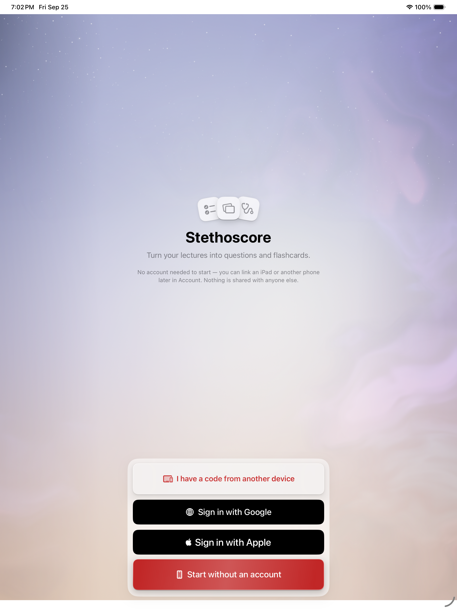

### ipad/2-signed-in: iPad Pro 13-inch (M5)

```
bundle=com.cramdown.personal exe=Stethoscore Personal
keep=1 args=-launchTestSignedIn
launch_status=0
pid=27278 alive_after_30s=yes
--- stderr.txt (last 25 of 1)
IOSurfaceClientSetSurfaceNotify failed e00002c7
--- log-process.txt: 56 matching lines (last 30)
2026-09-25 19:06:14.004 Df Stethoscore Personal[27278:15840] [com.apple.CFNetwork:Default] Initializing CFHTTPCookieStorage singleton
2026-09-25 19:06:14.004 Df Stethoscore Personal[27278:15840] [com.apple.CFNetwork:Default] Creating default cookie storage with process/bundle identifier
2026-09-25 19:06:14.005 Df Stethoscore Personal[27278:15840] [com.apple.CFNetwork:Default] Initializing AlternativeServices Storage singleton
2026-09-25 19:06:14.006 Df Stethoscore Personal[27278:15840] [com.apple.FileURL:default] kExcludedFromBackupXattrName set on path: /Users/runner/Library/Developer/CoreSimulator/Devices/A2011F14-88A1-46AA-999A-FD6FEDCD870B/data/Containers/Data/Application/3E472F03-6FAC-4E1C-B470-804AE89C5C44/Library/HTTPStorages/com.cramdown.personal
2026-09-25 19:06:14.020 Df Stethoscore Personal[27278:15840] [com.apple.CFNetwork:Default] Connection 0: creating secure tcp or quic connection
2026-09-25 19:06:14.023 Df Stethoscore Personal[27278:15840] [com.apple.CFNetwork:Default] Connection 1: enabling TLS
2026-09-25 19:06:14.023 Df Stethoscore Personal[27278:15840] [com.apple.CFNetwork:Default] Connection 1: starting, TC(0x0)
2026-09-25 19:06:14.038 Df Stethoscore Personal[27278:15840] [com.apple.CFNetwork:Default] Task <EB950BA3-56B0-4F61-86DE-EB2F6E471B2A>.<1> setting up Connection 1
2026-09-25 19:06:14.203 Df Stethoscore Personal[27278:1587d] [com.apple.CFNetwork:Default] Connection 1: asked to evaluate TLS Trust
2026-09-25 19:06:14.224 Df Stethoscore Personal[27278:1587d] [com.apple.CFNetwork:Default] Task <EB950BA3-56B0-4F61-86DE-EB2F6E471B2A>.<1> auth completion disp=1 cred=0x0
2026-09-25 19:06:14.436 Df Stethoscore Personal[27278:1587d] [com.apple.CFNetwork:Default] System Trust Evaluation yielded status(0)
2026-09-25 19:06:14.482 Df Stethoscore Personal[27278:1587d] [com.apple.CFNetwork:Default] Connection 1: TLS Trust result 0
2026-09-25 19:06:14.501 Df Stethoscore Personal[27278:1587d] [com.apple.network:boringssl] nw_protocol_boringssl_signal_connected(895) [C1.1.1.1:2][0x11944b9e0] TLS connected [server(0) version(0x0304) ciphersuite(TLS_AES_256_GCM_SHA384) group(0x11ec) signature_alg(0x0403) alpn(h2) resumed(0) offered_ticket(0) in_early_data(0) early_data_accepted(0) false_started(0) ocsp_received(0) sct_received(1
2026-09-25 19:06:14.512 Df Stethoscore Personal[27278:1587d] [com.apple.CFNetwork:Default] Connection 1: connected successfully
2026-09-25 19:06:14.513 Df Stethoscore Personal[27278:1587d] [com.apple.CFNetwork:Default] Connection 1: TLS handshake complete
2026-09-25 19:06:14.513 Df Stethoscore Personal[27278:1587d] [com.apple.CFNetwork:Default] Connection 1: ready C(N) E(N)
2026-09-25 19:06:14.519 Df Stethoscore Personal[27278:1587d] [com.apple.CFNetwork:Default] Task <EB950BA3-56B0-4F61-86DE-EB2F6E471B2A>.<1> now using Connection 1
2026-09-25 19:06:14.521 Df Stethoscore Personal[27278:15840] [com.apple.CFNetwork:Default] Task <EB950BA3-56B0-4F61-86DE-EB2F6E471B2A>.<1> sent request, body S 2
2026-09-25 19:06:14.678 Df Stethoscore Personal[27278:1587d] [com.apple.CFNetwork:Default] Task <EB950BA3-56B0-4F61-86DE-EB2F6E471B2A>.<1> received response, status 200 content U
2026-09-25 19:06:14.678 Df Stethoscore Personal[27278:1587d] [com.apple.CFNetwork:Default] Task <EB950BA3-56B0-4F61-86DE-EB2F6E471B2A>.<1> done using Connection 1
2026-09-25 19:06:14.760 Df Stethoscore Personal[27278:1587d] [com.apple.CFNetwork:Default] Task <EB950BA3-56B0-4F61-86DE-EB2F6E471B2A>.<1> response ended
2026-09-25 19:06:14.761 Df Stethoscore Personal[27278:1587d] [com.apple.CFNetwork:Default] Task <EB950BA3-56B0-4F61-86DE-EB2F6E471B2A>.<1> finished successfully
2026-09-25 19:06:15.004 I  Stethoscore Personal[27278:15809] [com.apple.storekit:Default] AAFService Closing XPCConnection f52f836b
2026-09-25 19:06:15.016 Df Stethoscore Personal[27278:1587c] [com.apple.storekit:Default] AAFService connection invalidated
2026-09-25 19:06:15.017 Df Stethoscore Personal[27278:15809] [com.apple.storekit:Default] Registering for 'transactionsupdated' daemon notification
2026-09-25 19:06:16.220 Df Stethoscore Personal[27278:157e1] [com.apple.network:activity] <nw_activity 50:1 [9121C9AE-37AF-45DD-8712-1790CDD040BF] (global parent) (reporting strategy default) complete (reason success)> complete with reason 2 (success), duration 8032ms
2026-09-25 19:06:16.220 Df Stethoscore Personal[27278:157e1] [com.apple.network:activity] <nw_activity 50:2 [1F72DA0A-2F0F-4BAB-8F5C-658E292713B9] (reporting strategy default) complete (reason success)> complete with reason 2 (success), duration 8032ms
2026-09-25 19:06:16.220 Df Stethoscore Personal[27278:157e1] [com.apple.network:activity] Unsetting the global parent activity <nw_activity 50:1 [9121C9AE-37AF-45DD-8712-1790CDD040BF] (global parent) (reporting strategy default) complete (reason success)>
2026-09-25 19:06:16.376 Df Stethoscore Personal[27278:157fb] [com.apple.CFNetwork:Default] Garbage collection for alternative services
2026-09-25 19:06:34.214 Df Stethoscore Personal[27278:15809] [com.apple.FileURL:default] kExcludedFromBackupXattrName set on path: /Users/runner/Library/Developer/CoreSimulator/Devices/A2011F14-88A1-46AA-999A-FD6FEDCD870B/data/Containers/Data/Application/3E472F03-6FAC-4E1C-B470-804AE89C5C44/Library/Application Support/RedPenSources
--- log-system.txt: 129 matching lines (last 30)
2026-09-25 19:06:09.569 Df SpringBoard[19902:156fd] [com.apple.SplashBoard:Capture] Image generation complete for: <XBLaunchStateRequest: 0x119f96c30; groupID: com.cramdown.personal - {DEFAULT GROUP}; statusBar: normal; refSize: {1032, 1376}; orientation: Portrait; userInterfaceStyle: Dark>
2026-09-25 19:06:09.569 Df SpringBoard[19902:14d63] [com.apple.SplashBoard:Capture] Asynchronously generating image data for request: <XBLaunchStateRequest: 0x119f96a70; groupID: com.cramdown.personal - {DEFAULT GROUP}; statusBar: normal; refSize: {375, 1376}; orientation: Portrait; userInterfaceStyle: Dark>
```
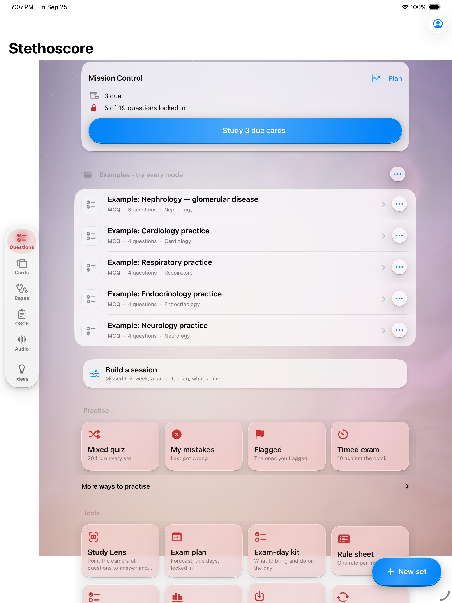

### ipad/3-relaunch: iPad Pro 13-inch (M5)

```
bundle=com.cramdown.personal exe=Stethoscore Personal
keep=1 args=
launch_status=0
pid=29853 alive_after_30s=yes
--- stderr.txt (last 25 of 1)
IOSurfaceClientSetSurfaceNotify failed e00002c7
--- log-process.txt: 31 matching lines (last 30)
2026-09-25 19:07:31.251 Df Stethoscore Personal[29853:173ed] [com.apple.dt.xctest:Default] notify_get_state check indicated test daemon not ready.
2026-09-25 19:07:31.251 Df Stethoscore Personal[29853:173ed] [com.apple.dt.xctest:Default] notify_get_state check indicated test daemon not ready.
2026-09-25 19:07:31.251 Df Stethoscore Personal[29853:173ed] [com.apple.dt.xctest:Default] notify_get_state check indicated test daemon not ready.
2026-09-25 19:07:31.297 Df Stethoscore Personal[29853:173ed] [com.apple.FileURL:default] kExcludedFromBackupXattrName set on path: /Users/runner/Library/Developer/CoreSimulator/Devices/A2011F14-88A1-46AA-999A-FD6FEDCD870B/data/Containers/Data/Application/8CFE3BE0-4332-4B4F-B06A-BE5AEC50F949/Library/Application Support/RedPenBlobs
2026-09-25 19:07:31.384 Df Stethoscore Personal[29853:173ed] [com.apple.UIKit:KeyWindow] Setting default evaluation strategy for UIUserInterfaceIdiomPad to LastOneWins
2026-09-25 19:07:31.385 Df Stethoscore Personal[29853:173ed] [com.apple.UIKit:KeyWindow] Setting default evaluation strategy for UIUserInterfaceIdiomPad to SystemShellManaged
2026-09-25 19:07:32.213 I  Stethoscore Personal[29853:173ed] [com.apple.DesignLibrary:defaults] liveTuning=false
2026-09-25 19:07:32.313 Df Stethoscore Personal[29853:173ed] [PrototypeTools:domain] Not observing PTDefaults on customer install.
2026-09-25 19:07:32.414 Df Stethoscore Personal[29853:17412] [com.apple.calls.callkit:Default] Call host has no calls
2026-09-25 19:07:32.504 I  Stethoscore Personal[29853:17410] [com.apple.storekit:Default] AAFService Starting new XPCConnection 5f98b777
2026-09-25 19:07:32.514 Df Stethoscore Personal[29853:17412] [com.apple.storekit:Default] [Default] Finished iterating transaction batches
2026-09-25 19:07:32.515 I  Stethoscore Personal[29853:17412] [com.apple.storekit:Default] AAFService Closing XPCConnection 5f98b777
2026-09-25 19:07:32.515 Df Stethoscore Personal[29853:17412] [com.apple.storekit:Default] AAFService connection invalidated
2026-09-25 19:07:33.558 Df Stethoscore Personal[29853:173ed] [com.apple.network:activity] Create activity from XPC object <nw_activity 50:1 [AB1B0495-FF71-4568-9C5A-9C9838243D37] (reporting strategy default)>
2026-09-25 19:07:33.558 Df Stethoscore Personal[29853:173ed] [com.apple.network:activity] Create activity from XPC object <nw_activity 50:2 [F27E6D2D-08DB-4FA5-B8AC-8E37D9C8EC11] (reporting strategy default)>
2026-09-25 19:07:33.558 Df Stethoscore Personal[29853:173ed] [com.apple.network:activity] Set activity <nw_activity 50:1 [AB1B0495-FF71-4568-9C5A-9C9838243D37] (reporting strategy default)> as the global parent
2026-09-25 19:07:33.644 I  Stethoscore Personal[29853:174cf] [com.apple.storekit:Default] AAFService Starting new XPCConnection 40429de3
2026-09-25 19:07:33.673 I  Stethoscore Personal[29853:173ed] [com.apple.PointerUI:Common] Activating Connection: <BSXPC(com.apple.PointerUI.pointeruid.service[C:3-1])-as(com.apple.PointerUI.pointeruid.default-service):0x1042c7160 name=(null)>
2026-09-25 19:07:33.675 Df Stethoscore Personal[29853:1741e] [com.apple.storekit:Default] [Default] Finished iterating transaction batches
2026-09-25 19:07:33.676 I  Stethoscore Personal[29853:1741e] [com.apple.storekit:Default] AAFService Closing XPCConnection 40429de3
2026-09-25 19:07:33.677 I  Stethoscore Personal[29853:1741e] [com.apple.storekit:Default] AAFService Starting new XPCConnection 6bb61c04
2026-09-25 19:07:33.721 Df Stethoscore Personal[29853:174ec] [com.apple.storekit:Default] [Default] Finished iterating transaction batches
2026-09-25 19:07:33.725 Df Stethoscore Personal[29853:174cf] [com.apple.storekit:Default] AAFService connection invalidated
2026-09-25 19:07:34.494 I  Stethoscore Personal[29853:174ec] [com.apple.storekit:Default] AAFService Closing XPCConnection 6bb61c04
2026-09-25 19:07:34.494 Df Stethoscore Personal[29853:174cf] [com.apple.storekit:Default] AAFService connection invalidated
2026-09-25 19:07:34.496 Df Stethoscore Personal[29853:174ec] [com.apple.storekit:Default] Registering for 'transactionsupdated' daemon notification
2026-09-25 19:07:40.829 Df Stethoscore Personal[29853:17412] [com.apple.FileURL:default] kExcludedFromBackupXattrName set on path: /Users/runner/Library/Developer/CoreSimulator/Devices/A2011F14-88A1-46AA-999A-FD6FEDCD870B/data/Containers/Data/Application/8CFE3BE0-4332-4B4F-B06A-BE5AEC50F949/Library/Application Support/RedPenSources
2026-09-25 19:07:40.891 Df Stethoscore Personal[29853:173ed] [com.apple.network:activity] <nw_activity 50:1 [AB1B0495-FF71-4568-9C5A-9C9838243D37] (global parent) (reporting strategy default) complete (reason success)> complete with reason 2 (success), duration 11162ms
2026-09-25 19:07:40.891 Df Stethoscore Personal[29853:173ed] [com.apple.network:activity] <nw_activity 50:2 [F27E6D2D-08DB-4FA5-B8AC-8E37D9C8EC11] (reporting strategy default) complete (reason success)> complete with reason 2 (success), duration 11162ms
2026-09-25 19:07:40.891 Df Stethoscore Personal[29853:173ed] [com.apple.network:activity] Unsetting the global parent activity <nw_activity 50:1 [AB1B0495-FF71-4568-9C5A-9C9838243D37] (global parent) (reporting strategy default) complete (reason success)>
--- log-system.txt: 122 matching lines (last 30)
2026-09-25 19:07:29.180 Df SpringBoard[19902:171b6] [com.apple.SplashBoard:FileManifest] <XBApplicationSnapshotManifestImpl: 0x118f19100> [com.cramdown.personal] Snapshot data for <XBApplicationSnapshot: 0x119d4ef40; …4603FD922EC5> [com.cramdown.personal] written to file: /Users/runner/Library/Developer/CoreSimulator/Devices/A2011F14-88A1-46AA-999A-FD6FEDCD870B/data/Containers/Data/Application/8CF
2026-09-25 19:07:29.182 Df SpringBoard[19902:171b6] [com.apple.SplashBoard:Capture] Image generation complete for: <XBLaunchStateRequest: 0x119dd1570; groupID: com.cramdown.personal - {DEFAULT GROUP}; statusBar: normal; refSize: {1032, 1376}; naturalSize: {1376, 1032}; orientation: LandscapeLeft; userInterfaceStyle: Dark>
```
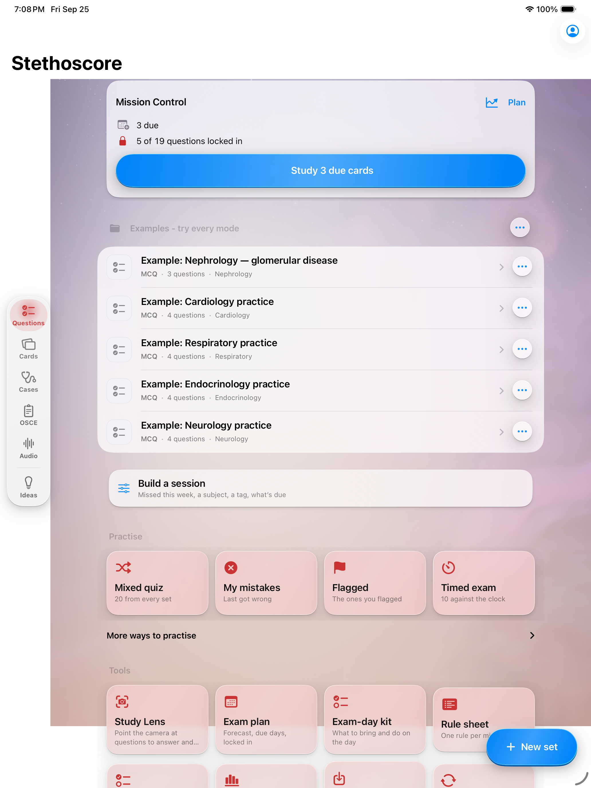

### iphone/1-fresh: iPhone 17 Pro

```
bundle=com.cramdown.personal exe=Stethoscore Personal
keep=0 args=
launch_status=0
pid=7188 alive_after_30s=yes
--- stderr.txt (last 25 of 1)
IOSurfaceClientSetSurfaceNotify failed e00002c7
--- log-process.txt: 19 matching lines (last 30)
2026-09-25 18:42:33.463 Df Stethoscore Personal[7188:6a8f] [com.apple.dt.xctest:Default] Registering for test daemon availability notify post.
2026-09-25 18:42:33.463 Df Stethoscore Personal[7188:6a8f] [com.apple.dt.xctest:Default] notify_get_state check indicated test daemon not ready.
2026-09-25 18:42:33.464 Df Stethoscore Personal[7188:6a8f] [com.apple.dt.xctest:Default] notify_get_state check indicated test daemon not ready.
2026-09-25 18:42:33.464 Df Stethoscore Personal[7188:6a8f] [com.apple.dt.xctest:Default] notify_get_state check indicated test daemon not ready.
2026-09-25 18:42:33.549 Df Stethoscore Personal[7188:6a8f] [com.apple.FileURL:default] kExcludedFromBackupXattrName set on path: /Users/runner/Library/Developer/CoreSimulator/Devices/22452A91-4697-4369-8812-53ADB77EB73B/data/Containers/Data/Application/5488DACD-6CF6-4345-BFC4-B82615361AFD/Library/Application Support/RedPenBlobs
2026-09-25 18:42:33.672 Df Stethoscore Personal[7188:6a8f] [com.apple.UIKit:KeyWindow] Setting default evaluation strategy for UIUserInterfaceIdiomPhone to LastOneWins
2026-09-25 18:42:33.673 Df Stethoscore Personal[7188:6a8f] [com.apple.UIKit:KeyWindow] Setting default evaluation strategy for UIUserInterfaceIdiomPhone to SystemShellManaged
2026-09-25 18:42:34.400 Df Stethoscore Personal[7188:6a8f] [PrototypeTools:domain] Not observing PTDefaults on customer install.
2026-09-25 18:42:36.283 Df Stethoscore Personal[7188:6a8f] [com.apple.network:activity] Create activity from XPC object <nw_activity 50:1 [64495499-7494-4F5B-B048-8A66101B3C03] (reporting strategy default)>
2026-09-25 18:42:36.283 Df Stethoscore Personal[7188:6a8f] [com.apple.network:activity] Create activity from XPC object <nw_activity 50:2 [B98350AA-C862-46EB-906C-F81D723E3CAA] (reporting strategy default)>
2026-09-25 18:42:36.283 Df Stethoscore Personal[7188:6a8f] [com.apple.network:activity] Set activity <nw_activity 50:1 [64495499-7494-4F5B-B048-8A66101B3C03] (reporting strategy default)> as the global parent
2026-09-25 18:42:37.026 Df Stethoscore Personal[7188:6b21] [com.apple.storekit:Default] [Default] Finished iterating transaction batches
2026-09-25 18:42:37.037 Df Stethoscore Personal[7188:6b21] [com.apple.storekit:Default] AAFService connection invalidated
2026-09-25 18:42:37.071 Df Stethoscore Personal[7188:6aca] [com.apple.storekit:Default] [Default] Finished iterating transaction batches
2026-09-25 18:42:37.126 Df Stethoscore Personal[7188:6b21] [com.apple.storekit:Default] Registering for 'transactionsupdated' daemon notification
2026-09-25 18:42:37.127 Df Stethoscore Personal[7188:6b27] [com.apple.storekit:Default] AAFService connection invalidated
2026-09-25 18:42:47.013 Df Stethoscore Personal[7188:6a8f] [com.apple.network:activity] <nw_activity 50:1 [64495499-7494-4F5B-B048-8A66101B3C03] (global parent) (reporting strategy default) complete (reason failure)> complete with reason 3 (failure), duration 15755ms
2026-09-25 18:42:47.013 Df Stethoscore Personal[7188:6a8f] [com.apple.network:activity] <nw_activity 50:2 [B98350AA-C862-46EB-906C-F81D723E3CAA] (reporting strategy default) complete (reason failure)> complete with reason 3 (failure), duration 15756ms
2026-09-25 18:42:47.013 Df Stethoscore Personal[7188:6a8f] [com.apple.network:activity] Unsetting the global parent activity <nw_activity 50:1 [64495499-7494-4F5B-B048-8A66101B3C03] (global parent) (reporting strategy default) complete (reason failure)>
--- log-system.txt: 70 matching lines (last 30)
2026-09-25 18:42:26.409 Df biomed[5124:512c] [com.apple.Biome:BiomeCascade] Creating dataResource: CCDataResource: file:///Users/runner/Library/Developer/CoreSimulator/Devices/22452A91-4697-4369-8812-53ADB77EB73B/data/Library/Biome/sets/Default/App.Shortcut.Phrase/sourceIdentifier=com.cramdown.personal/ in temporary path: /Users/runner/Library/Developer/CoreSimulator/Devices/22452A91-4697-4369-881
2026-09-25 18:42:26.434 Df biomed[5124:512c] [com.apple.Biome:BiomeCascade] Successfully renamed temporary directory and moved to final path: /Users/runner/Library/Developer/CoreSimulator/Devices/22452A91-4697-4369-8812-53ADB77EB73B/data/Library/Biome/sets/Default/App.Shortcut.Phrase/sourceIdentifier=com.cramdown.personal/Database
2026-09-25 18:42:28.440 Df splashboardd[7066:694e] [com.apple.SplashBoard:Capture] Updating window to <XBLaunchStateRequest: 0x1054bc070; groupID: com.cramdown.personal - {DEFAULT GROUP}; statusBar: normal; refSize: {402, 874}; orientation: Portrait; userInterfaceStyle: Light>
2026-09-25 18:42:28.578 Df SpringBoard[5110:5966] [com.apple.SplashBoard:Capture] Image generation complete for: <XBLaunchStateRequest: 0x11c6d5dc0; groupID: com.cramdown.personal - {DEFAULT GROUP}; statusBar: normal; refSize: {402, 874}; orientation: Portrait; userInterfaceStyle: Light>
2026-09-25 18:42:28.580 Df SpringBoard[5110:57c7] [com.apple.SplashBoard:Capture] Asynchronously generating image data for request: <XBLaunchStateRequest: 0x11c6d7db0; groupID: com.cramdown.personal - {DEFAULT GROUP}; statusBar: normal; refSize: {402, 874}; orientation: Portrait; userInterfaceStyle: Dark>
2026-09-25 18:42:28.584 Df splashboardd[7066:694e] [com.apple.SplashBoard:Capture] Updating window to <XBLaunchStateRequest: 0x105640000; groupID: com.cramdown.personal - {DEFAULT GROUP}; statusBar: normal; refSize: {402, 874}; orientation: Portrait; userInterfaceStyle: Dark>
2026-09-25 18:42:28.584 Df SpringBoard[5110:58ee] [com.apple.SplashBoard:FileManifest] <XBApplicationSnapshotManifestImpl: 0x119293f80> [com.cramdown.personal] Snapshot data for <XBApplicationSnapshot: 0x1192b2a00; …078010D5AC87> [com.cramdown.personal] written to file: /Users/runner/Library/Developer/CoreSimulator/Devices/22452A91-4697-4369-8812-53ADB77EB73B/data/Containers/Data/Application/5488D
2026-09-25 18:42:28.662 Df SpringBoard[5110:5966] [com.apple.UserNotifications:DataProviderFactory] [com.cramdown.personal] Application installed using default data provider
2026-09-25 18:42:28.733 Df SpringBoard[5110:5996] [com.apple.SplashBoard:FileManifest] <XBApplicationSnapshotManifestImpl: 0x119293f80> [com.cramdown.personal] Snapshot data for <XBApplicationSnapshot: 0x1192b2f40; …0087AF8034FC> [com.cramdown.personal] written to file: /Users/runner/Library/Developer/CoreSimulator/Devices/22452A91-4697-4369-8812-53ADB77EB73B/data/Containers/Data/Application/5488D
2026-09-25 18:42:28.733 Df SpringBoard[5110:58bf] [com.apple.SplashBoard:Capture] Image generation complete for: <XBLaunchStateRequest: 0x11c6d7db0; groupID: com.cramdown.personal - {DEFAULT GROUP}; statusBar: normal; refSize: {402, 874}; orientation: Portrait; userInterfaceStyle: Dark>
    "terminate_running_process" = 1;
	retryTimeout: 120.000000 (default write com.apple.CoreSimulatorBridge LaunchRetryTimeout <value>)
	bootTimeout: 300.000000 (default write com.apple.CoreSimulatorBridge BootRetryTimeout <value>)
```
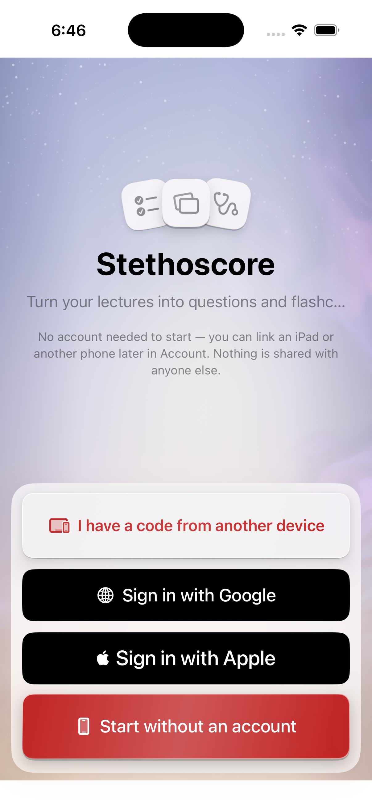

### iphone/2-signed-in: iPhone 17 Pro

```
bundle=com.cramdown.personal exe=Stethoscore Personal
keep=1 args=-launchTestSignedIn
launch_status=0
pid=12153 alive_after_30s=yes
--- stderr.txt (last 25 of 1)
IOSurfaceClientSetSurfaceNotify failed e00002c7
--- log-process.txt: 54 matching lines (last 30)
2026-09-25 18:48:10.253 Df Stethoscore Personal[12153:a376] [com.apple.storekit:Default] [Default] Finished iterating transaction batches
2026-09-25 18:48:10.254 I  Stethoscore Personal[12153:a376] [com.apple.storekit:Default] AAFService Closing XPCConnection fda133b1
2026-09-25 18:48:10.268 I  Stethoscore Personal[12153:a335] [com.apple.storekit:Default] AAFService Starting new XPCConnection 4919cc92
2026-09-25 18:48:10.310 Df Stethoscore Personal[12153:a336] [com.apple.storekit:Default] AAFService connection invalidated
2026-09-25 18:48:10.329 Df Stethoscore Personal[12153:a397] [com.apple.storekit:Default] [Default] Finished iterating transaction batches
2026-09-25 18:48:10.831 I  Stethoscore Personal[12153:a397] [com.apple.storekit:Default] AAFService Closing XPCConnection 4919cc92
2026-09-25 18:48:10.850 Df Stethoscore Personal[12153:a335] [com.apple.storekit:Default] Registering for 'transactionsupdated' daemon notification
2026-09-25 18:48:10.877 Df Stethoscore Personal[12153:a397] [com.apple.storekit:Default] AAFService connection invalidated
2026-09-25 18:48:11.138 Df Stethoscore Personal[12153:a327] [com.apple.CFNetwork:Default] Connection 0: creating secure tcp or quic connection
2026-09-25 18:48:11.159 Df Stethoscore Personal[12153:a327] [com.apple.CFNetwork:Default] Connection 1: enabling TLS
2026-09-25 18:48:11.159 Df Stethoscore Personal[12153:a327] [com.apple.CFNetwork:Default] Connection 1: starting, TC(0x0)
2026-09-25 18:48:11.707 Df Stethoscore Personal[12153:a327] [com.apple.CFNetwork:Default] Task <64E10257-772A-4E4D-A2ED-23B5F6CB9619>.<1> setting up Connection 1
2026-09-25 18:48:11.866 Df Stethoscore Personal[12153:a327] [com.apple.CFNetwork:Default] Connection 1: asked to evaluate TLS Trust
2026-09-25 18:48:11.870 Df Stethoscore Personal[12153:a327] [com.apple.CFNetwork:Default] Task <64E10257-772A-4E4D-A2ED-23B5F6CB9619>.<1> auth completion disp=1 cred=0x0
2026-09-25 18:48:11.950 Df Stethoscore Personal[12153:a327] [com.apple.CFNetwork:Default] System Trust Evaluation yielded status(0)
2026-09-25 18:48:12.239 Df Stethoscore Personal[12153:a337] [com.apple.CFNetwork:Default] Connection 1: TLS Trust result 0
2026-09-25 18:48:12.250 Df Stethoscore Personal[12153:a337] [com.apple.network:boringssl] nw_protocol_boringssl_signal_connected(895) [C1.1.1.1:2][0x11618d460] TLS connected [server(0) version(0x0304) ciphersuite(TLS_AES_256_GCM_SHA384) group(0x11ec) signature_alg(0x0403) alpn(h2) resumed(0) offered_ticket(0) in_early_data(0) early_data_accepted(0) false_started(0) ocsp_received(0) sct_received(1)
2026-09-25 18:48:12.256 Df Stethoscore Personal[12153:a337] [com.apple.CFNetwork:Default] Connection 1: connected successfully
2026-09-25 18:48:12.256 Df Stethoscore Personal[12153:a337] [com.apple.CFNetwork:Default] Connection 1: TLS handshake complete
2026-09-25 18:48:12.256 Df Stethoscore Personal[12153:a337] [com.apple.CFNetwork:Default] Connection 1: ready C(N) E(N)
2026-09-25 18:48:12.268 Df Stethoscore Personal[12153:a337] [com.apple.CFNetwork:Default] Task <64E10257-772A-4E4D-A2ED-23B5F6CB9619>.<1> now using Connection 1
2026-09-25 18:48:12.288 Df Stethoscore Personal[12153:a337] [com.apple.CFNetwork:Default] Task <64E10257-772A-4E4D-A2ED-23B5F6CB9619>.<1> sent request, body S 2
2026-09-25 18:48:12.431 Df Stethoscore Personal[12153:a327] [com.apple.CFNetwork:Default] Task <64E10257-772A-4E4D-A2ED-23B5F6CB9619>.<1> received response, status 200 content U
2026-09-25 18:48:12.432 Df Stethoscore Personal[12153:a327] [com.apple.CFNetwork:Default] Task <64E10257-772A-4E4D-A2ED-23B5F6CB9619>.<1> done using Connection 1
2026-09-25 18:48:12.442 Df Stethoscore Personal[12153:a336] [com.apple.CFNetwork:Default] Garbage collection for alternative services
2026-09-25 18:48:12.493 Df Stethoscore Personal[12153:a327] [com.apple.CFNetwork:Default] Task <64E10257-772A-4E4D-A2ED-23B5F6CB9619>.<1> response ended
2026-09-25 18:48:12.494 Df Stethoscore Personal[12153:a337] [com.apple.CFNetwork:Default] Task <64E10257-772A-4E4D-A2ED-23B5F6CB9619>.<1> finished successfully
2026-09-25 18:48:34.511 Df Stethoscore Personal[12153:a30e] [com.apple.network:activity] <nw_activity 50:1 [9A2F115C-F10F-4E85-8302-D3347C8B93BD] (global parent) (reporting strategy default) complete (reason failure)> complete with reason 3 (failure), duration 29557ms
2026-09-25 18:48:34.511 Df Stethoscore Personal[12153:a30e] [com.apple.network:activity] <nw_activity 50:2 [5274985D-5EC8-4BC5-A8F0-9028FC73EDAC] (reporting strategy default) complete (reason failure)> complete with reason 3 (failure), duration 29557ms
2026-09-25 18:48:34.511 Df Stethoscore Personal[12153:a30e] [com.apple.network:activity] Unsetting the global parent activity <nw_activity 50:1 [9A2F115C-F10F-4E85-8302-D3347C8B93BD] (global parent) (reporting strategy default) complete (reason failure)>
--- log-system.txt: 80 matching lines (last 30)
2026-09-25 18:48:03.368 Df SpringBoard[5110:5959] [com.apple.SplashBoard:Capture] Image generation complete for: <XBLaunchStateRequest: 0x120404000; groupID: com.cramdown.personal - {DEFAULT GROUP}; statusBar: normal; refSize: {402, 874}; orientation: Portrait; userInterfaceStyle: Light>
2026-09-25 18:48:03.368 Df SpringBoard[5110:57cb] [com.apple.SplashBoard:Capture] Asynchronously generating image data for request: <XBLaunchStateRequest: 0x120407d40; groupID: com.cramdown.personal - {DEFAULT GROUP}; statusBar: normal; refSize: {402, 874}; orientation: Portrait; userInterfaceStyle: Dark>
```
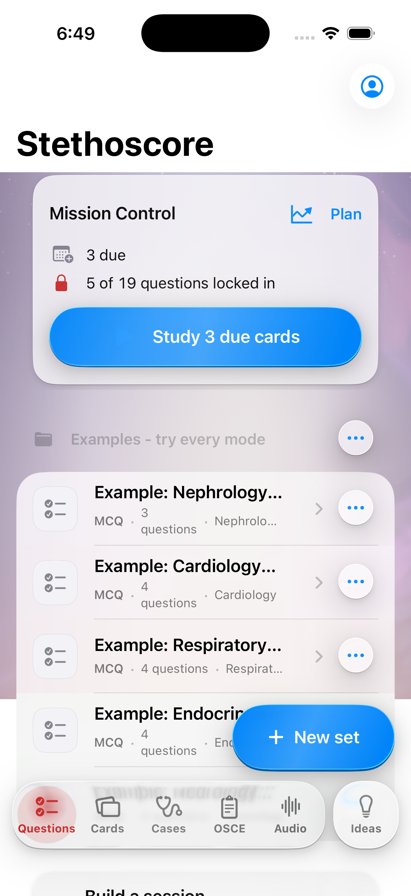

### iphone/3-relaunch: iPhone 17 Pro

```
bundle=com.cramdown.personal exe=Stethoscore Personal
keep=1 args=
launch_status=0
pid=14284 alive_after_30s=yes
--- stderr.txt (last 25 of 1)
IOSurfaceClientSetSurfaceNotify failed e00002c7
--- log-process.txt: 30 matching lines (last 30)
2026-09-25 18:49:29.893 Df Stethoscore Personal[14284:b9c4] [com.apple.dt.xctest:Default] Registering for test daemon availability notify post.
2026-09-25 18:49:29.894 Df Stethoscore Personal[14284:b9c4] [com.apple.dt.xctest:Default] notify_get_state check indicated test daemon not ready.
2026-09-25 18:49:29.894 Df Stethoscore Personal[14284:b9c4] [com.apple.dt.xctest:Default] notify_get_state check indicated test daemon not ready.
2026-09-25 18:49:29.894 Df Stethoscore Personal[14284:b9c4] [com.apple.dt.xctest:Default] notify_get_state check indicated test daemon not ready.
2026-09-25 18:49:29.910 Df Stethoscore Personal[14284:b9c4] [com.apple.UIKit:KeyWindow] Setting default evaluation strategy for UIUserInterfaceIdiomPhone to LastOneWins
2026-09-25 18:49:29.910 Df Stethoscore Personal[14284:b9c4] [com.apple.UIKit:KeyWindow] Setting default evaluation strategy for UIUserInterfaceIdiomPhone to SystemShellManaged
2026-09-25 18:49:29.947 Df Stethoscore Personal[14284:b9c4] [com.apple.FileURL:default] kExcludedFromBackupXattrName set on path: /Users/runner/Library/Developer/CoreSimulator/Devices/22452A91-4697-4369-8812-53ADB77EB73B/data/Containers/Data/Application/2DCACBBA-BC29-4665-AE2E-44EEB4478C00/Library/Application Support/RedPenBlobs
2026-09-25 18:49:30.987 I  Stethoscore Personal[14284:b9c4] [com.apple.DesignLibrary:defaults] liveTuning=false
2026-09-25 18:49:31.174 Df Stethoscore Personal[14284:b9c4] [PrototypeTools:domain] Not observing PTDefaults on customer install.
2026-09-25 18:49:31.298 Df Stethoscore Personal[14284:b9e5] [com.apple.calls.callkit:Default] Call host has no calls
2026-09-25 18:49:31.412 I  Stethoscore Personal[14284:ba15] [com.apple.storekit:Default] AAFService Starting new XPCConnection ee7ceb9f
2026-09-25 18:49:31.470 Df Stethoscore Personal[14284:b9e4] [com.apple.storekit:Default] [Default] Finished iterating transaction batches
2026-09-25 18:49:31.470 I  Stethoscore Personal[14284:b9e4] [com.apple.storekit:Default] AAFService Closing XPCConnection ee7ceb9f
2026-09-25 18:49:31.484 Df Stethoscore Personal[14284:b9e5] [com.apple.storekit:Default] AAFService connection invalidated
2026-09-25 18:49:32.436 Df Stethoscore Personal[14284:b9c4] [com.apple.network:activity] Create activity from XPC object <nw_activity 50:1 [F8170574-8739-4AA0-B394-24D9F679A746] (reporting strategy default)>
2026-09-25 18:49:32.436 Df Stethoscore Personal[14284:b9c4] [com.apple.network:activity] Create activity from XPC object <nw_activity 50:2 [5C1D9D24-9B89-4C68-8F28-9B0F275A8827] (reporting strategy default)>
2026-09-25 18:49:32.436 Df Stethoscore Personal[14284:b9c4] [com.apple.network:activity] Set activity <nw_activity 50:1 [F8170574-8739-4AA0-B394-24D9F679A746] (reporting strategy default)> as the global parent
2026-09-25 18:49:32.567 I  Stethoscore Personal[14284:ba15] [com.apple.storekit:Default] AAFService Starting new XPCConnection 9bc674c9
2026-09-25 18:49:32.597 Df Stethoscore Personal[14284:b9e5] [com.apple.storekit:Default] [Default] Finished iterating transaction batches
2026-09-25 18:49:32.597 I  Stethoscore Personal[14284:b9e5] [com.apple.storekit:Default] AAFService Closing XPCConnection 9bc674c9
2026-09-25 18:49:32.598 I  Stethoscore Personal[14284:ba15] [com.apple.storekit:Default] AAFService Starting new XPCConnection 979305d7
2026-09-25 18:49:32.608 Df Stethoscore Personal[14284:b9e5] [com.apple.storekit:Default] AAFService connection invalidated
2026-09-25 18:49:32.613 Df Stethoscore Personal[14284:ba15] [com.apple.storekit:Default] [Default] Finished iterating transaction batches
2026-09-25 18:49:32.997 I  Stethoscore Personal[14284:b9e5] [com.apple.storekit:Default] AAFService Closing XPCConnection 979305d7
2026-09-25 18:49:32.997 Df Stethoscore Personal[14284:ba15] [com.apple.storekit:Default] AAFService connection invalidated
2026-09-25 18:49:33.002 Df Stethoscore Personal[14284:b9e5] [com.apple.storekit:Default] Registering for 'transactionsupdated' daemon notification
2026-09-25 18:49:35.521 Df Stethoscore Personal[14284:b9e4] [com.apple.FileURL:default] kExcludedFromBackupXattrName set on path: /Users/runner/Library/Developer/CoreSimulator/Devices/22452A91-4697-4369-8812-53ADB77EB73B/data/Containers/Data/Application/2DCACBBA-BC29-4665-AE2E-44EEB4478C00/Library/Application Support/RedPenSources
2026-09-25 18:49:46.142 Df Stethoscore Personal[14284:b9c4] [com.apple.network:activity] <nw_activity 50:1 [F8170574-8739-4AA0-B394-24D9F679A746] (global parent) (reporting strategy default) complete (reason success)> complete with reason 2 (success), duration 17896ms
2026-09-25 18:49:46.143 Df Stethoscore Personal[14284:b9c4] [com.apple.network:activity] <nw_activity 50:2 [5C1D9D24-9B89-4C68-8F28-9B0F275A8827] (reporting strategy default) complete (reason success)> complete with reason 2 (success), duration 17896ms
2026-09-25 18:49:46.143 Df Stethoscore Personal[14284:b9c4] [com.apple.network:activity] Unsetting the global parent activity <nw_activity 50:1 [F8170574-8739-4AA0-B394-24D9F679A746] (global parent) (reporting strategy default) complete (reason success)>
--- log-system.txt: 79 matching lines (last 30)
2026-09-25 18:49:27.248 Df SpringBoard[5110:599e] [com.apple.SplashBoard:FileManifest] <XBApplicationSnapshotManifestImpl: 0x119293f80> [com.cramdown.personal] Snapshot data for <XBApplicationSnapshot: 0x106839f80; …910019722BF6> [com.cramdown.personal] written to file: /Users/runner/Library/Developer/CoreSimulator/Devices/22452A91-4697-4369-8812-53ADB77EB73B/data/Containers/Data/Application/2DCAC
2026-09-25 18:49:27.294 Df SpringBoard[5110:599e] [com.apple.SplashBoard:Capture] Image generation complete for: <XBLaunchStateRequest: 0x1056c0e70; groupID: com.cramdown.personal - {DEFAULT GROUP}; statusBar: normal; refSize: {402, 874}; orientation: Portrait; userInterfaceStyle: Light>
```
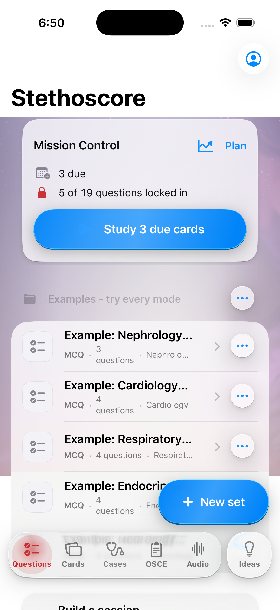

### iphone/5-other-bundle-id: iPhone 17 Pro

```
bundle=swift-playgrounds-dev-run.launchtest exe=Stethoscore Personal
keep=0 args=-launchTestSignedIn
launch_status=0
pid=16028 alive_after_30s=yes
--- stderr.txt (last 25 of 1)
IOSurfaceClientSetSurfaceNotify failed e00002c7
--- log-process.txt: 55 matching lines (last 30)
2026-09-25 18:50:57.416 Df Stethoscore Personal[16028:cd45] [com.apple.FileURL:default] kExcludedFromBackupXattrName set on path: /Users/runner/Library/Developer/CoreSimulator/Devices/22452A91-4697-4369-8812-53ADB77EB73B/data/Containers/Data/Application/7BA72B79-BF7C-4283-9C86-1A1D75FBA2E0/Library/HTTPStorages/swift-playgrounds-dev-run.launchtest
2026-09-25 18:50:57.427 Df Stethoscore Personal[16028:cd39] [com.apple.storekit:Default] AAFService connection invalidated
2026-09-25 18:50:57.427 Df Stethoscore Personal[16028:cd45] [com.apple.CFNetwork:Default] Connection 0: creating secure tcp or quic connection
2026-09-25 18:50:57.458 Df Stethoscore Personal[16028:cd45] [com.apple.CFNetwork:Default] Connection 1: enabling TLS
2026-09-25 18:50:57.458 Df Stethoscore Personal[16028:cd45] [com.apple.CFNetwork:Default] Connection 1: starting, TC(0x0)
2026-09-25 18:50:57.494 Df Stethoscore Personal[16028:cd45] [com.apple.CFNetwork:Default] Task <F3BFD10D-21D8-4D11-A72F-401C4AEEF969>.<1> setting up Connection 1
2026-09-25 18:50:57.533 Df Stethoscore Personal[16028:cd49] [com.apple.CFNetwork:Default] Connection 1: asked to evaluate TLS Trust
2026-09-25 18:50:57.534 Df Stethoscore Personal[16028:cd49] [com.apple.CFNetwork:Default] Task <F3BFD10D-21D8-4D11-A72F-401C4AEEF969>.<1> auth completion disp=1 cred=0x0
2026-09-25 18:50:57.580 Df Stethoscore Personal[16028:cd4b] [com.apple.CFNetwork:Default] Garbage collection for alternative services
2026-09-25 18:50:57.613 Df Stethoscore Personal[16028:cd4b] [com.apple.CFNetwork:Default] System Trust Evaluation yielded status(0)
2026-09-25 18:50:57.648 Df Stethoscore Personal[16028:cd39] [com.apple.CFNetwork:Default] Connection 1: TLS Trust result 0
2026-09-25 18:50:57.649 Df Stethoscore Personal[16028:cd39] [com.apple.network:boringssl] nw_protocol_boringssl_signal_connected(895) [C1.1.1.1:2][0x113c88a60] TLS connected [server(0) version(0x0304) ciphersuite(TLS_AES_256_GCM_SHA384) group(0x11ec) signature_alg(0x0403) alpn(h2) resumed(0) offered_ticket(0) in_early_data(0) early_data_accepted(0) false_started(0) ocsp_received(0) sct_received(1)
2026-09-25 18:50:57.650 Df Stethoscore Personal[16028:cd39] [com.apple.CFNetwork:Default] Connection 1: connected successfully
2026-09-25 18:50:57.650 Df Stethoscore Personal[16028:cd39] [com.apple.CFNetwork:Default] Connection 1: TLS handshake complete
2026-09-25 18:50:57.650 Df Stethoscore Personal[16028:cd39] [com.apple.CFNetwork:Default] Connection 1: ready C(N) E(N)
2026-09-25 18:50:57.664 Df Stethoscore Personal[16028:cd39] [com.apple.CFNetwork:Default] Task <F3BFD10D-21D8-4D11-A72F-401C4AEEF969>.<1> now using Connection 1
2026-09-25 18:50:57.665 Df Stethoscore Personal[16028:cd39] [com.apple.CFNetwork:Default] Task <F3BFD10D-21D8-4D11-A72F-401C4AEEF969>.<1> sent request, body S 2
2026-09-25 18:50:57.798 Df Stethoscore Personal[16028:cd49] [com.apple.CFNetwork:Default] Task <F3BFD10D-21D8-4D11-A72F-401C4AEEF969>.<1> received response, status 200 content U
2026-09-25 18:50:57.798 Df Stethoscore Personal[16028:cd49] [com.apple.CFNetwork:Default] Task <F3BFD10D-21D8-4D11-A72F-401C4AEEF969>.<1> done using Connection 1
2026-09-25 18:50:57.812 Df Stethoscore Personal[16028:cd49] [com.apple.CFNetwork:Default] Task <F3BFD10D-21D8-4D11-A72F-401C4AEEF969>.<1> response ended
2026-09-25 18:50:57.812 Df Stethoscore Personal[16028:cd49] [com.apple.CFNetwork:Default] Task <F3BFD10D-21D8-4D11-A72F-401C4AEEF969>.<1> finished successfully
2026-09-25 18:50:57.897 I  Stethoscore Personal[16028:cd48] [com.apple.storekit:Default] AAFService Starting new XPCConnection cced12ea
2026-09-25 18:50:57.931 Df Stethoscore Personal[16028:cd39] [com.apple.storekit:Default] [Default] Finished iterating transaction batches
2026-09-25 18:50:58.195 I  Stethoscore Personal[16028:cd39] [com.apple.storekit:Default] AAFService Closing XPCConnection cced12ea
2026-09-25 18:50:58.196 Df Stethoscore Personal[16028:cd39] [com.apple.storekit:Default] Registering for 'transactionsupdated' daemon notification
2026-09-25 18:50:58.197 Df Stethoscore Personal[16028:cd49] [com.apple.storekit:Default] AAFService connection invalidated
2026-09-25 18:51:18.827 Df Stethoscore Personal[16028:cd1a] [com.apple.network:activity] <nw_activity 50:1 [4D7E40C8-197B-462B-96C4-2FB447DBEE85] (global parent) (reporting strategy default) complete (reason failure)> complete with reason 3 (failure), duration 25957ms
2026-09-25 18:51:18.827 Df Stethoscore Personal[16028:cd1a] [com.apple.network:activity] <nw_activity 50:2 [913FDFA1-C87F-4F0A-B1F6-0113E75E660B] (reporting strategy default) complete (reason failure)> complete with reason 3 (failure), duration 25957ms
2026-09-25 18:51:18.827 Df Stethoscore Personal[16028:cd1a] [com.apple.network:activity] Unsetting the global parent activity <nw_activity 50:1 [4D7E40C8-197B-462B-96C4-2FB447DBEE85] (global parent) (reporting strategy default) complete (reason failure)>
2026-09-25 18:51:29.280 Df Stethoscore Personal[16028:cd45] [com.apple.FileURL:default] kExcludedFromBackupXattrName set on path: /Users/runner/Library/Developer/CoreSimulator/Devices/22452A91-4697-4369-8812-53ADB77EB73B/data/Containers/Data/Application/7BA72B79-BF7C-4283-9C86-1A1D75FBA2E0/Library/Application Support/RedPenSources
--- log-system.txt: 73 matching lines (last 30)
2026-09-25 18:50:51.387 Df splashboardd[7066:694e] [com.apple.SplashBoard:Capture] Updating window to <XBLaunchStateRequest: 0x105642300; groupID: swift-playgrounds-dev-run.launchtest - {DEFAULT GROUP}; statusBar: normal; refSize: {402, 874}; orientation: Portrait; userInterfaceStyle: Dark>
2026-09-25 18:50:51.396 Df SpringBoard[5110:594f] [com.apple.UserNotifications:DataProviderFactory] [swift-playgrounds-dev-run.launchtest] Application installed using default data provider
```
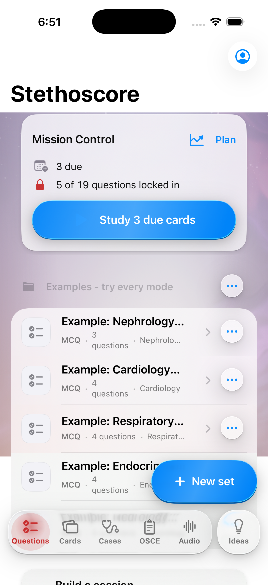

## old-0930

```
iphone/1-fresh=0
iphone/2-signed-in=0
iphone/3-relaunch=0
iphone/4-upgrade-to-current=0
iphone/5-other-bundle-id=0
ipad/1-fresh=0
ipad/2-signed-in=0
ipad/3-relaunch=0
ipad/4-upgrade-to-current=0
```

### ipad/1-fresh: iPad Pro 13-inch (M5)

```
bundle=com.cramdown.personal exe=Stethoscore Personal
keep=0 args=
launch_status=0
pid=29426 alive_after_30s=yes
--- stderr.txt (last 25 of 1)
IOSurfaceClientSetSurfaceNotify failed e00002c7
--- log-process.txt: 20 matching lines (last 30)
2026-09-25 18:51:49.802 Df Stethoscore Personal[29426:152e9] [com.apple.dt.xctest:Default] Registering for test daemon availability notify post.
2026-09-25 18:51:49.803 Df Stethoscore Personal[29426:152e9] [com.apple.dt.xctest:Default] notify_get_state check indicated test daemon not ready.
2026-09-25 18:51:49.804 Df Stethoscore Personal[29426:152e9] [com.apple.dt.xctest:Default] notify_get_state check indicated test daemon not ready.
2026-09-25 18:51:49.805 Df Stethoscore Personal[29426:152e9] [com.apple.dt.xctest:Default] notify_get_state check indicated test daemon not ready.
2026-09-25 18:51:49.913 Df Stethoscore Personal[29426:152e9] [com.apple.FileURL:default] kExcludedFromBackupXattrName set on path: /Users/runner/Library/Developer/CoreSimulator/Devices/A2011F14-88A1-46AA-999A-FD6FEDCD870B/data/Containers/Data/Application/1E34F374-B088-4250-8BDF-C7582F20EE95/Library/Application Support/RedPenBlobs
2026-09-25 18:51:49.954 Df Stethoscore Personal[29426:152e9] [com.apple.UIKit:KeyWindow] Setting default evaluation strategy for UIUserInterfaceIdiomPad to LastOneWins
2026-09-25 18:51:49.955 Df Stethoscore Personal[29426:152e9] [com.apple.UIKit:KeyWindow] Setting default evaluation strategy for UIUserInterfaceIdiomPad to SystemShellManaged
2026-09-25 18:51:50.657 Df Stethoscore Personal[29426:152e9] [PrototypeTools:domain] Not observing PTDefaults on customer install.
2026-09-25 18:51:53.459 Df Stethoscore Personal[29426:152e9] [com.apple.network:activity] Create activity from XPC object <nw_activity 50:1 [ABCCC741-0BEC-41FF-BF32-481ED318B916] (reporting strategy default)>
2026-09-25 18:51:53.459 Df Stethoscore Personal[29426:152e9] [com.apple.network:activity] Create activity from XPC object <nw_activity 50:2 [788DD709-035A-4BC3-8C7A-8907C9A26946] (reporting strategy default)>
2026-09-25 18:51:53.459 Df Stethoscore Personal[29426:152e9] [com.apple.network:activity] Set activity <nw_activity 50:1 [ABCCC741-0BEC-41FF-BF32-481ED318B916] (reporting strategy default)> as the global parent
2026-09-25 18:51:54.115 Df Stethoscore Personal[29426:15358] [com.apple.storekit:Default] [Default] Finished iterating transaction batches
2026-09-25 18:51:54.209 Df Stethoscore Personal[29426:15312] [com.apple.storekit:Default] AAFService connection invalidated
2026-09-25 18:51:54.908 Df Stethoscore Personal[29426:1530d] [com.apple.storekit:Default] [Default] Finished iterating transaction batches
2026-09-25 18:51:55.098 Df Stethoscore Personal[29426:1530d] [com.apple.storekit:Default] Registering for 'transactionsupdated' daemon notification
2026-09-25 18:51:55.180 Df Stethoscore Personal[29426:15366] [com.apple.storekit:Default] AAFService connection invalidated
2026-09-25 18:52:00.572 Df Stethoscore Personal[29426:152e9] [com.apple.network:activity] <nw_activity 50:1 [ABCCC741-0BEC-41FF-BF32-481ED318B916] (global parent) (reporting strategy default) complete (reason success)> complete with reason 2 (success), duration 19670ms
2026-09-25 18:52:00.573 Df Stethoscore Personal[29426:152e9] [com.apple.network:activity] <nw_activity 50:2 [788DD709-035A-4BC3-8C7A-8907C9A26946] (reporting strategy default) complete (reason success)> complete with reason 2 (success), duration 19670ms
2026-09-25 18:52:00.573 Df Stethoscore Personal[29426:152e9] [com.apple.network:activity] Unsetting the global parent activity <nw_activity 50:1 [ABCCC741-0BEC-41FF-BF32-481ED318B916] (global parent) (reporting strategy default) complete (reason success)>
2026-09-25 18:52:29.892 E  Stethoscore Personal[29426:152e9] [com.apple.UIKit:BackgroundTask] Background Task 3 ("Saving library"), was created over 30 seconds ago. In applications running in the background, this creates a risk of termination. Remember to call UIApplication.endBackgroundTask(_:) for your task in a timely manner to avoid this.
--- log-system.txt: 96 matching lines (last 30)
2026-09-25 18:51:43.607 Df SpringBoard[23657:12c75] [com.apple.SplashBoard:FileManifest] <XBApplicationSnapshotManifestImpl: 0x11cc70c00> [com.cramdown.personal] Snapshot data for <XBApplicationSnapshot: 0x11ddd8fc0; …8AD2B969B3BA> [com.cramdown.personal] written to file: /Users/runner/Library/Developer/CoreSimulator/Devices/A2011F14-88A1-46AA-999A-FD6FEDCD870B/data/Containers/Data/Application/1E3
2026-09-25 18:51:43.858 Df SpringBoard[23657:12b52] [com.apple.SplashBoard:Capture] Image generation complete for: <XBLaunchStateRequest: 0x11dcf9570; groupID: com.cramdown.personal - {DEFAULT GROUP}; statusBar: normal; refSize: {375, 1376}; orientation: Portrait; userInterfaceStyle: Dark>
2026-09-25 18:51:43.858 Df SpringBoard[23657:136c5] [com.apple.SplashBoard:Capture] Asynchronously generating image data for request: <XBLaunchStateRequest: 0x11dcf9500; groupID: com.cramdown.personal - {DEFAULT GROUP}; statusBar: normal; refSize: {1032, 1376}; naturalSize: {1376, 1032}; orientation: LandscapeLeft; userInterfaceStyle: Light>
2026-09-25 18:51:43.860 Df splashboardd[26680:13722] [com.apple.SplashBoard:Capture] Updating window to <XBLaunchStateRequest: 0x101a54150; groupID: com.cramdown.personal - {DEFAULT GROUP}; statusBar: normal; refSize: {1032, 1376}; naturalSize: {1376, 1032}; orientation: LandscapeLeft; userInterfaceStyle: Light>
2026-09-25 18:51:43.868 Df SpringBoard[23657:12c75] [com.apple.SplashBoard:FileManifest] <XBApplicationSnapshotManifestImpl: 0x11cc70c00> [com.cramdown.personal] Snapshot data for <XBApplicationSnapshot: 0x11ddd8e00; …EA808ABFE1D0> [com.cramdown.personal] written to file: /Users/runner/Library/Developer/CoreSimulator/Devices/A2011F14-88A1-46AA-999A-FD6FEDCD870B/data/Containers/Data/Application/1E3
2026-09-25 18:51:44.451 Df SpringBoard[23657:12c75] [com.apple.SplashBoard:FileManifest] <XBApplicationSnapshotManifestImpl: 0x11cc70c00> [com.cramdown.personal] Snapshot data for <XBApplicationSnapshot: 0x11ddd9180; …B9D1189E2F59> [com.cramdown.personal] written to file: /Users/runner/Library/Developer/CoreSimulator/Devices/A2011F14-88A1-46AA-999A-FD6FEDCD870B/data/Containers/Data/Application/1E3
2026-09-25 18:51:44.452 Df SpringBoard[23657:13518] [com.apple.SplashBoard:Capture] Image generation complete for: <XBLaunchStateRequest: 0x11dcf9500; groupID: com.cramdown.personal - {DEFAULT GROUP}; statusBar: normal; refSize: {1032, 1376}; naturalSize: {1376, 1032}; orientation: LandscapeLeft; userInterfaceStyle: Light>
2026-09-25 18:51:44.452 Df SpringBoard[23657:136c5] [com.apple.SplashBoard:Capture] Asynchronously generating image data for request: <XBLaunchStateRequest: 0x11dcf95e0; groupID: com.cramdown.personal - {DEFAULT GROUP}; statusBar: normal; refSize: {1032, 375}; naturalSize: {375, 1032}; orientation: LandscapeLeft; userInterfaceStyle: Light>
2026-09-25 18:51:44.454 Df splashboardd[26680:13722] [com.apple.SplashBoard:Capture] Updating window to <XBLaunchStateRequest: 0x101a54230; groupID: com.cramdown.personal - {DEFAULT GROUP}; statusBar: normal; refSize: {1032, 375}; naturalSize: {375, 1032}; orientation: LandscapeLeft; userInterfaceStyle: Light>
2026-09-25 18:51:44.520 Df SpringBoard[23657:12a99] [com.apple.SplashBoard:Capture] Image generation complete for: <XBLaunchStateRequest: 0x11dcf95e0; groupID: com.cramdown.personal - {DEFAULT GROUP}; statusBar: normal; refSize: {1032, 375}; naturalSize: {375, 1032}; orientation: LandscapeLeft; userInterfaceStyle: Light>
2026-09-25 18:51:44.521 Df SpringBoard[23657:136c5] [com.apple.SplashBoard:Capture] Asynchronously generating image data for request: <XBLaunchStateRequest: 0x11dcf8540; groupID: com.cramdown.personal - {DEFAULT GROUP}; statusBar: normal; refSize: {1032, 1376}; naturalSize: {1376, 1032}; orientation: LandscapeLeft; userInterfaceStyle: Dark>
2026-09-25 18:51:44.523 Df splashboardd[26680:13722] [com.apple.SplashBoard:Capture] Updating window to <XBLaunchStateRequest: 0x101a54150; groupID: com.cramdown.personal - {DEFAULT GROUP}; statusBar: normal; refSize: {1032, 1376}; naturalSize: {1376, 1032}; orientation: LandscapeLeft; userInterfaceStyle: Dark>
```
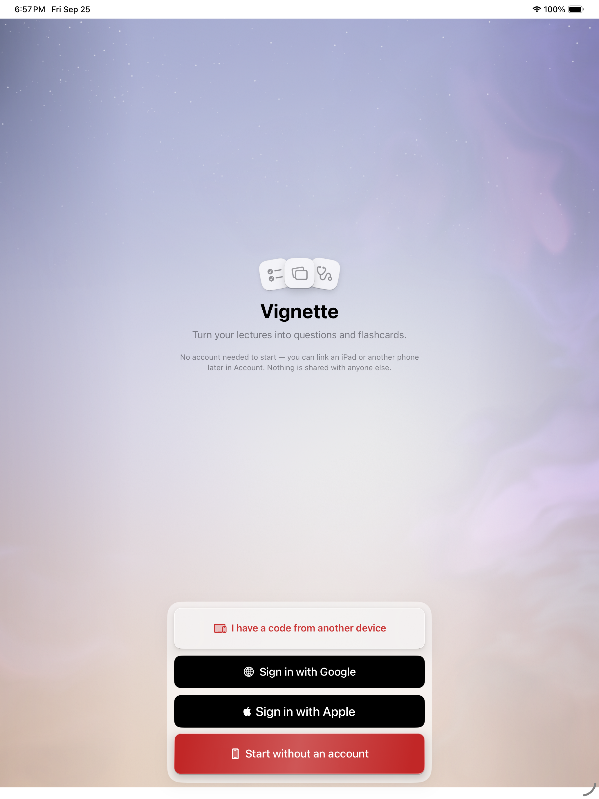

### ipad/2-signed-in: iPad Pro 13-inch (M5)

```
bundle=com.cramdown.personal exe=Stethoscore Personal
keep=1 args=-launchTestSignedIn
launch_status=0
pid=32112 alive_after_30s=yes
--- stderr.txt (last 25 of 1)
IOSurfaceClientSetSurfaceNotify failed e00002c7
--- log-process.txt: 30 matching lines (last 30)
2026-09-25 18:58:16.735 Df Stethoscore Personal[32112:179d3] [com.apple.dt.xctest:Default] Registering for test daemon availability notify post.
2026-09-25 18:58:16.736 Df Stethoscore Personal[32112:179d3] [com.apple.dt.xctest:Default] notify_get_state check indicated test daemon not ready.
2026-09-25 18:58:16.736 Df Stethoscore Personal[32112:179d3] [com.apple.dt.xctest:Default] notify_get_state check indicated test daemon not ready.
2026-09-25 18:58:16.736 Df Stethoscore Personal[32112:179d3] [com.apple.dt.xctest:Default] notify_get_state check indicated test daemon not ready.
2026-09-25 18:58:16.856 Df Stethoscore Personal[32112:179d3] [com.apple.UIKit:KeyWindow] Setting default evaluation strategy for UIUserInterfaceIdiomPad to LastOneWins
2026-09-25 18:58:16.857 Df Stethoscore Personal[32112:179d3] [com.apple.UIKit:KeyWindow] Setting default evaluation strategy for UIUserInterfaceIdiomPad to SystemShellManaged
2026-09-25 18:58:16.911 Df Stethoscore Personal[32112:179d3] [com.apple.FileURL:default] kExcludedFromBackupXattrName set on path: /Users/runner/Library/Developer/CoreSimulator/Devices/A2011F14-88A1-46AA-999A-FD6FEDCD870B/data/Containers/Data/Application/A5663E97-1FB9-48B1-99C2-034F85372683/Library/Application Support/RedPenBlobs
2026-09-25 18:58:17.826 I  Stethoscore Personal[32112:179d3] [com.apple.DesignLibrary:defaults] liveTuning=false
2026-09-25 18:58:18.141 Df Stethoscore Personal[32112:179d3] [PrototypeTools:domain] Not observing PTDefaults on customer install.
2026-09-25 18:58:18.388 Df Stethoscore Personal[32112:17a03] [com.apple.calls.callkit:Default] Call host has no calls
2026-09-25 18:58:18.595 I  Stethoscore Personal[32112:17a03] [com.apple.storekit:Default] AAFService Starting new XPCConnection 296873f0
2026-09-25 18:58:18.703 Df Stethoscore Personal[32112:17a03] [com.apple.storekit:Default] [Default] Finished iterating transaction batches
2026-09-25 18:58:18.704 I  Stethoscore Personal[32112:17a0a] [com.apple.storekit:Default] AAFService Closing XPCConnection 296873f0
2026-09-25 18:58:18.709 Df Stethoscore Personal[32112:17a0a] [com.apple.storekit:Default] AAFService connection invalidated
2026-09-25 18:58:20.027 Df Stethoscore Personal[32112:179d3] [com.apple.network:activity] Create activity from XPC object <nw_activity 50:1 [A6B47A4E-2651-4BED-AD4E-3A24032BDB5C] (reporting strategy default)>
2026-09-25 18:58:20.027 Df Stethoscore Personal[32112:179d3] [com.apple.network:activity] Create activity from XPC object <nw_activity 50:2 [ACE25D96-4F77-424F-989E-A695C4A2E1BA] (reporting strategy default)>
2026-09-25 18:58:20.027 Df Stethoscore Personal[32112:179d3] [com.apple.network:activity] Set activity <nw_activity 50:1 [A6B47A4E-2651-4BED-AD4E-3A24032BDB5C] (reporting strategy default)> as the global parent
2026-09-25 18:58:20.035 I  Stethoscore Personal[32112:17a0a] [com.apple.storekit:Default] AAFService Starting new XPCConnection 28ccad7b
2026-09-25 18:58:20.058 I  Stethoscore Personal[32112:179d3] [com.apple.PointerUI:Common] Activating Connection: <BSXPC(com.apple.PointerUI.pointeruid.service[C:3-1])-as(com.apple.PointerUI.pointeruid.default-service):0x1022871b0 name=(null)>
2026-09-25 18:58:20.060 Df Stethoscore Personal[32112:179ea] [com.apple.storekit:Default] [Default] Finished iterating transaction batches
2026-09-25 18:58:20.061 I  Stethoscore Personal[32112:179ea] [com.apple.storekit:Default] AAFService Closing XPCConnection 28ccad7b
2026-09-25 18:58:20.061 Df Stethoscore Personal[32112:179ea] [com.apple.storekit:Default] AAFService connection invalidated
2026-09-25 18:58:20.061 I  Stethoscore Personal[32112:17a09] [com.apple.storekit:Default] AAFService Starting new XPCConnection a3051d8b
2026-09-25 18:58:20.087 Df Stethoscore Personal[32112:17a0a] [com.apple.storekit:Default] [Default] Finished iterating transaction batches
2026-09-25 18:58:20.304 I  Stethoscore Personal[32112:17a0a] [com.apple.storekit:Default] AAFService Closing XPCConnection a3051d8b
2026-09-25 18:58:20.304 Df Stethoscore Personal[32112:17a09] [com.apple.storekit:Default] AAFService connection invalidated
2026-09-25 18:58:20.310 Df Stethoscore Personal[32112:17a0a] [com.apple.storekit:Default] Registering for 'transactionsupdated' daemon notification
2026-09-25 18:58:22.362 Df Stethoscore Personal[32112:179d3] [com.apple.network:activity] <nw_activity 50:1 [A6B47A4E-2651-4BED-AD4E-3A24032BDB5C] (global parent) (reporting strategy default) complete (reason success)> complete with reason 2 (success), duration 7626ms
2026-09-25 18:58:22.362 Df Stethoscore Personal[32112:179d3] [com.apple.network:activity] <nw_activity 50:2 [ACE25D96-4F77-424F-989E-A695C4A2E1BA] (reporting strategy default) complete (reason success)> complete with reason 2 (success), duration 7627ms
2026-09-25 18:58:22.362 Df Stethoscore Personal[32112:179d3] [com.apple.network:activity] Unsetting the global parent activity <nw_activity 50:1 [A6B47A4E-2651-4BED-AD4E-3A24032BDB5C] (global parent) (reporting strategy default) complete (reason success)>
--- log-system.txt: 124 matching lines (last 30)
2026-09-25 18:58:15.846 Df SpringBoard[23657:175f8] [com.apple.SplashBoard:FileManifest] <XBApplicationSnapshotManifestImpl: 0x11cc70c00> [com.cramdown.personal] Snapshot data for <XBApplicationSnapshot: 0x11ded7100; …C9978DA66215> [com.cramdown.personal] written to file: /Users/runner/Library/Developer/CoreSimulator/Devices/A2011F14-88A1-46AA-999A-FD6FEDCD870B/data/Containers/Data/Application/A56
2026-09-25 18:58:15.848 Df SpringBoard[23657:178ba] [com.apple.SplashBoard:Capture] Image generation complete for: <XBLaunchStateRequest: 0x11df36370; groupID: com.cramdown.personal - {DEFAULT GROUP}; statusBar: normal; refSize: {1032, 1376}; orientation: Portrait; userInterfaceStyle: Dark>
```
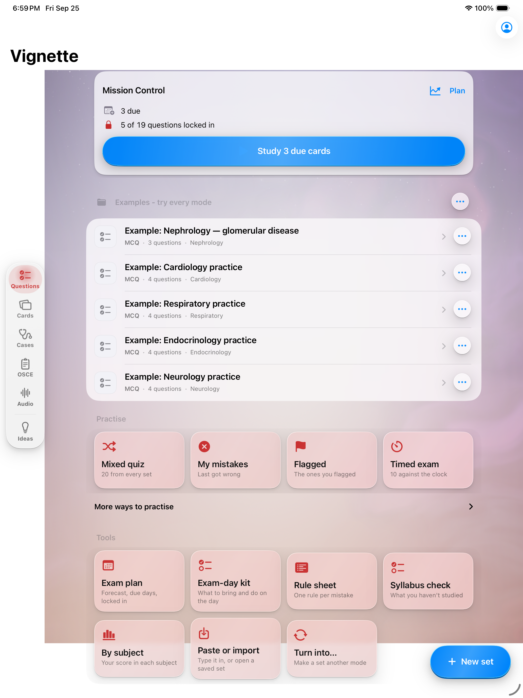

### ipad/3-relaunch: iPad Pro 13-inch (M5)

```
bundle=com.cramdown.personal exe=Stethoscore Personal
keep=1 args=
launch_status=0
pid=35126 alive_after_30s=yes
--- stderr.txt (last 25 of 1)
IOSurfaceClientSetSurfaceNotify failed e00002c7
--- log-process.txt: 31 matching lines (last 30)
2026-09-25 19:00:37.540 Df Stethoscore Personal[35126:19a94] [com.apple.dt.xctest:Default] notify_get_state check indicated test daemon not ready.
2026-09-25 19:00:37.540 Df Stethoscore Personal[35126:19a94] [com.apple.dt.xctest:Default] notify_get_state check indicated test daemon not ready.
2026-09-25 19:00:37.541 Df Stethoscore Personal[35126:19a94] [com.apple.dt.xctest:Default] notify_get_state check indicated test daemon not ready.
2026-09-25 19:00:38.405 Df Stethoscore Personal[35126:19a94] [com.apple.UIKit:KeyWindow] Setting default evaluation strategy for UIUserInterfaceIdiomPad to LastOneWins
2026-09-25 19:00:38.406 Df Stethoscore Personal[35126:19a94] [com.apple.UIKit:KeyWindow] Setting default evaluation strategy for UIUserInterfaceIdiomPad to SystemShellManaged
2026-09-25 19:00:38.439 Df Stethoscore Personal[35126:19a94] [com.apple.FileURL:default] kExcludedFromBackupXattrName set on path: /Users/runner/Library/Developer/CoreSimulator/Devices/A2011F14-88A1-46AA-999A-FD6FEDCD870B/data/Containers/Data/Application/7A1EF1F2-28C0-4EAF-B110-9695B8F3DC0F/Library/Application Support/RedPenBlobs
2026-09-25 19:00:39.255 I  Stethoscore Personal[35126:19a94] [com.apple.DesignLibrary:defaults] liveTuning=false
2026-09-25 19:00:39.945 Df Stethoscore Personal[35126:19a94] [PrototypeTools:domain] Not observing PTDefaults on customer install.
2026-09-25 19:00:40.092 Df Stethoscore Personal[35126:19b82] [com.apple.calls.callkit:Default] Call host has no calls
2026-09-25 19:00:40.232 I  Stethoscore Personal[35126:19b84] [com.apple.storekit:Default] AAFService Starting new XPCConnection 0c4d1e59
2026-09-25 19:00:40.282 Df Stethoscore Personal[35126:19b7c] [com.apple.storekit:Default] [Default] Finished iterating transaction batches
2026-09-25 19:00:40.282 I  Stethoscore Personal[35126:19b7c] [com.apple.storekit:Default] AAFService Closing XPCConnection 0c4d1e59
2026-09-25 19:00:40.282 Df Stethoscore Personal[35126:19b7c] [com.apple.storekit:Default] AAFService connection invalidated
2026-09-25 19:00:41.726 Df Stethoscore Personal[35126:19a94] [com.apple.network:activity] Create activity from XPC object <nw_activity 50:1 [813D2585-4758-4EE3-9842-30D964E99B64] (reporting strategy default)>
2026-09-25 19:00:41.726 Df Stethoscore Personal[35126:19a94] [com.apple.network:activity] Create activity from XPC object <nw_activity 50:2 [CC803ACE-6F1B-453E-911C-7F77C17C16A9] (reporting strategy default)>
2026-09-25 19:00:41.726 Df Stethoscore Personal[35126:19a94] [com.apple.network:activity] Set activity <nw_activity 50:1 [813D2585-4758-4EE3-9842-30D964E99B64] (reporting strategy default)> as the global parent
2026-09-25 19:00:41.741 I  Stethoscore Personal[35126:19b82] [com.apple.storekit:Default] AAFService Starting new XPCConnection 73dc7dd0
2026-09-25 19:00:41.768 I  Stethoscore Personal[35126:19a94] [com.apple.PointerUI:Common] Activating Connection: <BSXPC(com.apple.PointerUI.pointeruid.service[C:3-1])-as(com.apple.PointerUI.pointeruid.default-service):0x10628af80 name=(null)>
2026-09-25 19:00:41.778 Df Stethoscore Personal[35126:19b82] [com.apple.storekit:Default] [Default] Finished iterating transaction batches
2026-09-25 19:00:41.779 I  Stethoscore Personal[35126:19b82] [com.apple.storekit:Default] AAFService Closing XPCConnection 73dc7dd0
2026-09-25 19:00:41.781 I  Stethoscore Personal[35126:19b82] [com.apple.storekit:Default] AAFService Starting new XPCConnection 6fb979ae
2026-09-25 19:00:41.786 Df Stethoscore Personal[35126:19b82] [com.apple.storekit:Default] AAFService connection invalidated
2026-09-25 19:00:41.797 Df Stethoscore Personal[35126:19b82] [com.apple.storekit:Default] [Default] Finished iterating transaction batches
2026-09-25 19:00:41.951 I  Stethoscore Personal[35126:19b82] [com.apple.storekit:Default] AAFService Closing XPCConnection 6fb979ae
2026-09-25 19:00:41.958 Df Stethoscore Personal[35126:19b86] [com.apple.storekit:Default] AAFService connection invalidated
2026-09-25 19:00:41.959 Df Stethoscore Personal[35126:19b82] [com.apple.storekit:Default] Registering for 'transactionsupdated' daemon notification
2026-09-25 19:00:42.111 Df Stethoscore Personal[35126:19b84] [com.apple.FileURL:default] kExcludedFromBackupXattrName set on path: /Users/runner/Library/Developer/CoreSimulator/Devices/A2011F14-88A1-46AA-999A-FD6FEDCD870B/data/Containers/Data/Application/7A1EF1F2-28C0-4EAF-B110-9695B8F3DC0F/Library/Application Support/RedPenSources
2026-09-25 19:00:42.922 Df Stethoscore Personal[35126:19a94] [com.apple.network:activity] <nw_activity 50:1 [813D2585-4758-4EE3-9842-30D964E99B64] (global parent) (reporting strategy default) complete (reason success)> complete with reason 2 (success), duration 10353ms
2026-09-25 19:00:42.922 Df Stethoscore Personal[35126:19a94] [com.apple.network:activity] <nw_activity 50:2 [CC803ACE-6F1B-453E-911C-7F77C17C16A9] (reporting strategy default) complete (reason success)> complete with reason 2 (success), duration 10353ms
2026-09-25 19:00:42.922 Df Stethoscore Personal[35126:19a94] [com.apple.network:activity] Unsetting the global parent activity <nw_activity 50:1 [813D2585-4758-4EE3-9842-30D964E99B64] (global parent) (reporting strategy default) complete (reason success)>
--- log-system.txt: 122 matching lines (last 30)
2026-09-25 19:00:30.653 Df splashboardd[26680:13722] [com.apple.SplashBoard:Capture] Updating window to <XBLaunchStateRequest: 0x101a543f0; groupID: com.cramdown.personal - {DEFAULT GROUP}; statusBar: normal; refSize: {1032, 1376}; naturalSize: {1376, 1032}; orientation: LandscapeLeft; userInterfaceStyle: Dark>
2026-09-25 19:00:30.890 Df SpringBoard[23657:1930f] [com.apple.SplashBoard:Capture] Image generation complete for: <XBLaunchStateRequest: 0x11df37250; groupID: com.cramdown.personal - {DEFAULT GROUP}; statusBar: normal; refSize: {1032, 1376}; naturalSize: {1376, 1032}; orientation: LandscapeLeft; userInterfaceStyle: Dark>
```
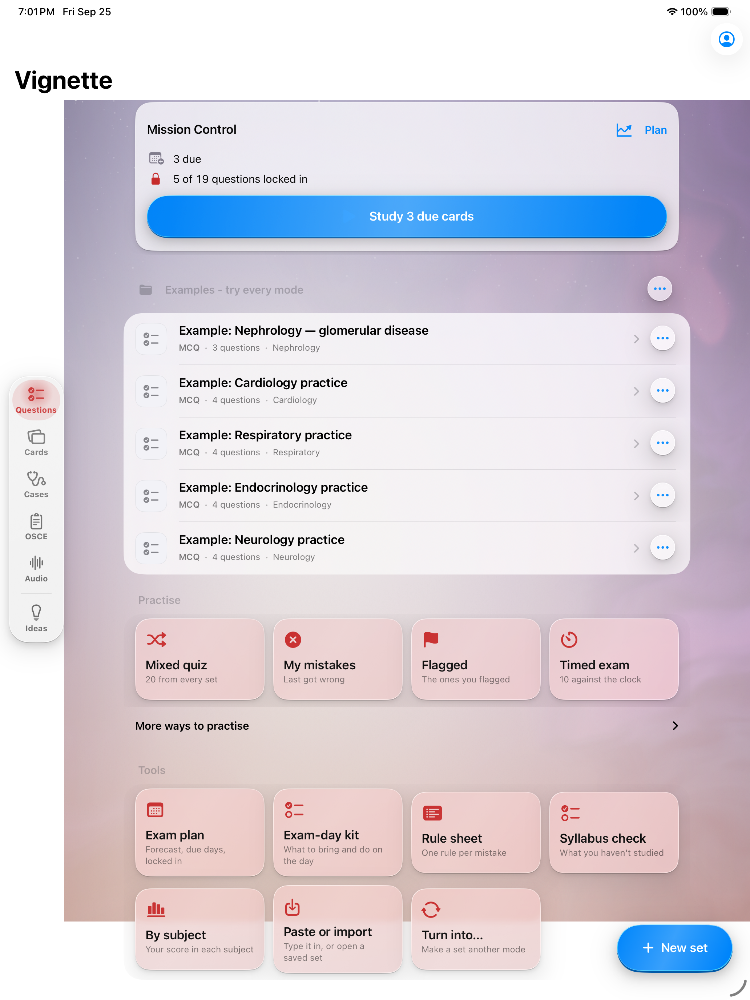

### ipad/4-upgrade-to-current: iPad Pro 13-inch (M5)

```
bundle=com.cramdown.personal exe=Stethoscore Personal
keep=1 args=
launch_status=0
pid=36823 alive_after_30s=yes
--- stderr.txt (last 25 of 1)
IOSurfaceClientSetSurfaceNotify failed e00002c7
--- log-process.txt: 25 matching lines (last 30)
2026-09-25 19:01:41.860 Df Stethoscore Personal[36823:1abec] [com.apple.dt.xctest:Default] Registering for test daemon availability notify post.
2026-09-25 19:01:41.860 Df Stethoscore Personal[36823:1abec] [com.apple.dt.xctest:Default] notify_get_state check indicated test daemon not ready.
2026-09-25 19:01:41.861 Df Stethoscore Personal[36823:1abec] [com.apple.dt.xctest:Default] notify_get_state check indicated test daemon not ready.
2026-09-25 19:01:41.861 Df Stethoscore Personal[36823:1abec] [com.apple.dt.xctest:Default] notify_get_state check indicated test daemon not ready.
2026-09-25 19:01:41.925 Df Stethoscore Personal[36823:1abec] [com.apple.FileURL:default] kExcludedFromBackupXattrName set on path: /Users/runner/Library/Developer/CoreSimulator/Devices/A2011F14-88A1-46AA-999A-FD6FEDCD870B/data/Containers/Data/Application/1BEEDBF9-6F48-4203-BD68-1912EEBDCFA6/Library/Application Support/RedPenBlobs
2026-09-25 19:01:42.030 Df Stethoscore Personal[36823:1abec] [com.apple.UIKit:KeyWindow] Setting default evaluation strategy for UIUserInterfaceIdiomPad to LastOneWins
2026-09-25 19:01:42.031 Df Stethoscore Personal[36823:1abec] [com.apple.UIKit:KeyWindow] Setting default evaluation strategy for UIUserInterfaceIdiomPad to SystemShellManaged
2026-09-25 19:01:42.586 I  Stethoscore Personal[36823:1abec] [com.apple.DesignLibrary:defaults] liveTuning=false
2026-09-25 19:01:42.634 Df Stethoscore Personal[36823:1abec] [PrototypeTools:domain] Not observing PTDefaults on customer install.
2026-09-25 19:01:43.004 Df Stethoscore Personal[36823:1abec] [com.apple.network:activity] Create activity from XPC object <nw_activity 50:1 [E61F8329-6C85-44CB-880E-EDD25C24EC18] (reporting strategy default)>
2026-09-25 19:01:43.004 Df Stethoscore Personal[36823:1abec] [com.apple.network:activity] Create activity from XPC object <nw_activity 50:2 [002C1AFB-E98B-42C2-B384-5B814BA6FF81] (reporting strategy default)>
2026-09-25 19:01:43.004 Df Stethoscore Personal[36823:1abec] [com.apple.network:activity] Set activity <nw_activity 50:1 [E61F8329-6C85-44CB-880E-EDD25C24EC18] (reporting strategy default)> as the global parent
2026-09-25 19:01:43.010 I  Stethoscore Personal[36823:1abf8] [com.apple.storekit:Default] AAFService Starting new XPCConnection 672f0eb7
2026-09-25 19:01:43.022 I  Stethoscore Personal[36823:1abec] [com.apple.PointerUI:Common] Activating Connection: <BSXPC(com.apple.PointerUI.pointeruid.service[C:3-1])-as(com.apple.PointerUI.pointeruid.default-service):0x1158a56d0 name=(null)>
2026-09-25 19:01:43.054 Df Stethoscore Personal[36823:1abf9] [com.apple.storekit:Default] [Default] Finished iterating transaction batches
2026-09-25 19:01:43.054 I  Stethoscore Personal[36823:1abfa] [com.apple.storekit:Default] AAFService Closing XPCConnection 672f0eb7
2026-09-25 19:01:43.055 I  Stethoscore Personal[36823:1abf8] [com.apple.storekit:Default] AAFService Starting new XPCConnection 6a0f8927
2026-09-25 19:01:43.059 Df Stethoscore Personal[36823:1abf9] [com.apple.storekit:Default] AAFService connection invalidated
2026-09-25 19:01:43.067 Df Stethoscore Personal[36823:1ac00] [com.apple.storekit:Default] [Default] Finished iterating transaction batches
2026-09-25 19:01:43.296 I  Stethoscore Personal[36823:1abf8] [com.apple.storekit:Default] AAFService Closing XPCConnection 6a0f8927
2026-09-25 19:01:43.304 Df Stethoscore Personal[36823:1abf9] [com.apple.storekit:Default] Registering for 'transactionsupdated' daemon notification
2026-09-25 19:01:43.313 Df Stethoscore Personal[36823:1ac00] [com.apple.storekit:Default] AAFService connection invalidated
2026-09-25 19:01:43.541 Df Stethoscore Personal[36823:1abec] [com.apple.network:activity] <nw_activity 50:1 [E61F8329-6C85-44CB-880E-EDD25C24EC18] (global parent) (reporting strategy default) complete (reason success)> complete with reason 2 (success), duration 3231ms
2026-09-25 19:01:43.541 Df Stethoscore Personal[36823:1abec] [com.apple.network:activity] <nw_activity 50:2 [002C1AFB-E98B-42C2-B384-5B814BA6FF81] (reporting strategy default) complete (reason success)> complete with reason 2 (success), duration 3232ms
2026-09-25 19:01:43.541 Df Stethoscore Personal[36823:1abec] [com.apple.network:activity] Unsetting the global parent activity <nw_activity 50:1 [E61F8329-6C85-44CB-880E-EDD25C24EC18] (global parent) (reporting strategy default) complete (reason success)>
--- log-system.txt: 120 matching lines (last 30)
2026-09-25 19:01:39.600 Df SpringBoard[23657:198b0] [com.apple.SplashBoard:FileManifest] <XBApplicationSnapshotManifestImpl: 0x11cab9980> [com.cramdown.personal] Snapshot data for <XBApplicationSnapshot: 0x11cbf9a40; …01233B3A4839> [com.cramdown.personal] written to file: /Users/runner/Library/Developer/CoreSimulator/Devices/A2011F14-88A1-46AA-999A-FD6FEDCD870B/data/Containers/Data/Application/1BE
2026-09-25 19:01:39.601 Df splashboardd[26680:13722] [com.apple.SplashBoard:Capture] Updating window to <XBLaunchStateRequest: 0x101a551f0; groupID: com.cramdown.personal - {DEFAULT GROUP}; statusBar: normal; refSize: {1032, 1376}; naturalSize: {1376, 1032}; orientation: LandscapeLeft; userInterfaceStyle: Dark>
2026-09-25 19:01:39.684 Df SpringBoard[23657:198b0] [com.apple.SplashBoard:Capture] Image generation complete for: <XBLaunchStateRequest: 0x10b713bf0; groupID: com.cramdown.personal - {DEFAULT GROUP}; statusBar: normal; refSize: {1032, 1376}; naturalSize: {1376, 1032}; orientation: LandscapeLeft; userInterfaceStyle: Dark>
2026-09-25 19:01:39.685 Df SpringBoard[23657:1ab7d] [com.apple.SplashBoard:Capture] Asynchronously generating image data for request: <XBLaunchStateRequest: 0x11df341c0; groupID: com.cramdown.personal - {DEFAULT GROUP}; statusBar: normal; refSize: {1032, 375}; naturalSize: {375, 1032}; orientation: LandscapeLeft; userInterfaceStyle: Dark>
2026-09-25 19:01:39.686 Df SpringBoard[23657:1ab3e] [com.apple.SplashBoard:FileManifest] <XBApplicationSnapshotManifestImpl: 0x11cab9980> [com.cramdown.personal] Snapshot data for <XBApplicationSnapshot: 0x11df12bc0; …A7721A0B0E68> [com.cramdown.personal] written to file: /Users/runner/Library/Developer/CoreSimulator/Devices/A2011F14-88A1-46AA-999A-FD6FEDCD870B/data/Containers/Data/Application/1BE
2026-09-25 19:01:39.686 Df splashboardd[26680:13722] [com.apple.SplashBoard:Capture] Updating window to <XBLaunchStateRequest: 0x101a56290; groupID: com.cramdown.personal - {DEFAULT GROUP}; statusBar: normal; refSize: {1032, 375}; naturalSize: {375, 1032}; orientation: LandscapeLeft; userInterfaceStyle: Dark>
2026-09-25 19:01:39.711 Df SpringBoard[23657:198b0] [com.apple.SplashBoard:Capture] Image generation complete for: <XBLaunchStateRequest: 0x11df341c0; groupID: com.cramdown.personal - {DEFAULT GROUP}; statusBar: normal; refSize: {1032, 375}; naturalSize: {375, 1032}; orientation: LandscapeLeft; userInterfaceStyle: Dark>
```
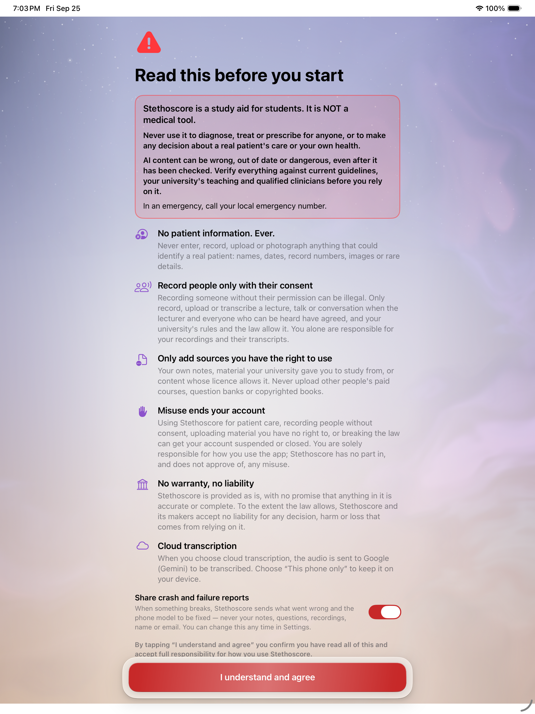

### iphone/1-fresh: iPhone 17 Pro

```
bundle=com.cramdown.personal exe=Stethoscore Personal
keep=0 args=
launch_status=0
pid=11475 alive_after_30s=yes
--- stderr.txt (last 25 of 1)
IOSurfaceClientSetSurfaceNotify failed e00002c7
--- log-process.txt: 19 matching lines (last 30)
2026-09-25 18:38:36.690 Df Stethoscore Personal[11475:911e] [com.apple.dt.xctest:Default] Registering for test daemon availability notify post.
2026-09-25 18:38:36.690 Df Stethoscore Personal[11475:911e] [com.apple.dt.xctest:Default] notify_get_state check indicated test daemon not ready.
2026-09-25 18:38:36.691 Df Stethoscore Personal[11475:911e] [com.apple.dt.xctest:Default] notify_get_state check indicated test daemon not ready.
2026-09-25 18:38:36.692 Df Stethoscore Personal[11475:911e] [com.apple.dt.xctest:Default] notify_get_state check indicated test daemon not ready.
2026-09-25 18:38:36.905 Df Stethoscore Personal[11475:911e] [com.apple.FileURL:default] kExcludedFromBackupXattrName set on path: /Users/runner/Library/Developer/CoreSimulator/Devices/22452A91-4697-4369-8812-53ADB77EB73B/data/Containers/Data/Application/1254E379-4B97-45EF-ABFB-FDD6BF3A8825/Library/Application Support/RedPenBlobs
2026-09-25 18:38:36.944 Df Stethoscore Personal[11475:911e] [com.apple.UIKit:KeyWindow] Setting default evaluation strategy for UIUserInterfaceIdiomPhone to LastOneWins
2026-09-25 18:38:36.944 Df Stethoscore Personal[11475:911e] [com.apple.UIKit:KeyWindow] Setting default evaluation strategy for UIUserInterfaceIdiomPhone to SystemShellManaged
2026-09-25 18:38:37.748 Df Stethoscore Personal[11475:911e] [PrototypeTools:domain] Not observing PTDefaults on customer install.
2026-09-25 18:38:39.462 Df Stethoscore Personal[11475:911e] [com.apple.network:activity] Create activity from XPC object <nw_activity 50:1 [96838C0E-85DA-44DC-AC66-2A132FD98DF4] (reporting strategy default)>
2026-09-25 18:38:39.463 Df Stethoscore Personal[11475:911e] [com.apple.network:activity] Create activity from XPC object <nw_activity 50:2 [AC85589D-AAB2-4C8E-9006-70252B2D89DD] (reporting strategy default)>
2026-09-25 18:38:39.463 Df Stethoscore Personal[11475:911e] [com.apple.network:activity] Set activity <nw_activity 50:1 [96838C0E-85DA-44DC-AC66-2A132FD98DF4] (reporting strategy default)> as the global parent
2026-09-25 18:38:40.149 Df Stethoscore Personal[11475:915c] [com.apple.storekit:Default] [Default] Finished iterating transaction batches
2026-09-25 18:38:40.311 Df Stethoscore Personal[11475:915c] [com.apple.storekit:Default] [Default] Finished iterating transaction batches
2026-09-25 18:38:40.325 Df Stethoscore Personal[11475:915d] [com.apple.storekit:Default] AAFService connection invalidated
2026-09-25 18:38:40.538 Df Stethoscore Personal[11475:915c] [com.apple.storekit:Default] Registering for 'transactionsupdated' daemon notification
2026-09-25 18:38:40.584 Df Stethoscore Personal[11475:915d] [com.apple.storekit:Default] AAFService connection invalidated
2026-09-25 18:38:56.946 Df Stethoscore Personal[11475:911e] [com.apple.network:activity] <nw_activity 50:1 [96838C0E-85DA-44DC-AC66-2A132FD98DF4] (global parent) (reporting strategy default) complete (reason failure)> complete with reason 3 (failure), duration 22439ms
2026-09-25 18:38:56.946 Df Stethoscore Personal[11475:911e] [com.apple.network:activity] <nw_activity 50:2 [AC85589D-AAB2-4C8E-9006-70252B2D89DD] (reporting strategy default) complete (reason failure)> complete with reason 3 (failure), duration 22439ms
2026-09-25 18:38:56.946 Df Stethoscore Personal[11475:911e] [com.apple.network:activity] Unsetting the global parent activity <nw_activity 50:1 [96838C0E-85DA-44DC-AC66-2A132FD98DF4] (global parent) (reporting strategy default) complete (reason failure)>
--- log-system.txt: 70 matching lines (last 30)
2026-09-25 18:38:29.352 Df SpringBoard[8866:9064] [com.apple.SplashBoard:Capture] Asynchronously generating image data for request: <XBLaunchStateRequest: 0x11902f4f0; groupID: com.cramdown.personal - {DEFAULT GROUP}; statusBar: normal; refSize: {402, 874}; orientation: Portrait; userInterfaceStyle: Light>
2026-09-25 18:38:32.209 Df splashboardd[11451:90ae] [com.apple.SplashBoard:Capture] Updating window to <XBLaunchStateRequest: 0x1038dc070; groupID: com.cramdown.personal - {DEFAULT GROUP}; statusBar: normal; refSize: {402, 874}; orientation: Portrait; userInterfaceStyle: Light>
2026-09-25 18:38:32.443 Df SpringBoard[8866:9079] [com.apple.SplashBoard:Capture] Image generation complete for: <XBLaunchStateRequest: 0x11902f4f0; groupID: com.cramdown.personal - {DEFAULT GROUP}; statusBar: normal; refSize: {402, 874}; orientation: Portrait; userInterfaceStyle: Light>
2026-09-25 18:38:32.449 Df SpringBoard[8866:8ad7] [com.apple.SplashBoard:FileManifest] <XBApplicationSnapshotManifestImpl: 0x119306600> [com.cramdown.personal] Snapshot data for <XBApplicationSnapshot: 0x11cb8cc40; …6BAF90217972> [com.cramdown.personal] written to file: /Users/runner/Library/Developer/CoreSimulator/Devices/22452A91-4697-4369-8812-53ADB77EB73B/data/Containers/Data/Application/1254E
2026-09-25 18:38:32.449 Df SpringBoard[8866:9064] [com.apple.SplashBoard:Capture] Asynchronously generating image data for request: <XBLaunchStateRequest: 0x11902ee60; groupID: com.cramdown.personal - {DEFAULT GROUP}; statusBar: normal; refSize: {402, 874}; orientation: Portrait; userInterfaceStyle: Dark>
2026-09-25 18:38:32.457 Df splashboardd[11451:90ae] [com.apple.SplashBoard:Capture] Updating window to <XBLaunchStateRequest: 0x103a60000; groupID: com.cramdown.personal - {DEFAULT GROUP}; statusBar: normal; refSize: {402, 874}; orientation: Portrait; userInterfaceStyle: Dark>
2026-09-25 18:38:32.578 Df SpringBoard[8866:9078] [com.apple.SplashBoard:FileManifest] <XBApplicationSnapshotManifestImpl: 0x119306600> [com.cramdown.personal] Snapshot data for <XBApplicationSnapshot: 0x11cb8ce00; …8F410631CFB6> [com.cramdown.personal] written to file: /Users/runner/Library/Developer/CoreSimulator/Devices/22452A91-4697-4369-8812-53ADB77EB73B/data/Containers/Data/Application/1254E
2026-09-25 18:38:32.579 Df SpringBoard[8866:9078] [com.apple.SplashBoard:Capture] Image generation complete for: <XBLaunchStateRequest: 0x11902ee60; groupID: com.cramdown.personal - {DEFAULT GROUP}; statusBar: normal; refSize: {402, 874}; orientation: Portrait; userInterfaceStyle: Dark>
    "terminate_running_process" = 1;
	retryTimeout: 120.000000 (default write com.apple.CoreSimulatorBridge LaunchRetryTimeout <value>)
	bootTimeout: 300.000000 (default write com.apple.CoreSimulatorBridge BootRetryTimeout <value>)
	bootLeeway: 120.000000 (default write com.apple.CoreSimulatorBridge BootLeeway <value>)
	Note: Use 'xcrun simctl spawn booted defaults write <domain> <key> <value>' to modify defaults in the booted Simulator device.
```
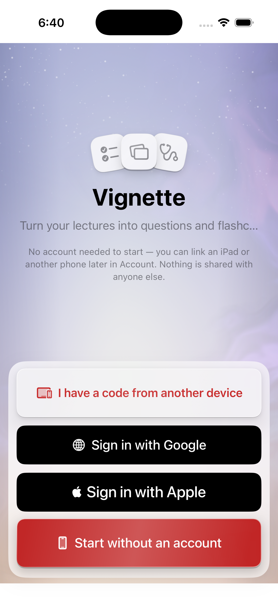

### iphone/2-signed-in: iPhone 17 Pro

```
bundle=com.cramdown.personal exe=Stethoscore Personal
keep=1 args=-launchTestSignedIn
launch_status=0
pid=15507 alive_after_30s=yes
--- stderr.txt (last 25 of 1)
IOSurfaceClientSetSurfaceNotify failed e00002c7
--- log-process.txt: 30 matching lines (last 30)
2026-09-25 18:42:39.957 Df Stethoscore Personal[15507:bac1] [com.apple.dt.xctest:Default] Registering for test daemon availability notify post.
2026-09-25 18:42:39.957 Df Stethoscore Personal[15507:bac1] [com.apple.dt.xctest:Default] notify_get_state check indicated test daemon not ready.
2026-09-25 18:42:39.957 Df Stethoscore Personal[15507:bac1] [com.apple.dt.xctest:Default] notify_get_state check indicated test daemon not ready.
2026-09-25 18:42:39.957 Df Stethoscore Personal[15507:bac1] [com.apple.dt.xctest:Default] notify_get_state check indicated test daemon not ready.
2026-09-25 18:42:40.030 Df Stethoscore Personal[15507:bac1] [com.apple.UIKit:KeyWindow] Setting default evaluation strategy for UIUserInterfaceIdiomPhone to LastOneWins
2026-09-25 18:42:40.031 Df Stethoscore Personal[15507:bac1] [com.apple.UIKit:KeyWindow] Setting default evaluation strategy for UIUserInterfaceIdiomPhone to SystemShellManaged
2026-09-25 18:42:40.059 Df Stethoscore Personal[15507:bac1] [com.apple.FileURL:default] kExcludedFromBackupXattrName set on path: /Users/runner/Library/Developer/CoreSimulator/Devices/22452A91-4697-4369-8812-53ADB77EB73B/data/Containers/Data/Application/C5388652-2AF4-4F69-BB36-28585C7D6EDD/Library/Application Support/RedPenBlobs
2026-09-25 18:42:40.686 I  Stethoscore Personal[15507:bac1] [com.apple.DesignLibrary:defaults] liveTuning=false
2026-09-25 18:42:40.857 Df Stethoscore Personal[15507:bac1] [PrototypeTools:domain] Not observing PTDefaults on customer install.
2026-09-25 18:42:40.996 Df Stethoscore Personal[15507:bae3] [com.apple.calls.callkit:Default] Call host has no calls
2026-09-25 18:42:41.119 I  Stethoscore Personal[15507:bae4] [com.apple.storekit:Default] AAFService Starting new XPCConnection 9cb442c2
2026-09-25 18:42:41.200 Df Stethoscore Personal[15507:badc] [com.apple.storekit:Default] [Default] Finished iterating transaction batches
2026-09-25 18:42:41.200 I  Stethoscore Personal[15507:badc] [com.apple.storekit:Default] AAFService Closing XPCConnection 9cb442c2
2026-09-25 18:42:41.200 Df Stethoscore Personal[15507:badc] [com.apple.storekit:Default] AAFService connection invalidated
2026-09-25 18:42:42.149 Df Stethoscore Personal[15507:bac1] [com.apple.network:activity] Create activity from XPC object <nw_activity 50:1 [D89104A3-8FB6-4F6E-9AE6-CB770F40FF82] (reporting strategy default)>
2026-09-25 18:42:42.150 Df Stethoscore Personal[15507:bac1] [com.apple.network:activity] Create activity from XPC object <nw_activity 50:2 [0A9B3F10-08B7-4019-8A70-AB377E5CC677] (reporting strategy default)>
2026-09-25 18:42:42.150 Df Stethoscore Personal[15507:bac1] [com.apple.network:activity] Set activity <nw_activity 50:1 [D89104A3-8FB6-4F6E-9AE6-CB770F40FF82] (reporting strategy default)> as the global parent
2026-09-25 18:42:42.152 I  Stethoscore Personal[15507:bae3] [com.apple.storekit:Default] AAFService Starting new XPCConnection ba0153f8
2026-09-25 18:42:42.196 Df Stethoscore Personal[15507:bae2] [com.apple.storekit:Default] [Default] Finished iterating transaction batches
2026-09-25 18:42:42.197 I  Stethoscore Personal[15507:bae2] [com.apple.storekit:Default] AAFService Closing XPCConnection ba0153f8
2026-09-25 18:42:42.197 I  Stethoscore Personal[15507:badb] [com.apple.storekit:Default] AAFService Starting new XPCConnection a5331cc9
2026-09-25 18:42:42.334 Df Stethoscore Personal[15507:badb] [com.apple.storekit:Default] [Default] Finished iterating transaction batches
2026-09-25 18:42:42.475 Df Stethoscore Personal[15507:bae2] [com.apple.storekit:Default] AAFService connection invalidated
2026-09-25 18:42:42.779 I  Stethoscore Personal[15507:badb] [com.apple.storekit:Default] AAFService Closing XPCConnection a5331cc9
2026-09-25 18:42:42.801 Df Stethoscore Personal[15507:badb] [com.apple.storekit:Default] Registering for 'transactionsupdated' daemon notification
2026-09-25 18:42:42.823 Df Stethoscore Personal[15507:badb] [com.apple.storekit:Default] AAFService connection invalidated
2026-09-25 18:42:57.941 Df Stethoscore Personal[15507:bac1] [com.apple.network:activity] <nw_activity 50:1 [D89104A3-8FB6-4F6E-9AE6-CB770F40FF82] (global parent) (reporting strategy default) complete (reason failure)> complete with reason 3 (failure), duration 19114ms
2026-09-25 18:42:57.941 Df Stethoscore Personal[15507:bac1] [com.apple.network:activity] <nw_activity 50:2 [0A9B3F10-08B7-4019-8A70-AB377E5CC677] (reporting strategy default) complete (reason failure)> complete with reason 3 (failure), duration 19114ms
2026-09-25 18:42:57.941 Df Stethoscore Personal[15507:bac1] [com.apple.network:activity] Unsetting the global parent activity <nw_activity 50:1 [D89104A3-8FB6-4F6E-9AE6-CB770F40FF82] (global parent) (reporting strategy default) complete (reason failure)>
2026-09-25 18:43:17.018 Df Stethoscore Personal[15507:bae4] [com.apple.FileURL:default] kExcludedFromBackupXattrName set on path: /Users/runner/Library/Developer/CoreSimulator/Devices/22452A91-4697-4369-8812-53ADB77EB73B/data/Containers/Data/Application/C5388652-2AF4-4F69-BB36-28585C7D6EDD/Library/Application Support/RedPenSources
--- log-system.txt: 80 matching lines (last 30)
2026-09-25 18:42:37.704 Df splashboardd[11451:90ae] [com.apple.SplashBoard:Capture] Updating window to <XBLaunchStateRequest: 0x103a62290; groupID: com.cramdown.personal - {DEFAULT GROUP}; statusBar: normal; refSize: {402, 874}; orientation: Portrait; userInterfaceStyle: Light>
2026-09-25 18:42:37.973 Df SpringBoard[8866:b931] [com.apple.SplashBoard:Capture] Image generation complete for: <XBLaunchStateRequest: 0x115de2e60; groupID: com.cramdown.personal - {DEFAULT GROUP}; statusBar: normal; refSize: {402, 874}; orientation: Portrait; userInterfaceStyle: Light>
```


### iphone/3-relaunch: iPhone 17 Pro

```
bundle=com.cramdown.personal exe=Stethoscore Personal
keep=1 args=
launch_status=0
pid=17591 alive_after_30s=yes
--- stderr.txt (last 25 of 1)
IOSurfaceClientSetSurfaceNotify failed e00002c7
--- log-process.txt: 30 matching lines (last 30)
2026-09-25 18:43:58.843 Df Stethoscore Personal[17591:d01c] [com.apple.dt.xctest:Default] Registering for test daemon availability notify post.
2026-09-25 18:43:58.844 Df Stethoscore Personal[17591:d01c] [com.apple.dt.xctest:Default] notify_get_state check indicated test daemon not ready.
2026-09-25 18:43:58.844 Df Stethoscore Personal[17591:d01c] [com.apple.dt.xctest:Default] notify_get_state check indicated test daemon not ready.
2026-09-25 18:43:58.844 Df Stethoscore Personal[17591:d01c] [com.apple.dt.xctest:Default] notify_get_state check indicated test daemon not ready.
2026-09-25 18:43:58.940 Df Stethoscore Personal[17591:d01c] [com.apple.UIKit:KeyWindow] Setting default evaluation strategy for UIUserInterfaceIdiomPhone to LastOneWins
2026-09-25 18:43:58.941 Df Stethoscore Personal[17591:d01c] [com.apple.UIKit:KeyWindow] Setting default evaluation strategy for UIUserInterfaceIdiomPhone to SystemShellManaged
2026-09-25 18:43:58.976 Df Stethoscore Personal[17591:d01c] [com.apple.FileURL:default] kExcludedFromBackupXattrName set on path: /Users/runner/Library/Developer/CoreSimulator/Devices/22452A91-4697-4369-8812-53ADB77EB73B/data/Containers/Data/Application/6FF1FC8A-449E-4B87-B398-ADF8371C92FF/Library/Application Support/RedPenBlobs
2026-09-25 18:43:59.858 I  Stethoscore Personal[17591:d01c] [com.apple.DesignLibrary:defaults] liveTuning=false
2026-09-25 18:44:00.009 Df Stethoscore Personal[17591:d01c] [PrototypeTools:domain] Not observing PTDefaults on customer install.
2026-09-25 18:44:00.125 Df Stethoscore Personal[17591:d051] [com.apple.calls.callkit:Default] Call host has no calls
2026-09-25 18:44:00.268 I  Stethoscore Personal[17591:d056] [com.apple.storekit:Default] AAFService Starting new XPCConnection 4582a335
2026-09-25 18:44:00.288 Df Stethoscore Personal[17591:d056] [com.apple.storekit:Default] [Default] Finished iterating transaction batches
2026-09-25 18:44:00.288 I  Stethoscore Personal[17591:d056] [com.apple.storekit:Default] AAFService Closing XPCConnection 4582a335
2026-09-25 18:44:00.288 Df Stethoscore Personal[17591:d056] [com.apple.storekit:Default] AAFService connection invalidated
2026-09-25 18:44:01.295 Df Stethoscore Personal[17591:d01c] [com.apple.network:activity] Create activity from XPC object <nw_activity 50:1 [C940A19E-D464-4F45-B626-E67192BFC840] (reporting strategy default)>
2026-09-25 18:44:01.295 Df Stethoscore Personal[17591:d01c] [com.apple.network:activity] Create activity from XPC object <nw_activity 50:2 [57954523-4E26-4022-B7D4-019B3668584F] (reporting strategy default)>
2026-09-25 18:44:01.295 Df Stethoscore Personal[17591:d01c] [com.apple.network:activity] Set activity <nw_activity 50:1 [C940A19E-D464-4F45-B626-E67192BFC840] (reporting strategy default)> as the global parent
2026-09-25 18:44:01.325 I  Stethoscore Personal[17591:d053] [com.apple.storekit:Default] AAFService Starting new XPCConnection b979b43b
2026-09-25 18:44:01.335 Df Stethoscore Personal[17591:d053] [com.apple.storekit:Default] [Default] Finished iterating transaction batches
2026-09-25 18:44:01.335 I  Stethoscore Personal[17591:d053] [com.apple.storekit:Default] AAFService Closing XPCConnection b979b43b
2026-09-25 18:44:01.335 I  Stethoscore Personal[17591:d053] [com.apple.storekit:Default] AAFService Starting new XPCConnection be45bab2
2026-09-25 18:44:01.383 Df Stethoscore Personal[17591:d057] [com.apple.storekit:Default] AAFService connection invalidated
2026-09-25 18:44:01.385 Df Stethoscore Personal[17591:d0e8] [com.apple.storekit:Default] [Default] Finished iterating transaction batches
2026-09-25 18:44:01.958 I  Stethoscore Personal[17591:d057] [com.apple.storekit:Default] AAFService Closing XPCConnection be45bab2
2026-09-25 18:44:01.961 Df Stethoscore Personal[17591:d057] [com.apple.storekit:Default] Registering for 'transactionsupdated' daemon notification
2026-09-25 18:44:01.962 Df Stethoscore Personal[17591:d051] [com.apple.storekit:Default] AAFService connection invalidated
2026-09-25 18:44:06.223 Df Stethoscore Personal[17591:d0e8] [com.apple.FileURL:default] kExcludedFromBackupXattrName set on path: /Users/runner/Library/Developer/CoreSimulator/Devices/22452A91-4697-4369-8812-53ADB77EB73B/data/Containers/Data/Application/6FF1FC8A-449E-4B87-B398-ADF8371C92FF/Library/Application Support/RedPenSources
2026-09-25 18:44:08.872 Df Stethoscore Personal[17591:d01c] [com.apple.network:activity] <nw_activity 50:1 [C940A19E-D464-4F45-B626-E67192BFC840] (global parent) (reporting strategy default) complete (reason success)> complete with reason 2 (success), duration 11735ms
2026-09-25 18:44:08.872 Df Stethoscore Personal[17591:d01c] [com.apple.network:activity] <nw_activity 50:2 [57954523-4E26-4022-B7D4-019B3668584F] (reporting strategy default) complete (reason success)> complete with reason 2 (success), duration 11735ms
2026-09-25 18:44:08.872 Df Stethoscore Personal[17591:d01c] [com.apple.network:activity] Unsetting the global parent activity <nw_activity 50:1 [C940A19E-D464-4F45-B626-E67192BFC840] (global parent) (reporting strategy default) complete (reason success)>
--- log-system.txt: 79 matching lines (last 30)
2026-09-25 18:43:55.142 Df SpringBoard[8866:cd32] [com.apple.SplashBoard:Capture] Asynchronously generating image data for request: <XBLaunchStateRequest: 0x11e56e0d0; groupID: com.cramdown.personal - {DEFAULT GROUP}; statusBar: normal; refSize: {402, 874}; orientation: Portrait; userInterfaceStyle: Light>
2026-09-25 18:43:55.164 Df splashboardd[11451:90ae] [com.apple.SplashBoard:Capture] Updating window to <XBLaunchStateRequest: 0x103a613b0; groupID: com.cramdown.personal - {DEFAULT GROUP}; statusBar: normal; refSize: {402, 874}; orientation: Portrait; userInterfaceStyle: Light>
```
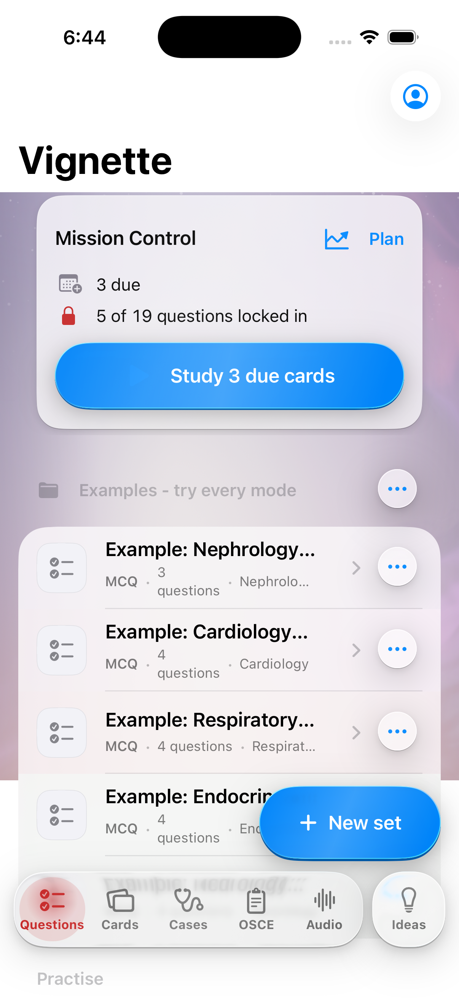

### iphone/4-upgrade-to-current: iPhone 17 Pro

```
bundle=com.cramdown.personal exe=Stethoscore Personal
keep=1 args=
launch_status=0
pid=19557 alive_after_30s=yes
--- stderr.txt (last 25 of 1)
IOSurfaceClientSetSurfaceNotify failed e00002c7
--- log-process.txt: 24 matching lines (last 30)
2026-09-25 18:45:06.695 Df Stethoscore Personal[19557:e4f0] [com.apple.dt.xctest:Default] Registering for test daemon availability notify post.
2026-09-25 18:45:06.696 Df Stethoscore Personal[19557:e4f0] [com.apple.dt.xctest:Default] notify_get_state check indicated test daemon not ready.
2026-09-25 18:45:06.696 Df Stethoscore Personal[19557:e4f0] [com.apple.dt.xctest:Default] notify_get_state check indicated test daemon not ready.
2026-09-25 18:45:06.696 Df Stethoscore Personal[19557:e4f0] [com.apple.dt.xctest:Default] notify_get_state check indicated test daemon not ready.
2026-09-25 18:45:06.723 Df Stethoscore Personal[19557:e4f0] [com.apple.UIKit:KeyWindow] Setting default evaluation strategy for UIUserInterfaceIdiomPhone to LastOneWins
2026-09-25 18:45:06.726 Df Stethoscore Personal[19557:e4f0] [com.apple.UIKit:KeyWindow] Setting default evaluation strategy for UIUserInterfaceIdiomPhone to SystemShellManaged
2026-09-25 18:45:06.790 Df Stethoscore Personal[19557:e4f0] [com.apple.FileURL:default] kExcludedFromBackupXattrName set on path: /Users/runner/Library/Developer/CoreSimulator/Devices/22452A91-4697-4369-8812-53ADB77EB73B/data/Containers/Data/Application/F06CD394-EB7B-44FC-AD27-7D242C8D611D/Library/Application Support/RedPenBlobs
2026-09-25 18:45:07.584 I  Stethoscore Personal[19557:e4f0] [com.apple.DesignLibrary:defaults] liveTuning=false
2026-09-25 18:45:07.646 Df Stethoscore Personal[19557:e4f0] [PrototypeTools:domain] Not observing PTDefaults on customer install.
2026-09-25 18:45:08.120 Df Stethoscore Personal[19557:e4f0] [com.apple.network:activity] Create activity from XPC object <nw_activity 50:1 [3FB06381-F6E5-446E-8858-D77316838C56] (reporting strategy default)>
2026-09-25 18:45:08.120 Df Stethoscore Personal[19557:e4f0] [com.apple.network:activity] Create activity from XPC object <nw_activity 50:2 [717D2481-3DDA-44F4-A286-470A9025A614] (reporting strategy default)>
2026-09-25 18:45:08.120 Df Stethoscore Personal[19557:e4f0] [com.apple.network:activity] Set activity <nw_activity 50:1 [3FB06381-F6E5-446E-8858-D77316838C56] (reporting strategy default)> as the global parent
2026-09-25 18:45:08.125 I  Stethoscore Personal[19557:e531] [com.apple.storekit:Default] AAFService Starting new XPCConnection f2005d89
2026-09-25 18:45:08.206 Df Stethoscore Personal[19557:e53f] [com.apple.storekit:Default] [Default] Finished iterating transaction batches
2026-09-25 18:45:08.207 I  Stethoscore Personal[19557:e535] [com.apple.storekit:Default] AAFService Closing XPCConnection f2005d89
2026-09-25 18:45:08.207 I  Stethoscore Personal[19557:e53f] [com.apple.storekit:Default] AAFService Starting new XPCConnection 745003ec
2026-09-25 18:45:08.225 Df Stethoscore Personal[19557:e53f] [com.apple.storekit:Default] AAFService connection invalidated
2026-09-25 18:45:08.230 Df Stethoscore Personal[19557:e535] [com.apple.storekit:Default] [Default] Finished iterating transaction batches
2026-09-25 18:45:08.403 I  Stethoscore Personal[19557:e53f] [com.apple.storekit:Default] AAFService Closing XPCConnection 745003ec
2026-09-25 18:45:08.410 Df Stethoscore Personal[19557:e531] [com.apple.storekit:Default] Registering for 'transactionsupdated' daemon notification
2026-09-25 18:45:08.428 Df Stethoscore Personal[19557:e56b] [com.apple.storekit:Default] AAFService connection invalidated
2026-09-25 18:45:13.743 Df Stethoscore Personal[19557:e4f0] [com.apple.network:activity] <nw_activity 50:1 [3FB06381-F6E5-446E-8858-D77316838C56] (global parent) (reporting strategy default) complete (reason success)> complete with reason 2 (success), duration 8931ms
2026-09-25 18:45:13.743 Df Stethoscore Personal[19557:e4f0] [com.apple.network:activity] <nw_activity 50:2 [717D2481-3DDA-44F4-A286-470A9025A614] (reporting strategy default) complete (reason success)> complete with reason 2 (success), duration 8932ms
2026-09-25 18:45:13.743 Df Stethoscore Personal[19557:e4f0] [com.apple.network:activity] Unsetting the global parent activity <nw_activity 50:1 [3FB06381-F6E5-446E-8858-D77316838C56] (global parent) (reporting strategy default) complete (reason success)>
--- log-system.txt: 77 matching lines (last 30)
    "/Users/runner/Library/Developer/CoreSimulator/Devices/22452A91-4697-4369-8812-53ADB77EB73B/data/Containers/Data/Application/F06CD394-EB7B-44FC-AD27-7D242C8D611D/Library/SplashBoard/Snapshots/com.cramdown.personal - {DEFAULT GROUP}/57D031FD-5481-435E-95BB-D0E0A201ED5D@3x.ktx",
    "/Users/runner/Library/Developer/CoreSimulator/Devices/22452A91-4697-4369-8812-53ADB77EB73B/data/Containers/Data/Application/F06CD394-EB7B-44FC-AD27-7D242C8D611D/Library/SplashBoard/Snapshots/com.cramdown.personal - {DEFAULT GROUP}/03EAD8B2-3DB1-44DA-8593-C2B29915F270@3x.ktx"
2026-09-25 18:45:02.426 Df SpringBoard[8866:e432] [com.apple.SplashBoard:Capture] Asynchronously generating image data for request: <XBLaunchStateRequest: 0x11cab48c0; groupID: com.cramdown.personal - {DEFAULT GROUP}; statusBar: normal; refSize: {402, 874}; orientation: Portrait; userInterfaceStyle: Light>
2026-09-25 18:45:02.509 Df splashboardd[11451:90ae] [com.apple.SplashBoard:Capture] Updating window to <XBLaunchStateRequest: 0x103a62300; groupID: com.cramdown.personal - {DEFAULT GROUP}; statusBar: normal; refSize: {402, 874}; orientation: Portrait; userInterfaceStyle: Light>
2026-09-25 18:45:03.600 Df SpringBoard[8866:e427] [com.apple.SplashBoard:Capture] Image generation complete for: <XBLaunchStateRequest: 0x11cab48c0; groupID: com.cramdown.personal - {DEFAULT GROUP}; statusBar: normal; refSize: {402, 874}; orientation: Portrait; userInterfaceStyle: Light>
2026-09-25 18:45:03.600 Df SpringBoard[8866:e432] [com.apple.SplashBoard:Capture] Asynchronously generating image data for request: <XBLaunchStateRequest: 0x11cab5ab0; groupID: com.cramdown.personal - {DEFAULT GROUP}; statusBar: normal; refSize: {402, 874}; orientation: Portrait; userInterfaceStyle: Dark>
2026-09-25 18:45:03.600 Df SpringBoard[8866:e473] [com.apple.SplashBoard:FileManifest] <XBApplicationSnapshotManifestImpl: 0x11c911c80> [com.cramdown.personal] Snapshot data for <XBApplicationSnapshot: 0x10a396300; …15B7F0558F1B> [com.cramdown.personal] written to file: /Users/runner/Library/Developer/CoreSimulator/Devices/22452A91-4697-4369-8812-53ADB77EB73B/data/Containers/Data/Application/F06CD
2026-09-25 18:45:03.603 Df splashboardd[11451:90ae] [com.apple.SplashBoard:Capture] Updating window to <XBLaunchStateRequest: 0x103a62290; groupID: com.cramdown.personal - {DEFAULT GROUP}; statusBar: normal; refSize: {402, 874}; orientation: Portrait; userInterfaceStyle: Dark>
```
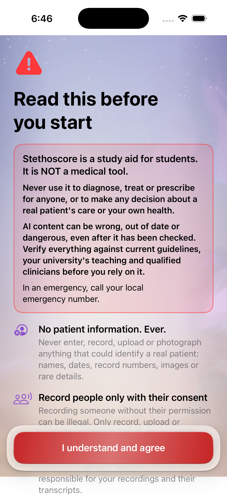

### iphone/5-other-bundle-id: iPhone 17 Pro

```
bundle=swift-playgrounds-dev-run.launchtest exe=Stethoscore Personal
keep=0 args=-launchTestSignedIn
launch_status=0
pid=21981 alive_after_30s=yes
--- stderr.txt (last 25 of 1)
IOSurfaceClientSetSurfaceNotify failed e00002c7
--- log-process.txt: 30 matching lines (last 30)
2026-09-25 18:46:46.602 Df Stethoscore Personal[21981:fe64] [com.apple.dt.xctest:Default] Registering for test daemon availability notify post.
2026-09-25 18:46:46.602 Df Stethoscore Personal[21981:fe64] [com.apple.dt.xctest:Default] notify_get_state check indicated test daemon not ready.
2026-09-25 18:46:46.602 Df Stethoscore Personal[21981:fe64] [com.apple.dt.xctest:Default] notify_get_state check indicated test daemon not ready.
2026-09-25 18:46:46.602 Df Stethoscore Personal[21981:fe64] [com.apple.dt.xctest:Default] notify_get_state check indicated test daemon not ready.
2026-09-25 18:46:46.707 Df Stethoscore Personal[21981:fe64] [com.apple.FileURL:default] kExcludedFromBackupXattrName set on path: /Users/runner/Library/Developer/CoreSimulator/Devices/22452A91-4697-4369-8812-53ADB77EB73B/data/Containers/Data/Application/118E27EC-02FB-40BE-8680-EEDAF13E1405/Library/Application Support/RedPenBlobs
2026-09-25 18:46:46.740 Df Stethoscore Personal[21981:fe64] [com.apple.UIKit:KeyWindow] Setting default evaluation strategy for UIUserInterfaceIdiomPhone to LastOneWins
2026-09-25 18:46:46.740 Df Stethoscore Personal[21981:fe64] [com.apple.UIKit:KeyWindow] Setting default evaluation strategy for UIUserInterfaceIdiomPhone to SystemShellManaged
2026-09-25 18:46:47.478 I  Stethoscore Personal[21981:fe64] [com.apple.DesignLibrary:defaults] liveTuning=false
2026-09-25 18:46:47.729 Df Stethoscore Personal[21981:fe64] [PrototypeTools:domain] Not observing PTDefaults on customer install.
2026-09-25 18:46:47.821 Df Stethoscore Personal[21981:fe9a] [com.apple.calls.callkit:Default] Call host has no calls
2026-09-25 18:46:47.974 I  Stethoscore Personal[21981:fe8d] [com.apple.storekit:Default] AAFService Starting new XPCConnection b4db1652
2026-09-25 18:46:48.000 Df Stethoscore Personal[21981:fe8d] [com.apple.storekit:Default] [Default] Finished iterating transaction batches
2026-09-25 18:46:48.000 I  Stethoscore Personal[21981:fe8d] [com.apple.storekit:Default] AAFService Closing XPCConnection b4db1652
2026-09-25 18:46:48.000 Df Stethoscore Personal[21981:fe8d] [com.apple.storekit:Default] AAFService connection invalidated
2026-09-25 18:46:50.925 Df Stethoscore Personal[21981:fe64] [com.apple.network:activity] Create activity from XPC object <nw_activity 50:1 [18DC4B90-DD25-4F89-9766-75D75B9BB7C1] (reporting strategy default)>
2026-09-25 18:46:50.925 Df Stethoscore Personal[21981:fe64] [com.apple.network:activity] Create activity from XPC object <nw_activity 50:2 [6CB49FE4-E828-4AFD-89E2-C9C1E49AEDEF] (reporting strategy default)>
2026-09-25 18:46:50.925 Df Stethoscore Personal[21981:fe64] [com.apple.network:activity] Set activity <nw_activity 50:1 [18DC4B90-DD25-4F89-9766-75D75B9BB7C1] (reporting strategy default)> as the global parent
2026-09-25 18:46:50.928 I  Stethoscore Personal[21981:fe8d] [com.apple.storekit:Default] AAFService Starting new XPCConnection de20fc07
2026-09-25 18:46:50.948 Df Stethoscore Personal[21981:fe8d] [com.apple.storekit:Default] [Default] Finished iterating transaction batches
2026-09-25 18:46:50.948 I  Stethoscore Personal[21981:fe99] [com.apple.storekit:Default] AAFService Closing XPCConnection de20fc07
2026-09-25 18:46:50.949 Df Stethoscore Personal[21981:fe8d] [com.apple.storekit:Default] AAFService connection invalidated
2026-09-25 18:46:50.979 I  Stethoscore Personal[21981:fe9b] [com.apple.storekit:Default] AAFService Starting new XPCConnection dfe7143c
2026-09-25 18:46:51.011 Df Stethoscore Personal[21981:fe8d] [com.apple.storekit:Default] [Default] Finished iterating transaction batches
2026-09-25 18:46:51.512 I  Stethoscore Personal[21981:fe8d] [com.apple.storekit:Default] AAFService Closing XPCConnection dfe7143c
2026-09-25 18:46:51.519 Df Stethoscore Personal[21981:fe8d] [com.apple.storekit:Default] Registering for 'transactionsupdated' daemon notification
2026-09-25 18:46:51.525 Df Stethoscore Personal[21981:fe90] [com.apple.storekit:Default] AAFService connection invalidated
2026-09-25 18:46:53.330 Df Stethoscore Personal[21981:fe90] [com.apple.FileURL:default] kExcludedFromBackupXattrName set on path: /Users/runner/Library/Developer/CoreSimulator/Devices/22452A91-4697-4369-8812-53ADB77EB73B/data/Containers/Data/Application/118E27EC-02FB-40BE-8680-EEDAF13E1405/Library/Application Support/RedPenSources
2026-09-25 18:46:55.009 Df Stethoscore Personal[21981:fe64] [com.apple.network:activity] <nw_activity 50:1 [18DC4B90-DD25-4F89-9766-75D75B9BB7C1] (global parent) (reporting strategy default) complete (reason success)> complete with reason 2 (success), duration 10965ms
2026-09-25 18:46:55.010 Df Stethoscore Personal[21981:fe64] [com.apple.network:activity] <nw_activity 50:2 [6CB49FE4-E828-4AFD-89E2-C9C1E49AEDEF] (reporting strategy default) complete (reason success)> complete with reason 2 (success), duration 10965ms
2026-09-25 18:46:55.010 Df Stethoscore Personal[21981:fe64] [com.apple.network:activity] Unsetting the global parent activity <nw_activity 50:1 [18DC4B90-DD25-4F89-9766-75D75B9BB7C1] (global parent) (reporting strategy default) complete (reason success)>
--- log-system.txt: 70 matching lines (last 30)
2026-09-25 18:46:42.485 Df SpringBoard[8866:faf2] [com.apple.UserNotifications:DataProviderFactory] [swift-playgrounds-dev-run.launchtest] Application installed using default data provider
2026-09-25 18:46:42.520 Df splashboardd[11451:90ae] [com.apple.SplashBoard:Capture] Updating window to <XBLaunchStateRequest: 0x103a61420; groupID: swift-playgrounds-dev-run.launchtest - {DEFAULT GROUP}; statusBar: normal; refSize: {402, 874}; orientation: Portrait; userInterfaceStyle: Light>
```
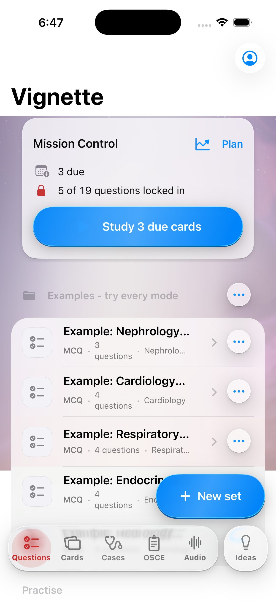

## old-1111

```
iphone/1-fresh=0
iphone/2-signed-in=0
iphone/3-relaunch=0
iphone/4-upgrade-to-current=0
iphone/5-other-bundle-id=0
ipad/1-fresh=0
ipad/2-signed-in=0
ipad/3-relaunch=0
ipad/4-upgrade-to-current=0
```

### ipad/1-fresh: iPad Pro 13-inch (M5)

```
bundle=com.cramdown.personal exe=Stethoscore Personal
keep=0 args=
launch_status=0
pid=31986 alive_after_30s=yes
--- stderr.txt (last 25 of 1)
IOSurfaceClientSetSurfaceNotify failed e00002c7
--- log-process.txt: 19 matching lines (last 30)
2026-09-25 18:54:30.981 Df Stethoscore Personal[31986:17d8c] [com.apple.dt.xctest:Default] Registering for test daemon availability notify post.
2026-09-25 18:54:30.981 Df Stethoscore Personal[31986:17d8c] [com.apple.dt.xctest:Default] notify_get_state check indicated test daemon not ready.
2026-09-25 18:54:30.982 Df Stethoscore Personal[31986:17d8c] [com.apple.dt.xctest:Default] notify_get_state check indicated test daemon not ready.
2026-09-25 18:54:30.982 Df Stethoscore Personal[31986:17d8c] [com.apple.dt.xctest:Default] notify_get_state check indicated test daemon not ready.
2026-09-25 18:54:31.104 Df Stethoscore Personal[31986:17d8c] [com.apple.FileURL:default] kExcludedFromBackupXattrName set on path: /Users/runner/Library/Developer/CoreSimulator/Devices/A2011F14-88A1-46AA-999A-FD6FEDCD870B/data/Containers/Data/Application/C68B2AE4-5B01-4D49-9657-A3E0F6413644/Library/Application Support/RedPenBlobs
2026-09-25 18:54:31.131 Df Stethoscore Personal[31986:17d8c] [com.apple.UIKit:KeyWindow] Setting default evaluation strategy for UIUserInterfaceIdiomPad to LastOneWins
2026-09-25 18:54:31.132 Df Stethoscore Personal[31986:17d8c] [com.apple.UIKit:KeyWindow] Setting default evaluation strategy for UIUserInterfaceIdiomPad to SystemShellManaged
2026-09-25 18:54:31.649 Df Stethoscore Personal[31986:17d8c] [PrototypeTools:domain] Not observing PTDefaults on customer install.
2026-09-25 18:54:33.095 Df Stethoscore Personal[31986:17d8c] [com.apple.network:activity] Create activity from XPC object <nw_activity 50:1 [4FBF1261-AC3D-4A20-9FEE-21071992ADBD] (reporting strategy default)>
2026-09-25 18:54:33.095 Df Stethoscore Personal[31986:17d8c] [com.apple.network:activity] Create activity from XPC object <nw_activity 50:2 [7B3B982D-1D9E-4BD6-84DE-BD22636A636C] (reporting strategy default)>
2026-09-25 18:54:33.095 Df Stethoscore Personal[31986:17d8c] [com.apple.network:activity] Set activity <nw_activity 50:1 [4FBF1261-AC3D-4A20-9FEE-21071992ADBD] (reporting strategy default)> as the global parent
2026-09-25 18:54:33.377 Df Stethoscore Personal[31986:17da9] [com.apple.storekit:Default] [Default] Finished iterating transaction batches
2026-09-25 18:54:33.397 Df Stethoscore Personal[31986:17daf] [com.apple.storekit:Default] AAFService connection invalidated
2026-09-25 18:54:33.661 Df Stethoscore Personal[31986:17db0] [com.apple.storekit:Default] [Default] Finished iterating transaction batches
2026-09-25 18:54:33.711 Df Stethoscore Personal[31986:17db0] [com.apple.storekit:Default] Registering for 'transactionsupdated' daemon notification
2026-09-25 18:54:33.749 Df Stethoscore Personal[31986:17db0] [com.apple.storekit:Default] AAFService connection invalidated
2026-09-25 18:54:50.236 Df Stethoscore Personal[31986:17d8c] [com.apple.network:activity] <nw_activity 50:1 [4FBF1261-AC3D-4A20-9FEE-21071992ADBD] (global parent) (reporting strategy default) complete (reason failure)> complete with reason 3 (failure), duration 20709ms
2026-09-25 18:54:50.237 Df Stethoscore Personal[31986:17d8c] [com.apple.network:activity] <nw_activity 50:2 [7B3B982D-1D9E-4BD6-84DE-BD22636A636C] (reporting strategy default) complete (reason failure)> complete with reason 3 (failure), duration 20712ms
2026-09-25 18:54:50.237 Df Stethoscore Personal[31986:17d8c] [com.apple.network:activity] Unsetting the global parent activity <nw_activity 50:1 [4FBF1261-AC3D-4A20-9FEE-21071992ADBD] (global parent) (reporting strategy default) complete (reason failure)>
--- log-system.txt: 99 matching lines (last 30)
2026-09-25 18:54:27.936 Df SpringBoard[28720:160dd] [com.apple.SplashBoard:Capture] Image generation complete for: <XBLaunchStateRequest: 0x11a67da40; groupID: com.cramdown.personal - {DEFAULT GROUP}; statusBar: normal; refSize: {1032, 375}; naturalSize: {375, 1032}; orientation: LandscapeLeft; userInterfaceStyle: Light>
2026-09-25 18:54:27.936 Df SpringBoard[28720:17b99] [com.apple.SplashBoard:Capture] Asynchronously generating image data for request: <XBLaunchStateRequest: 0x11a67fbf0; groupID: com.cramdown.personal - {DEFAULT GROUP}; statusBar: normal; refSize: {1032, 1376}; naturalSize: {1376, 1032}; orientation: LandscapeLeft; userInterfaceStyle: Dark>
2026-09-25 18:54:27.936 Df SpringBoard[28720:17b9b] [com.apple.SplashBoard:FileManifest] <XBApplicationSnapshotManifestImpl: 0x119183280> [com.cramdown.personal] Snapshot data for <XBApplicationSnapshot: 0x11a6f3100; …FA2F3700DF1A> [com.cramdown.personal] written to file: /Users/runner/Library/Developer/CoreSimulator/Devices/A2011F14-88A1-46AA-999A-FD6FEDCD870B/data/Containers/Data/Application/C68
2026-09-25 18:54:27.936 Df splashboardd[31807:17bd7] [com.apple.SplashBoard:Capture] Updating window to <XBLaunchStateRequest: 0x106274150; groupID: com.cramdown.personal - {DEFAULT GROUP}; statusBar: normal; refSize: {1032, 1376}; naturalSize: {1376, 1032}; orientation: LandscapeLeft; userInterfaceStyle: Dark>
2026-09-25 18:54:28.002 Df SpringBoard[28720:17b9b] [com.apple.SplashBoard:Capture] Image generation complete for: <XBLaunchStateRequest: 0x11a67fbf0; groupID: com.cramdown.personal - {DEFAULT GROUP}; statusBar: normal; refSize: {1032, 1376}; naturalSize: {1376, 1032}; orientation: LandscapeLeft; userInterfaceStyle: Dark>
2026-09-25 18:54:28.002 Df SpringBoard[28720:17b99] [com.apple.SplashBoard:Capture] Asynchronously generating image data for request: <XBLaunchStateRequest: 0x11a67ea70; groupID: com.cramdown.personal - {DEFAULT GROUP}; statusBar: normal; refSize: {1032, 375}; naturalSize: {375, 1032}; orientation: LandscapeLeft; userInterfaceStyle: Dark>
2026-09-25 18:54:28.002 Df SpringBoard[28720:17b84] [com.apple.SplashBoard:FileManifest] <XBApplicationSnapshotManifestImpl: 0x119183280> [com.cramdown.personal] Snapshot data for <XBApplicationSnapshot: 0x11a6f3480; …FEF28F74D121> [com.cramdown.personal] written to file: /Users/runner/Library/Developer/CoreSimulator/Devices/A2011F14-88A1-46AA-999A-FD6FEDCD870B/data/Containers/Data/Application/C68
2026-09-25 18:54:28.003 Df splashboardd[31807:17bd7] [com.apple.SplashBoard:Capture] Updating window to <XBLaunchStateRequest: 0x106274000; groupID: com.cramdown.personal - {DEFAULT GROUP}; statusBar: normal; refSize: {1032, 375}; naturalSize: {375, 1032}; orientation: LandscapeLeft; userInterfaceStyle: Dark>
2026-09-25 18:54:28.026 Df SpringBoard[28720:17b9b] [com.apple.SplashBoard:Capture] Image generation complete for: <XBLaunchStateRequest: 0x11a67ea70; groupID: com.cramdown.personal - {DEFAULT GROUP}; statusBar: normal; refSize: {1032, 375}; naturalSize: {375, 1032}; orientation: LandscapeLeft; userInterfaceStyle: Dark>
2026-09-25 18:54:28.027 Df SpringBoard[28720:15255] [com.apple.SplashBoard:FileManifest] <XBApplicationSnapshotManifestImpl: 0x119183280> [com.cramdown.personal] Snapshot data for <XBApplicationSnapshot: 0x11a6f3640; …8C468959FE36> [com.cramdown.personal] written to file: /Users/runner/Library/Developer/CoreSimulator/Devices/A2011F14-88A1-46AA-999A-FD6FEDCD870B/data/Containers/Data/Application/C68
    "terminate_running_process" = 1;
	retryTimeout: 120.000000 (default write com.apple.CoreSimulatorBridge LaunchRetryTimeout <value>)
	bootTimeout: 300.000000 (default write com.apple.CoreSimulatorBridge BootRetryTimeout <value>)
```
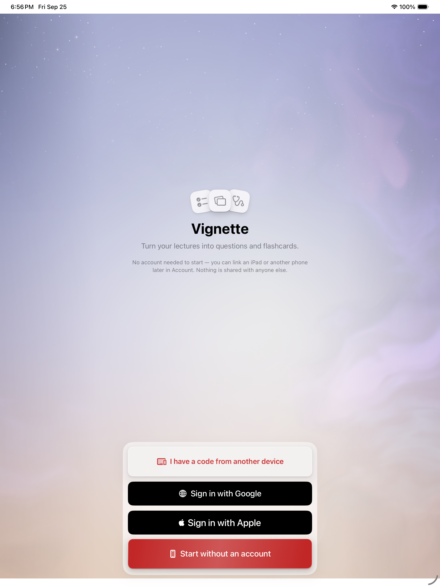

### ipad/2-signed-in: iPad Pro 13-inch (M5)

```
bundle=com.cramdown.personal exe=Stethoscore Personal
keep=1 args=-launchTestSignedIn
launch_status=0
pid=35793 alive_after_30s=yes
--- stderr.txt (last 25 of 1)
IOSurfaceClientSetSurfaceNotify failed e00002c7
--- log-process.txt: 31 matching lines (last 30)
2026-09-25 18:57:54.388 Df Stethoscore Personal[35793:1a571] [com.apple.dt.xctest:Default] notify_get_state check indicated test daemon not ready.
2026-09-25 18:57:54.389 Df Stethoscore Personal[35793:1a571] [com.apple.dt.xctest:Default] notify_get_state check indicated test daemon not ready.
2026-09-25 18:57:54.390 Df Stethoscore Personal[35793:1a571] [com.apple.dt.xctest:Default] notify_get_state check indicated test daemon not ready.
2026-09-25 18:57:54.487 Df Stethoscore Personal[35793:1a571] [com.apple.UIKit:KeyWindow] Setting default evaluation strategy for UIUserInterfaceIdiomPad to LastOneWins
2026-09-25 18:57:54.488 Df Stethoscore Personal[35793:1a571] [com.apple.UIKit:KeyWindow] Setting default evaluation strategy for UIUserInterfaceIdiomPad to SystemShellManaged
2026-09-25 18:57:54.528 Df Stethoscore Personal[35793:1a571] [com.apple.FileURL:default] kExcludedFromBackupXattrName set on path: /Users/runner/Library/Developer/CoreSimulator/Devices/A2011F14-88A1-46AA-999A-FD6FEDCD870B/data/Containers/Data/Application/C96C6157-0579-4411-A27C-665F677CF1BE/Library/Application Support/RedPenBlobs
2026-09-25 18:57:55.596 I  Stethoscore Personal[35793:1a571] [com.apple.DesignLibrary:defaults] liveTuning=false
2026-09-25 18:57:55.927 Df Stethoscore Personal[35793:1a571] [PrototypeTools:domain] Not observing PTDefaults on customer install.
2026-09-25 18:57:56.179 Df Stethoscore Personal[35793:1a5ce] [com.apple.calls.callkit:Default] Call host has no calls
2026-09-25 18:57:56.401 I  Stethoscore Personal[35793:1a5f0] [com.apple.storekit:Default] AAFService Starting new XPCConnection ed6aa710
2026-09-25 18:57:56.464 Df Stethoscore Personal[35793:1a5f0] [com.apple.storekit:Default] [Default] Finished iterating transaction batches
2026-09-25 18:57:56.464 I  Stethoscore Personal[35793:1a5f0] [com.apple.storekit:Default] AAFService Closing XPCConnection ed6aa710
2026-09-25 18:57:56.464 Df Stethoscore Personal[35793:1a5f0] [com.apple.storekit:Default] AAFService connection invalidated
2026-09-25 18:57:58.259 Df Stethoscore Personal[35793:1a571] [com.apple.network:activity] Create activity from XPC object <nw_activity 50:1 [ABE580E7-70FD-427B-85E4-413437C453D3] (reporting strategy default)>
2026-09-25 18:57:58.259 Df Stethoscore Personal[35793:1a571] [com.apple.network:activity] Create activity from XPC object <nw_activity 50:2 [713A219D-0492-4A52-AA8E-E6CF3DF0780B] (reporting strategy default)>
2026-09-25 18:57:58.259 Df Stethoscore Personal[35793:1a571] [com.apple.network:activity] Set activity <nw_activity 50:1 [ABE580E7-70FD-427B-85E4-413437C453D3] (reporting strategy default)> as the global parent
2026-09-25 18:57:58.263 I  Stethoscore Personal[35793:1a5ce] [com.apple.storekit:Default] AAFService Starting new XPCConnection f9ddb4d3
2026-09-25 18:57:58.304 I  Stethoscore Personal[35793:1a571] [com.apple.PointerUI:Common] Activating Connection: <BSXPC(com.apple.PointerUI.pointeruid.service[C:3-1])-as(com.apple.PointerUI.pointeruid.default-service):0x101e7b1b0 name=(null)>
2026-09-25 18:57:58.317 Df Stethoscore Personal[35793:1a5ce] [com.apple.storekit:Default] [Default] Finished iterating transaction batches
2026-09-25 18:57:58.317 I  Stethoscore Personal[35793:1a5f0] [com.apple.storekit:Default] AAFService Closing XPCConnection f9ddb4d3
2026-09-25 18:57:58.320 I  Stethoscore Personal[35793:1a5ce] [com.apple.storekit:Default] AAFService Starting new XPCConnection 395d95dd
2026-09-25 18:57:58.336 Df Stethoscore Personal[35793:1a726] [com.apple.storekit:Default] AAFService connection invalidated
2026-09-25 18:57:58.351 Df Stethoscore Personal[35793:1a5f2] [com.apple.storekit:Default] [Default] Finished iterating transaction batches
2026-09-25 18:58:00.020 I  Stethoscore Personal[35793:1a5ce] [com.apple.storekit:Default] AAFService Closing XPCConnection 395d95dd
2026-09-25 18:58:00.040 Df Stethoscore Personal[35793:1a5ce] [com.apple.storekit:Default] Registering for 'transactionsupdated' daemon notification
2026-09-25 18:58:00.090 Df Stethoscore Personal[35793:1a726] [com.apple.storekit:Default] AAFService connection invalidated
2026-09-25 18:58:02.136 Df Stethoscore Personal[35793:1a571] [com.apple.network:activity] <nw_activity 50:1 [ABE580E7-70FD-427B-85E4-413437C453D3] (global parent) (reporting strategy default) complete (reason success)> complete with reason 2 (success), duration 10033ms
2026-09-25 18:58:02.137 Df Stethoscore Personal[35793:1a571] [com.apple.network:activity] <nw_activity 50:2 [713A219D-0492-4A52-AA8E-E6CF3DF0780B] (reporting strategy default) complete (reason success)> complete with reason 2 (success), duration 10034ms
2026-09-25 18:58:02.137 Df Stethoscore Personal[35793:1a571] [com.apple.network:activity] Unsetting the global parent activity <nw_activity 50:1 [ABE580E7-70FD-427B-85E4-413437C453D3] (global parent) (reporting strategy default) complete (reason success)>
2026-09-25 18:58:21.838 Df Stethoscore Personal[35793:1a5f4] [com.apple.FileURL:default] kExcludedFromBackupXattrName set on path: /Users/runner/Library/Developer/CoreSimulator/Devices/A2011F14-88A1-46AA-999A-FD6FEDCD870B/data/Containers/Data/Application/C96C6157-0579-4411-A27C-665F677CF1BE/Library/Application Support/RedPenSources
--- log-system.txt: 131 matching lines (last 30)
2026-09-25 18:57:49.324 Df splashboardd[31807:17bd7] [com.apple.SplashBoard:Capture] Updating window to <XBLaunchStateRequest: 0x106274fc0; groupID: com.cramdown.personal - {DEFAULT GROUP}; statusBar: normal; refSize: {1032, 375}; naturalSize: {375, 1032}; orientation: LandscapeLeft; userInterfaceStyle: Dark>
2026-09-25 18:57:49.363 Df SpringBoard[28720:181bf] [com.apple.SplashBoard:Capture] Image generation complete for: <XBLaunchStateRequest: 0x1193a5180; groupID: com.cramdown.personal - {DEFAULT GROUP}; statusBar: normal; refSize: {1032, 375}; naturalSize: {375, 1032}; orientation: LandscapeLeft; userInterfaceStyle: Dark>
```


### ipad/3-relaunch: iPad Pro 13-inch (M5)

```
bundle=com.cramdown.personal exe=Stethoscore Personal
keep=1 args=
launch_status=0
pid=38206 alive_after_30s=yes
--- stderr.txt (last 25 of 1)
IOSurfaceClientSetSurfaceNotify failed e00002c7
--- log-process.txt: 31 matching lines (last 30)
2026-09-25 18:59:26.615 Df Stethoscore Personal[38206:1be96] [com.apple.dt.xctest:Default] notify_get_state check indicated test daemon not ready.
2026-09-25 18:59:26.617 Df Stethoscore Personal[38206:1be96] [com.apple.dt.xctest:Default] notify_get_state check indicated test daemon not ready.
2026-09-25 18:59:26.617 Df Stethoscore Personal[38206:1be96] [com.apple.dt.xctest:Default] notify_get_state check indicated test daemon not ready.
2026-09-25 18:59:26.712 Df Stethoscore Personal[38206:1be96] [com.apple.UIKit:KeyWindow] Setting default evaluation strategy for UIUserInterfaceIdiomPad to LastOneWins
2026-09-25 18:59:26.712 Df Stethoscore Personal[38206:1be96] [com.apple.UIKit:KeyWindow] Setting default evaluation strategy for UIUserInterfaceIdiomPad to SystemShellManaged
2026-09-25 18:59:26.746 Df Stethoscore Personal[38206:1be96] [com.apple.FileURL:default] kExcludedFromBackupXattrName set on path: /Users/runner/Library/Developer/CoreSimulator/Devices/A2011F14-88A1-46AA-999A-FD6FEDCD870B/data/Containers/Data/Application/92B8F616-CF9A-40A1-8726-ADA2D2F7DF95/Library/Application Support/RedPenBlobs
2026-09-25 18:59:27.611 I  Stethoscore Personal[38206:1be96] [com.apple.DesignLibrary:defaults] liveTuning=false
2026-09-25 18:59:27.718 Df Stethoscore Personal[38206:1be96] [PrototypeTools:domain] Not observing PTDefaults on customer install.
2026-09-25 18:59:27.829 Df Stethoscore Personal[38206:1bedd] [com.apple.calls.callkit:Default] Call host has no calls
2026-09-25 18:59:27.944 I  Stethoscore Personal[38206:1bee5] [com.apple.storekit:Default] AAFService Starting new XPCConnection 97dbd7b5
2026-09-25 18:59:27.979 Df Stethoscore Personal[38206:1bee3] [com.apple.storekit:Default] [Default] Finished iterating transaction batches
2026-09-25 18:59:27.979 I  Stethoscore Personal[38206:1bee3] [com.apple.storekit:Default] AAFService Closing XPCConnection 97dbd7b5
2026-09-25 18:59:27.979 Df Stethoscore Personal[38206:1bee3] [com.apple.storekit:Default] AAFService connection invalidated
2026-09-25 18:59:29.352 Df Stethoscore Personal[38206:1be96] [com.apple.network:activity] Create activity from XPC object <nw_activity 50:1 [924D0F55-77A0-4739-BD70-2642D8AF82DC] (reporting strategy default)>
2026-09-25 18:59:29.352 Df Stethoscore Personal[38206:1be96] [com.apple.network:activity] Create activity from XPC object <nw_activity 50:2 [8A0AC3D9-27B2-42FB-A5DA-6E8EBF402E3E] (reporting strategy default)>
2026-09-25 18:59:29.352 Df Stethoscore Personal[38206:1be96] [com.apple.network:activity] Set activity <nw_activity 50:1 [924D0F55-77A0-4739-BD70-2642D8AF82DC] (reporting strategy default)> as the global parent
2026-09-25 18:59:29.588 I  Stethoscore Personal[38206:1beb8] [com.apple.storekit:Default] AAFService Starting new XPCConnection 6ae5d950
2026-09-25 18:59:29.600 I  Stethoscore Personal[38206:1be96] [com.apple.PointerUI:Common] Activating Connection: <BSXPC(com.apple.PointerUI.pointeruid.service[C:3-1])-as(com.apple.PointerUI.pointeruid.default-service):0x105e7b0c0 name=(null)>
2026-09-25 18:59:29.606 Df Stethoscore Personal[38206:1beb8] [com.apple.storekit:Default] [Default] Finished iterating transaction batches
2026-09-25 18:59:29.606 I  Stethoscore Personal[38206:1bee3] [com.apple.storekit:Default] AAFService Closing XPCConnection 6ae5d950
2026-09-25 18:59:29.606 Df Stethoscore Personal[38206:1beb8] [com.apple.storekit:Default] AAFService connection invalidated
2026-09-25 18:59:29.606 I  Stethoscore Personal[38206:1bee3] [com.apple.storekit:Default] AAFService Starting new XPCConnection dab9ee27
2026-09-25 18:59:29.627 Df Stethoscore Personal[38206:1bee5] [com.apple.storekit:Default] [Default] Finished iterating transaction batches
2026-09-25 18:59:30.586 I  Stethoscore Personal[38206:1bee5] [com.apple.storekit:Default] AAFService Closing XPCConnection dab9ee27
2026-09-25 18:59:30.591 Df Stethoscore Personal[38206:1bee5] [com.apple.storekit:Default] Registering for 'transactionsupdated' daemon notification
2026-09-25 18:59:30.592 Df Stethoscore Personal[38206:1bede] [com.apple.storekit:Default] AAFService connection invalidated
2026-09-25 18:59:31.618 Df Stethoscore Personal[38206:1be96] [com.apple.network:activity] <nw_activity 50:1 [924D0F55-77A0-4739-BD70-2642D8AF82DC] (global parent) (reporting strategy default) complete (reason success)> complete with reason 2 (success), duration 6785ms
2026-09-25 18:59:31.618 Df Stethoscore Personal[38206:1be96] [com.apple.network:activity] <nw_activity 50:2 [8A0AC3D9-27B2-42FB-A5DA-6E8EBF402E3E] (reporting strategy default) complete (reason success)> complete with reason 2 (success), duration 6785ms
2026-09-25 18:59:31.618 Df Stethoscore Personal[38206:1be96] [com.apple.network:activity] Unsetting the global parent activity <nw_activity 50:1 [924D0F55-77A0-4739-BD70-2642D8AF82DC] (global parent) (reporting strategy default) complete (reason success)>
2026-09-25 18:59:40.335 Df Stethoscore Personal[38206:1bee3] [com.apple.FileURL:default] kExcludedFromBackupXattrName set on path: /Users/runner/Library/Developer/CoreSimulator/Devices/A2011F14-88A1-46AA-999A-FD6FEDCD870B/data/Containers/Data/Application/92B8F616-CF9A-40A1-8726-ADA2D2F7DF95/Library/Application Support/RedPenSources
--- log-system.txt: 122 matching lines (last 30)
2026-09-25 18:59:23.377 Df splashboardd[31807:17bd7] [com.apple.SplashBoard:Capture] Updating window to <XBLaunchStateRequest: 0x1062743f0; groupID: com.cramdown.personal - {DEFAULT GROUP}; statusBar: normal; refSize: {1032, 1376}; naturalSize: {1376, 1032}; orientation: LandscapeLeft; userInterfaceStyle: Dark>
2026-09-25 18:59:23.384 Df SpringBoard[28720:18160] [com.apple.SplashBoard:FileManifest] <XBApplicationSnapshotManifestImpl: 0x119183280> [com.cramdown.personal] Snapshot data for <XBApplicationSnapshot: 0x1193dea00; …7AA661C6BFEA> [com.cramdown.personal] written to file: /Users/runner/Library/Developer/CoreSimulator/Devices/A2011F14-88A1-46AA-999A-FD6FEDCD870B/data/Containers/Data/Application/92B
```
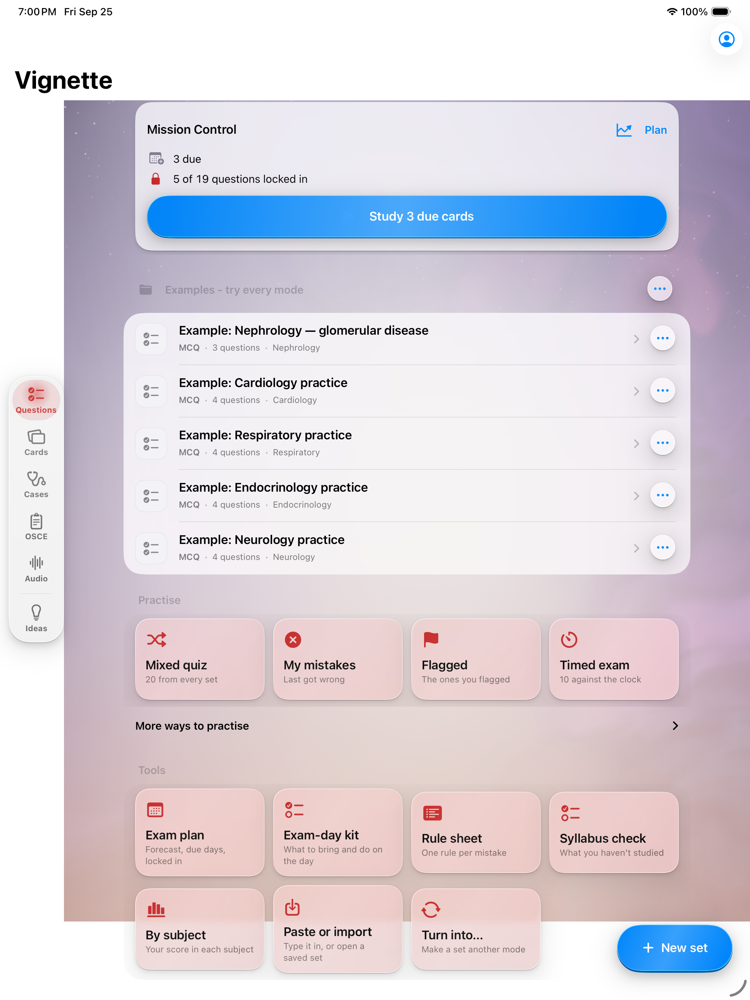

### ipad/4-upgrade-to-current: iPad Pro 13-inch (M5)

```
bundle=com.cramdown.personal exe=Stethoscore Personal
keep=1 args=
launch_status=0
pid=40387 alive_after_30s=yes
--- stderr.txt (last 25 of 1)
IOSurfaceClientSetSurfaceNotify failed e00002c7
--- log-process.txt: 25 matching lines (last 30)
2026-09-25 19:00:53.707 Df Stethoscore Personal[40387:1d54a] [com.apple.dt.xctest:Default] Registering for test daemon availability notify post.
2026-09-25 19:00:53.707 Df Stethoscore Personal[40387:1d54a] [com.apple.dt.xctest:Default] notify_get_state check indicated test daemon not ready.
2026-09-25 19:00:53.707 Df Stethoscore Personal[40387:1d54a] [com.apple.dt.xctest:Default] notify_get_state check indicated test daemon not ready.
2026-09-25 19:00:53.708 Df Stethoscore Personal[40387:1d54a] [com.apple.dt.xctest:Default] notify_get_state check indicated test daemon not ready.
2026-09-25 19:00:53.729 Df Stethoscore Personal[40387:1d54a] [com.apple.UIKit:KeyWindow] Setting default evaluation strategy for UIUserInterfaceIdiomPad to LastOneWins
2026-09-25 19:00:53.731 Df Stethoscore Personal[40387:1d54a] [com.apple.UIKit:KeyWindow] Setting default evaluation strategy for UIUserInterfaceIdiomPad to SystemShellManaged
2026-09-25 19:00:53.791 Df Stethoscore Personal[40387:1d54a] [com.apple.FileURL:default] kExcludedFromBackupXattrName set on path: /Users/runner/Library/Developer/CoreSimulator/Devices/A2011F14-88A1-46AA-999A-FD6FEDCD870B/data/Containers/Data/Application/6DDD2F09-6633-4CDC-B198-EECAB4D3A0C4/Library/Application Support/RedPenBlobs
2026-09-25 19:00:54.498 I  Stethoscore Personal[40387:1d54a] [com.apple.DesignLibrary:defaults] liveTuning=false
2026-09-25 19:00:54.536 Df Stethoscore Personal[40387:1d54a] [PrototypeTools:domain] Not observing PTDefaults on customer install.
2026-09-25 19:00:55.102 Df Stethoscore Personal[40387:1d54a] [com.apple.network:activity] Create activity from XPC object <nw_activity 50:1 [5121B421-5D3C-4A2B-93C8-0DEB13E18022] (reporting strategy default)>
2026-09-25 19:00:55.102 Df Stethoscore Personal[40387:1d54a] [com.apple.network:activity] Create activity from XPC object <nw_activity 50:2 [40E026E8-BD19-4C8D-8742-4FC258E03EC8] (reporting strategy default)>
2026-09-25 19:00:55.102 Df Stethoscore Personal[40387:1d54a] [com.apple.network:activity] Set activity <nw_activity 50:1 [5121B421-5D3C-4A2B-93C8-0DEB13E18022] (reporting strategy default)> as the global parent
2026-09-25 19:00:55.112 I  Stethoscore Personal[40387:1d55a] [com.apple.storekit:Default] AAFService Starting new XPCConnection aa7f3560
2026-09-25 19:00:55.122 I  Stethoscore Personal[40387:1d54a] [com.apple.PointerUI:Common] Activating Connection: <BSXPC(com.apple.PointerUI.pointeruid.service[C:3-1])-as(com.apple.PointerUI.pointeruid.default-service):0x108be54a0 name=(null)>
2026-09-25 19:00:55.140 Df Stethoscore Personal[40387:1d55a] [com.apple.storekit:Default] [Default] Finished iterating transaction batches
2026-09-25 19:00:55.141 I  Stethoscore Personal[40387:1d59d] [com.apple.storekit:Default] AAFService Closing XPCConnection aa7f3560
2026-09-25 19:00:55.141 I  Stethoscore Personal[40387:1d55a] [com.apple.storekit:Default] AAFService Starting new XPCConnection f432eff9
2026-09-25 19:00:55.142 Df Stethoscore Personal[40387:1d59f] [com.apple.storekit:Default] AAFService connection invalidated
2026-09-25 19:00:55.153 Df Stethoscore Personal[40387:1d59d] [com.apple.storekit:Default] [Default] Finished iterating transaction batches
2026-09-25 19:00:55.344 I  Stethoscore Personal[40387:1d59d] [com.apple.storekit:Default] AAFService Closing XPCConnection f432eff9
2026-09-25 19:00:55.352 Df Stethoscore Personal[40387:1d55a] [com.apple.storekit:Default] Registering for 'transactionsupdated' daemon notification
2026-09-25 19:00:55.354 Df Stethoscore Personal[40387:1d59d] [com.apple.storekit:Default] AAFService connection invalidated
2026-09-25 19:01:00.224 Df Stethoscore Personal[40387:1d54a] [com.apple.network:activity] <nw_activity 50:1 [5121B421-5D3C-4A2B-93C8-0DEB13E18022] (global parent) (reporting strategy default) complete (reason success)> complete with reason 2 (success), duration 8112ms
2026-09-25 19:01:00.224 Df Stethoscore Personal[40387:1d54a] [com.apple.network:activity] <nw_activity 50:2 [40E026E8-BD19-4C8D-8742-4FC258E03EC8] (reporting strategy default) complete (reason success)> complete with reason 2 (success), duration 8113ms
2026-09-25 19:01:00.224 Df Stethoscore Personal[40387:1d54a] [com.apple.network:activity] Unsetting the global parent activity <nw_activity 50:1 [5121B421-5D3C-4A2B-93C8-0DEB13E18022] (global parent) (reporting strategy default) complete (reason success)>
--- log-system.txt: 121 matching lines (last 30)
2026-09-25 19:00:51.232 Df SpringBoard[28720:1d2ef] [com.apple.SplashBoard:Capture] Asynchronously generating image data for request: <XBLaunchStateRequest: 0x11a6abd40; groupID: com.cramdown.personal - {DEFAULT GROUP}; statusBar: normal; refSize: {1032, 1376}; naturalSize: {1376, 1032}; orientation: LandscapeLeft; userInterfaceStyle: Dark>
2026-09-25 19:00:51.232 Df splashboardd[31807:17bd7] [com.apple.SplashBoard:Capture] Updating window to <XBLaunchStateRequest: 0x1062751f0; groupID: com.cramdown.personal - {DEFAULT GROUP}; statusBar: normal; refSize: {1032, 1376}; naturalSize: {1376, 1032}; orientation: LandscapeLeft; userInterfaceStyle: Dark>
2026-09-25 19:00:51.235 Df SpringBoard[28720:15f94] [com.apple.SplashBoard:FileManifest] <XBApplicationSnapshotManifestImpl: 0x119183280> [com.cramdown.personal] Snapshot data for <XBApplicationSnapshot: 0x1192baa00; …25A0BB176ECA> [com.cramdown.personal] written to file: /Users/runner/Library/Developer/CoreSimulator/Devices/A2011F14-88A1-46AA-999A-FD6FEDCD870B/data/Containers/Data/Application/6DD
2026-09-25 19:00:51.418 Df SpringBoard[28720:1d2ec] [com.apple.SplashBoard:Capture] Image generation complete for: <XBLaunchStateRequest: 0x11a6abd40; groupID: com.cramdown.personal - {DEFAULT GROUP}; statusBar: normal; refSize: {1032, 1376}; naturalSize: {1376, 1032}; orientation: LandscapeLeft; userInterfaceStyle: Dark>
2026-09-25 19:00:51.418 Df SpringBoard[28720:1d2ef] [com.apple.SplashBoard:Capture] Asynchronously generating image data for request: <XBLaunchStateRequest: 0x11a6ab5d0; groupID: com.cramdown.personal - {DEFAULT GROUP}; statusBar: normal; refSize: {1032, 375}; naturalSize: {375, 1032}; orientation: LandscapeLeft; userInterfaceStyle: Dark>
2026-09-25 19:00:51.420 Df splashboardd[31807:17bd7] [com.apple.SplashBoard:Capture] Updating window to <XBLaunchStateRequest: 0x106276290; groupID: com.cramdown.personal - {DEFAULT GROUP}; statusBar: normal; refSize: {1032, 375}; naturalSize: {375, 1032}; orientation: LandscapeLeft; userInterfaceStyle: Dark>
2026-09-25 19:00:51.421 Df SpringBoard[28720:15f94] [com.apple.SplashBoard:FileManifest] <XBApplicationSnapshotManifestImpl: 0x119183280> [com.cramdown.personal] Snapshot data for <XBApplicationSnapshot: 0x103be7640; …0FACC5100140> [com.cramdown.personal] written to file: /Users/runner/Library/Developer/CoreSimulator/Devices/A2011F14-88A1-46AA-999A-FD6FEDCD870B/data/Containers/Data/Application/6DD
```
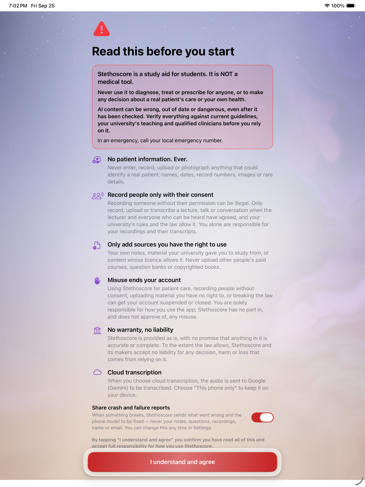

### iphone/1-fresh: iPhone 17 Pro

```
bundle=com.cramdown.personal exe=Stethoscore Personal
keep=0 args=
launch_status=0
pid=14217 alive_after_30s=yes
--- stderr.txt (last 25 of 1)
IOSurfaceClientSetSurfaceNotify failed e00002c7
--- log-process.txt: 20 matching lines (last 30)
2026-09-25 18:37:21.975 Df Stethoscore Personal[14217:b0c3] [com.apple.dt.xctest:Default] Registering for test daemon availability notify post.
2026-09-25 18:37:21.976 Df Stethoscore Personal[14217:b0c3] [com.apple.dt.xctest:Default] notify_get_state check indicated test daemon not ready.
2026-09-25 18:37:21.976 Df Stethoscore Personal[14217:b0c3] [com.apple.dt.xctest:Default] notify_get_state check indicated test daemon not ready.
2026-09-25 18:37:21.976 Df Stethoscore Personal[14217:b0c3] [com.apple.dt.xctest:Default] notify_get_state check indicated test daemon not ready.
2026-09-25 18:37:22.141 Df Stethoscore Personal[14217:b0c3] [com.apple.FileURL:default] kExcludedFromBackupXattrName set on path: /Users/runner/Library/Developer/CoreSimulator/Devices/22452A91-4697-4369-8812-53ADB77EB73B/data/Containers/Data/Application/47486A2C-8020-4F6F-9BD0-ACD2D5FD4120/Library/Application Support/RedPenBlobs
2026-09-25 18:37:22.188 Df Stethoscore Personal[14217:b0c3] [com.apple.UIKit:KeyWindow] Setting default evaluation strategy for UIUserInterfaceIdiomPhone to LastOneWins
2026-09-25 18:37:22.188 Df Stethoscore Personal[14217:b0c3] [com.apple.UIKit:KeyWindow] Setting default evaluation strategy for UIUserInterfaceIdiomPhone to SystemShellManaged
2026-09-25 18:37:23.324 Df Stethoscore Personal[14217:b0c3] [PrototypeTools:domain] Not observing PTDefaults on customer install.
2026-09-25 18:37:25.545 Df Stethoscore Personal[14217:b0c3] [com.apple.network:activity] Create activity from XPC object <nw_activity 50:1 [A7B4C87B-B732-45AD-8520-D8BC9A506CD7] (reporting strategy default)>
2026-09-25 18:37:25.545 Df Stethoscore Personal[14217:b0c3] [com.apple.network:activity] Create activity from XPC object <nw_activity 50:2 [30ABA2E4-4E63-48CC-AFAE-51376084967F] (reporting strategy default)>
2026-09-25 18:37:25.545 Df Stethoscore Personal[14217:b0c3] [com.apple.network:activity] Set activity <nw_activity 50:1 [A7B4C87B-B732-45AD-8520-D8BC9A506CD7] (reporting strategy default)> as the global parent
2026-09-25 18:37:27.660 Df Stethoscore Personal[14217:b0eb] [com.apple.storekit:Default] [Default] Finished iterating transaction batches
2026-09-25 18:37:27.761 Df Stethoscore Personal[14217:b0eb] [com.apple.storekit:Default] AAFService connection invalidated
2026-09-25 18:37:28.684 Df Stethoscore Personal[14217:b0e8] [com.apple.storekit:Default] [Default] Finished iterating transaction batches
2026-09-25 18:37:28.829 Df Stethoscore Personal[14217:b15a] [com.apple.storekit:Default] AAFService connection invalidated
2026-09-25 18:37:28.837 Df Stethoscore Personal[14217:b0e8] [com.apple.storekit:Default] Registering for 'transactionsupdated' daemon notification
2026-09-25 18:37:31.630 Df Stethoscore Personal[14217:b0c3] [com.apple.network:activity] <nw_activity 50:1 [A7B4C87B-B732-45AD-8520-D8BC9A506CD7] (global parent) (reporting strategy default) complete (reason success)> complete with reason 2 (success), duration 14938ms
2026-09-25 18:37:31.630 Df Stethoscore Personal[14217:b0c3] [com.apple.network:activity] <nw_activity 50:2 [30ABA2E4-4E63-48CC-AFAE-51376084967F] (reporting strategy default) complete (reason success)> complete with reason 2 (success), duration 14938ms
2026-09-25 18:37:31.630 Df Stethoscore Personal[14217:b0c3] [com.apple.network:activity] Unsetting the global parent activity <nw_activity 50:1 [A7B4C87B-B732-45AD-8520-D8BC9A506CD7] (global parent) (reporting strategy default) complete (reason success)>
2026-09-25 18:38:00.977 E  Stethoscore Personal[14217:b0c3] [com.apple.UIKit:BackgroundTask] Background Task 3 ("Saving library"), was created over 30 seconds ago. In applications running in the background, this creates a risk of termination. Remember to call UIApplication.endBackgroundTask(_:) for your task in a timely manner to avoid this.
--- log-system.txt: 78 matching lines (last 30)
2026-09-25 18:36:41.157 Df searchd[11043:8dd0] [com.apple.spotlight:default] Apps changed: (
2026-09-25 18:37:01.463 Df storekitd[12373:a30b] [com.apple.storekit:Default] [Client] (com.cramdown.personal) Initialized with server Sandbox bundle ID com.cramdown.personal and request bundle ID com.cramdown.personal]
2026-09-25 18:37:16.499 Df SpringBoard[10836:842f] [com.apple.FrontBoard:Common] [FBSystemService] Request received from CoreSimulatorBr.10866 to terminate application com.cramdown.personal: "Termination requested by simulator host"
2026-09-25 18:37:16.626 E  CoreSimulatorBridge[10866:997f] [com.apple.FrontBoard:Common] FBSSystemAppProxy: Error reported for termination request: <NSError: 0x101c49d40; domain: NSPOSIXErrorDomain; code: 3 ("No such process"); "The request to terminate "com.cramdown.personal" failed. found nothing to terminate">
2026-09-25 18:37:16.752 Df SpringBoard[10836:8373] [com.apple.SplashBoard:Capture] Synchronously generating image for request: <XBLaunchStateRequest: 0x11ece5e30; groupID: com.cramdown.personal - {DEFAULT GROUP}; statusBar: normal; refSize: {402, 874}; orientation: Portrait; userInterfaceStyle: Light>
2026-09-25 18:37:16.796 Df splashboardd[12403:9d45] [com.apple.SplashBoard:Capture] Updating window to <XBLaunchStateRequest: 0x1030d0070; groupID: com.cramdown.personal - {DEFAULT GROUP}; statusBar: normal; refSize: {402, 874}; orientation: Portrait; userInterfaceStyle: Light>
2026-09-25 18:37:16.824 Df splashboardd[12403:9d45] [com.apple.SplashBoard:Capture] Updating window to <XBLaunchStateRequest: 0x103264000; groupID: com.cramdown.personal - {DEFAULT GROUP}; statusBar: normal; refSize: {402, 874}; orientation: Portrait; userInterfaceStyle: Light>
    "<XBApplicationSnapshot: 0x11ec0e680; identifier: 8B010FA9-06E3-4205-99A0-320A401F7E38; launchInterfaceIdentifier: __from_UILaunchStoryboardName__; contentType: GeneratedDefault; referenceSize: {402, 874}; interfaceOrientation: Portrait; userInterfaceStyle: Light>"
2026-09-25 18:37:16.863 Df SpringBoard[10836:8373] [com.apple.SplashBoard:FileManifest] <XBApplicationSnapshotManifestImpl: 0x11bf65c80> [com.cramdown.personal] Deleting snapshot <XBApplicationSnapshot: 0x11ec0e680; …320A401F7E38> [com.cramdown.personal] for reason: _contentType: GeneratedDefault(1)
    homeAffordanceDrawingSuppression: Default;
2026-09-25 18:37:17.070 Df SpringBoard[10836:930c] [com.apple.SplashBoard:FileManifest] <XBApplicationSnapshotManifestImpl: 0x11bf65c80> [com.cramdown.personal] Snapshot data for <XBApplicationSnapshot: 0x11ec0d880; …6F2829CB8543> [com.cramdown.personal] written to file: /Users/runner/Library/Developer/CoreSimulator/Devices/22452A91-4697-4369-8812-53ADB77EB73B/data/Containers/Data/Application/4748
2026-09-25 18:37:17.072 Df SpringBoard[10836:930c] [com.apple.SplashBoard:Capture] Image generation complete for: <XBLaunchStateRequest: 0x11ec5d6c0; groupID: com.cramdown.personal - {DEFAULT GROUP}; statusBar: normal; refSize: {402, 874}; orientation: Portrait; userInterfaceStyle: Light>
```
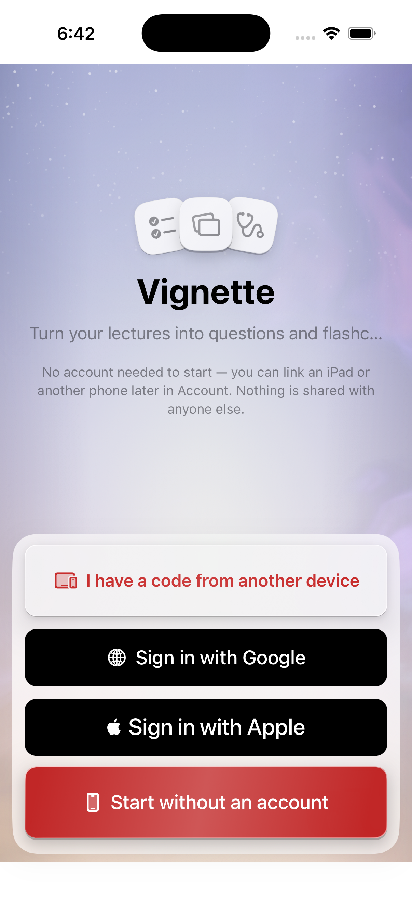

### iphone/2-signed-in: iPhone 17 Pro

```
bundle=com.cramdown.personal exe=Stethoscore Personal
keep=1 args=-launchTestSignedIn
launch_status=0
pid=19150 alive_after_30s=yes
--- stderr.txt (last 25 of 1)
IOSurfaceClientSetSurfaceNotify failed e00002c7
--- log-process.txt: 30 matching lines (last 30)
2026-09-25 18:44:24.216 Df Stethoscore Personal[19150:eb71] [com.apple.dt.xctest:Default] Registering for test daemon availability notify post.
2026-09-25 18:44:24.217 Df Stethoscore Personal[19150:eb71] [com.apple.dt.xctest:Default] notify_get_state check indicated test daemon not ready.
2026-09-25 18:44:24.218 Df Stethoscore Personal[19150:eb71] [com.apple.dt.xctest:Default] notify_get_state check indicated test daemon not ready.
2026-09-25 18:44:24.218 Df Stethoscore Personal[19150:eb71] [com.apple.dt.xctest:Default] notify_get_state check indicated test daemon not ready.
2026-09-25 18:44:24.383 Df Stethoscore Personal[19150:eb71] [com.apple.UIKit:KeyWindow] Setting default evaluation strategy for UIUserInterfaceIdiomPhone to LastOneWins
2026-09-25 18:44:24.383 Df Stethoscore Personal[19150:eb71] [com.apple.UIKit:KeyWindow] Setting default evaluation strategy for UIUserInterfaceIdiomPhone to SystemShellManaged
2026-09-25 18:44:24.439 Df Stethoscore Personal[19150:eb71] [com.apple.FileURL:default] kExcludedFromBackupXattrName set on path: /Users/runner/Library/Developer/CoreSimulator/Devices/22452A91-4697-4369-8812-53ADB77EB73B/data/Containers/Data/Application/FAA4C9D9-D4A7-43EF-B92D-6CB9F6960361/Library/Application Support/RedPenBlobs
2026-09-25 18:44:25.859 I  Stethoscore Personal[19150:eb71] [com.apple.DesignLibrary:defaults] liveTuning=false
2026-09-25 18:44:26.229 Df Stethoscore Personal[19150:eb71] [PrototypeTools:domain] Not observing PTDefaults on customer install.
2026-09-25 18:44:26.503 Df Stethoscore Personal[19150:ebd7] [com.apple.calls.callkit:Default] Call host has no calls
2026-09-25 18:44:26.745 I  Stethoscore Personal[19150:ecc3] [com.apple.storekit:Default] AAFService Starting new XPCConnection 56809d76
2026-09-25 18:44:26.913 Df Stethoscore Personal[19150:ebd7] [com.apple.storekit:Default] [Default] Finished iterating transaction batches
2026-09-25 18:44:26.914 I  Stethoscore Personal[19150:ebd7] [com.apple.storekit:Default] AAFService Closing XPCConnection 56809d76
2026-09-25 18:44:26.914 Df Stethoscore Personal[19150:ecc4] [com.apple.storekit:Default] AAFService connection invalidated
2026-09-25 18:44:28.417 Df Stethoscore Personal[19150:eb71] [com.apple.network:activity] Create activity from XPC object <nw_activity 50:1 [AC414B66-9848-45E4-B65C-71603AC8B028] (reporting strategy default)>
2026-09-25 18:44:28.417 Df Stethoscore Personal[19150:eb71] [com.apple.network:activity] Create activity from XPC object <nw_activity 50:2 [3F39506F-528D-4E3C-A12A-82AAEF66D67F] (reporting strategy default)>
2026-09-25 18:44:28.417 Df Stethoscore Personal[19150:eb71] [com.apple.network:activity] Set activity <nw_activity 50:1 [AC414B66-9848-45E4-B65C-71603AC8B028] (reporting strategy default)> as the global parent
2026-09-25 18:44:28.419 I  Stethoscore Personal[19150:ebd7] [com.apple.storekit:Default] AAFService Starting new XPCConnection acfabaf9
2026-09-25 18:44:28.451 Df Stethoscore Personal[19150:ebf7] [com.apple.storekit:Default] [Default] Finished iterating transaction batches
2026-09-25 18:44:28.452 I  Stethoscore Personal[19150:ebf7] [com.apple.storekit:Default] AAFService Closing XPCConnection acfabaf9
2026-09-25 18:44:28.453 Df Stethoscore Personal[19150:ebf7] [com.apple.storekit:Default] AAFService connection invalidated
2026-09-25 18:44:28.458 I  Stethoscore Personal[19150:ecc4] [com.apple.storekit:Default] AAFService Starting new XPCConnection d546434e
2026-09-25 18:44:28.479 Df Stethoscore Personal[19150:ecc3] [com.apple.storekit:Default] [Default] Finished iterating transaction batches
2026-09-25 18:44:28.671 I  Stethoscore Personal[19150:ecc3] [com.apple.storekit:Default] AAFService Closing XPCConnection d546434e
2026-09-25 18:44:28.672 Df Stethoscore Personal[19150:ebd7] [com.apple.storekit:Default] AAFService connection invalidated
2026-09-25 18:44:28.682 Df Stethoscore Personal[19150:ecc3] [com.apple.storekit:Default] Registering for 'transactionsupdated' daemon notification
2026-09-25 18:44:29.862 Df Stethoscore Personal[19150:eb71] [com.apple.network:activity] <nw_activity 50:1 [AC414B66-9848-45E4-B65C-71603AC8B028] (global parent) (reporting strategy default) complete (reason success)> complete with reason 2 (success), duration 8558ms
2026-09-25 18:44:29.862 Df Stethoscore Personal[19150:eb71] [com.apple.network:activity] <nw_activity 50:2 [3F39506F-528D-4E3C-A12A-82AAEF66D67F] (reporting strategy default) complete (reason success)> complete with reason 2 (success), duration 8558ms
2026-09-25 18:44:29.863 Df Stethoscore Personal[19150:eb71] [com.apple.network:activity] Unsetting the global parent activity <nw_activity 50:1 [AC414B66-9848-45E4-B65C-71603AC8B028] (global parent) (reporting strategy default) complete (reason success)>
2026-09-25 18:44:45.816 Df Stethoscore Personal[19150:ebf8] [com.apple.FileURL:default] kExcludedFromBackupXattrName set on path: /Users/runner/Library/Developer/CoreSimulator/Devices/22452A91-4697-4369-8812-53ADB77EB73B/data/Containers/Data/Application/FAA4C9D9-D4A7-43EF-B92D-6CB9F6960361/Library/Application Support/RedPenSources
--- log-system.txt: 78 matching lines (last 30)
2026-09-25 18:44:19.102 Df SpringBoard[10836:eacc] [com.apple.SplashBoard:Capture] Image generation complete for: <XBLaunchStateRequest: 0x11ee27170; groupID: com.cramdown.personal - {DEFAULT GROUP}; statusBar: normal; refSize: {402, 874}; orientation: Portrait; userInterfaceStyle: Light>
2026-09-25 18:44:19.102 Df SpringBoard[10836:e93c] [com.apple.SplashBoard:Capture] Asynchronously generating image data for request: <XBLaunchStateRequest: 0x11ee263e0; groupID: com.cramdown.personal - {DEFAULT GROUP}; statusBar: normal; refSize: {402, 874}; orientation: Portrait; userInterfaceStyle: Dark>
```
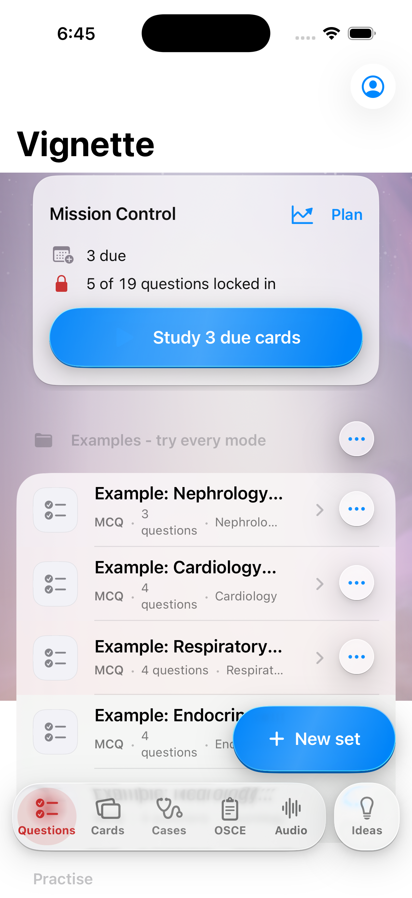

### iphone/3-relaunch: iPhone 17 Pro

```
bundle=com.cramdown.personal exe=Stethoscore Personal
keep=1 args=
launch_status=0
pid=21504 alive_after_30s=yes
--- stderr.txt (last 25 of 1)
IOSurfaceClientSetSurfaceNotify failed e00002c7
--- log-process.txt: 30 matching lines (last 30)
2026-09-25 18:45:43.659 Df Stethoscore Personal[21504:103f5] [com.apple.dt.xctest:Default] Registering for test daemon availability notify post.
2026-09-25 18:45:43.660 Df Stethoscore Personal[21504:103f5] [com.apple.dt.xctest:Default] notify_get_state check indicated test daemon not ready.
2026-09-25 18:45:43.660 Df Stethoscore Personal[21504:103f5] [com.apple.dt.xctest:Default] notify_get_state check indicated test daemon not ready.
2026-09-25 18:45:43.660 Df Stethoscore Personal[21504:103f5] [com.apple.dt.xctest:Default] notify_get_state check indicated test daemon not ready.
2026-09-25 18:45:43.725 Df Stethoscore Personal[21504:103f5] [com.apple.UIKit:KeyWindow] Setting default evaluation strategy for UIUserInterfaceIdiomPhone to LastOneWins
2026-09-25 18:45:43.725 Df Stethoscore Personal[21504:103f5] [com.apple.UIKit:KeyWindow] Setting default evaluation strategy for UIUserInterfaceIdiomPhone to SystemShellManaged
2026-09-25 18:45:43.749 Df Stethoscore Personal[21504:103f5] [com.apple.FileURL:default] kExcludedFromBackupXattrName set on path: /Users/runner/Library/Developer/CoreSimulator/Devices/22452A91-4697-4369-8812-53ADB77EB73B/data/Containers/Data/Application/D96449F1-36A8-418C-9772-DD6472076468/Library/Application Support/RedPenBlobs
2026-09-25 18:45:44.410 I  Stethoscore Personal[21504:103f5] [com.apple.DesignLibrary:defaults] liveTuning=false
2026-09-25 18:45:44.529 Df Stethoscore Personal[21504:103f5] [PrototypeTools:domain] Not observing PTDefaults on customer install.
2026-09-25 18:45:44.605 Df Stethoscore Personal[21504:10418] [com.apple.calls.callkit:Default] Call host has no calls
2026-09-25 18:45:44.687 I  Stethoscore Personal[21504:1041d] [com.apple.storekit:Default] AAFService Starting new XPCConnection 48f11845
2026-09-25 18:45:44.708 Df Stethoscore Personal[21504:10418] [com.apple.storekit:Default] [Default] Finished iterating transaction batches
2026-09-25 18:45:44.708 I  Stethoscore Personal[21504:10418] [com.apple.storekit:Default] AAFService Closing XPCConnection 48f11845
2026-09-25 18:45:44.709 Df Stethoscore Personal[21504:1041d] [com.apple.storekit:Default] AAFService connection invalidated
2026-09-25 18:45:45.350 Df Stethoscore Personal[21504:103f5] [com.apple.network:activity] Create activity from XPC object <nw_activity 50:1 [E788FD2C-DDF9-4B71-A9E8-31E4FF98717B] (reporting strategy default)>
2026-09-25 18:45:45.350 Df Stethoscore Personal[21504:103f5] [com.apple.network:activity] Create activity from XPC object <nw_activity 50:2 [EDCDCEE7-71CD-47D8-A014-69DF62314691] (reporting strategy default)>
2026-09-25 18:45:45.350 Df Stethoscore Personal[21504:103f5] [com.apple.network:activity] Set activity <nw_activity 50:1 [E788FD2C-DDF9-4B71-A9E8-31E4FF98717B] (reporting strategy default)> as the global parent
2026-09-25 18:45:45.372 I  Stethoscore Personal[21504:1040c] [com.apple.storekit:Default] AAFService Starting new XPCConnection 171e5898
2026-09-25 18:45:45.397 Df Stethoscore Personal[21504:1041d] [com.apple.storekit:Default] [Default] Finished iterating transaction batches
2026-09-25 18:45:45.397 I  Stethoscore Personal[21504:1041d] [com.apple.storekit:Default] AAFService Closing XPCConnection 171e5898
2026-09-25 18:45:45.399 I  Stethoscore Personal[21504:1041d] [com.apple.storekit:Default] AAFService Starting new XPCConnection 2bba3929
2026-09-25 18:45:45.436 Df Stethoscore Personal[21504:1041e] [com.apple.storekit:Default] [Default] Finished iterating transaction batches
2026-09-25 18:45:45.436 Df Stethoscore Personal[21504:1041e] [com.apple.storekit:Default] AAFService connection invalidated
2026-09-25 18:45:45.733 I  Stethoscore Personal[21504:1041d] [com.apple.storekit:Default] AAFService Closing XPCConnection 2bba3929
2026-09-25 18:45:45.733 Df Stethoscore Personal[21504:1040c] [com.apple.storekit:Default] AAFService connection invalidated
2026-09-25 18:45:45.734 Df Stethoscore Personal[21504:1041d] [com.apple.storekit:Default] Registering for 'transactionsupdated' daemon notification
2026-09-25 18:45:56.666 Df Stethoscore Personal[21504:1041c] [com.apple.FileURL:default] kExcludedFromBackupXattrName set on path: /Users/runner/Library/Developer/CoreSimulator/Devices/22452A91-4697-4369-8812-53ADB77EB73B/data/Containers/Data/Application/D96449F1-36A8-418C-9772-DD6472076468/Library/Application Support/RedPenSources
2026-09-25 18:46:04.634 Df Stethoscore Personal[21504:103f5] [com.apple.network:activity] <nw_activity 50:1 [E788FD2C-DDF9-4B71-A9E8-31E4FF98717B] (global parent) (reporting strategy default) complete (reason failure)> complete with reason 3 (failure), duration 22236ms
2026-09-25 18:46:04.634 Df Stethoscore Personal[21504:103f5] [com.apple.network:activity] <nw_activity 50:2 [EDCDCEE7-71CD-47D8-A014-69DF62314691] (reporting strategy default) complete (reason failure)> complete with reason 3 (failure), duration 22236ms
2026-09-25 18:46:04.634 Df Stethoscore Personal[21504:103f5] [com.apple.network:activity] Unsetting the global parent activity <nw_activity 50:1 [E788FD2C-DDF9-4B71-A9E8-31E4FF98717B] (global parent) (reporting strategy default) complete (reason failure)>
--- log-system.txt: 81 matching lines (last 30)
2026-09-25 18:45:41.584 Df SpringBoard[10836:100e1] [com.apple.UserNotifications:DataProviderFactory] [com.cramdown.personal] Application installed using default data provider
2026-09-25 18:45:41.585 Df SpringBoard[10836:100d8] [com.apple.SplashBoard:Capture] Image generation complete for: <XBLaunchStateRequest: 0x11ece7d40; groupID: com.cramdown.personal - {DEFAULT GROUP}; statusBar: normal; refSize: {402, 874}; orientation: Portrait; userInterfaceStyle: Light>
```
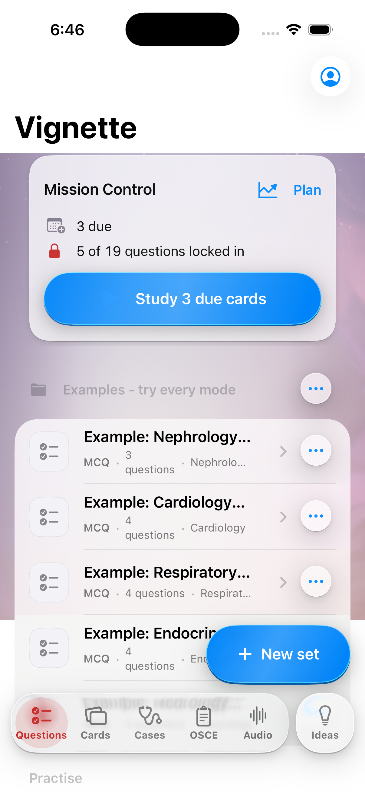

### iphone/4-upgrade-to-current: iPhone 17 Pro

```
bundle=com.cramdown.personal exe=Stethoscore Personal
keep=1 args=
launch_status=0
pid=24077 alive_after_30s=yes
--- stderr.txt (last 25 of 1)
IOSurfaceClientSetSurfaceNotify failed e00002c7
--- log-process.txt: 19 matching lines (last 30)
2026-09-25 18:47:11.344 Df Stethoscore Personal[24077:11e0d] [com.apple.dt.xctest:Default] Registering for test daemon availability notify post.
2026-09-25 18:47:11.345 Df Stethoscore Personal[24077:11e0d] [com.apple.dt.xctest:Default] notify_get_state check indicated test daemon not ready.
2026-09-25 18:47:11.345 Df Stethoscore Personal[24077:11e0d] [com.apple.dt.xctest:Default] notify_get_state check indicated test daemon not ready.
2026-09-25 18:47:11.346 Df Stethoscore Personal[24077:11e0d] [com.apple.dt.xctest:Default] notify_get_state check indicated test daemon not ready.
2026-09-25 18:47:11.453 Df Stethoscore Personal[24077:11e0d] [com.apple.FileURL:default] kExcludedFromBackupXattrName set on path: /Users/runner/Library/Developer/CoreSimulator/Devices/22452A91-4697-4369-8812-53ADB77EB73B/data/Containers/Data/Application/F4A0F80B-434A-4B87-BB50-ACD7DD5383B9/Library/Application Support/RedPenBlobs
2026-09-25 18:47:11.576 Df Stethoscore Personal[24077:11e0d] [com.apple.UIKit:KeyWindow] Setting default evaluation strategy for UIUserInterfaceIdiomPhone to LastOneWins
2026-09-25 18:47:11.577 Df Stethoscore Personal[24077:11e0d] [com.apple.UIKit:KeyWindow] Setting default evaluation strategy for UIUserInterfaceIdiomPhone to SystemShellManaged
2026-09-25 18:47:12.252 Df Stethoscore Personal[24077:11e0d] [PrototypeTools:domain] Not observing PTDefaults on customer install.
2026-09-25 18:47:12.686 Df Stethoscore Personal[24077:11e0d] [com.apple.network:activity] Create activity from XPC object <nw_activity 50:1 [1FEE6506-8B86-4278-8018-A77009ED763F] (reporting strategy default)>
2026-09-25 18:47:12.686 Df Stethoscore Personal[24077:11e0d] [com.apple.network:activity] Create activity from XPC object <nw_activity 50:2 [69E39129-2F22-4B70-A288-AB6AB993625B] (reporting strategy default)>
2026-09-25 18:47:12.686 Df Stethoscore Personal[24077:11e0d] [com.apple.network:activity] Set activity <nw_activity 50:1 [1FEE6506-8B86-4278-8018-A77009ED763F] (reporting strategy default)> as the global parent
2026-09-25 18:47:12.735 Df Stethoscore Personal[24077:11e18] [com.apple.storekit:Default] [Default] Finished iterating transaction batches
2026-09-25 18:47:12.736 Df Stethoscore Personal[24077:11e18] [com.apple.storekit:Default] AAFService connection invalidated
2026-09-25 18:47:12.757 Df Stethoscore Personal[24077:11e17] [com.apple.storekit:Default] [Default] Finished iterating transaction batches
2026-09-25 18:47:13.009 Df Stethoscore Personal[24077:11e3e] [com.apple.storekit:Default] Registering for 'transactionsupdated' daemon notification
2026-09-25 18:47:13.011 Df Stethoscore Personal[24077:11e74] [com.apple.storekit:Default] AAFService connection invalidated
2026-09-25 18:47:16.210 Df Stethoscore Personal[24077:11e0d] [com.apple.network:activity] <nw_activity 50:1 [1FEE6506-8B86-4278-8018-A77009ED763F] (global parent) (reporting strategy default) complete (reason success)> complete with reason 2 (success), duration 6902ms
2026-09-25 18:47:16.210 Df Stethoscore Personal[24077:11e0d] [com.apple.network:activity] <nw_activity 50:2 [69E39129-2F22-4B70-A288-AB6AB993625B] (reporting strategy default) complete (reason success)> complete with reason 2 (success), duration 6902ms
2026-09-25 18:47:16.210 Df Stethoscore Personal[24077:11e0d] [com.apple.network:activity] Unsetting the global parent activity <nw_activity 50:1 [1FEE6506-8B86-4278-8018-A77009ED763F] (global parent) (reporting strategy default) complete (reason success)>
--- log-system.txt: 78 matching lines (last 30)
2026-09-25 18:47:07.522 Df SpringBoard[10836:11ade] [com.apple.SplashBoard:Capture] Image generation complete for: <XBLaunchStateRequest: 0x11ec5d6c0; groupID: com.cramdown.personal - {DEFAULT GROUP}; statusBar: normal; refSize: {402, 874}; orientation: Portrait; userInterfaceStyle: Light>
2026-09-25 18:47:07.522 Df SpringBoard[10836:11ae5] [com.apple.SplashBoard:Capture] Asynchronously generating image data for request: <XBLaunchStateRequest: 0x11ec5dc00; groupID: com.cramdown.personal - {DEFAULT GROUP}; statusBar: normal; refSize: {402, 874}; orientation: Portrait; userInterfaceStyle: Dark>
2026-09-25 18:47:07.523 Df SpringBoard[10836:11ae8] [com.apple.SplashBoard:FileManifest] <XBApplicationSnapshotManifestImpl: 0x11bf52080> [com.cramdown.personal] Snapshot data for <XBApplicationSnapshot: 0x11bc1aa00; …4DF1A2C507AB> [com.cramdown.personal] written to file: /Users/runner/Library/Developer/CoreSimulator/Devices/22452A91-4697-4369-8812-53ADB77EB73B/data/Containers/Data/Application/F4A
2026-09-25 18:47:07.525 Df splashboardd[12403:9d45] [com.apple.SplashBoard:Capture] Updating window to <XBLaunchStateRequest: 0x103266290; groupID: com.cramdown.personal - {DEFAULT GROUP}; statusBar: normal; refSize: {402, 874}; orientation: Portrait; userInterfaceStyle: Dark>
2026-09-25 18:47:07.534 Df SpringBoard[10836:11ade] [com.apple.UserNotifications:DataProviderFactory] [com.cramdown.personal] Application installed using default data provider
2026-09-25 18:47:07.622 Df SpringBoard[10836:11adc] [com.apple.SplashBoard:Capture] Image generation complete for: <XBLaunchStateRequest: 0x11ec5dc00; groupID: com.cramdown.personal - {DEFAULT GROUP}; statusBar: normal; refSize: {402, 874}; orientation: Portrait; userInterfaceStyle: Dark>
2026-09-25 18:47:07.623 Df SpringBoard[10836:11965] [com.apple.SplashBoard:FileManifest] <XBApplicationSnapshotManifestImpl: 0x11bf52080> [com.cramdown.personal] Snapshot data for <XBApplicationSnapshot: 0x11bc19dc0; …C07AC0E43108> [com.cramdown.personal] written to file: /Users/runner/Library/Developer/CoreSimulator/Devices/22452A91-4697-4369-8812-53ADB77EB73B/data/Containers/Data/Application/F4A
    "terminate_running_process" = 1;
	retryTimeout: 120.000000 (default write com.apple.CoreSimulatorBridge LaunchRetryTimeout <value>)
	bootTimeout: 300.000000 (default write com.apple.CoreSimulatorBridge BootRetryTimeout <value>)
	bootLeeway: 120.000000 (default write com.apple.CoreSimulatorBridge BootLeeway <value>)
	Note: Use 'xcrun simctl spawn booted defaults write <domain> <key> <value>' to modify defaults in the booted Simulator device.
2026-09-25 18:47:09.214 Df CoreSimulatorBridge[10866:ea26] [com.apple.FrontBoard:Common] FBSSystemAppProxy: Sending request to terminate application com.cramdown.personal
```
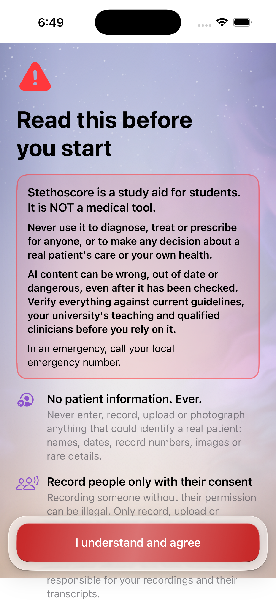

### iphone/5-other-bundle-id: iPhone 17 Pro

```
bundle=swift-playgrounds-dev-run.launchtest exe=Stethoscore Personal
keep=0 args=-launchTestSignedIn
launch_status=0
pid=27124 alive_after_30s=yes
--- stderr.txt (last 25 of 1)
IOSurfaceClientSetSurfaceNotify failed e00002c7
--- log-process.txt: 29 matching lines (last 30)
2026-09-25 18:50:01.397 Df Stethoscore Personal[27124:13f17] [com.apple.dt.xctest:Default] Registering for test daemon availability notify post.
2026-09-25 18:50:01.397 Df Stethoscore Personal[27124:13f17] [com.apple.dt.xctest:Default] notify_get_state check indicated test daemon not ready.
2026-09-25 18:50:01.398 Df Stethoscore Personal[27124:13f17] [com.apple.dt.xctest:Default] notify_get_state check indicated test daemon not ready.
2026-09-25 18:50:01.398 Df Stethoscore Personal[27124:13f17] [com.apple.dt.xctest:Default] notify_get_state check indicated test daemon not ready.
2026-09-25 18:50:01.569 Df Stethoscore Personal[27124:13f17] [com.apple.FileURL:default] kExcludedFromBackupXattrName set on path: /Users/runner/Library/Developer/CoreSimulator/Devices/22452A91-4697-4369-8812-53ADB77EB73B/data/Containers/Data/Application/20670592-B264-4019-AD1B-651E10C11360/Library/Application Support/RedPenBlobs
2026-09-25 18:50:01.628 Df Stethoscore Personal[27124:13f17] [com.apple.UIKit:KeyWindow] Setting default evaluation strategy for UIUserInterfaceIdiomPhone to LastOneWins
2026-09-25 18:50:01.629 Df Stethoscore Personal[27124:13f17] [com.apple.UIKit:KeyWindow] Setting default evaluation strategy for UIUserInterfaceIdiomPhone to SystemShellManaged
2026-09-25 18:50:02.935 I  Stethoscore Personal[27124:13f17] [com.apple.DesignLibrary:defaults] liveTuning=false
2026-09-25 18:50:03.422 Df Stethoscore Personal[27124:13f17] [PrototypeTools:domain] Not observing PTDefaults on customer install.
2026-09-25 18:50:03.719 Df Stethoscore Personal[27124:13ff3] [com.apple.calls.callkit:Default] Call host has no calls
2026-09-25 18:50:04.144 I  Stethoscore Personal[27124:13ff7] [com.apple.storekit:Default] AAFService Starting new XPCConnection 1695b8d0
2026-09-25 18:50:04.222 Df Stethoscore Personal[27124:13ff7] [com.apple.storekit:Default] [Default] Finished iterating transaction batches
2026-09-25 18:50:04.224 I  Stethoscore Personal[27124:13ffd] [com.apple.storekit:Default] AAFService Closing XPCConnection 1695b8d0
2026-09-25 18:50:04.224 Df Stethoscore Personal[27124:13ffd] [com.apple.storekit:Default] AAFService connection invalidated
2026-09-25 18:50:08.526 Df Stethoscore Personal[27124:13f17] [com.apple.network:activity] Create activity from XPC object <nw_activity 50:1 [9570DC46-E1F8-43DB-8186-51E2A722ACC7] (reporting strategy default)>
2026-09-25 18:50:08.527 Df Stethoscore Personal[27124:13f17] [com.apple.network:activity] Create activity from XPC object <nw_activity 50:2 [93274714-2955-495F-B9BE-C9C483EDEDD1] (reporting strategy default)>
2026-09-25 18:50:08.527 Df Stethoscore Personal[27124:13f17] [com.apple.network:activity] Set activity <nw_activity 50:1 [9570DC46-E1F8-43DB-8186-51E2A722ACC7] (reporting strategy default)> as the global parent
2026-09-25 18:50:08.669 I  Stethoscore Personal[27124:14090] [com.apple.storekit:Default] AAFService Starting new XPCConnection 8b8e14a7
2026-09-25 18:50:08.749 Df Stethoscore Personal[27124:14090] [com.apple.storekit:Default] [Default] Finished iterating transaction batches
2026-09-25 18:50:08.750 I  Stethoscore Personal[27124:13ffe] [com.apple.storekit:Default] AAFService Closing XPCConnection 8b8e14a7
2026-09-25 18:50:08.890 Df Stethoscore Personal[27124:13ff8] [com.apple.storekit:Default] AAFService connection invalidated
2026-09-25 18:50:09.371 I  Stethoscore Personal[27124:14090] [com.apple.storekit:Default] AAFService Starting new XPCConnection 96f80e17
2026-09-25 18:50:09.408 Df Stethoscore Personal[27124:14090] [com.apple.storekit:Default] [Default] Finished iterating transaction batches
2026-09-25 18:50:09.539 I  Stethoscore Personal[27124:14090] [com.apple.storekit:Default] AAFService Closing XPCConnection 96f80e17
2026-09-25 18:50:09.550 Df Stethoscore Personal[27124:14090] [com.apple.storekit:Default] Registering for 'transactionsupdated' daemon notification
2026-09-25 18:50:09.556 Df Stethoscore Personal[27124:14029] [com.apple.storekit:Default] AAFService connection invalidated
2026-09-25 18:50:10.120 Df Stethoscore Personal[27124:13f17] [com.apple.network:activity] <nw_activity 50:1 [9570DC46-E1F8-43DB-8186-51E2A722ACC7] (global parent) (reporting strategy default) complete (reason success)> complete with reason 2 (success), duration 14753ms
2026-09-25 18:50:10.120 Df Stethoscore Personal[27124:13f17] [com.apple.network:activity] <nw_activity 50:2 [93274714-2955-495F-B9BE-C9C483EDEDD1] (reporting strategy default) complete (reason success)> complete with reason 2 (success), duration 14752ms
2026-09-25 18:50:10.121 Df Stethoscore Personal[27124:13f17] [com.apple.network:activity] Unsetting the global parent activity <nw_activity 50:1 [9570DC46-E1F8-43DB-8186-51E2A722ACC7] (global parent) (reporting strategy default) complete (reason success)>
--- log-system.txt: 70 matching lines (last 30)
2026-09-25 18:49:53.796 Df SpringBoard[10836:13e70] [com.apple.SplashBoard:Capture] Asynchronously generating image data for request: <XBLaunchStateRequest: 0x11ec5e760; groupID: swift-playgrounds-dev-run.launchtest - {DEFAULT GROUP}; statusBar: normal; refSize: {402, 874}; orientation: Portrait; userInterfaceStyle: Dark>
2026-09-25 18:49:53.798 Df splashboardd[12403:9d45] [com.apple.SplashBoard:Capture] Updating window to <XBLaunchStateRequest: 0x1032653b0; groupID: swift-playgrounds-dev-run.launchtest - {DEFAULT GROUP}; statusBar: normal; refSize: {402, 874}; orientation: Portrait; userInterfaceStyle: Dark>
2026-09-25 18:49:53.805 Df SpringBoard[10836:13e73] [com.apple.SplashBoard:FileManifest] <XBApplicationSnapshotManifestImpl: 0x11bf1e200> [swift-playgrounds-dev-run.launchtest] Snapshot data for <XBApplicationSnapshot: 0x11ec0f2c0; …FA7645A40260> [swift-playgrounds-dev-run.launchtest] written to file: /Users/runner/Library/Developer/CoreSimulator/Devices/22452A91-4697-4369-8812-53ADB77EB73B/data/C
```
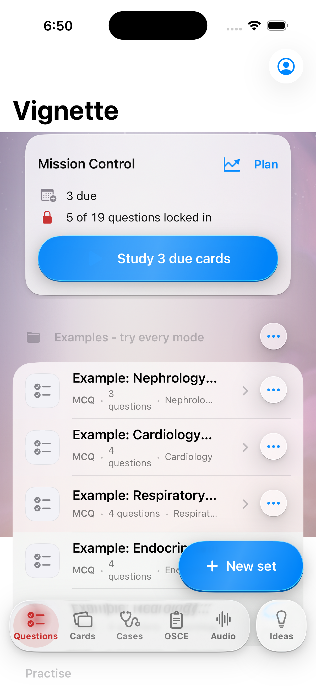

## old-1242

```
iphone/1-fresh=0
iphone/2-signed-in=0
iphone/3-relaunch=0
iphone/4-upgrade-to-current=0
iphone/5-other-bundle-id=0
ipad/1-fresh=0
ipad/2-signed-in=0
ipad/3-relaunch=0
ipad/4-upgrade-to-current=0
```

### ipad/1-fresh: iPad Pro 13-inch (M5)

```
bundle=com.cramdown.personal exe=Stethoscore Personal
keep=0 args=
launch_status=0
pid=26494 alive_after_30s=yes
--- stderr.txt (last 25 of 1)
IOSurfaceClientSetSurfaceNotify failed e00002c7
--- log-process.txt: 19 matching lines (last 30)
2026-09-25 18:52:54.759 Df Stethoscore Personal[26494:1404f] [com.apple.dt.xctest:Default] Registering for test daemon availability notify post.
2026-09-25 18:52:54.760 Df Stethoscore Personal[26494:1404f] [com.apple.dt.xctest:Default] notify_get_state check indicated test daemon not ready.
2026-09-25 18:52:54.760 Df Stethoscore Personal[26494:1404f] [com.apple.dt.xctest:Default] notify_get_state check indicated test daemon not ready.
2026-09-25 18:52:54.760 Df Stethoscore Personal[26494:1404f] [com.apple.dt.xctest:Default] notify_get_state check indicated test daemon not ready.
2026-09-25 18:52:54.891 Df Stethoscore Personal[26494:1404f] [com.apple.FileURL:default] kExcludedFromBackupXattrName set on path: /Users/runner/Library/Developer/CoreSimulator/Devices/A2011F14-88A1-46AA-999A-FD6FEDCD870B/data/Containers/Data/Application/47BE3BF7-B85C-439A-8769-9D10C23A7BEE/Library/Application Support/RedPenBlobs
2026-09-25 18:52:54.944 Df Stethoscore Personal[26494:1404f] [com.apple.UIKit:KeyWindow] Setting default evaluation strategy for UIUserInterfaceIdiomPad to LastOneWins
2026-09-25 18:52:54.945 Df Stethoscore Personal[26494:1404f] [com.apple.UIKit:KeyWindow] Setting default evaluation strategy for UIUserInterfaceIdiomPad to SystemShellManaged
2026-09-25 18:52:55.931 Df Stethoscore Personal[26494:1404f] [PrototypeTools:domain] Not observing PTDefaults on customer install.
2026-09-25 18:52:57.836 Df Stethoscore Personal[26494:1404f] [com.apple.network:activity] Create activity from XPC object <nw_activity 50:1 [96BBE073-5C40-474E-B972-0781C2266E51] (reporting strategy default)>
2026-09-25 18:52:57.836 Df Stethoscore Personal[26494:1404f] [com.apple.network:activity] Create activity from XPC object <nw_activity 50:2 [5B3DBB10-4A49-4501-9CF6-9B9B66559865] (reporting strategy default)>
2026-09-25 18:52:57.836 Df Stethoscore Personal[26494:1404f] [com.apple.network:activity] Set activity <nw_activity 50:1 [96BBE073-5C40-474E-B972-0781C2266E51] (reporting strategy default)> as the global parent
2026-09-25 18:52:58.182 Df Stethoscore Personal[26494:1411a] [com.apple.storekit:Default] [Default] Finished iterating transaction batches
2026-09-25 18:52:58.221 Df Stethoscore Personal[26494:1411c] [com.apple.storekit:Default] AAFService connection invalidated
2026-09-25 18:52:58.622 Df Stethoscore Personal[26494:1411a] [com.apple.storekit:Default] [Default] Finished iterating transaction batches
2026-09-25 18:52:58.625 Df Stethoscore Personal[26494:14095] [com.apple.storekit:Default] Registering for 'transactionsupdated' daemon notification
2026-09-25 18:52:58.629 Df Stethoscore Personal[26494:1411a] [com.apple.storekit:Default] AAFService connection invalidated
2026-09-25 18:53:26.049 Df Stethoscore Personal[26494:1404f] [com.apple.network:activity] <nw_activity 50:1 [96BBE073-5C40-474E-B972-0781C2266E51] (global parent) (reporting strategy default) complete (reason failure)> complete with reason 3 (failure), duration 34632ms
2026-09-25 18:53:26.049 Df Stethoscore Personal[26494:1404f] [com.apple.network:activity] <nw_activity 50:2 [5B3DBB10-4A49-4501-9CF6-9B9B66559865] (reporting strategy default) complete (reason failure)> complete with reason 3 (failure), duration 34633ms
2026-09-25 18:53:26.049 Df Stethoscore Personal[26494:1404f] [com.apple.network:activity] Unsetting the global parent activity <nw_activity 50:1 [96BBE073-5C40-474E-B972-0781C2266E51] (global parent) (reporting strategy default) complete (reason failure)>
--- log-system.txt: 101 matching lines (last 30)
2026-09-25 18:52:54.254 Df SpringBoard[23233:12c41] [com.apple.SplashBoard:Capture] Image generation complete for: <XBLaunchStateRequest: 0x11d4804d0; groupID: com.cramdown.personal - {DEFAULT GROUP}; statusBar: normal; refSize: {1032, 1376}; orientation: Portrait; userInterfaceStyle: Dark>
2026-09-25 18:52:54.258 Df SpringBoard[23233:12d21] [com.apple.SplashBoard:Capture] Asynchronously generating image data for request: <XBLaunchStateRequest: 0x11d607bf0; groupID: com.cramdown.personal - {DEFAULT GROUP}; statusBar: normal; refSize: {375, 1376}; orientation: Portrait; userInterfaceStyle: Dark>
2026-09-25 18:52:54.379 Df splashboardd[26378:14036] [com.apple.SplashBoard:Capture] Updating window to <XBLaunchStateRequest: 0x105248380; groupID: com.cramdown.personal - {DEFAULT GROUP}; statusBar: normal; refSize: {375, 1376}; orientation: Portrait; userInterfaceStyle: Dark>
<SBTransitionSwitcherModifierEvent: 0x11d6e79c0; type: MainTransition; transitionID: FF12CE16-9E27-479A-AFCE-9FAAB9B98AA4; phase: Complete; animated: YES; fromAppLayout: 0x0; toAppLayout: <SBAppLayout: 0x11a267e00; primary: com.cramdown.personal:A9FC0FBD6C15; environment: main>; fromEnvironmentMode: home-screen; toEnvironmentMode: application; fromPeekConfiguration: undefined; toPeekConfiguration:
2026-09-25 18:52:54.494 Df SpringBoard[23233:12d0a] [com.apple.SplashBoard:FileManifest] <XBApplicationSnapshotManifestImpl: 0x107359080> [com.cramdown.personal] Snapshot data for <XBApplicationSnapshot: 0x11d744fc0; …0C3836F343A4> [com.cramdown.personal] written to file: /Users/runner/Library/Developer/CoreSimulator/Devices/A2011F14-88A1-46AA-999A-FD6FEDCD870B/data/Containers/Data/Application/47B
2026-09-25 18:52:54.498 Df SpringBoard[23233:12d0a] [com.apple.SplashBoard:FileManifest] <XBApplicationSnapshotManifestImpl: 0x107359080> [com.cramdown.personal] Snapshot data for <XBApplicationSnapshot: 0x11d6e5880; …A30894C6ECB6> [com.cramdown.personal] written to file: /Users/runner/Library/Developer/CoreSimulator/Devices/A2011F14-88A1-46AA-999A-FD6FEDCD870B/data/Containers/Data/Application/47B
2026-09-25 18:52:54.716 Df backboardd[23188:14079] [com.apple.iohid:default] Connection added: IOHIDEventSystemConnection uuid:6CCC4516-54EC-489D-96E1-AB7393E51847 pid:26494 process:Stethoscore Personal type:Passive entitlements:0x0 caller:BackBoardServices: ___getHIDEventSystemClient_block_invoke + 296 attributes:{
2026-09-25 18:52:54.717 Df backboardd[23188:14079] [com.apple.BackBoard:HID] Adding client connection: <BKHIDClientConnection: 0x10ee009c0; IOHIDEventSystemConnectionRef: 0x10d05b800; vpid: 26494(vD187); taskPort: 0xB033; bundleID: com.cramdown.personal> for client: IOHIDEventSystemConnection uuid:6CCC4516-54EC-489D-96E1-AB7393E51847 pid:26494 process:Stethoscore Personal type:Passive entitlements
2026-09-25 18:52:54.886 Df SpringBoard[23233:12cbe] [com.apple.SplashBoard:Capture] Image generation complete for: <XBLaunchStateRequest: 0x11d607bf0; groupID: com.cramdown.personal - {DEFAULT GROUP}; statusBar: normal; refSize: {375, 1376}; orientation: Portrait; userInterfaceStyle: Dark>
2026-09-25 18:52:54.887 Df SpringBoard[23233:12d21] [com.apple.SplashBoard:Capture] Asynchronously generating image data for request: <XBLaunchStateRequest: 0x11d6040e0; groupID: com.cramdown.personal - {DEFAULT GROUP}; statusBar: normal; refSize: {1032, 1376}; naturalSize: {1376, 1032}; orientation: LandscapeLeft; userInterfaceStyle: Light>
2026-09-25 18:52:54.889 Df splashboardd[26378:14036] [com.apple.SplashBoard:Capture] Updating window to <XBLaunchStateRequest: 0x1052483f0; groupID: com.cramdown.personal - {DEFAULT GROUP}; statusBar: normal; refSize: {1032, 1376}; naturalSize: {1376, 1032}; orientation: LandscapeLeft; userInterfaceStyle: Light>
2026-09-25 18:52:54.894 Df SpringBoard[23233:12bff] [com.apple.SplashBoard:FileManifest] <XBApplicationSnapshotManifestImpl: 0x107359080> [com.cramdown.personal] Snapshot data for <XBApplicationSnapshot: 0x11d6e5340; …BAA58D8D2AEA> [com.cramdown.personal] written to file: /Users/runner/Library/Developer/CoreSimulator/Devices/A2011F14-88A1-46AA-999A-FD6FEDCD870B/data/Containers/Data/Application/47B
2026-09-25 18:52:55.225 Df SpringBoard[23233:12cbe] [com.apple.SplashBoard:Capture] Image generation complete for: <XBLaunchStateRequest: 0x11d6040e0; groupID: com.cramdown.personal - {DEFAULT GROUP}; statusBar: normal; refSize: {1032, 1376}; naturalSize: {1376, 1032}; orientation: LandscapeLeft; userInterfaceStyle: Light>
```
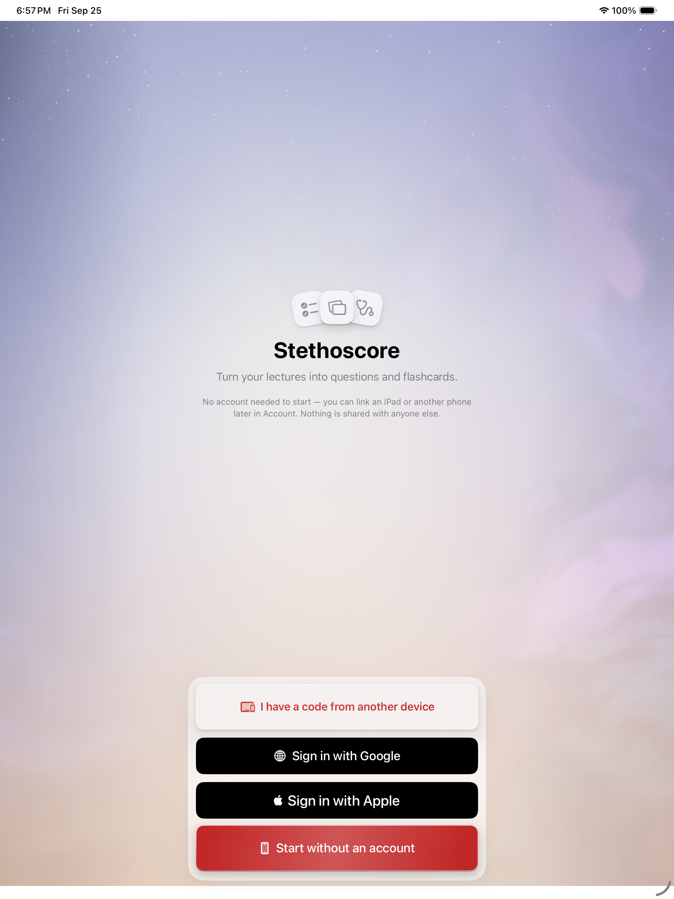

### ipad/2-signed-in: iPad Pro 13-inch (M5)

```
bundle=com.cramdown.personal exe=Stethoscore Personal
keep=1 args=-launchTestSignedIn
launch_status=0
pid=31507 alive_after_30s=yes
--- stderr.txt (last 25 of 1)
IOSurfaceClientSetSurfaceNotify failed e00002c7
--- log-process.txt: 55 matching lines (last 30)
2026-09-25 19:00:19.951 Df Stethoscore Personal[31507:180e6] [com.apple.CFNetwork:Default] Initializing NSHTTPCookieStorage singleton
2026-09-25 19:00:19.952 Df Stethoscore Personal[31507:180e6] [com.apple.CFNetwork:Default] Initializing CFHTTPCookieStorage singleton
2026-09-25 19:00:19.952 Df Stethoscore Personal[31507:180e6] [com.apple.CFNetwork:Default] Creating default cookie storage with process/bundle identifier
2026-09-25 19:00:19.958 Df Stethoscore Personal[31507:180e6] [com.apple.CFNetwork:Default] Initializing AlternativeServices Storage singleton
2026-09-25 19:00:19.959 Df Stethoscore Personal[31507:180e6] [com.apple.FileURL:default] kExcludedFromBackupXattrName set on path: /Users/runner/Library/Developer/CoreSimulator/Devices/A2011F14-88A1-46AA-999A-FD6FEDCD870B/data/Containers/Data/Application/2AE99CB0-5285-41D6-8008-E08E0972B9DA/Library/HTTPStorages/com.cramdown.personal
2026-09-25 19:00:20.036 Df Stethoscore Personal[31507:180e6] [com.apple.CFNetwork:Default] Connection 1: enabling TLS
2026-09-25 19:00:20.036 Df Stethoscore Personal[31507:180e6] [com.apple.CFNetwork:Default] Connection 1: starting, TC(0x0)
2026-09-25 19:00:20.121 Df Stethoscore Personal[31507:180e6] [com.apple.CFNetwork:Default] Task <41F25A1E-A72F-471A-9757-336DFD583747>.<1> setting up Connection 1
2026-09-25 19:00:20.210 Df Stethoscore Personal[31507:1820f] [com.apple.CFNetwork:Default] Connection 1: asked to evaluate TLS Trust
2026-09-25 19:00:20.215 Df Stethoscore Personal[31507:1820f] [com.apple.CFNetwork:Default] Task <41F25A1E-A72F-471A-9757-336DFD583747>.<1> auth completion disp=1 cred=0x0
2026-09-25 19:00:20.282 Df Stethoscore Personal[31507:1820f] [com.apple.CFNetwork:Default] System Trust Evaluation yielded status(0)
2026-09-25 19:00:20.315 Df Stethoscore Personal[31507:1820f] [com.apple.CFNetwork:Default] Connection 1: TLS Trust result 0
2026-09-25 19:00:20.322 Df Stethoscore Personal[31507:1820f] [com.apple.network:boringssl] nw_protocol_boringssl_signal_connected(895) [C1.1.1:2][0x113a06d60] TLS connected [server(0) version(0x0304) ciphersuite(TLS_AES_256_GCM_SHA384) group(0x11ec) signature_alg(0x0403) alpn(h2) resumed(0) offered_ticket(0) in_early_data(0) early_data_accepted(0) false_started(0) ocsp_received(0) sct_received(1) 
2026-09-25 19:00:20.336 Df Stethoscore Personal[31507:1820f] [com.apple.CFNetwork:Default] Connection 1: connected successfully
2026-09-25 19:00:20.336 Df Stethoscore Personal[31507:1820f] [com.apple.CFNetwork:Default] Connection 1: TLS handshake complete
2026-09-25 19:00:20.337 Df Stethoscore Personal[31507:1820f] [com.apple.CFNetwork:Default] Connection 1: ready C(N) E(N)
2026-09-25 19:00:20.353 Df Stethoscore Personal[31507:1820f] [com.apple.CFNetwork:Default] Task <41F25A1E-A72F-471A-9757-336DFD583747>.<1> now using Connection 1
2026-09-25 19:00:20.353 Df Stethoscore Personal[31507:1820f] [com.apple.CFNetwork:Default] Task <41F25A1E-A72F-471A-9757-336DFD583747>.<1> sent request, body S 2
2026-09-25 19:00:20.514 Df Stethoscore Personal[31507:181e2] [com.apple.CFNetwork:Default] Task <41F25A1E-A72F-471A-9757-336DFD583747>.<1> received response, status 200 content U
2026-09-25 19:00:20.514 Df Stethoscore Personal[31507:181e2] [com.apple.CFNetwork:Default] Task <41F25A1E-A72F-471A-9757-336DFD583747>.<1> done using Connection 1
2026-09-25 19:00:20.600 Df Stethoscore Personal[31507:181e2] [com.apple.CFNetwork:Default] Task <41F25A1E-A72F-471A-9757-336DFD583747>.<1> response ended
2026-09-25 19:00:20.601 Df Stethoscore Personal[31507:181e2] [com.apple.CFNetwork:Default] Task <41F25A1E-A72F-471A-9757-336DFD583747>.<1> finished successfully
2026-09-25 19:00:21.085 Df Stethoscore Personal[31507:180df] [com.apple.CFNetwork:Default] Garbage collection for alternative services
2026-09-25 19:00:22.009 I  Stethoscore Personal[31507:180e4] [com.apple.storekit:Default] AAFService Closing XPCConnection b8e743d2
2026-09-25 19:00:22.013 Df Stethoscore Personal[31507:180df] [com.apple.storekit:Default] AAFService connection invalidated
2026-09-25 19:00:22.019 Df Stethoscore Personal[31507:180e4] [com.apple.storekit:Default] Registering for 'transactionsupdated' daemon notification
2026-09-25 19:00:22.680 Df Stethoscore Personal[31507:18076] [com.apple.network:activity] <nw_activity 50:1 [E451200A-D0B9-4684-8D1A-9F6019F4F7D8] (global parent) (reporting strategy default) complete (reason success)> complete with reason 2 (success), duration 9348ms
2026-09-25 19:00:22.680 Df Stethoscore Personal[31507:18076] [com.apple.network:activity] <nw_activity 50:2 [EACFA722-BB3E-4BA0-8DBC-3B91A4D0F21D] (reporting strategy default) complete (reason success)> complete with reason 2 (success), duration 9348ms
2026-09-25 19:00:22.680 Df Stethoscore Personal[31507:18076] [com.apple.network:activity] Unsetting the global parent activity <nw_activity 50:1 [E451200A-D0B9-4684-8D1A-9F6019F4F7D8] (global parent) (reporting strategy default) complete (reason success)>
2026-09-25 19:00:23.631 Df Stethoscore Personal[31507:180e0] [com.apple.FileURL:default] kExcludedFromBackupXattrName set on path: /Users/runner/Library/Developer/CoreSimulator/Devices/A2011F14-88A1-46AA-999A-FD6FEDCD870B/data/Containers/Data/Application/2AE99CB0-5285-41D6-8008-E08E0972B9DA/Library/Application Support/RedPenSources
--- log-system.txt: 128 matching lines (last 30)
2026-09-25 19:00:12.337 Df SpringBoard[23233:159ab] [com.apple.SplashBoard:Capture] Image generation complete for: <XBLaunchStateRequest: 0x11d6040e0; groupID: com.cramdown.personal - {DEFAULT GROUP}; statusBar: normal; refSize: {1032, 1376}; naturalSize: {1376, 1032}; orientation: LandscapeLeft; userInterfaceStyle: Dark>
2026-09-25 19:00:12.337 Df SpringBoard[23233:16071] [com.apple.SplashBoard:Capture] Asynchronously generating image data for request: <XBLaunchStateRequest: 0x11d604cb0; groupID: com.cramdown.personal - {DEFAULT GROUP}; statusBar: normal; refSize: {1032, 375}; naturalSize: {375, 1032}; orientation: LandscapeLeft; userInterfaceStyle: Dark>
```
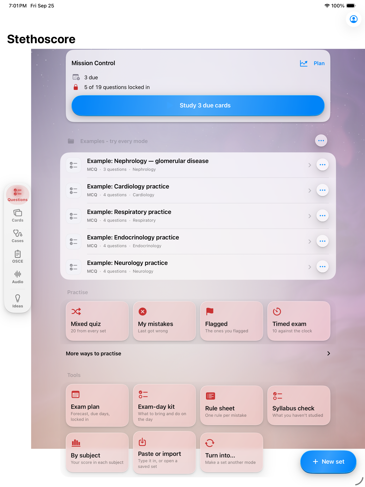

### ipad/3-relaunch: iPad Pro 13-inch (M5)

```
bundle=com.cramdown.personal exe=Stethoscore Personal
keep=1 args=
launch_status=0
pid=33828 alive_after_30s=yes
--- stderr.txt (last 25 of 1)
IOSurfaceClientSetSurfaceNotify failed e00002c7
--- log-process.txt: 31 matching lines (last 30)
2026-09-25 19:01:27.820 Df Stethoscore Personal[33828:197f4] [com.apple.dt.xctest:Default] notify_get_state check indicated test daemon not ready.
2026-09-25 19:01:27.820 Df Stethoscore Personal[33828:197f4] [com.apple.dt.xctest:Default] notify_get_state check indicated test daemon not ready.
2026-09-25 19:01:27.820 Df Stethoscore Personal[33828:197f4] [com.apple.dt.xctest:Default] notify_get_state check indicated test daemon not ready.
2026-09-25 19:01:27.878 Df Stethoscore Personal[33828:197f4] [com.apple.UIKit:KeyWindow] Setting default evaluation strategy for UIUserInterfaceIdiomPad to LastOneWins
2026-09-25 19:01:27.879 Df Stethoscore Personal[33828:197f4] [com.apple.UIKit:KeyWindow] Setting default evaluation strategy for UIUserInterfaceIdiomPad to SystemShellManaged
2026-09-25 19:01:27.905 Df Stethoscore Personal[33828:197f4] [com.apple.FileURL:default] kExcludedFromBackupXattrName set on path: /Users/runner/Library/Developer/CoreSimulator/Devices/A2011F14-88A1-46AA-999A-FD6FEDCD870B/data/Containers/Data/Application/C07A8CE3-5A4E-48C8-8A98-9E35BF846AEE/Library/Application Support/RedPenBlobs
2026-09-25 19:01:28.600 I  Stethoscore Personal[33828:197f4] [com.apple.DesignLibrary:defaults] liveTuning=false
2026-09-25 19:01:28.700 Df Stethoscore Personal[33828:197f4] [PrototypeTools:domain] Not observing PTDefaults on customer install.
2026-09-25 19:01:28.783 Df Stethoscore Personal[33828:197fb] [com.apple.calls.callkit:Default] Call host has no calls
2026-09-25 19:01:28.876 I  Stethoscore Personal[33828:1980d] [com.apple.storekit:Default] AAFService Starting new XPCConnection 5f69adc4
2026-09-25 19:01:28.889 Df Stethoscore Personal[33828:19812] [com.apple.storekit:Default] [Default] Finished iterating transaction batches
2026-09-25 19:01:28.889 I  Stethoscore Personal[33828:19812] [com.apple.storekit:Default] AAFService Closing XPCConnection 5f69adc4
2026-09-25 19:01:28.889 Df Stethoscore Personal[33828:19812] [com.apple.storekit:Default] AAFService connection invalidated
2026-09-25 19:01:29.947 Df Stethoscore Personal[33828:197f4] [com.apple.network:activity] Create activity from XPC object <nw_activity 50:1 [526C5C68-BC0B-4C07-80D4-E1A41A67A0A5] (reporting strategy default)>
2026-09-25 19:01:29.947 Df Stethoscore Personal[33828:197f4] [com.apple.network:activity] Create activity from XPC object <nw_activity 50:2 [F2492BB9-637A-4425-856E-58A88E09F49C] (reporting strategy default)>
2026-09-25 19:01:29.947 Df Stethoscore Personal[33828:197f4] [com.apple.network:activity] Set activity <nw_activity 50:1 [526C5C68-BC0B-4C07-80D4-E1A41A67A0A5] (reporting strategy default)> as the global parent
2026-09-25 19:01:30.016 I  Stethoscore Personal[33828:19812] [com.apple.storekit:Default] AAFService Starting new XPCConnection 883e824a
2026-09-25 19:01:30.039 I  Stethoscore Personal[33828:197f4] [com.apple.PointerUI:Common] Activating Connection: <BSXPC(com.apple.PointerUI.pointeruid.service[C:3-1])-as(com.apple.PointerUI.pointeruid.default-service):0x1036a7110 name=(null)>
2026-09-25 19:01:30.049 Df Stethoscore Personal[33828:197fb] [com.apple.storekit:Default] [Default] Finished iterating transaction batches
2026-09-25 19:01:30.052 I  Stethoscore Personal[33828:197fb] [com.apple.storekit:Default] AAFService Closing XPCConnection 883e824a
2026-09-25 19:01:30.053 I  Stethoscore Personal[33828:1980d] [com.apple.storekit:Default] AAFService Starting new XPCConnection 91774fcc
2026-09-25 19:01:30.065 Df Stethoscore Personal[33828:19812] [com.apple.storekit:Default] AAFService connection invalidated
2026-09-25 19:01:30.107 Df Stethoscore Personal[33828:19816] [com.apple.storekit:Default] [Default] Finished iterating transaction batches
2026-09-25 19:01:31.061 I  Stethoscore Personal[33828:19812] [com.apple.storekit:Default] AAFService Closing XPCConnection 91774fcc
2026-09-25 19:01:31.063 Df Stethoscore Personal[33828:197fb] [com.apple.storekit:Default] Registering for 'transactionsupdated' daemon notification
2026-09-25 19:01:31.065 Df Stethoscore Personal[33828:19816] [com.apple.storekit:Default] AAFService connection invalidated
2026-09-25 19:01:35.974 Df Stethoscore Personal[33828:1980d] [com.apple.FileURL:default] kExcludedFromBackupXattrName set on path: /Users/runner/Library/Developer/CoreSimulator/Devices/A2011F14-88A1-46AA-999A-FD6FEDCD870B/data/Containers/Data/Application/C07A8CE3-5A4E-48C8-8A98-9E35BF846AEE/Library/Application Support/RedPenSources
2026-09-25 19:01:43.787 Df Stethoscore Personal[33828:197f4] [com.apple.network:activity] <nw_activity 50:1 [526C5C68-BC0B-4C07-80D4-E1A41A67A0A5] (global parent) (reporting strategy default) complete (reason success)> complete with reason 2 (success), duration 17391ms
2026-09-25 19:01:43.788 Df Stethoscore Personal[33828:197f4] [com.apple.network:activity] <nw_activity 50:2 [F2492BB9-637A-4425-856E-58A88E09F49C] (reporting strategy default) complete (reason success)> complete with reason 2 (success), duration 17392ms
2026-09-25 19:01:43.788 Df Stethoscore Personal[33828:197f4] [com.apple.network:activity] Unsetting the global parent activity <nw_activity 50:1 [526C5C68-BC0B-4C07-80D4-E1A41A67A0A5] (global parent) (reporting strategy default) complete (reason success)>
--- log-system.txt: 122 matching lines (last 30)
2026-09-25 19:01:25.834 Df splashboardd[26378:14036] [com.apple.SplashBoard:Capture] Updating window to <XBLaunchStateRequest: 0x105248310; groupID: com.cramdown.personal - {DEFAULT GROUP}; statusBar: normal; refSize: {1032, 1376}; naturalSize: {1376, 1032}; orientation: LandscapeLeft; userInterfaceStyle: Dark>
2026-09-25 19:01:25.834 Df SpringBoard[23233:12bff] [com.apple.SplashBoard:FileManifest] <XBApplicationSnapshotManifestImpl: 0x107359080> [com.cramdown.personal] Snapshot data for <XBApplicationSnapshot: 0x1087dcfc0; …82EA1A143B8E> [com.cramdown.personal] written to file: /Users/runner/Library/Developer/CoreSimulator/Devices/A2011F14-88A1-46AA-999A-FD6FEDCD870B/data/Containers/Data/Application/C07
```
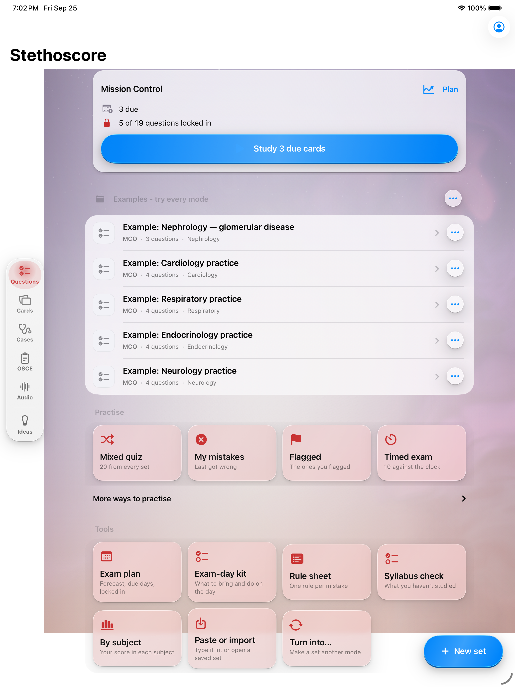

### ipad/4-upgrade-to-current: iPad Pro 13-inch (M5)

```
bundle=com.cramdown.personal exe=Stethoscore Personal
keep=1 args=
launch_status=0
pid=36127 alive_after_30s=yes
--- stderr.txt (last 25 of 1)
IOSurfaceClientSetSurfaceNotify failed e00002c7
--- log-process.txt: 30 matching lines (last 30)
2026-09-25 19:02:24.694 Df Stethoscore Personal[36127:1ae73] [com.apple.dt.xctest:Default] Registering for test daemon availability notify post.
2026-09-25 19:02:24.694 Df Stethoscore Personal[36127:1ae73] [com.apple.dt.xctest:Default] notify_get_state check indicated test daemon not ready.
2026-09-25 19:02:24.694 Df Stethoscore Personal[36127:1ae73] [com.apple.dt.xctest:Default] notify_get_state check indicated test daemon not ready.
2026-09-25 19:02:24.694 Df Stethoscore Personal[36127:1ae73] [com.apple.dt.xctest:Default] notify_get_state check indicated test daemon not ready.
2026-09-25 19:02:24.705 Df Stethoscore Personal[36127:1ae73] [com.apple.UIKit:KeyWindow] Setting default evaluation strategy for UIUserInterfaceIdiomPad to LastOneWins
2026-09-25 19:02:24.707 Df Stethoscore Personal[36127:1ae73] [com.apple.UIKit:KeyWindow] Setting default evaluation strategy for UIUserInterfaceIdiomPad to SystemShellManaged
2026-09-25 19:02:24.752 Df Stethoscore Personal[36127:1ae73] [com.apple.FileURL:default] kExcludedFromBackupXattrName set on path: /Users/runner/Library/Developer/CoreSimulator/Devices/A2011F14-88A1-46AA-999A-FD6FEDCD870B/data/Containers/Data/Application/2639F0F1-C64C-4BA4-B543-557F78E01229/Library/Application Support/RedPenBlobs
2026-09-25 19:02:25.769 I  Stethoscore Personal[36127:1ae73] [com.apple.DesignLibrary:defaults] liveTuning=false
2026-09-25 19:02:25.962 Df Stethoscore Personal[36127:1ae73] [PrototypeTools:domain] Not observing PTDefaults on customer install.
2026-09-25 19:02:26.047 Df Stethoscore Personal[36127:1aef5] [com.apple.calls.callkit:Default] Call host has no calls
2026-09-25 19:02:26.178 I  Stethoscore Personal[36127:1aef5] [com.apple.storekit:Default] AAFService Starting new XPCConnection 682c3510
2026-09-25 19:02:26.208 Df Stethoscore Personal[36127:1aef5] [com.apple.storekit:Default] [Default] Finished iterating transaction batches
2026-09-25 19:02:26.208 I  Stethoscore Personal[36127:1aef5] [com.apple.storekit:Default] AAFService Closing XPCConnection 682c3510
2026-09-25 19:02:26.233 Df Stethoscore Personal[36127:1aef5] [com.apple.storekit:Default] AAFService connection invalidated
2026-09-25 19:02:27.814 Df Stethoscore Personal[36127:1ae73] [com.apple.network:activity] Create activity from XPC object <nw_activity 50:1 [CB7E2A90-1E58-4C2D-B0CA-944165EEFB70] (reporting strategy default)>
2026-09-25 19:02:27.814 Df Stethoscore Personal[36127:1ae73] [com.apple.network:activity] Create activity from XPC object <nw_activity 50:2 [BE996AE6-403D-400C-9FD2-A023AC51D21E] (reporting strategy default)>
2026-09-25 19:02:27.814 Df Stethoscore Personal[36127:1ae73] [com.apple.network:activity] Set activity <nw_activity 50:1 [CB7E2A90-1E58-4C2D-B0CA-944165EEFB70] (reporting strategy default)> as the global parent
2026-09-25 19:02:27.878 I  Stethoscore Personal[36127:1aeca] [com.apple.storekit:Default] AAFService Starting new XPCConnection 20c26d80
2026-09-25 19:02:27.906 I  Stethoscore Personal[36127:1ae73] [com.apple.PointerUI:Common] Activating Connection: <BSXPC(com.apple.PointerUI.pointeruid.service[C:3-1])-as(com.apple.PointerUI.pointeruid.default-service):0x10668eee0 name=(null)>
2026-09-25 19:02:27.929 Df Stethoscore Personal[36127:1aef2] [com.apple.storekit:Default] [Default] Finished iterating transaction batches
2026-09-25 19:02:27.929 I  Stethoscore Personal[36127:1aef2] [com.apple.storekit:Default] AAFService Closing XPCConnection 20c26d80
2026-09-25 19:02:27.930 I  Stethoscore Personal[36127:1aeca] [com.apple.storekit:Default] AAFService Starting new XPCConnection 626554ca
2026-09-25 19:02:27.971 Df Stethoscore Personal[36127:1aec9] [com.apple.storekit:Default] [Default] Finished iterating transaction batches
2026-09-25 19:02:27.985 Df Stethoscore Personal[36127:1aef6] [com.apple.storekit:Default] AAFService connection invalidated
2026-09-25 19:02:29.882 I  Stethoscore Personal[36127:1aec9] [com.apple.storekit:Default] AAFService Closing XPCConnection 626554ca
2026-09-25 19:02:29.887 Df Stethoscore Personal[36127:1aec9] [com.apple.storekit:Default] Registering for 'transactionsupdated' daemon notification
2026-09-25 19:02:30.345 Df Stethoscore Personal[36127:1aec9] [com.apple.storekit:Default] AAFService connection invalidated
2026-09-25 19:02:30.640 Df Stethoscore Personal[36127:1ae73] [com.apple.network:activity] <nw_activity 50:1 [CB7E2A90-1E58-4C2D-B0CA-944165EEFB70] (global parent) (reporting strategy default) complete (reason success)> complete with reason 2 (success), duration 8061ms
2026-09-25 19:02:30.641 Df Stethoscore Personal[36127:1ae73] [com.apple.network:activity] <nw_activity 50:2 [BE996AE6-403D-400C-9FD2-A023AC51D21E] (reporting strategy default) complete (reason success)> complete with reason 2 (success), duration 8061ms
2026-09-25 19:02:30.641 Df Stethoscore Personal[36127:1ae73] [com.apple.network:activity] Unsetting the global parent activity <nw_activity 50:1 [CB7E2A90-1E58-4C2D-B0CA-944165EEFB70] (global parent) (reporting strategy default) complete (reason success)>
--- log-system.txt: 122 matching lines (last 30)
2026-09-25 19:02:22.224 Df splashboardd[26378:14036] [com.apple.SplashBoard:Capture] Updating window to <XBLaunchStateRequest: 0x1052491f0; groupID: com.cramdown.personal - {DEFAULT GROUP}; statusBar: normal; refSize: {1032, 1376}; naturalSize: {1376, 1032}; orientation: LandscapeLeft; userInterfaceStyle: Dark>
2026-09-25 19:02:22.337 Df SpringBoard[23233:1ab1e] [com.apple.SplashBoard:Capture] Image generation complete for: <XBLaunchStateRequest: 0x125d634f0; groupID: com.cramdown.personal - {DEFAULT GROUP}; statusBar: normal; refSize: {1032, 1376}; naturalSize: {1376, 1032}; orientation: LandscapeLeft; userInterfaceStyle: Dark>
```
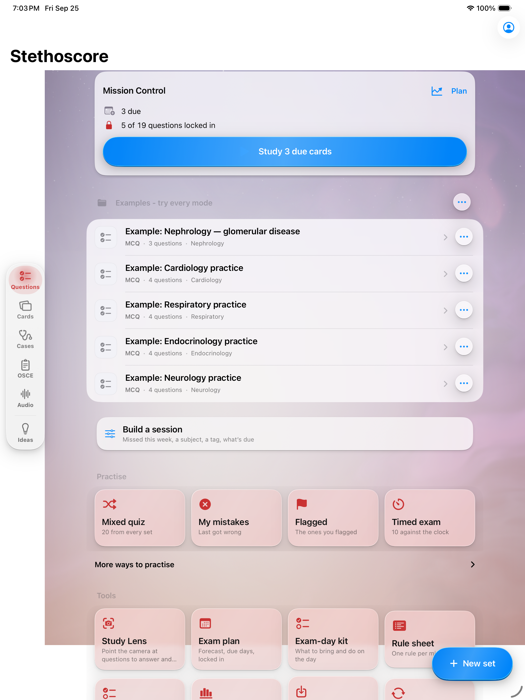

### iphone/1-fresh: iPhone 17 Pro

```
bundle=com.cramdown.personal exe=Stethoscore Personal
keep=0 args=
launch_status=0
pid=10662 alive_after_30s=yes
--- stderr.txt (last 25 of 1)
IOSurfaceClientSetSurfaceNotify failed e00002c7
--- log-process.txt: 20 matching lines (last 30)
2026-09-25 18:36:58.418 Df Stethoscore Personal[10662:89b8] [com.apple.dt.xctest:Default] Registering for test daemon availability notify post.
2026-09-25 18:36:58.418 Df Stethoscore Personal[10662:89b8] [com.apple.dt.xctest:Default] notify_get_state check indicated test daemon not ready.
2026-09-25 18:36:58.419 Df Stethoscore Personal[10662:89b8] [com.apple.dt.xctest:Default] notify_get_state check indicated test daemon not ready.
2026-09-25 18:36:58.419 Df Stethoscore Personal[10662:89b8] [com.apple.dt.xctest:Default] notify_get_state check indicated test daemon not ready.
2026-09-25 18:36:58.558 Df Stethoscore Personal[10662:89b8] [com.apple.FileURL:default] kExcludedFromBackupXattrName set on path: /Users/runner/Library/Developer/CoreSimulator/Devices/22452A91-4697-4369-8812-53ADB77EB73B/data/Containers/Data/Application/E2DA2118-A488-4EAE-9179-8A857A161E1D/Library/Application Support/RedPenBlobs
2026-09-25 18:36:58.602 Df Stethoscore Personal[10662:89b8] [com.apple.UIKit:KeyWindow] Setting default evaluation strategy for UIUserInterfaceIdiomPhone to LastOneWins
2026-09-25 18:36:58.602 Df Stethoscore Personal[10662:89b8] [com.apple.UIKit:KeyWindow] Setting default evaluation strategy for UIUserInterfaceIdiomPhone to SystemShellManaged
2026-09-25 18:36:59.595 Df Stethoscore Personal[10662:89b8] [PrototypeTools:domain] Not observing PTDefaults on customer install.
2026-09-25 18:37:01.155 Df Stethoscore Personal[10662:89b8] [com.apple.network:activity] Create activity from XPC object <nw_activity 50:1 [6324CCB5-8748-42A9-98B8-D3A0A4912E19] (reporting strategy default)>
2026-09-25 18:37:01.155 Df Stethoscore Personal[10662:89b8] [com.apple.network:activity] Create activity from XPC object <nw_activity 50:2 [FCDE1587-DBD1-4DC3-9B4E-4B8486AC3581] (reporting strategy default)>
2026-09-25 18:37:01.155 Df Stethoscore Personal[10662:89b8] [com.apple.network:activity] Set activity <nw_activity 50:1 [6324CCB5-8748-42A9-98B8-D3A0A4912E19] (reporting strategy default)> as the global parent
2026-09-25 18:37:02.138 Df Stethoscore Personal[10662:89ee] [com.apple.storekit:Default] [Default] Finished iterating transaction batches
2026-09-25 18:37:02.250 Df Stethoscore Personal[10662:89ee] [com.apple.storekit:Default] AAFService connection invalidated
2026-09-25 18:37:02.506 Df Stethoscore Personal[10662:8a36] [com.apple.storekit:Default] [Default] Finished iterating transaction batches
2026-09-25 18:37:02.621 Df Stethoscore Personal[10662:8a36] [com.apple.storekit:Default] Registering for 'transactionsupdated' daemon notification
2026-09-25 18:37:02.678 Df Stethoscore Personal[10662:89ee] [com.apple.storekit:Default] AAFService connection invalidated
2026-09-25 18:37:13.979 Df Stethoscore Personal[10662:89b8] [com.apple.network:activity] <nw_activity 50:1 [6324CCB5-8748-42A9-98B8-D3A0A4912E19] (global parent) (reporting strategy default) complete (reason failure)> complete with reason 3 (failure), duration 19161ms
2026-09-25 18:37:13.979 Df Stethoscore Personal[10662:89b8] [com.apple.network:activity] <nw_activity 50:2 [FCDE1587-DBD1-4DC3-9B4E-4B8486AC3581] (reporting strategy default) complete (reason failure)> complete with reason 3 (failure), duration 19161ms
2026-09-25 18:37:13.980 Df Stethoscore Personal[10662:89b8] [com.apple.network:activity] Unsetting the global parent activity <nw_activity 50:1 [6324CCB5-8748-42A9-98B8-D3A0A4912E19] (global parent) (reporting strategy default) complete (reason failure)>
2026-09-25 18:37:36.732 E  Stethoscore Personal[10662:89b8] [com.apple.UIKit:BackgroundTask] Background Task 3 ("Saving library"), was created over 30 seconds ago. In applications running in the background, this creates a risk of termination. Remember to call UIApplication.endBackgroundTask(_:) for your task in a timely manner to avoid this.
--- log-system.txt: 72 matching lines (last 30)
	retryTimeout: 120.000000 (default write com.apple.CoreSimulatorBridge LaunchRetryTimeout <value>)
	bootTimeout: 300.000000 (default write com.apple.CoreSimulatorBridge BootRetryTimeout <value>)
	bootLeeway: 120.000000 (default write com.apple.CoreSimulatorBridge BootLeeway <value>)
	Note: Use 'xcrun simctl spawn booted defaults write <domain> <key> <value>' to modify defaults in the booted Simulator device.
2026-09-25 18:36:37.280 Df CoreSimulatorBridge[8666:7fd5] [com.apple.FrontBoard:Common] FBSSystemAppProxy: Sending request to terminate application com.cramdown.personal
2026-09-25 18:36:39.587 Df SpringBoard[8635:82cc] [com.apple.UserNotifications:DataProviderFactory] [com.cramdown.personal] Application installed using default data provider
2026-09-25 18:36:41.219 Df searchd[8878:83aa] [com.apple.spotlight:default] Apps changed: (
2026-09-25 18:36:41.568 Df storekitd[10060:834e] [com.apple.storekit:Default] [Client] (com.cramdown.personal) Initialized with server Sandbox bundle ID com.cramdown.personal and request bundle ID com.cramdown.personal]
2026-09-25 18:36:52.897 Df SpringBoard[8635:798a] [com.apple.FrontBoard:Common] [FBSystemService] Request received from CoreSimulatorBr.8666 to terminate application com.cramdown.personal: "Termination requested by simulator host"
2026-09-25 18:36:52.985 Df biomed[8649:83c3] [com.apple.Biome:BiomeCascade] Creating dataResource: CCDataResource: file:///Users/runner/Library/Developer/CoreSimulator/Devices/22452A91-4697-4369-8812-53ADB77EB73B/data/Library/Biome/sets/Default/App.Shortcut.Phrase/sourceIdentifier=com.cramdown.personal/ in temporary path: /Users/runner/Library/Developer/CoreSimulator/Devices/22452A91-4697-4369-881
2026-09-25 18:36:52.986 Df splashboardd[10066:830b] [com.apple.SplashBoard:Capture] Updating window to <XBLaunchStateRequest: 0x1010dc070; groupID: com.cramdown.personal - {DEFAULT GROUP}; statusBar: normal; refSize: {402, 874}; orientation: Portrait; userInterfaceStyle: Light>
2026-09-25 18:36:52.997 Df biomed[8649:83c3] [com.apple.Biome:BiomeCascade] Successfully renamed temporary directory and moved to final path: /Users/runner/Library/Developer/CoreSimulator/Devices/22452A91-4697-4369-8812-53ADB77EB73B/data/Library/Biome/sets/Default/App.Shortcut.Phrase/sourceIdentifier=com.cramdown.personal/Database
```
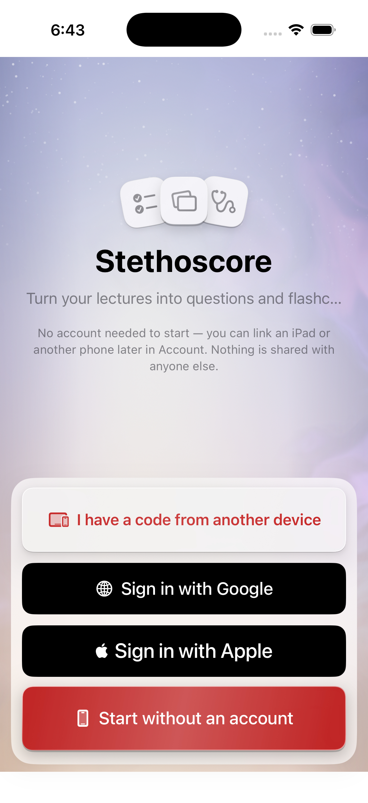

### iphone/2-signed-in: iPhone 17 Pro

```
bundle=com.cramdown.personal exe=Stethoscore Personal
keep=1 args=-launchTestSignedIn
launch_status=0
pid=14523 alive_after_30s=yes
--- stderr.txt (last 25 of 1)
IOSurfaceClientSetSurfaceNotify failed e00002c7
--- log-process.txt: 54 matching lines (last 30)
2026-09-25 18:44:42.098 Df Stethoscore Personal[14523:bcee] [com.apple.storekit:Default] [Default] Finished iterating transaction batches
2026-09-25 18:44:42.100 I  Stethoscore Personal[14523:bcee] [com.apple.storekit:Default] AAFService Closing XPCConnection 4741e6b4
2026-09-25 18:44:42.104 I  Stethoscore Personal[14523:bce8] [com.apple.storekit:Default] AAFService Starting new XPCConnection 0b844589
2026-09-25 18:44:42.175 Df Stethoscore Personal[14523:bcee] [com.apple.storekit:Default] [Default] Finished iterating transaction batches
2026-09-25 18:44:42.518 I  Stethoscore Personal[14523:bce8] [com.apple.storekit:Default] AAFService Closing XPCConnection 0b844589
2026-09-25 18:44:42.528 Df Stethoscore Personal[14523:bce8] [com.apple.storekit:Default] Registering for 'transactionsupdated' daemon notification
2026-09-25 18:44:42.687 Df Stethoscore Personal[14523:bcee] [com.apple.storekit:Default] AAFService connection invalidated
2026-09-25 18:44:42.741 Df Stethoscore Personal[14523:bcee] [com.apple.storekit:Default] AAFService connection invalidated
2026-09-25 18:44:43.060 Df Stethoscore Personal[14523:bcf0] [com.apple.CFNetwork:Default] Connection 1: enabling TLS
2026-09-25 18:44:43.060 Df Stethoscore Personal[14523:bcf0] [com.apple.CFNetwork:Default] Connection 1: starting, TC(0x0)
2026-09-25 18:44:43.106 Df Stethoscore Personal[14523:bce8] [com.apple.CFNetwork:Default] Garbage collection for alternative services
2026-09-25 18:44:43.393 Df Stethoscore Personal[14523:bcf0] [com.apple.CFNetwork:Default] Task <49CBA724-8DF6-4A7B-9EA5-BC22D4ED7AB7>.<1> setting up Connection 1
2026-09-25 18:44:43.597 Df Stethoscore Personal[14523:bd25] [com.apple.CFNetwork:Default] Connection 1: asked to evaluate TLS Trust
2026-09-25 18:44:43.601 Df Stethoscore Personal[14523:bd25] [com.apple.CFNetwork:Default] Task <49CBA724-8DF6-4A7B-9EA5-BC22D4ED7AB7>.<1> auth completion disp=1 cred=0x0
2026-09-25 18:44:43.699 Df Stethoscore Personal[14523:bd25] [com.apple.CFNetwork:Default] System Trust Evaluation yielded status(0)
2026-09-25 18:44:43.718 Df Stethoscore Personal[14523:bd25] [com.apple.CFNetwork:Default] Connection 1: TLS Trust result 0
2026-09-25 18:44:43.733 Df Stethoscore Personal[14523:bd25] [com.apple.network:boringssl] nw_protocol_boringssl_signal_connected(895) [C1.1.1:2][0x116ff39e0] TLS connected [server(0) version(0x0304) ciphersuite(TLS_AES_256_GCM_SHA384) group(0x11ec) signature_alg(0x0403) alpn(h2) resumed(0) offered_ticket(0) in_early_data(0) early_data_accepted(0) false_started(0) ocsp_received(0) sct_received(1) c
2026-09-25 18:44:43.756 Df Stethoscore Personal[14523:bd25] [com.apple.CFNetwork:Default] Connection 1: connected successfully
2026-09-25 18:44:43.756 Df Stethoscore Personal[14523:bd25] [com.apple.CFNetwork:Default] Connection 1: TLS handshake complete
2026-09-25 18:44:43.757 Df Stethoscore Personal[14523:bd25] [com.apple.CFNetwork:Default] Connection 1: ready C(N) E(N)
2026-09-25 18:44:43.768 Df Stethoscore Personal[14523:bd25] [com.apple.CFNetwork:Default] Task <49CBA724-8DF6-4A7B-9EA5-BC22D4ED7AB7>.<1> now using Connection 1
2026-09-25 18:44:43.769 Df Stethoscore Personal[14523:bd15] [com.apple.CFNetwork:Default] Task <49CBA724-8DF6-4A7B-9EA5-BC22D4ED7AB7>.<1> sent request, body S 2
2026-09-25 18:44:43.916 Df Stethoscore Personal[14523:bcf0] [com.apple.CFNetwork:Default] Task <49CBA724-8DF6-4A7B-9EA5-BC22D4ED7AB7>.<1> received response, status 200 content U
2026-09-25 18:44:43.916 Df Stethoscore Personal[14523:bcf0] [com.apple.CFNetwork:Default] Task <49CBA724-8DF6-4A7B-9EA5-BC22D4ED7AB7>.<1> done using Connection 1
2026-09-25 18:44:43.950 Df Stethoscore Personal[14523:bcf0] [com.apple.CFNetwork:Default] Task <49CBA724-8DF6-4A7B-9EA5-BC22D4ED7AB7>.<1> response ended
2026-09-25 18:44:43.953 Df Stethoscore Personal[14523:bcf0] [com.apple.CFNetwork:Default] Task <49CBA724-8DF6-4A7B-9EA5-BC22D4ED7AB7>.<1> finished successfully
2026-09-25 18:44:54.888 Df Stethoscore Personal[14523:bcf0] [com.apple.FileURL:default] kExcludedFromBackupXattrName set on path: /Users/runner/Library/Developer/CoreSimulator/Devices/22452A91-4697-4369-8812-53ADB77EB73B/data/Containers/Data/Application/3C119B47-9DE0-41B1-9FF5-A11CA90A5E18/Library/Application Support/RedPenSources
2026-09-25 18:45:03.581 Df Stethoscore Personal[14523:bc2c] [com.apple.network:activity] <nw_activity 50:1 [1F0E0DF7-3E99-4CE6-A74E-BB08C9F17E28] (global parent) (reporting strategy default) complete (reason failure)> complete with reason 3 (failure), duration 25548ms
2026-09-25 18:45:03.581 Df Stethoscore Personal[14523:bc2c] [com.apple.network:activity] <nw_activity 50:2 [4021E2E6-2613-4FBC-9E8C-56EEC0660D82] (reporting strategy default) complete (reason failure)> complete with reason 3 (failure), duration 25549ms
2026-09-25 18:45:03.581 Df Stethoscore Personal[14523:bc2c] [com.apple.network:activity] Unsetting the global parent activity <nw_activity 50:1 [1F0E0DF7-3E99-4CE6-A74E-BB08C9F17E28] (global parent) (reporting strategy default) complete (reason failure)>
--- log-system.txt: 81 matching lines (last 30)
2026-09-25 18:44:37.256 Df SpringBoard[8635:bb44] [com.apple.SplashBoard:Capture] Asynchronously generating image data for request: <XBLaunchStateRequest: 0x11bdca060; groupID: com.cramdown.personal - {DEFAULT GROUP}; statusBar: normal; refSize: {402, 874}; orientation: Portrait; userInterfaceStyle: Dark>
2026-09-25 18:44:37.256 Df SpringBoard[8635:b82c] [com.apple.SplashBoard:FileManifest] <XBApplicationSnapshotManifestImpl: 0x11832e800> [com.cramdown.personal] Snapshot data for <XBApplicationSnapshot: 0x11bfea680; …691D5F8F24CF> [com.cramdown.personal] written to file: /Users/runner/Library/Developer/CoreSimulator/Devices/22452A91-4697-4369-8812-53ADB77EB73B/data/Containers/Data/Application/3C119
```
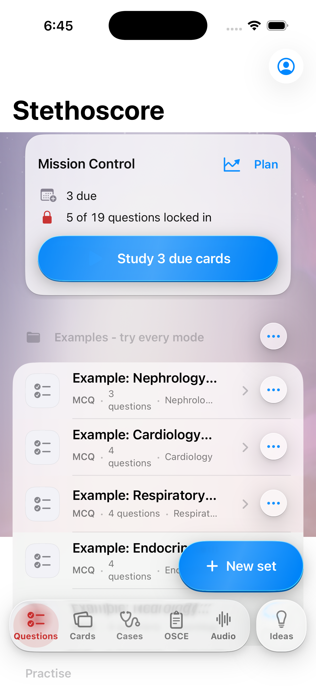

### iphone/3-relaunch: iPhone 17 Pro

```
bundle=com.cramdown.personal exe=Stethoscore Personal
keep=1 args=
launch_status=0
pid=16997 alive_after_30s=yes
--- stderr.txt (last 25 of 1)
IOSurfaceClientSetSurfaceNotify failed e00002c7
--- log-process.txt: 29 matching lines (last 30)
2026-09-25 18:45:52.399 Df Stethoscore Personal[16997:d56b] [com.apple.dt.xctest:Default] Registering for test daemon availability notify post.
2026-09-25 18:45:52.400 Df Stethoscore Personal[16997:d56b] [com.apple.dt.xctest:Default] notify_get_state check indicated test daemon not ready.
2026-09-25 18:45:52.400 Df Stethoscore Personal[16997:d56b] [com.apple.dt.xctest:Default] notify_get_state check indicated test daemon not ready.
2026-09-25 18:45:52.400 Df Stethoscore Personal[16997:d56b] [com.apple.dt.xctest:Default] notify_get_state check indicated test daemon not ready.
2026-09-25 18:45:52.472 Df Stethoscore Personal[16997:d56b] [com.apple.UIKit:KeyWindow] Setting default evaluation strategy for UIUserInterfaceIdiomPhone to LastOneWins
2026-09-25 18:45:52.473 Df Stethoscore Personal[16997:d56b] [com.apple.UIKit:KeyWindow] Setting default evaluation strategy for UIUserInterfaceIdiomPhone to SystemShellManaged
2026-09-25 18:45:52.505 Df Stethoscore Personal[16997:d56b] [com.apple.FileURL:default] kExcludedFromBackupXattrName set on path: /Users/runner/Library/Developer/CoreSimulator/Devices/22452A91-4697-4369-8812-53ADB77EB73B/data/Containers/Data/Application/6CB3BE6A-2774-4955-B10D-D9B147D3E133/Library/Application Support/RedPenBlobs
2026-09-25 18:45:53.196 I  Stethoscore Personal[16997:d56b] [com.apple.DesignLibrary:defaults] liveTuning=false
2026-09-25 18:45:53.318 Df Stethoscore Personal[16997:d56b] [PrototypeTools:domain] Not observing PTDefaults on customer install.
2026-09-25 18:45:53.406 Df Stethoscore Personal[16997:d57a] [com.apple.calls.callkit:Default] Call host has no calls
2026-09-25 18:45:53.524 I  Stethoscore Personal[16997:d580] [com.apple.storekit:Default] AAFService Starting new XPCConnection 45c07680
2026-09-25 18:45:53.548 Df Stethoscore Personal[16997:d580] [com.apple.storekit:Default] [Default] Finished iterating transaction batches
2026-09-25 18:45:53.548 I  Stethoscore Personal[16997:d57a] [com.apple.storekit:Default] AAFService Closing XPCConnection 45c07680
2026-09-25 18:45:53.548 Df Stethoscore Personal[16997:d57c] [com.apple.storekit:Default] AAFService connection invalidated
2026-09-25 18:45:54.361 Df Stethoscore Personal[16997:d56b] [com.apple.network:activity] Create activity from XPC object <nw_activity 50:1 [08C5B8C7-9F8F-49CB-ACC4-DAEAC4E3B9C1] (reporting strategy default)>
2026-09-25 18:45:54.361 Df Stethoscore Personal[16997:d56b] [com.apple.network:activity] Create activity from XPC object <nw_activity 50:2 [9D7B8F2E-96F9-4606-AFF0-D173EF327D47] (reporting strategy default)>
2026-09-25 18:45:54.361 Df Stethoscore Personal[16997:d56b] [com.apple.network:activity] Set activity <nw_activity 50:1 [08C5B8C7-9F8F-49CB-ACC4-DAEAC4E3B9C1] (reporting strategy default)> as the global parent
2026-09-25 18:45:54.408 I  Stethoscore Personal[16997:d57a] [com.apple.storekit:Default] AAFService Starting new XPCConnection f4e699ed
2026-09-25 18:45:54.437 Df Stethoscore Personal[16997:d57b] [com.apple.storekit:Default] [Default] Finished iterating transaction batches
2026-09-25 18:45:54.438 I  Stethoscore Personal[16997:d57b] [com.apple.storekit:Default] AAFService Closing XPCConnection f4e699ed
2026-09-25 18:45:54.438 I  Stethoscore Personal[16997:d57b] [com.apple.storekit:Default] AAFService Starting new XPCConnection cbb31a50
2026-09-25 18:45:54.466 Df Stethoscore Personal[16997:d57c] [com.apple.storekit:Default] [Default] Finished iterating transaction batches
2026-09-25 18:45:54.477 Df Stethoscore Personal[16997:d57b] [com.apple.storekit:Default] AAFService connection invalidated
2026-09-25 18:45:55.177 I  Stethoscore Personal[16997:d57c] [com.apple.storekit:Default] AAFService Closing XPCConnection cbb31a50
2026-09-25 18:45:55.201 Df Stethoscore Personal[16997:d57c] [com.apple.storekit:Default] Registering for 'transactionsupdated' daemon notification
2026-09-25 18:45:55.202 Df Stethoscore Personal[16997:d57b] [com.apple.storekit:Default] AAFService connection invalidated
2026-09-25 18:46:08.761 Df Stethoscore Personal[16997:d56b] [com.apple.network:activity] <nw_activity 50:1 [08C5B8C7-9F8F-49CB-ACC4-DAEAC4E3B9C1] (global parent) (reporting strategy default) complete (reason success)> complete with reason 2 (success), duration 17732ms
2026-09-25 18:46:08.762 Df Stethoscore Personal[16997:d56b] [com.apple.network:activity] <nw_activity 50:2 [9D7B8F2E-96F9-4606-AFF0-D173EF327D47] (reporting strategy default) complete (reason success)> complete with reason 2 (success), duration 17733ms
2026-09-25 18:46:08.762 Df Stethoscore Personal[16997:d56b] [com.apple.network:activity] Unsetting the global parent activity <nw_activity 50:1 [08C5B8C7-9F8F-49CB-ACC4-DAEAC4E3B9C1] (global parent) (reporting strategy default) complete (reason success)>
--- log-system.txt: 78 matching lines (last 30)
2026-09-25 18:45:49.931 Df SpringBoard[8635:d0ba] [com.apple.SplashBoard:Capture] Asynchronously generating image data for request: <XBLaunchStateRequest: 0x11bdc8380; groupID: com.cramdown.personal - {DEFAULT GROUP}; statusBar: normal; refSize: {402, 874}; orientation: Portrait; userInterfaceStyle: Light>
2026-09-25 18:45:49.965 Df splashboardd[10066:830b] [com.apple.SplashBoard:Capture] Updating window to <XBLaunchStateRequest: 0x1012493b0; groupID: com.cramdown.personal - {DEFAULT GROUP}; statusBar: normal; refSize: {402, 874}; orientation: Portrait; userInterfaceStyle: Light>
2026-09-25 18:45:50.208 Df SpringBoard[8635:d1fb] [com.apple.SplashBoard:Capture] Image generation complete for: <XBLaunchStateRequest: 0x11bdc8380; groupID: com.cramdown.personal - {DEFAULT GROUP}; statusBar: normal; refSize: {402, 874}; orientation: Portrait; userInterfaceStyle: Light>
```
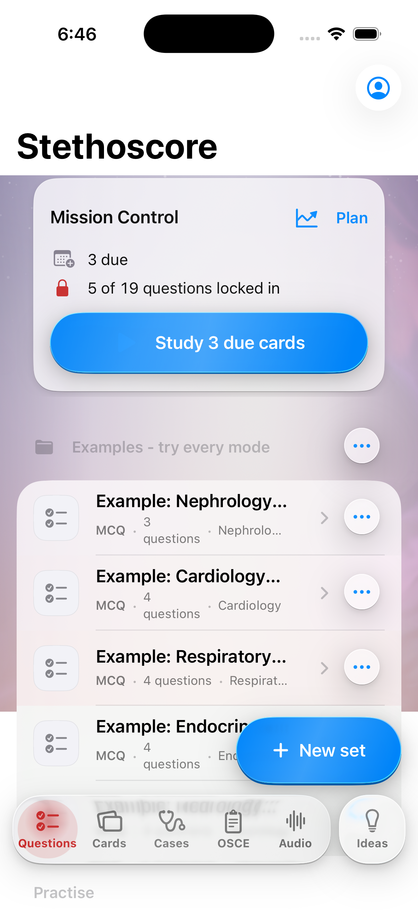

### iphone/4-upgrade-to-current: iPhone 17 Pro

```
bundle=com.cramdown.personal exe=Stethoscore Personal
keep=1 args=
launch_status=0
pid=19236 alive_after_30s=yes
--- stderr.txt (last 25 of 1)
IOSurfaceClientSetSurfaceNotify failed e00002c7
--- log-process.txt: 26 matching lines (last 30)
2026-09-25 18:47:25.178 Df Stethoscore Personal[19236:ebfb] [com.apple.dt.xctest:Default] Registering for test daemon availability notify post.
2026-09-25 18:47:25.179 Df Stethoscore Personal[19236:ebfb] [com.apple.dt.xctest:Default] notify_get_state check indicated test daemon not ready.
2026-09-25 18:47:25.179 Df Stethoscore Personal[19236:ebfb] [com.apple.dt.xctest:Default] notify_get_state check indicated test daemon not ready.
2026-09-25 18:47:25.180 Df Stethoscore Personal[19236:ebfb] [com.apple.dt.xctest:Default] notify_get_state check indicated test daemon not ready.
2026-09-25 18:47:25.297 Df Stethoscore Personal[19236:ebfb] [com.apple.FileURL:default] kExcludedFromBackupXattrName set on path: /Users/runner/Library/Developer/CoreSimulator/Devices/22452A91-4697-4369-8812-53ADB77EB73B/data/Containers/Data/Application/BA56CA4E-FC02-4C30-B50D-A34EE9A99882/Library/Application Support/RedPenBlobs
2026-09-25 18:47:25.426 Df Stethoscore Personal[19236:ebfb] [com.apple.UIKit:KeyWindow] Setting default evaluation strategy for UIUserInterfaceIdiomPhone to LastOneWins
2026-09-25 18:47:25.426 Df Stethoscore Personal[19236:ebfb] [com.apple.UIKit:KeyWindow] Setting default evaluation strategy for UIUserInterfaceIdiomPhone to SystemShellManaged
2026-09-25 18:47:26.313 I  Stethoscore Personal[19236:ebfb] [com.apple.DesignLibrary:defaults] liveTuning=false
2026-09-25 18:47:26.574 Df Stethoscore Personal[19236:ebfb] [PrototypeTools:domain] Not observing PTDefaults on customer install.
2026-09-25 18:47:26.777 Df Stethoscore Personal[19236:ec7b] [com.apple.calls.callkit:Default] Call host has no calls
2026-09-25 18:47:26.990 I  Stethoscore Personal[19236:ec78] [com.apple.storekit:Default] AAFService Starting new XPCConnection 5957d159
2026-09-25 18:47:28.076 Df Stethoscore Personal[19236:ebfb] [com.apple.network:activity] Create activity from XPC object <nw_activity 50:1 [0EF37670-E2A4-431C-821A-6478462B5A9A] (reporting strategy default)>
2026-09-25 18:47:28.076 Df Stethoscore Personal[19236:ebfb] [com.apple.network:activity] Create activity from XPC object <nw_activity 50:2 [1170DE89-435B-478E-85CC-B13C92242B7D] (reporting strategy default)>
2026-09-25 18:47:28.076 Df Stethoscore Personal[19236:ebfb] [com.apple.network:activity] Set activity <nw_activity 50:1 [0EF37670-E2A4-431C-821A-6478462B5A9A] (reporting strategy default)> as the global parent
2026-09-25 18:47:28.641 Df Stethoscore Personal[19236:ec7b] [com.apple.storekit:Default] [Default] Finished iterating transaction batches
2026-09-25 18:47:28.641 Df Stethoscore Personal[19236:ec7b] [com.apple.storekit:Default] [Default] Finished iterating transaction batches
2026-09-25 18:47:28.642 I  Stethoscore Personal[19236:ec6b] [com.apple.storekit:Default] AAFService Closing XPCConnection 5957d159
2026-09-25 18:47:28.642 Df Stethoscore Personal[19236:ec7b] [com.apple.storekit:Default] AAFService connection invalidated
2026-09-25 18:47:28.643 I  Stethoscore Personal[19236:eca4] [com.apple.storekit:Default] AAFService Starting new XPCConnection de254563
2026-09-25 18:47:28.655 Df Stethoscore Personal[19236:ec6b] [com.apple.storekit:Default] [Default] Finished iterating transaction batches
2026-09-25 18:47:28.896 I  Stethoscore Personal[19236:eca4] [com.apple.storekit:Default] AAFService Closing XPCConnection de254563
2026-09-25 18:47:28.903 Df Stethoscore Personal[19236:eca4] [com.apple.storekit:Default] Registering for 'transactionsupdated' daemon notification
2026-09-25 18:47:28.907 Df Stethoscore Personal[19236:ec6b] [com.apple.storekit:Default] AAFService connection invalidated
2026-09-25 18:47:45.708 Df Stethoscore Personal[19236:ebfb] [com.apple.network:activity] <nw_activity 50:1 [0EF37670-E2A4-431C-821A-6478462B5A9A] (global parent) (reporting strategy default) complete (reason failure)> complete with reason 3 (failure), duration 23553ms
2026-09-25 18:47:45.708 Df Stethoscore Personal[19236:ebfb] [com.apple.network:activity] <nw_activity 50:2 [1170DE89-435B-478E-85CC-B13C92242B7D] (reporting strategy default) complete (reason failure)> complete with reason 3 (failure), duration 23553ms
2026-09-25 18:47:45.708 Df Stethoscore Personal[19236:ebfb] [com.apple.network:activity] Unsetting the global parent activity <nw_activity 50:1 [0EF37670-E2A4-431C-821A-6478462B5A9A] (global parent) (reporting strategy default) complete (reason failure)>
--- log-system.txt: 80 matching lines (last 30)
2026-09-25 18:47:20.944 Df SpringBoard[8635:e922] [com.apple.SplashBoard:Capture] Image generation complete for: <XBLaunchStateRequest: 0x1214d27d0; groupID: com.cramdown.personal - {DEFAULT GROUP}; statusBar: normal; refSize: {402, 874}; orientation: Portrait; userInterfaceStyle: Light>
2026-09-25 18:47:20.944 Df SpringBoard[8635:e6cd] [com.apple.SplashBoard:Capture] Asynchronously generating image data for request: <XBLaunchStateRequest: 0x1214d1dc0; groupID: com.cramdown.personal - {DEFAULT GROUP}; statusBar: normal; refSize: {402, 874}; orientation: Portrait; userInterfaceStyle: Dark>
2026-09-25 18:47:20.944 Df SpringBoard[8635:eb84] [com.apple.SplashBoard:FileManifest] <XBApplicationSnapshotManifestImpl: 0x1182dad80> [com.cramdown.personal] Snapshot data for <XBApplicationSnapshot: 0x11a7d4700; …B3F4CA5D3052> [com.cramdown.personal] written to file: /Users/runner/Library/Developer/CoreSimulator/Devices/22452A91-4697-4369-8812-53ADB77EB73B/data/Containers/Data/Application/BA56C
2026-09-25 18:47:20.948 Df splashboardd[10066:830b] [com.apple.SplashBoard:Capture] Updating window to <XBLaunchStateRequest: 0x10124a300; groupID: com.cramdown.personal - {DEFAULT GROUP}; statusBar: normal; refSize: {402, 874}; orientation: Portrait; userInterfaceStyle: Dark>
2026-09-25 18:47:20.964 Df SpringBoard[8635:e922] [com.apple.UserNotifications:DataProviderFactory] [com.cramdown.personal] Application installed using default data provider
2026-09-25 18:47:21.082 Df SpringBoard[8635:eb84] [com.apple.SplashBoard:FileManifest] <XBApplicationSnapshotManifestImpl: 0x1182dad80> [com.cramdown.personal] Snapshot data for <XBApplicationSnapshot: 0x11a7d4000; …8E3EAD51999A> [com.cramdown.personal] written to file: /Users/runner/Library/Developer/CoreSimulator/Devices/22452A91-4697-4369-8812-53ADB77EB73B/data/Containers/Data/Application/BA56C
```


### iphone/5-other-bundle-id: iPhone 17 Pro

```
bundle=swift-playgrounds-dev-run.launchtest exe=Stethoscore Personal
keep=0 args=-launchTestSignedIn
launch_status=0
pid=21228 alive_after_30s=yes
--- stderr.txt (last 25 of 1)
IOSurfaceClientSetSurfaceNotify failed e00002c7
--- log-process.txt: 54 matching lines (last 30)
2026-09-25 18:48:27.380 Df Stethoscore Personal[21228:1001e] [com.apple.CFNetwork:Default] Creating default cookie storage with process/bundle identifier
2026-09-25 18:48:27.387 Df Stethoscore Personal[21228:1001e] [com.apple.CFNetwork:Default] Initializing AlternativeServices Storage singleton
2026-09-25 18:48:27.388 Df Stethoscore Personal[21228:1001e] [com.apple.FileURL:default] kExcludedFromBackupXattrName set on path: /Users/runner/Library/Developer/CoreSimulator/Devices/22452A91-4697-4369-8812-53ADB77EB73B/data/Containers/Data/Application/9FED778E-9209-4676-B7D7-6F7EC684EC51/Library/HTTPStorages/swift-playgrounds-dev-run.launchtest
2026-09-25 18:48:27.497 Df Stethoscore Personal[21228:1001e] [com.apple.CFNetwork:Default] Connection 1: enabling TLS
2026-09-25 18:48:27.497 Df Stethoscore Personal[21228:1001e] [com.apple.CFNetwork:Default] Connection 1: starting, TC(0x0)
2026-09-25 18:48:27.542 Df Stethoscore Personal[21228:1001e] [com.apple.CFNetwork:Default] Task <78689F04-FF86-4B6E-9A7B-62C9E09EAAB2>.<1> setting up Connection 1
2026-09-25 18:48:27.720 Df Stethoscore Personal[21228:1001f] [com.apple.CFNetwork:Default] Connection 1: asked to evaluate TLS Trust
2026-09-25 18:48:27.724 Df Stethoscore Personal[21228:1001f] [com.apple.CFNetwork:Default] Task <78689F04-FF86-4B6E-9A7B-62C9E09EAAB2>.<1> auth completion disp=1 cred=0x0
2026-09-25 18:48:27.740 Df Stethoscore Personal[21228:1001f] [com.apple.CFNetwork:Default] System Trust Evaluation yielded status(0)
2026-09-25 18:48:27.751 Df Stethoscore Personal[21228:10022] [com.apple.CFNetwork:Default] Connection 1: TLS Trust result 0
2026-09-25 18:48:27.772 Df Stethoscore Personal[21228:10022] [com.apple.network:boringssl] nw_protocol_boringssl_signal_connected(895) [C1.1.1:2][0x114dc47e0] TLS connected [server(0) version(0x0304) ciphersuite(TLS_AES_256_GCM_SHA384) group(0x11ec) signature_alg(0x0403) alpn(h2) resumed(0) offered_ticket(0) in_early_data(0) early_data_accepted(0) false_started(0) ocsp_received(0) sct_received(1) 
2026-09-25 18:48:27.783 Df Stethoscore Personal[21228:10022] [com.apple.CFNetwork:Default] Connection 1: connected successfully
2026-09-25 18:48:27.783 Df Stethoscore Personal[21228:10022] [com.apple.CFNetwork:Default] Connection 1: TLS handshake complete
2026-09-25 18:48:27.784 Df Stethoscore Personal[21228:10022] [com.apple.CFNetwork:Default] Connection 1: ready C(N) E(N)
2026-09-25 18:48:27.796 Df Stethoscore Personal[21228:10022] [com.apple.CFNetwork:Default] Task <78689F04-FF86-4B6E-9A7B-62C9E09EAAB2>.<1> now using Connection 1
2026-09-25 18:48:27.797 Df Stethoscore Personal[21228:10022] [com.apple.CFNetwork:Default] Task <78689F04-FF86-4B6E-9A7B-62C9E09EAAB2>.<1> sent request, body S 2
2026-09-25 18:48:27.893 Df Stethoscore Personal[21228:1001f] [com.apple.CFNetwork:Default] Task <78689F04-FF86-4B6E-9A7B-62C9E09EAAB2>.<1> received response, status 200 content U
2026-09-25 18:48:27.893 Df Stethoscore Personal[21228:1001f] [com.apple.CFNetwork:Default] Task <78689F04-FF86-4B6E-9A7B-62C9E09EAAB2>.<1> done using Connection 1
2026-09-25 18:48:27.902 I  Stethoscore Personal[21228:1001d] [com.apple.storekit:Default] AAFService Starting new XPCConnection b0a95eac
2026-09-25 18:48:27.930 Df Stethoscore Personal[21228:1001d] [com.apple.storekit:Default] [Default] Finished iterating transaction batches
2026-09-25 18:48:27.962 I  Stethoscore Personal[21228:1001d] [com.apple.storekit:Default] AAFService Closing XPCConnection b0a95eac
2026-09-25 18:48:27.970 Df Stethoscore Personal[21228:10022] [com.apple.storekit:Default] Registering for 'transactionsupdated' daemon notification
2026-09-25 18:48:27.999 Df Stethoscore Personal[21228:10022] [com.apple.storekit:Default] AAFService connection invalidated
2026-09-25 18:48:28.101 Df Stethoscore Personal[21228:1001f] [com.apple.CFNetwork:Default] Task <78689F04-FF86-4B6E-9A7B-62C9E09EAAB2>.<1> response ended
2026-09-25 18:48:28.103 Df Stethoscore Personal[21228:1001f] [com.apple.CFNetwork:Default] Task <78689F04-FF86-4B6E-9A7B-62C9E09EAAB2>.<1> finished successfully
2026-09-25 18:48:28.827 Df Stethoscore Personal[21228:1001f] [com.apple.CFNetwork:Default] Garbage collection for alternative services
2026-09-25 18:48:33.852 Df Stethoscore Personal[21228:ffdc] [com.apple.network:activity] <nw_activity 50:1 [545A7B49-424A-4914-9C04-35A97C238E41] (global parent) (reporting strategy default) complete (reason success)> complete with reason 2 (success), duration 11644ms
2026-09-25 18:48:33.852 Df Stethoscore Personal[21228:ffdc] [com.apple.network:activity] <nw_activity 50:2 [2BB6FBC3-6A68-42F8-8B8A-9735C5E7B606] (reporting strategy default) complete (reason success)> complete with reason 2 (success), duration 11644ms
2026-09-25 18:48:33.852 Df Stethoscore Personal[21228:ffdc] [com.apple.network:activity] Unsetting the global parent activity <nw_activity 50:1 [545A7B49-424A-4914-9C04-35A97C238E41] (global parent) (reporting strategy default) complete (reason success)>
2026-09-25 18:48:45.269 Df Stethoscore Personal[21228:1001f] [com.apple.FileURL:default] kExcludedFromBackupXattrName set on path: /Users/runner/Library/Developer/CoreSimulator/Devices/22452A91-4697-4369-8812-53ADB77EB73B/data/Containers/Data/Application/9FED778E-9209-4676-B7D7-6F7EC684EC51/Library/Application Support/RedPenSources
--- log-system.txt: 73 matching lines (last 30)
2026-09-25 18:48:21.599 Df SpringBoard[8635:feb2] [com.apple.UserNotifications:DataProviderFactory] [swift-playgrounds-dev-run.launchtest] Application installed using default data provider
2026-09-25 18:48:21.657 Df SpringBoard[8635:feb8] [com.apple.SplashBoard:Capture] Image generation complete for: <XBLaunchStateRequest: 0x1214d3480; groupID: swift-playgrounds-dev-run.launchtest - {DEFAULT GROUP}; statusBar: normal; refSize: {402, 874}; orientation: Portrait; userInterfaceStyle: Dark>
```
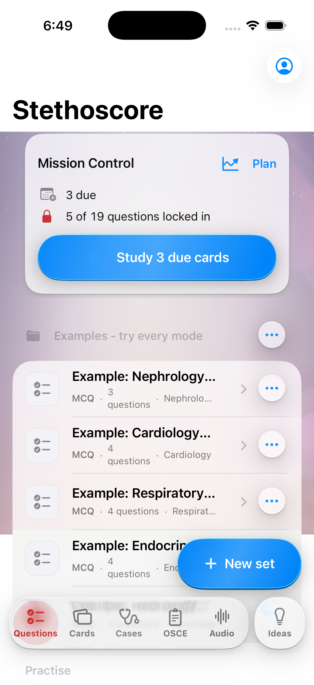
