# Playgrounds launch

Commit 3bc4078eea3a93baba725e59470b51a67b4ec035 (ci/launch), run 36828873787.

## current-core

```
iphone/1-fresh=0
iphone/2-signed-in=0
iphone/3-relaunch=0
iphone/6-open-every-set=0
iphone/5-other-bundle-id=0
ipad/1-fresh=0
ipad/2-signed-in=0
ipad/3-relaunch=0
ipad/6-open-every-set=0
```

### ipad/1-fresh: iPad Pro 13-inch (M5)

```
bundle=com.cramdown.personal exe=Stethoscore Personal
keep=0 args=
launch_status=0
peak_rss_mb=105
pid=24946 alive_after_30s=yes
MobileCal-2026-10-01-074455.ips
UsageTrackingAgent-2026-10-01-073946.ips
--- stderr.txt (last 25 of 1)
IOSurfaceClientSetSurfaceNotify failed e00002c7
--- log-process.txt: 20 matching lines (last 30)
2026-10-01 07:40:20.169 Df Stethoscore Personal[24946:12c59] [com.apple.dt.xctest:Default] Registering for test daemon availability notify post.
2026-10-01 07:40:20.169 Df Stethoscore Personal[24946:12c59] [com.apple.dt.xctest:Default] notify_get_state check indicated test daemon not ready.
2026-10-01 07:40:20.170 Df Stethoscore Personal[24946:12c59] [com.apple.dt.xctest:Default] notify_get_state check indicated test daemon not ready.
2026-10-01 07:40:20.170 Df Stethoscore Personal[24946:12c59] [com.apple.dt.xctest:Default] notify_get_state check indicated test daemon not ready.
2026-10-01 07:40:20.250 Df Stethoscore Personal[24946:12c59] [com.apple.FileURL:default] kExcludedFromBackupXattrName set on path: /Users/runner/Library/Developer/CoreSimulator/Devices/A2011F14-88A1-46AA-999A-FD6FEDCD870B/data/Containers/Data/Application/D72183A4-5DDF-425D-8236-A236462F0AC1/Library/Application Support/RedPenBlobs
2026-10-01 07:40:20.417 Df Stethoscore Personal[24946:12c59] [com.apple.UIKit:KeyWindow] Setting default evaluation strategy for UIUserInterfaceIdiomPad to LastOneWins
2026-10-01 07:40:20.418 Df Stethoscore Personal[24946:12c59] [com.apple.UIKit:KeyWindow] Setting default evaluation strategy for UIUserInterfaceIdiomPad to SystemShellManaged
2026-10-01 07:40:21.058 Df Stethoscore Personal[24946:12c59] [PrototypeTools:domain] Not observing PTDefaults on customer install.
2026-10-01 07:40:22.466 Df Stethoscore Personal[24946:12c59] [com.apple.network:activity] Create activity from XPC object <nw_activity 50:1 [1930F6E1-3505-4FA9-968E-06D71E7DBD4C] (reporting strategy default)>
2026-10-01 07:40:22.466 Df Stethoscore Personal[24946:12c59] [com.apple.network:activity] Create activity from XPC object <nw_activity 50:2 [BA8EC186-CA7B-40C6-8616-6E32B672C23A] (reporting strategy default)>
2026-10-01 07:40:22.469 Df Stethoscore Personal[24946:12c59] [com.apple.network:activity] Set activity <nw_activity 50:1 [1930F6E1-3505-4FA9-968E-06D71E7DBD4C] (reporting strategy default)> as the global parent
2026-10-01 07:40:22.972 Df Stethoscore Personal[24946:12cac] [com.apple.storekit:Default] [Default] Finished iterating transaction batches
2026-10-01 07:40:22.974 Df Stethoscore Personal[24946:12cac] [com.apple.storekit:Default] AAFService connection invalidated
2026-10-01 07:40:23.919 Df Stethoscore Personal[24946:12cb3] [com.apple.storekit:Default] [Default] Finished iterating transaction batches
2026-10-01 07:40:24.175 Df Stethoscore Personal[24946:12cbb] [com.apple.storekit:Default] AAFService connection invalidated
2026-10-01 07:40:24.200 Df Stethoscore Personal[24946:12cb3] [com.apple.storekit:Default] Registering for 'transactionsupdated' daemon notification
2026-10-01 07:40:25.656 Df Stethoscore Personal[24946:12c59] [com.apple.network:activity] <nw_activity 50:1 [1930F6E1-3505-4FA9-968E-06D71E7DBD4C] (global parent) (reporting strategy default) complete (reason success)> complete with reason 2 (success), duration 9844ms
2026-10-01 07:40:25.657 Df Stethoscore Personal[24946:12c59] [com.apple.network:activity] <nw_activity 50:2 [BA8EC186-CA7B-40C6-8616-6E32B672C23A] (reporting strategy default) complete (reason success)> complete with reason 2 (success), duration 9844ms
2026-10-01 07:40:25.657 Df Stethoscore Personal[24946:12c59] [com.apple.network:activity] Unsetting the global parent activity <nw_activity 50:1 [1930F6E1-3505-4FA9-968E-06D71E7DBD4C] (global parent) (reporting strategy default) complete (reason success)>
2026-10-01 07:40:58.627 E  Stethoscore Personal[24946:12c59] [com.apple.UIKit:BackgroundTask] Background Task 3 ("Saving library"), was created over 30 seconds ago. In applications running in the background, this creates a risk of termination. Remember to call UIApplication.endBackgroundTask(_:) for your task in a timely manner to avoid this.
--- log-system.txt: 100 matching lines (last 30)
2026-10-01 07:40:16.856 Df splashboardd[24053:122c1] [com.apple.SplashBoard:Capture] Updating window to <XBLaunchStateRequest: 0x101a28380; groupID: com.cramdown.personal - {DEFAULT GROUP}; statusBar: normal; refSize: {375, 1376}; orientation: Portrait; userInterfaceStyle: Dark>
2026-10-01 07:40:16.883 Df SpringBoard[22302:11417] [com.apple.SplashBoard:Capture] Image generation complete for: <XBLaunchStateRequest: 0x11ce34380; groupID: com.cramdown.personal - {DEFAULT GROUP}; statusBar: normal; refSize: {375, 1376}; orientation: Portrait; userInterfaceStyle: Dark>
2026-10-01 07:40:16.883 Df SpringBoard[22302:11b6b] [com.apple.SplashBoard:Capture] Asynchronously generating image data for request: <XBLaunchStateRequest: 0x11ce35340; groupID: com.cramdown.personal - {DEFAULT GROUP}; statusBar: normal; refSize: {1032, 1376}; naturalSize: {1376, 1032}; orientation: LandscapeLeft; userInterfaceStyle: Light>
2026-10-01 07:40:16.883 Df SpringBoard[22302:12c1f] [com.apple.SplashBoard:FileManifest] <XBApplicationSnapshotManifestImpl: 0x119c0f280> [com.cramdown.personal] Snapshot data for <XBApplicationSnapshot: 0x11cefa300; …1007415761E8> [com.cramdown.personal] written to file: /Users/runner/Library/Developer/CoreSimulator/Devices/A2011F14-88A1-46AA-999A-FD6FEDCD870B/data/Containers/Data/Application/D72
2026-10-01 07:40:16.884 Df splashboardd[24053:122c1] [com.apple.SplashBoard:Capture] Updating window to <XBLaunchStateRequest: 0x101a283f0; groupID: com.cramdown.personal - {DEFAULT GROUP}; statusBar: normal; refSize: {1032, 1376}; naturalSize: {1376, 1032}; orientation: LandscapeLeft; userInterfaceStyle: Light>
2026-10-01 07:40:17.075 Df SpringBoard[22302:11b79] [com.apple.SplashBoard:FileManifest] <XBApplicationSnapshotManifestImpl: 0x119c0f280> [com.cramdown.personal] Snapshot data for <XBApplicationSnapshot: 0x11cefa140; …C79DA4F2D775> [com.cramdown.personal] written to file: /Users/runner/Library/Developer/CoreSimulator/Devices/A2011F14-88A1-46AA-999A-FD6FEDCD870B/data/Containers/Data/Application/D72
2026-10-01 07:40:17.083 Df SpringBoard[22302:11b79] [com.apple.SplashBoard:Capture] Image generation complete for: <XBLaunchStateRequest: 0x11ce35340; groupID: com.cramdown.personal - {DEFAULT GROUP}; statusBar: normal; refSize: {1032, 1376}; naturalSize: {1376, 1032}; orientation: LandscapeLeft; userInterfaceStyle: Light>
2026-10-01 07:40:17.084 Df SpringBoard[22302:11b6b] [com.apple.SplashBoard:Capture] Asynchronously generating image data for request: <XBLaunchStateRequest: 0x11ce37560; groupID: com.cramdown.personal - {DEFAULT GROUP}; statusBar: normal; refSize: {1032, 375}; naturalSize: {375, 1032}; orientation: LandscapeLeft; userInterfaceStyle: Light>
2026-10-01 07:40:17.085 Df splashboardd[24053:122c1] [com.apple.SplashBoard:Capture] Updating window to <XBLaunchStateRequest: 0x101a28380; groupID: com.cramdown.personal - {DEFAULT GROUP}; statusBar: normal; refSize: {1032, 375}; naturalSize: {375, 1032}; orientation: LandscapeLeft; userInterfaceStyle: Light>
```
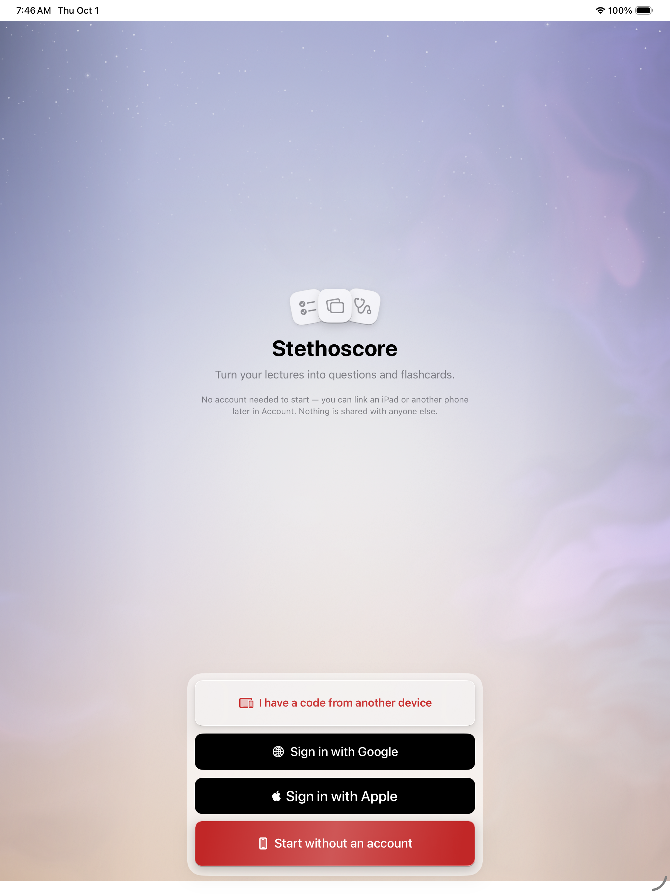

### ipad/2-signed-in: iPad Pro 13-inch (M5)

```
bundle=com.cramdown.personal exe=Stethoscore Personal
keep=1 args=-launchTestSignedIn
launch_status=0
peak_rss_mb=382
pid=29995 alive_after_30s=yes
--- stderr.txt (last 25 of 1)
IOSurfaceClientSetSurfaceNotify failed e00002c7
--- log-process.txt: 56 matching lines (last 30)
2026-10-01 07:51:44.715 I  Stethoscore Personal[29995:16efa] [com.apple.PointerUI:Common] Activating Connection: <BSXPC(com.apple.PointerUI.pointeruid.service[C:3-1])-as(com.apple.PointerUI.pointeruid.default-service):0x1025bb1b0 name=(null)>
2026-10-01 07:51:44.771 Df Stethoscore Personal[29995:17086] [com.apple.CFNetwork:Default] Task <7E5765E8-65D8-4DFF-A524-DC52941B19AA>.<1> resuming, timeouts(180.0, 604800.0) qos(0x19) voucher((null)) activity(00000000-0000-0000-0000-000000000000)
2026-10-01 07:51:44.847 Df Stethoscore Personal[29995:17086] [com.apple.CFNetwork:Default] Initializing NSHTTPCookieStorage singleton
2026-10-01 07:51:44.849 Df Stethoscore Personal[29995:17086] [com.apple.CFNetwork:Default] Initializing CFHTTPCookieStorage singleton
2026-10-01 07:51:44.849 Df Stethoscore Personal[29995:17086] [com.apple.CFNetwork:Default] Creating default cookie storage with process/bundle identifier
2026-10-01 07:51:44.859 Df Stethoscore Personal[29995:17086] [com.apple.CFNetwork:Default] Initializing AlternativeServices Storage singleton
2026-10-01 07:51:44.861 Df Stethoscore Personal[29995:17086] [com.apple.FileURL:default] kExcludedFromBackupXattrName set on path: /Users/runner/Library/Developer/CoreSimulator/Devices/A2011F14-88A1-46AA-999A-FD6FEDCD870B/data/Containers/Data/Application/0D554BA5-346D-486B-988A-1677E9BBC9C1/Library/HTTPStorages/com.cramdown.personal
2026-10-01 07:51:44.875 Df Stethoscore Personal[29995:17086] [com.apple.CFNetwork:Default] Connection 0: creating secure tcp or quic connection
2026-10-01 07:51:44.889 Df Stethoscore Personal[29995:17086] [com.apple.CFNetwork:Default] Connection 1: enabling TLS
2026-10-01 07:51:44.893 Df Stethoscore Personal[29995:17086] [com.apple.CFNetwork:Default] Connection 1: starting, TC(0x0)
2026-10-01 07:51:44.932 Df Stethoscore Personal[29995:17086] [com.apple.CFNetwork:Default] Task <7E5765E8-65D8-4DFF-A524-DC52941B19AA>.<1> setting up Connection 1
2026-10-01 07:51:44.968 Df Stethoscore Personal[29995:1703a] [com.apple.CFNetwork:Default] Connection 1: asked to evaluate TLS Trust
2026-10-01 07:51:44.970 Df Stethoscore Personal[29995:1703a] [com.apple.CFNetwork:Default] Task <7E5765E8-65D8-4DFF-A524-DC52941B19AA>.<1> auth completion disp=1 cred=0x0
2026-10-01 07:51:45.087 Df Stethoscore Personal[29995:17066] [com.apple.CFNetwork:Default] System Trust Evaluation yielded status(0)
2026-10-01 07:51:45.096 Df Stethoscore Personal[29995:16f5c] [com.apple.CFNetwork:Default] Connection 1: TLS Trust result 0
2026-10-01 07:51:45.099 Df Stethoscore Personal[29995:16f5c] [com.apple.network:boringssl] nw_protocol_boringssl_signal_connected(895) [C1.1.1.1:2][0x1047e4a60] TLS connected [server(0) version(0x0304) ciphersuite(TLS_AES_256_GCM_SHA384) group(0x11ec) signature_alg(0x0403) alpn(h2) resumed(0) offered_ticket(0) in_early_data(0) early_data_accepted(0) false_started(0) ocsp_received(0) sct_received(1
2026-10-01 07:51:45.110 Df Stethoscore Personal[29995:16f5c] [com.apple.CFNetwork:Default] Connection 1: connected successfully
2026-10-01 07:51:45.112 Df Stethoscore Personal[29995:16f5c] [com.apple.CFNetwork:Default] Connection 1: TLS handshake complete
2026-10-01 07:51:45.113 Df Stethoscore Personal[29995:16f5c] [com.apple.CFNetwork:Default] Connection 1: ready C(N) E(N)
2026-10-01 07:51:45.117 Df Stethoscore Personal[29995:16f5c] [com.apple.CFNetwork:Default] Task <7E5765E8-65D8-4DFF-A524-DC52941B19AA>.<1> now using Connection 1
2026-10-01 07:51:45.118 Df Stethoscore Personal[29995:16f5c] [com.apple.CFNetwork:Default] Task <7E5765E8-65D8-4DFF-A524-DC52941B19AA>.<1> sent request, body S 2
2026-10-01 07:51:45.183 Df Stethoscore Personal[29995:17066] [com.apple.CFNetwork:Default] Task <7E5765E8-65D8-4DFF-A524-DC52941B19AA>.<1> received response, status 200 content U
2026-10-01 07:51:45.183 Df Stethoscore Personal[29995:17066] [com.apple.CFNetwork:Default] Task <7E5765E8-65D8-4DFF-A524-DC52941B19AA>.<1> done using Connection 1
2026-10-01 07:51:45.202 Df Stethoscore Personal[29995:17066] [com.apple.CFNetwork:Default] Task <7E5765E8-65D8-4DFF-A524-DC52941B19AA>.<1> response ended
2026-10-01 07:51:45.203 Df Stethoscore Personal[29995:17086] [com.apple.CFNetwork:Default] Task <7E5765E8-65D8-4DFF-A524-DC52941B19AA>.<1> finished successfully
2026-10-01 07:51:46.345 Df Stethoscore Personal[29995:17066] [com.apple.CFNetwork:Default] Garbage collection for alternative services
2026-10-01 07:51:50.333 Df Stethoscore Personal[29995:16efa] [com.apple.network:activity] <nw_activity 50:1 [73005B17-CF49-40AF-84F4-B3D999C414C4] (global parent) (reporting strategy default) complete (reason success)> complete with reason 2 (success), duration 11817ms
2026-10-01 07:51:50.333 Df Stethoscore Personal[29995:16efa] [com.apple.network:activity] <nw_activity 50:2 [F33B0169-5A45-40D2-BB2E-2E8D992DF367] (reporting strategy default) complete (reason success)> complete with reason 2 (success), duration 11817ms
2026-10-01 07:51:50.333 Df Stethoscore Personal[29995:16efa] [com.apple.network:activity] Unsetting the global parent activity <nw_activity 50:1 [73005B17-CF49-40AF-84F4-B3D999C414C4] (global parent) (reporting strategy default) complete (reason success)>
2026-10-01 07:52:02.811 Df Stethoscore Personal[29995:1703a] [com.apple.FileURL:default] kExcludedFromBackupXattrName set on path: /Users/runner/Library/Developer/CoreSimulator/Devices/A2011F14-88A1-46AA-999A-FD6FEDCD870B/data/Containers/Data/Application/0D554BA5-346D-486B-988A-1677E9BBC9C1/Library/Application Support/RedPenSources
--- log-system.txt: 129 matching lines (last 30)
2026-10-01 07:51:37.527 Df SpringBoard[22302:16950] [com.apple.SplashBoard:Capture] Asynchronously generating image data for request: <XBLaunchStateRequest: 0x1230bbdb0; groupID: com.cramdown.personal - {DEFAULT GROUP}; statusBar: normal; refSize: {1032, 375}; naturalSize: {375, 1032}; orientation: LandscapeLeft; userInterfaceStyle: Dark>
```
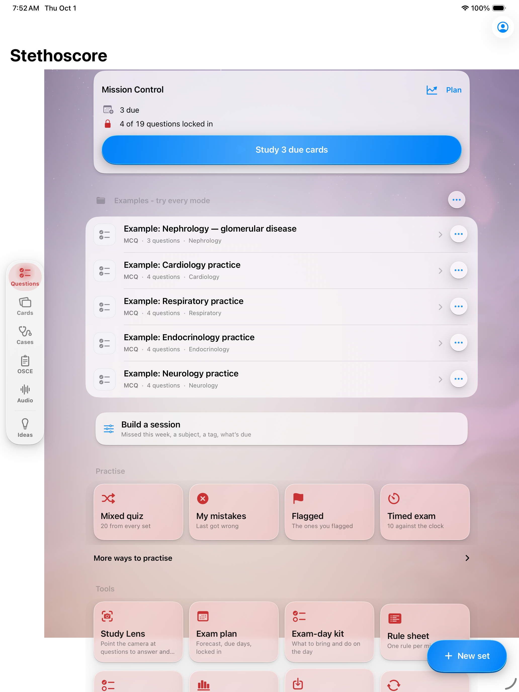

### ipad/3-relaunch: iPad Pro 13-inch (M5)

```
bundle=com.cramdown.personal exe=Stethoscore Personal
keep=1 args=
launch_status=0
peak_rss_mb=350
pid=32481 alive_after_30s=yes
--- stderr.txt (last 25 of 1)
IOSurfaceClientSetSurfaceNotify failed e00002c7
--- log-process.txt: 31 matching lines (last 30)
2026-10-01 07:53:00.219 Df Stethoscore Personal[32481:18997] [com.apple.dt.xctest:Default] notify_get_state check indicated test daemon not ready.
2026-10-01 07:53:00.219 Df Stethoscore Personal[32481:18997] [com.apple.dt.xctest:Default] notify_get_state check indicated test daemon not ready.
2026-10-01 07:53:00.220 Df Stethoscore Personal[32481:18997] [com.apple.dt.xctest:Default] notify_get_state check indicated test daemon not ready.
2026-10-01 07:53:00.290 Df Stethoscore Personal[32481:18997] [com.apple.FileURL:default] kExcludedFromBackupXattrName set on path: /Users/runner/Library/Developer/CoreSimulator/Devices/A2011F14-88A1-46AA-999A-FD6FEDCD870B/data/Containers/Data/Application/76A95B27-BEE1-49A8-ABA4-BF99113552CA/Library/Application Support/RedPenBlobs
2026-10-01 07:53:00.399 Df Stethoscore Personal[32481:18997] [com.apple.UIKit:KeyWindow] Setting default evaluation strategy for UIUserInterfaceIdiomPad to LastOneWins
2026-10-01 07:53:00.400 Df Stethoscore Personal[32481:18997] [com.apple.UIKit:KeyWindow] Setting default evaluation strategy for UIUserInterfaceIdiomPad to SystemShellManaged
2026-10-01 07:53:01.332 I  Stethoscore Personal[32481:18997] [com.apple.DesignLibrary:defaults] liveTuning=false
2026-10-01 07:53:01.490 Df Stethoscore Personal[32481:18997] [PrototypeTools:domain] Not observing PTDefaults on customer install.
2026-10-01 07:53:01.608 Df Stethoscore Personal[32481:189d1] [com.apple.calls.callkit:Default] Call host has no calls
2026-10-01 07:53:01.727 I  Stethoscore Personal[32481:189f1] [com.apple.storekit:Default] AAFService Starting new XPCConnection db5cfae3
2026-10-01 07:53:01.749 Df Stethoscore Personal[32481:189d1] [com.apple.storekit:Default] [Default] Finished iterating transaction batches
2026-10-01 07:53:01.749 I  Stethoscore Personal[32481:189d1] [com.apple.storekit:Default] AAFService Closing XPCConnection db5cfae3
2026-10-01 07:53:01.749 Df Stethoscore Personal[32481:189d1] [com.apple.storekit:Default] AAFService connection invalidated
2026-10-01 07:53:02.945 Df Stethoscore Personal[32481:18997] [com.apple.network:activity] Create activity from XPC object <nw_activity 50:1 [9A65C002-5F95-4F90-BD48-5DEC466A894E] (reporting strategy default)>
2026-10-01 07:53:02.945 Df Stethoscore Personal[32481:18997] [com.apple.network:activity] Create activity from XPC object <nw_activity 50:2 [9669CE51-81A3-40D1-ADCA-A3DC443F91E0] (reporting strategy default)>
2026-10-01 07:53:02.945 Df Stethoscore Personal[32481:18997] [com.apple.network:activity] Set activity <nw_activity 50:1 [9A65C002-5F95-4F90-BD48-5DEC466A894E] (reporting strategy default)> as the global parent
2026-10-01 07:53:02.995 I  Stethoscore Personal[32481:189d4] [com.apple.storekit:Default] AAFService Starting new XPCConnection 97f31ea0
2026-10-01 07:53:03.003 I  Stethoscore Personal[32481:18997] [com.apple.PointerUI:Common] Activating Connection: <BSXPC(com.apple.PointerUI.pointeruid.service[C:3-1])-as(com.apple.PointerUI.pointeruid.default-service):0x101aab160 name=(null)>
2026-10-01 07:53:03.006 Df Stethoscore Personal[32481:189d4] [com.apple.storekit:Default] [Default] Finished iterating transaction batches
2026-10-01 07:53:03.006 I  Stethoscore Personal[32481:189d4] [com.apple.storekit:Default] AAFService Closing XPCConnection 97f31ea0
2026-10-01 07:53:03.006 I  Stethoscore Personal[32481:189f1] [com.apple.storekit:Default] AAFService Starting new XPCConnection e1057585
2026-10-01 07:53:03.006 Df Stethoscore Personal[32481:189d4] [com.apple.storekit:Default] AAFService connection invalidated
2026-10-01 07:53:03.016 Df Stethoscore Personal[32481:189f1] [com.apple.storekit:Default] [Default] Finished iterating transaction batches
2026-10-01 07:53:03.895 I  Stethoscore Personal[32481:189f1] [com.apple.storekit:Default] AAFService Closing XPCConnection e1057585
2026-10-01 07:53:03.901 Df Stethoscore Personal[32481:189d1] [com.apple.storekit:Default] Registering for 'transactionsupdated' daemon notification
2026-10-01 07:53:03.902 Df Stethoscore Personal[32481:189d1] [com.apple.storekit:Default] AAFService connection invalidated
2026-10-01 07:53:04.374 Df Stethoscore Personal[32481:18997] [com.apple.network:activity] <nw_activity 50:1 [9A65C002-5F95-4F90-BD48-5DEC466A894E] (global parent) (reporting strategy default) complete (reason success)> complete with reason 2 (success), duration 6180ms
2026-10-01 07:53:04.374 Df Stethoscore Personal[32481:18997] [com.apple.network:activity] <nw_activity 50:2 [9669CE51-81A3-40D1-ADCA-A3DC443F91E0] (reporting strategy default) complete (reason success)> complete with reason 2 (success), duration 6180ms
2026-10-01 07:53:04.374 Df Stethoscore Personal[32481:18997] [com.apple.network:activity] Unsetting the global parent activity <nw_activity 50:1 [9A65C002-5F95-4F90-BD48-5DEC466A894E] (global parent) (reporting strategy default) complete (reason success)>
2026-10-01 07:53:06.273 Df Stethoscore Personal[32481:189d4] [com.apple.FileURL:default] kExcludedFromBackupXattrName set on path: /Users/runner/Library/Developer/CoreSimulator/Devices/A2011F14-88A1-46AA-999A-FD6FEDCD870B/data/Containers/Data/Application/76A95B27-BEE1-49A8-ABA4-BF99113552CA/Library/Application Support/RedPenSources
--- log-system.txt: 122 matching lines (last 30)
2026-10-01 07:52:57.842 Df splashboardd[24053:122c1] [com.apple.SplashBoard:Capture] Updating window to <XBLaunchStateRequest: 0x101a28310; groupID: com.cramdown.personal - {DEFAULT GROUP}; statusBar: normal; refSize: {1032, 1376}; naturalSize: {1376, 1032}; orientation: LandscapeLeft; userInterfaceStyle: Dark>
```


### ipad/6-open-every-set: iPad Pro 13-inch (M5)

```
bundle=com.cramdown.personal exe=Stethoscore Personal
keep=1 args=-launchTestSignedIn -launchTestOpenSets
launch_status=0
peak_rss_mb=346
pid=34614 alive_after_60s=yes
--- stderr.txt (last 25 of 1)
IOSurfaceClientSetSurfaceNotify failed e00002c7
--- log-process.txt: 31 matching lines (last 30)
2026-10-01 07:54:00.596 Df Stethoscore Personal[34614:19fb5] [com.apple.dt.xctest:Default] notify_get_state check indicated test daemon not ready.
2026-10-01 07:54:00.596 Df Stethoscore Personal[34614:19fb5] [com.apple.dt.xctest:Default] notify_get_state check indicated test daemon not ready.
2026-10-01 07:54:00.596 Df Stethoscore Personal[34614:19fb5] [com.apple.dt.xctest:Default] notify_get_state check indicated test daemon not ready.
2026-10-01 07:54:00.650 Df Stethoscore Personal[34614:19fb5] [com.apple.FileURL:default] kExcludedFromBackupXattrName set on path: /Users/runner/Library/Developer/CoreSimulator/Devices/A2011F14-88A1-46AA-999A-FD6FEDCD870B/data/Containers/Data/Application/1B4B3713-C821-49F4-B5C4-0558349728D8/Library/Application Support/RedPenBlobs
2026-10-01 07:54:00.748 Df Stethoscore Personal[34614:19fb5] [com.apple.UIKit:KeyWindow] Setting default evaluation strategy for UIUserInterfaceIdiomPad to LastOneWins
2026-10-01 07:54:00.749 Df Stethoscore Personal[34614:19fb5] [com.apple.UIKit:KeyWindow] Setting default evaluation strategy for UIUserInterfaceIdiomPad to SystemShellManaged
2026-10-01 07:54:01.457 I  Stethoscore Personal[34614:19fb5] [com.apple.DesignLibrary:defaults] liveTuning=false
2026-10-01 07:54:01.584 Df Stethoscore Personal[34614:19fb5] [PrototypeTools:domain] Not observing PTDefaults on customer install.
2026-10-01 07:54:01.660 Df Stethoscore Personal[34614:19fed] [com.apple.calls.callkit:Default] Call host has no calls
2026-10-01 07:54:01.762 I  Stethoscore Personal[34614:19fee] [com.apple.storekit:Default] AAFService Starting new XPCConnection 32e956bb
2026-10-01 07:54:01.786 Df Stethoscore Personal[34614:19fed] [com.apple.storekit:Default] [Default] Finished iterating transaction batches
2026-10-01 07:54:01.786 I  Stethoscore Personal[34614:19fee] [com.apple.storekit:Default] AAFService Closing XPCConnection 32e956bb
2026-10-01 07:54:01.786 Df Stethoscore Personal[34614:19fee] [com.apple.storekit:Default] AAFService connection invalidated
2026-10-01 07:54:03.112 Df Stethoscore Personal[34614:19fb5] [com.apple.network:activity] Create activity from XPC object <nw_activity 50:1 [750793B7-A732-4875-8944-A97A392D6B02] (reporting strategy default)>
2026-10-01 07:54:03.112 Df Stethoscore Personal[34614:19fb5] [com.apple.network:activity] Create activity from XPC object <nw_activity 50:2 [08958155-4247-4629-BB26-639CC9E2331B] (reporting strategy default)>
2026-10-01 07:54:03.113 Df Stethoscore Personal[34614:19fb5] [com.apple.network:activity] Set activity <nw_activity 50:1 [750793B7-A732-4875-8944-A97A392D6B02] (reporting strategy default)> as the global parent
2026-10-01 07:54:03.189 I  Stethoscore Personal[34614:1a0f0] [com.apple.storekit:Default] AAFService Starting new XPCConnection 12fc47d8
2026-10-01 07:54:03.203 I  Stethoscore Personal[34614:19fb5] [com.apple.PointerUI:Common] Activating Connection: <BSXPC(com.apple.PointerUI.pointeruid.service[C:3-1])-as(com.apple.PointerUI.pointeruid.default-service):0x10421b1b0 name=(null)>
2026-10-01 07:54:03.223 Df Stethoscore Personal[34614:19fee] [com.apple.storekit:Default] [Default] Finished iterating transaction batches
2026-10-01 07:54:03.224 I  Stethoscore Personal[34614:19fee] [com.apple.storekit:Default] AAFService Closing XPCConnection 12fc47d8
2026-10-01 07:54:03.224 I  Stethoscore Personal[34614:1a0f0] [com.apple.storekit:Default] AAFService Starting new XPCConnection 89e924fe
2026-10-01 07:54:03.241 Df Stethoscore Personal[34614:1a081] [com.apple.storekit:Default] [Default] Finished iterating transaction batches
2026-10-01 07:54:03.254 Df Stethoscore Personal[34614:19fed] [com.apple.storekit:Default] AAFService connection invalidated
2026-10-01 07:54:04.150 I  Stethoscore Personal[34614:1a081] [com.apple.storekit:Default] AAFService Closing XPCConnection 89e924fe
2026-10-01 07:54:04.153 Df Stethoscore Personal[34614:1a11d] [com.apple.storekit:Default] AAFService connection invalidated
2026-10-01 07:54:04.172 Df Stethoscore Personal[34614:1a081] [com.apple.storekit:Default] Registering for 'transactionsupdated' daemon notification
2026-10-01 07:54:05.272 Df Stethoscore Personal[34614:19fb5] [com.apple.network:activity] <nw_activity 50:1 [750793B7-A732-4875-8944-A97A392D6B02] (global parent) (reporting strategy default) complete (reason success)> complete with reason 2 (success), duration 6347ms
2026-10-01 07:54:05.272 Df Stethoscore Personal[34614:19fb5] [com.apple.network:activity] <nw_activity 50:2 [08958155-4247-4629-BB26-639CC9E2331B] (reporting strategy default) complete (reason success)> complete with reason 2 (success), duration 6347ms
2026-10-01 07:54:05.272 Df Stethoscore Personal[34614:19fb5] [com.apple.network:activity] Unsetting the global parent activity <nw_activity 50:1 [750793B7-A732-4875-8944-A97A392D6B02] (global parent) (reporting strategy default) complete (reason success)>
2026-10-01 07:54:19.260 Df Stethoscore Personal[34614:19fcb] [com.apple.FileURL:default] kExcludedFromBackupXattrName set on path: /Users/runner/Library/Developer/CoreSimulator/Devices/A2011F14-88A1-46AA-999A-FD6FEDCD870B/data/Containers/Data/Application/1B4B3713-C821-49F4-B5C4-0558349728D8/Library/Application Support/RedPenSources
--- log-system.txt: 121 matching lines (last 30)
2026-10-01 07:53:58.589 Df splashboardd[24053:122c1] [com.apple.SplashBoard:Capture] Updating window to <XBLaunchStateRequest: 0x101a291f0; groupID: com.cramdown.personal - {DEFAULT GROUP}; statusBar: normal; refSize: {1032, 1376}; naturalSize: {1376, 1032}; orientation: LandscapeLeft; userInterfaceStyle: Dark>
```


### iphone/1-fresh: iPhone 17 Pro

```
bundle=com.cramdown.personal exe=Stethoscore Personal
keep=0 args=
launch_status=0
peak_rss_mb=91
pid=7070 alive_after_30s=yes
--- stderr.txt (last 25 of 1)
IOSurfaceClientSetSurfaceNotify failed e00002c7
--- log-process.txt: 20 matching lines (last 30)
2026-10-01 07:26:34.695 Df Stethoscore Personal[7070:65eb] [com.apple.dt.xctest:Default] Registering for test daemon availability notify post.
2026-10-01 07:26:34.695 Df Stethoscore Personal[7070:65eb] [com.apple.dt.xctest:Default] notify_get_state check indicated test daemon not ready.
2026-10-01 07:26:34.695 Df Stethoscore Personal[7070:65eb] [com.apple.dt.xctest:Default] notify_get_state check indicated test daemon not ready.
2026-10-01 07:26:34.695 Df Stethoscore Personal[7070:65eb] [com.apple.dt.xctest:Default] notify_get_state check indicated test daemon not ready.
2026-10-01 07:26:34.818 Df Stethoscore Personal[7070:65eb] [com.apple.FileURL:default] kExcludedFromBackupXattrName set on path: /Users/runner/Library/Developer/CoreSimulator/Devices/22452A91-4697-4369-8812-53ADB77EB73B/data/Containers/Data/Application/32B6C3FE-36D7-46C9-95D9-B9A30221A1F5/Library/Application Support/RedPenBlobs
2026-10-01 07:26:34.964 Df Stethoscore Personal[7070:65eb] [com.apple.UIKit:KeyWindow] Setting default evaluation strategy for UIUserInterfaceIdiomPhone to LastOneWins
2026-10-01 07:26:34.964 Df Stethoscore Personal[7070:65eb] [com.apple.UIKit:KeyWindow] Setting default evaluation strategy for UIUserInterfaceIdiomPhone to SystemShellManaged
2026-10-01 07:26:35.697 Df Stethoscore Personal[7070:65eb] [PrototypeTools:domain] Not observing PTDefaults on customer install.
2026-10-01 07:26:42.529 Df Stethoscore Personal[7070:65eb] [com.apple.network:activity] Create activity from XPC object <nw_activity 50:1 [0FF35D02-5C4D-4CEE-A482-E26CA05E295A] (reporting strategy default)>
2026-10-01 07:26:42.529 Df Stethoscore Personal[7070:65eb] [com.apple.network:activity] Create activity from XPC object <nw_activity 50:2 [92EFB18F-CF02-4361-BBE4-77D50CD8575F] (reporting strategy default)>
2026-10-01 07:26:42.529 Df Stethoscore Personal[7070:65eb] [com.apple.network:activity] Set activity <nw_activity 50:1 [0FF35D02-5C4D-4CEE-A482-E26CA05E295A] (reporting strategy default)> as the global parent
2026-10-01 07:26:43.054 Df Stethoscore Personal[7070:6908] [com.apple.storekit:Default] [Default] Finished iterating transaction batches
2026-10-01 07:26:43.059 Df Stethoscore Personal[7070:6908] [com.apple.storekit:Default] AAFService connection invalidated
2026-10-01 07:26:43.207 Df Stethoscore Personal[7070:6908] [com.apple.storekit:Default] [Default] Finished iterating transaction batches
2026-10-01 07:26:43.277 Df Stethoscore Personal[7070:6903] [com.apple.storekit:Default] Registering for 'transactionsupdated' daemon notification
2026-10-01 07:26:43.294 Df Stethoscore Personal[7070:6903] [com.apple.storekit:Default] AAFService connection invalidated
2026-10-01 07:26:47.637 Df Stethoscore Personal[7070:65eb] [com.apple.network:activity] <nw_activity 50:1 [0FF35D02-5C4D-4CEE-A482-E26CA05E295A] (global parent) (reporting strategy default) complete (reason success)> complete with reason 2 (success), duration 15028ms
2026-10-01 07:26:47.637 Df Stethoscore Personal[7070:65eb] [com.apple.network:activity] <nw_activity 50:2 [92EFB18F-CF02-4361-BBE4-77D50CD8575F] (reporting strategy default) complete (reason success)> complete with reason 2 (success), duration 15028ms
2026-10-01 07:26:47.637 Df Stethoscore Personal[7070:65eb] [com.apple.network:activity] Unsetting the global parent activity <nw_activity 50:1 [0FF35D02-5C4D-4CEE-A482-E26CA05E295A] (global parent) (reporting strategy default) complete (reason success)>
2026-10-01 07:27:17.947 E  Stethoscore Personal[7070:65eb] [com.apple.UIKit:BackgroundTask] Background Task 3 ("Saving library"), was created over 30 seconds ago. In applications running in the background, this creates a risk of termination. Remember to call UIApplication.endBackgroundTask(_:) for your task in a timely manner to avoid this.
--- log-system.txt: 70 matching lines (last 30)
2026-10-01 07:26:27.625 Df splashboardd[6850:63d0] [com.apple.SplashBoard:Capture] Updating window to <XBLaunchStateRequest: 0x101cd8230; groupID: com.cramdown.personal - {DEFAULT GROUP}; statusBar: normal; refSize: {402, 874}; orientation: Portrait; userInterfaceStyle: Light>
2026-10-01 07:26:27.745 Df SpringBoard[3784:5394] [com.apple.SplashBoard:Capture] Image generation complete for: <XBLaunchStateRequest: 0x11c428f50; groupID: com.cramdown.personal - {DEFAULT GROUP}; statusBar: normal; refSize: {402, 874}; orientation: Portrait; userInterfaceStyle: Light>
2026-10-01 07:26:27.745 Df SpringBoard[3784:5375] [com.apple.SplashBoard:Capture] Asynchronously generating image data for request: <XBLaunchStateRequest: 0x11c428e00; groupID: com.cramdown.personal - {DEFAULT GROUP}; statusBar: normal; refSize: {402, 874}; orientation: Portrait; userInterfaceStyle: Dark>
2026-10-01 07:26:27.747 Df splashboardd[6850:63d0] [com.apple.SplashBoard:Capture] Updating window to <XBLaunchStateRequest: 0x101e440e0; groupID: com.cramdown.personal - {DEFAULT GROUP}; statusBar: normal; refSize: {402, 874}; orientation: Portrait; userInterfaceStyle: Dark>
2026-10-01 07:26:27.747 Df SpringBoard[3784:62f8] [com.apple.UserNotifications:DataProviderFactory] [com.cramdown.personal] Application installed using default data provider
2026-10-01 07:26:27.756 Df SpringBoard[3784:50aa] [com.apple.SplashBoard:FileManifest] <XBApplicationSnapshotManifestImpl: 0x1171b3800> [com.cramdown.personal] Snapshot data for <XBApplicationSnapshot: 0x11c5ffb80; …ABC6C6C3B7A5> [com.cramdown.personal] written to file: /Users/runner/Library/Developer/CoreSimulator/Devices/22452A91-4697-4369-8812-53ADB77EB73B/data/Containers/Data/Application/32B6C
2026-10-01 07:26:27.828 Df SpringBoard[3784:50aa] [com.apple.SplashBoard:FileManifest] <XBApplicationSnapshotManifestImpl: 0x1171b3800> [com.cramdown.personal] Snapshot data for <XBApplicationSnapshot: 0x11c5ffd40; …35F21DB8F8CA> [com.cramdown.personal] written to file: /Users/runner/Library/Developer/CoreSimulator/Devices/22452A91-4697-4369-8812-53ADB77EB73B/data/Containers/Data/Application/32B6C
2026-10-01 07:26:27.829 Df SpringBoard[3784:50aa] [com.apple.SplashBoard:Capture] Image generation complete for: <XBLaunchStateRequest: 0x11c428e00; groupID: com.cramdown.personal - {DEFAULT GROUP}; statusBar: normal; refSize: {402, 874}; orientation: Portrait; userInterfaceStyle: Dark>
    "terminate_running_process" = 1;
	retryTimeout: 120.000000 (default write com.apple.CoreSimulatorBridge LaunchRetryTimeout <value>)
	bootTimeout: 300.000000 (default write com.apple.CoreSimulatorBridge BootRetryTimeout <value>)
```
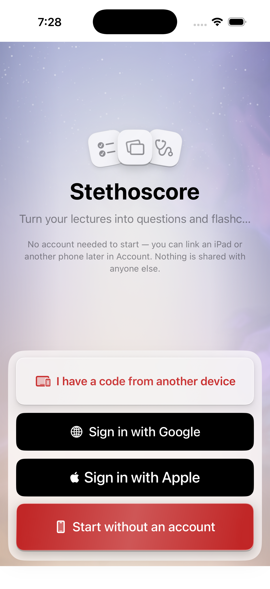

### iphone/2-signed-in: iPhone 17 Pro

```
bundle=com.cramdown.personal exe=Stethoscore Personal
keep=1 args=-launchTestSignedIn
launch_status=0
peak_rss_mb=372
pid=10570 alive_after_30s=yes
--- stderr.txt (last 25 of 1)
IOSurfaceClientSetSurfaceNotify failed e00002c7
--- log-process.txt: 48 matching lines (last 30)
2026-10-01 07:30:23.036 Df Stethoscore Personal[10570:8bb8] [com.apple.CFNetwork:Default] Initializing NSHTTPCookieStorage singleton
2026-10-01 07:30:23.036 Df Stethoscore Personal[10570:8bb8] [com.apple.CFNetwork:Default] Initializing CFHTTPCookieStorage singleton
2026-10-01 07:30:23.036 Df Stethoscore Personal[10570:8bb8] [com.apple.CFNetwork:Default] Creating default cookie storage with process/bundle identifier
2026-10-01 07:30:23.041 Df Stethoscore Personal[10570:8bb8] [com.apple.CFNetwork:Default] Initializing AlternativeServices Storage singleton
2026-10-01 07:30:23.043 Df Stethoscore Personal[10570:8bb8] [com.apple.FileURL:default] kExcludedFromBackupXattrName set on path: /Users/runner/Library/Developer/CoreSimulator/Devices/22452A91-4697-4369-8812-53ADB77EB73B/data/Containers/Data/Application/40C39B7A-C578-4827-B7AC-1020F38599D5/Library/HTTPStorages/com.cramdown.personal
2026-10-01 07:30:23.061 Df Stethoscore Personal[10570:8bb8] [com.apple.CFNetwork:Default] Connection 0: creating secure tcp or quic connection
2026-10-01 07:30:23.170 Df Stethoscore Personal[10570:8bb8] [com.apple.CFNetwork:Default] Connection 1: enabling TLS
2026-10-01 07:30:23.170 Df Stethoscore Personal[10570:8bb8] [com.apple.CFNetwork:Default] Connection 1: starting, TC(0x0)
2026-10-01 07:30:23.197 Df Stethoscore Personal[10570:8bb8] [com.apple.CFNetwork:Default] Task <1811AD39-2742-4F2D-A731-741FE152CF69>.<1> setting up Connection 1
2026-10-01 07:30:23.271 Df Stethoscore Personal[10570:8bbd] [com.apple.CFNetwork:Default] Connection 1: asked to evaluate TLS Trust
2026-10-01 07:30:23.273 Df Stethoscore Personal[10570:8bbd] [com.apple.CFNetwork:Default] Task <1811AD39-2742-4F2D-A731-741FE152CF69>.<1> auth completion disp=1 cred=0x0
2026-10-01 07:30:23.332 Df Stethoscore Personal[10570:8bfc] [com.apple.CFNetwork:Default] System Trust Evaluation yielded status(0)
2026-10-01 07:30:23.339 Df Stethoscore Personal[10570:8bbd] [com.apple.CFNetwork:Default] Connection 1: TLS Trust result 0
2026-10-01 07:30:23.340 Df Stethoscore Personal[10570:8bbd] [com.apple.network:boringssl] nw_protocol_boringssl_signal_connected(895) [C1.1.1.1:2][0x117731960] TLS connected [server(0) version(0x0304) ciphersuite(TLS_AES_256_GCM_SHA384) group(0x11ec) signature_alg(0x0403) alpn(h2) resumed(0) offered_ticket(0) in_early_data(0) early_data_accepted(0) false_started(0) ocsp_received(0) sct_received(1)
2026-10-01 07:30:23.340 Df Stethoscore Personal[10570:8bbd] [com.apple.CFNetwork:Default] Connection 1: connected successfully
2026-10-01 07:30:23.340 Df Stethoscore Personal[10570:8bbd] [com.apple.CFNetwork:Default] Connection 1: TLS handshake complete
2026-10-01 07:30:23.341 Df Stethoscore Personal[10570:8bbd] [com.apple.CFNetwork:Default] Connection 1: ready C(N) E(N)
2026-10-01 07:30:23.349 Df Stethoscore Personal[10570:8bbd] [com.apple.CFNetwork:Default] Task <1811AD39-2742-4F2D-A731-741FE152CF69>.<1> now using Connection 1
2026-10-01 07:30:23.358 Df Stethoscore Personal[10570:8bbd] [com.apple.CFNetwork:Default] Task <1811AD39-2742-4F2D-A731-741FE152CF69>.<1> sent request, body S 2
2026-10-01 07:30:23.449 Df Stethoscore Personal[10570:8bbd] [com.apple.CFNetwork:Default] Task <1811AD39-2742-4F2D-A731-741FE152CF69>.<1> received response, status 200 content U
2026-10-01 07:30:23.449 Df Stethoscore Personal[10570:8bbd] [com.apple.CFNetwork:Default] Task <1811AD39-2742-4F2D-A731-741FE152CF69>.<1> done using Connection 1
2026-10-01 07:30:23.463 Df Stethoscore Personal[10570:8bc1] [com.apple.storekit:Default] Registering for 'transactionsupdated' daemon notification
2026-10-01 07:30:23.463 Df Stethoscore Personal[10570:8bc1] [com.apple.storekit:Default] AAFService connection invalidated
2026-10-01 07:30:23.465 Df Stethoscore Personal[10570:8bbd] [com.apple.CFNetwork:Default] Task <1811AD39-2742-4F2D-A731-741FE152CF69>.<1> response ended
2026-10-01 07:30:23.465 Df Stethoscore Personal[10570:8bbd] [com.apple.CFNetwork:Default] Task <1811AD39-2742-4F2D-A731-741FE152CF69>.<1> finished successfully
2026-10-01 07:30:23.844 Df Stethoscore Personal[10570:8bb8] [com.apple.CFNetwork:Default] Garbage collection for alternative services
2026-10-01 07:30:32.949 Df Stethoscore Personal[10570:8b92] [com.apple.network:activity] <nw_activity 50:1 [88CBBD51-FBA1-46B2-B3A4-166B8B848AE2] (global parent) (reporting strategy default) complete (reason success)> complete with reason 2 (success), duration 13718ms
2026-10-01 07:30:32.949 Df Stethoscore Personal[10570:8b92] [com.apple.network:activity] <nw_activity 50:2 [F144E3C5-6A7D-4047-90EA-8485CB07F39B] (reporting strategy default) complete (reason success)> complete with reason 2 (success), duration 13718ms
2026-10-01 07:30:32.949 Df Stethoscore Personal[10570:8b92] [com.apple.network:activity] Unsetting the global parent activity <nw_activity 50:1 [88CBBD51-FBA1-46B2-B3A4-166B8B848AE2] (global parent) (reporting strategy default) complete (reason success)>
2026-10-01 07:30:40.124 Df Stethoscore Personal[10570:8bc3] [com.apple.FileURL:default] kExcludedFromBackupXattrName set on path: /Users/runner/Library/Developer/CoreSimulator/Devices/22452A91-4697-4369-8812-53ADB77EB73B/data/Containers/Data/Application/40C39B7A-C578-4827-B7AC-1020F38599D5/Library/Application Support/RedPenSources
--- log-system.txt: 81 matching lines (last 30)
2026-10-01 07:30:18.886 Df callservicesd[3881:6220] [com.apple.calls.copresencecore:Default] Invalidating cached value for bundle identifier: com.cramdown.personal
```
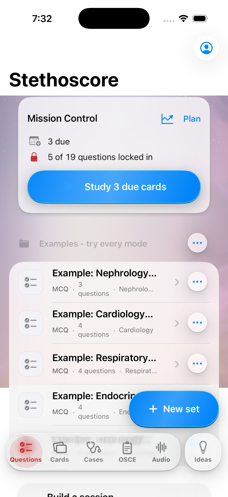

### iphone/3-relaunch: iPhone 17 Pro

```
bundle=com.cramdown.personal exe=Stethoscore Personal
keep=1 args=
launch_status=0
peak_rss_mb=337
pid=13993 alive_after_30s=yes
--- stderr.txt (last 25 of 1)
IOSurfaceClientSetSurfaceNotify failed e00002c7
--- log-process.txt: 30 matching lines (last 30)
2026-10-01 07:33:08.208 Df Stethoscore Personal[13993:b1ae] [com.apple.dt.xctest:Default] Registering for test daemon availability notify post.
2026-10-01 07:33:08.209 Df Stethoscore Personal[13993:b1ae] [com.apple.dt.xctest:Default] notify_get_state check indicated test daemon not ready.
2026-10-01 07:33:08.210 Df Stethoscore Personal[13993:b1ae] [com.apple.dt.xctest:Default] notify_get_state check indicated test daemon not ready.
2026-10-01 07:33:08.210 Df Stethoscore Personal[13993:b1ae] [com.apple.dt.xctest:Default] notify_get_state check indicated test daemon not ready.
2026-10-01 07:33:08.283 Df Stethoscore Personal[13993:b1ae] [com.apple.FileURL:default] kExcludedFromBackupXattrName set on path: /Users/runner/Library/Developer/CoreSimulator/Devices/22452A91-4697-4369-8812-53ADB77EB73B/data/Containers/Data/Application/C74C0A39-96C4-4518-B434-255D8532DF2B/Library/Application Support/RedPenBlobs
2026-10-01 07:33:08.449 Df Stethoscore Personal[13993:b1ae] [com.apple.UIKit:KeyWindow] Setting default evaluation strategy for UIUserInterfaceIdiomPhone to LastOneWins
2026-10-01 07:33:08.449 Df Stethoscore Personal[13993:b1ae] [com.apple.UIKit:KeyWindow] Setting default evaluation strategy for UIUserInterfaceIdiomPhone to SystemShellManaged
2026-10-01 07:33:09.687 I  Stethoscore Personal[13993:b1ae] [com.apple.DesignLibrary:defaults] liveTuning=false
2026-10-01 07:33:10.011 Df Stethoscore Personal[13993:b1ae] [PrototypeTools:domain] Not observing PTDefaults on customer install.
2026-10-01 07:33:10.235 Df Stethoscore Personal[13993:b1e2] [com.apple.calls.callkit:Default] Call host has no calls
2026-10-01 07:33:10.523 I  Stethoscore Personal[13993:b2cd] [com.apple.storekit:Default] AAFService Starting new XPCConnection 0ce34ef0
2026-10-01 07:33:10.580 Df Stethoscore Personal[13993:b1fa] [com.apple.storekit:Default] [Default] Finished iterating transaction batches
2026-10-01 07:33:10.581 I  Stethoscore Personal[13993:b1fa] [com.apple.storekit:Default] AAFService Closing XPCConnection 0ce34ef0
2026-10-01 07:33:10.581 Df Stethoscore Personal[13993:b1fa] [com.apple.storekit:Default] AAFService connection invalidated
2026-10-01 07:33:11.473 Df Stethoscore Personal[13993:b1ae] [com.apple.network:activity] Create activity from XPC object <nw_activity 50:1 [E26B1AE7-653F-4268-9030-5EE6D1832B41] (reporting strategy default)>
2026-10-01 07:33:11.473 Df Stethoscore Personal[13993:b1ae] [com.apple.network:activity] Create activity from XPC object <nw_activity 50:2 [2CA9181A-81EA-4869-BC80-0A62A100936B] (reporting strategy default)>
2026-10-01 07:33:11.473 Df Stethoscore Personal[13993:b1ae] [com.apple.network:activity] Set activity <nw_activity 50:1 [E26B1AE7-653F-4268-9030-5EE6D1832B41] (reporting strategy default)> as the global parent
2026-10-01 07:33:11.503 I  Stethoscore Personal[13993:b2ce] [com.apple.storekit:Default] AAFService Starting new XPCConnection 6be03a04
2026-10-01 07:33:11.532 Df Stethoscore Personal[13993:b2cd] [com.apple.storekit:Default] [Default] Finished iterating transaction batches
2026-10-01 07:33:11.533 I  Stethoscore Personal[13993:b2cd] [com.apple.storekit:Default] AAFService Closing XPCConnection 6be03a04
2026-10-01 07:33:11.535 I  Stethoscore Personal[13993:b2cd] [com.apple.storekit:Default] AAFService Starting new XPCConnection f6e96f0c
2026-10-01 07:33:11.535 Df Stethoscore Personal[13993:b1e2] [com.apple.storekit:Default] AAFService connection invalidated
2026-10-01 07:33:11.545 Df Stethoscore Personal[13993:b2ce] [com.apple.storekit:Default] [Default] Finished iterating transaction batches
2026-10-01 07:33:12.128 I  Stethoscore Personal[13993:b2cd] [com.apple.storekit:Default] AAFService Closing XPCConnection f6e96f0c
2026-10-01 07:33:12.134 Df Stethoscore Personal[13993:b1dd] [com.apple.storekit:Default] AAFService connection invalidated
2026-10-01 07:33:12.139 Df Stethoscore Personal[13993:b2cd] [com.apple.storekit:Default] Registering for 'transactionsupdated' daemon notification
2026-10-01 07:33:34.108 Df Stethoscore Personal[13993:b1ae] [com.apple.network:activity] <nw_activity 50:1 [E26B1AE7-653F-4268-9030-5EE6D1832B41] (global parent) (reporting strategy default) complete (reason failure)> complete with reason 3 (failure), duration 27582ms
2026-10-01 07:33:34.108 Df Stethoscore Personal[13993:b1ae] [com.apple.network:activity] <nw_activity 50:2 [2CA9181A-81EA-4869-BC80-0A62A100936B] (reporting strategy default) complete (reason failure)> complete with reason 3 (failure), duration 27582ms
2026-10-01 07:33:34.108 Df Stethoscore Personal[13993:b1ae] [com.apple.network:activity] Unsetting the global parent activity <nw_activity 50:1 [E26B1AE7-653F-4268-9030-5EE6D1832B41] (global parent) (reporting strategy default) complete (reason failure)>
2026-10-01 07:34:05.933 Df Stethoscore Personal[13993:b1dd] [com.apple.FileURL:default] kExcludedFromBackupXattrName set on path: /Users/runner/Library/Developer/CoreSimulator/Devices/22452A91-4697-4369-8812-53ADB77EB73B/data/Containers/Data/Application/C74C0A39-96C4-4518-B434-255D8532DF2B/Library/Application Support/RedPenSources
--- log-system.txt: 79 matching lines (last 30)
2026-10-01 07:33:05.307 Df splashboardd[6850:63d0] [com.apple.SplashBoard:Capture] Updating window to <XBLaunchStateRequest: 0x101e44540; groupID: com.cramdown.personal - {DEFAULT GROUP}; statusBar: normal; refSize: {402, 874}; orientation: Portrait; userInterfaceStyle: Light>
```
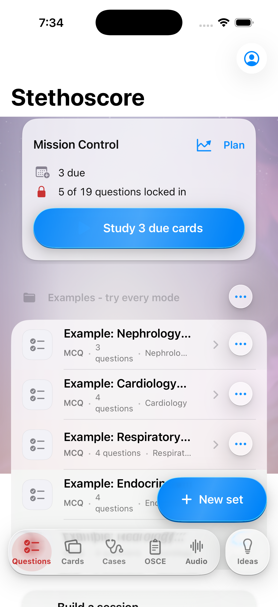

### iphone/5-other-bundle-id: iPhone 17 Pro

```
bundle=swift-playgrounds-dev-run.launchtest exe=Stethoscore Personal
keep=0 args=-launchTestSignedIn
launch_status=0
peak_rss_mb=409
pid=19812 alive_after_30s=yes
--- stderr.txt (last 25 of 1)
IOSurfaceClientSetSurfaceNotify failed e00002c7
--- log-process.txt: 55 matching lines (last 30)
2026-10-01 07:36:14.169 Df Stethoscore Personal[19812:eaeb] [com.apple.CFNetwork:Default] Initializing AlternativeServices Storage singleton
2026-10-01 07:36:14.170 Df Stethoscore Personal[19812:eaeb] [com.apple.FileURL:default] kExcludedFromBackupXattrName set on path: /Users/runner/Library/Developer/CoreSimulator/Devices/22452A91-4697-4369-8812-53ADB77EB73B/data/Containers/Data/Application/14541FD5-CEBD-437D-970D-9C5C12FCF9C8/Library/HTTPStorages/swift-playgrounds-dev-run.launchtest
2026-10-01 07:36:14.191 Df Stethoscore Personal[19812:eaeb] [com.apple.CFNetwork:Default] Connection 0: creating secure tcp or quic connection
2026-10-01 07:36:14.225 Df Stethoscore Personal[19812:ebca] [com.apple.CFNetwork:Default] Garbage collection for alternative services
2026-10-01 07:36:14.228 Df Stethoscore Personal[19812:eaeb] [com.apple.CFNetwork:Default] Connection 1: enabling TLS
2026-10-01 07:36:14.228 Df Stethoscore Personal[19812:eaeb] [com.apple.CFNetwork:Default] Connection 1: starting, TC(0x0)
2026-10-01 07:36:14.246 Df Stethoscore Personal[19812:eaeb] [com.apple.CFNetwork:Default] Task <2C547614-D7FD-46A5-96C2-3A9D3D65EA2B>.<1> setting up Connection 1
2026-10-01 07:36:14.279 Df Stethoscore Personal[19812:eaeb] [com.apple.CFNetwork:Default] Connection 1: asked to evaluate TLS Trust
2026-10-01 07:36:14.282 Df Stethoscore Personal[19812:eaeb] [com.apple.CFNetwork:Default] Task <2C547614-D7FD-46A5-96C2-3A9D3D65EA2B>.<1> auth completion disp=1 cred=0x0
2026-10-01 07:36:14.315 Df Stethoscore Personal[19812:ebd2] [com.apple.CFNetwork:Default] System Trust Evaluation yielded status(0)
2026-10-01 07:36:14.329 Df Stethoscore Personal[19812:eb8c] [com.apple.CFNetwork:Default] Connection 1: TLS Trust result 0
2026-10-01 07:36:14.333 Df Stethoscore Personal[19812:eb8c] [com.apple.network:boringssl] nw_protocol_boringssl_signal_connected(895) [C1.1.1.1:2][0x116b8fc60] TLS connected [server(0) version(0x0304) ciphersuite(TLS_AES_256_GCM_SHA384) group(0x11ec) signature_alg(0x0403) alpn(h2) resumed(0) offered_ticket(0) in_early_data(0) early_data_accepted(0) false_started(0) ocsp_received(0) sct_received(1)
2026-10-01 07:36:14.339 Df Stethoscore Personal[19812:eb8c] [com.apple.CFNetwork:Default] Connection 1: connected successfully
2026-10-01 07:36:14.339 Df Stethoscore Personal[19812:eb8c] [com.apple.CFNetwork:Default] Connection 1: TLS handshake complete
2026-10-01 07:36:14.340 Df Stethoscore Personal[19812:eb8c] [com.apple.CFNetwork:Default] Connection 1: ready C(N) E(N)
2026-10-01 07:36:14.352 Df Stethoscore Personal[19812:eb8c] [com.apple.CFNetwork:Default] Task <2C547614-D7FD-46A5-96C2-3A9D3D65EA2B>.<1> now using Connection 1
2026-10-01 07:36:14.355 Df Stethoscore Personal[19812:ebd2] [com.apple.CFNetwork:Default] Task <2C547614-D7FD-46A5-96C2-3A9D3D65EA2B>.<1> sent request, body S 2
2026-10-01 07:36:14.456 Df Stethoscore Personal[19812:ebca] [com.apple.CFNetwork:Default] Task <2C547614-D7FD-46A5-96C2-3A9D3D65EA2B>.<1> received response, status 200 content U
2026-10-01 07:36:14.456 Df Stethoscore Personal[19812:ebca] [com.apple.CFNetwork:Default] Task <2C547614-D7FD-46A5-96C2-3A9D3D65EA2B>.<1> done using Connection 1
2026-10-01 07:36:14.499 I  Stethoscore Personal[19812:ebba] [com.apple.storekit:Default] AAFService Starting new XPCConnection 0337f5ad
2026-10-01 07:36:14.507 Df Stethoscore Personal[19812:ebba] [com.apple.storekit:Default] [Default] Finished iterating transaction batches
2026-10-01 07:36:14.527 Df Stethoscore Personal[19812:ebca] [com.apple.CFNetwork:Default] Task <2C547614-D7FD-46A5-96C2-3A9D3D65EA2B>.<1> response ended
2026-10-01 07:36:14.528 Df Stethoscore Personal[19812:ebca] [com.apple.CFNetwork:Default] Task <2C547614-D7FD-46A5-96C2-3A9D3D65EA2B>.<1> finished successfully
2026-10-01 07:36:14.748 I  Stethoscore Personal[19812:eac2] [com.apple.storekit:Default] AAFService Closing XPCConnection 0337f5ad
2026-10-01 07:36:14.752 Df Stethoscore Personal[19812:eac2] [com.apple.storekit:Default] Registering for 'transactionsupdated' daemon notification
2026-10-01 07:36:14.758 Df Stethoscore Personal[19812:ebd2] [com.apple.storekit:Default] AAFService connection invalidated
2026-10-01 07:36:22.692 Df Stethoscore Personal[19812:ea7f] [com.apple.network:activity] <nw_activity 50:1 [4E01EDEA-DD88-4CE6-9C5A-76624819978D] (global parent) (reporting strategy default) complete (reason success)> complete with reason 2 (success), duration 12426ms
2026-10-01 07:36:22.692 Df Stethoscore Personal[19812:ea7f] [com.apple.network:activity] <nw_activity 50:2 [316553C6-38CF-436A-982E-FA207BBA6243] (reporting strategy default) complete (reason success)> complete with reason 2 (success), duration 12426ms
2026-10-01 07:36:22.692 Df Stethoscore Personal[19812:ea7f] [com.apple.network:activity] Unsetting the global parent activity <nw_activity 50:1 [4E01EDEA-DD88-4CE6-9C5A-76624819978D] (global parent) (reporting strategy default) complete (reason success)>
2026-10-01 07:36:52.174 Df Stethoscore Personal[19812:eac9] [com.apple.FileURL:default] kExcludedFromBackupXattrName set on path: /Users/runner/Library/Developer/CoreSimulator/Devices/22452A91-4697-4369-8812-53ADB77EB73B/data/Containers/Data/Application/14541FD5-CEBD-437D-970D-9C5C12FCF9C8/Library/Application Support/RedPenSources
--- log-system.txt: 73 matching lines (last 30)
2026-10-01 07:36:09.415 Df splashboardd[6850:63d0] [com.apple.SplashBoard:Capture] Updating window to <XBLaunchStateRequest: 0x101e44540; groupID: swift-playgrounds-dev-run.launchtest - {DEFAULT GROUP}; statusBar: normal; refSize: {402, 874}; orientation: Portrait; userInterfaceStyle: Dark>
```
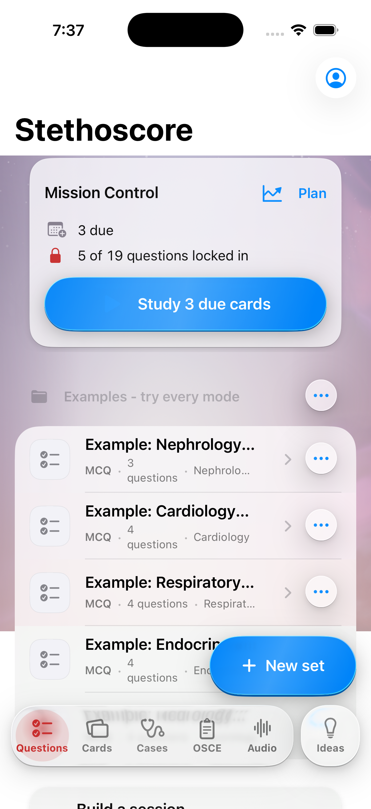

### iphone/6-open-every-set: iPhone 17 Pro

```
bundle=com.cramdown.personal exe=Stethoscore Personal
keep=1 args=-launchTestSignedIn -launchTestOpenSets
launch_status=0
peak_rss_mb=334
pid=16417 alive_after_60s=yes
--- stderr.txt (last 25 of 1)
IOSurfaceClientSetSurfaceNotify failed e00002c7
--- log-process.txt: 30 matching lines (last 30)
2026-10-01 07:34:35.558 Df Stethoscore Personal[16417:c98e] [com.apple.dt.xctest:Default] Registering for test daemon availability notify post.
2026-10-01 07:34:35.558 Df Stethoscore Personal[16417:c98e] [com.apple.dt.xctest:Default] notify_get_state check indicated test daemon not ready.
2026-10-01 07:34:35.558 Df Stethoscore Personal[16417:c98e] [com.apple.dt.xctest:Default] notify_get_state check indicated test daemon not ready.
2026-10-01 07:34:35.558 Df Stethoscore Personal[16417:c98e] [com.apple.dt.xctest:Default] notify_get_state check indicated test daemon not ready.
2026-10-01 07:34:35.658 Df Stethoscore Personal[16417:c98e] [com.apple.FileURL:default] kExcludedFromBackupXattrName set on path: /Users/runner/Library/Developer/CoreSimulator/Devices/22452A91-4697-4369-8812-53ADB77EB73B/data/Containers/Data/Application/CEA13C22-46CD-46BF-A7E0-747F81B7F7C8/Library/Application Support/RedPenBlobs
2026-10-01 07:34:35.777 Df Stethoscore Personal[16417:c98e] [com.apple.UIKit:KeyWindow] Setting default evaluation strategy for UIUserInterfaceIdiomPhone to LastOneWins
2026-10-01 07:34:35.777 Df Stethoscore Personal[16417:c98e] [com.apple.UIKit:KeyWindow] Setting default evaluation strategy for UIUserInterfaceIdiomPhone to SystemShellManaged
2026-10-01 07:34:36.664 I  Stethoscore Personal[16417:c98e] [com.apple.DesignLibrary:defaults] liveTuning=false
2026-10-01 07:34:36.801 Df Stethoscore Personal[16417:c98e] [PrototypeTools:domain] Not observing PTDefaults on customer install.
2026-10-01 07:34:36.936 Df Stethoscore Personal[16417:ca09] [com.apple.calls.callkit:Default] Call host has no calls
2026-10-01 07:34:37.046 I  Stethoscore Personal[16417:cafa] [com.apple.storekit:Default] AAFService Starting new XPCConnection ef7fff9f
2026-10-01 07:34:37.067 Df Stethoscore Personal[16417:cafb] [com.apple.storekit:Default] [Default] Finished iterating transaction batches
2026-10-01 07:34:37.067 I  Stethoscore Personal[16417:cafb] [com.apple.storekit:Default] AAFService Closing XPCConnection ef7fff9f
2026-10-01 07:34:37.071 Df Stethoscore Personal[16417:cafb] [com.apple.storekit:Default] AAFService connection invalidated
2026-10-01 07:34:37.839 Df Stethoscore Personal[16417:c98e] [com.apple.network:activity] Create activity from XPC object <nw_activity 50:1 [9FBB308E-2A4C-4963-99FE-B3492876397C] (reporting strategy default)>
2026-10-01 07:34:37.839 Df Stethoscore Personal[16417:c98e] [com.apple.network:activity] Create activity from XPC object <nw_activity 50:2 [A29034AA-50B2-4A6D-AEAC-80752FD2EC8F] (reporting strategy default)>
2026-10-01 07:34:37.839 Df Stethoscore Personal[16417:c98e] [com.apple.network:activity] Set activity <nw_activity 50:1 [9FBB308E-2A4C-4963-99FE-B3492876397C] (reporting strategy default)> as the global parent
2026-10-01 07:34:37.858 I  Stethoscore Personal[16417:ca25] [com.apple.storekit:Default] AAFService Starting new XPCConnection 83de7a1a
2026-10-01 07:34:37.882 Df Stethoscore Personal[16417:ca25] [com.apple.storekit:Default] [Default] Finished iterating transaction batches
2026-10-01 07:34:37.882 I  Stethoscore Personal[16417:ca25] [com.apple.storekit:Default] AAFService Closing XPCConnection 83de7a1a
2026-10-01 07:34:37.884 I  Stethoscore Personal[16417:ca25] [com.apple.storekit:Default] AAFService Starting new XPCConnection 8237b846
2026-10-01 07:34:37.907 Df Stethoscore Personal[16417:ca25] [com.apple.storekit:Default] [Default] Finished iterating transaction batches
2026-10-01 07:34:37.909 Df Stethoscore Personal[16417:cafb] [com.apple.storekit:Default] AAFService connection invalidated
2026-10-01 07:34:38.494 I  Stethoscore Personal[16417:ca25] [com.apple.storekit:Default] AAFService Closing XPCConnection 8237b846
2026-10-01 07:34:38.506 Df Stethoscore Personal[16417:ca25] [com.apple.storekit:Default] Registering for 'transactionsupdated' daemon notification
2026-10-01 07:34:38.512 Df Stethoscore Personal[16417:ca29] [com.apple.storekit:Default] AAFService connection invalidated
2026-10-01 07:34:46.785 Df Stethoscore Personal[16417:ca09] [com.apple.FileURL:default] kExcludedFromBackupXattrName set on path: /Users/runner/Library/Developer/CoreSimulator/Devices/22452A91-4697-4369-8812-53ADB77EB73B/data/Containers/Data/Application/CEA13C22-46CD-46BF-A7E0-747F81B7F7C8/Library/Application Support/RedPenSources
2026-10-01 07:34:59.984 Df Stethoscore Personal[16417:c98e] [com.apple.network:activity] <nw_activity 50:1 [9FBB308E-2A4C-4963-99FE-B3492876397C] (global parent) (reporting strategy default) complete (reason failure)> complete with reason 3 (failure), duration 26549ms
2026-10-01 07:34:59.984 Df Stethoscore Personal[16417:c98e] [com.apple.network:activity] <nw_activity 50:2 [A29034AA-50B2-4A6D-AEAC-80752FD2EC8F] (reporting strategy default) complete (reason failure)> complete with reason 3 (failure), duration 26549ms
2026-10-01 07:34:59.984 Df Stethoscore Personal[16417:c98e] [com.apple.network:activity] Unsetting the global parent activity <nw_activity 50:1 [9FBB308E-2A4C-4963-99FE-B3492876397C] (global parent) (reporting strategy default) complete (reason failure)>
--- log-system.txt: 79 matching lines (last 30)
2026-10-01 07:34:30.350 Df splashboardd[6850:63d0] [com.apple.SplashBoard:Capture] Updating window to <XBLaunchStateRequest: 0x101e444d0; groupID: com.cramdown.personal - {DEFAULT GROUP}; statusBar: normal; refSize: {402, 874}; orientation: Portrait; userInterfaceStyle: Light>
```
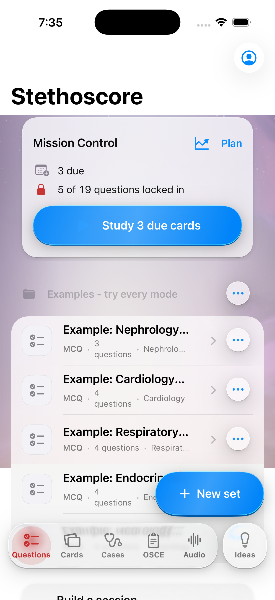

## current-core1

```
iphone/1-fresh=0
iphone/2-signed-in=0
iphone/3-relaunch=0
iphone/6-open-every-set=0
iphone/5-other-bundle-id=0
ipad/1-fresh=0
ipad/2-signed-in=0
ipad/3-relaunch=0
ipad/6-open-every-set=0
```

### ipad/1-fresh: iPad Pro 13-inch (M5)

```
bundle=com.cramdown.personal exe=Stethoscore Personal
keep=0 args=
launch_status=0
peak_rss_mb=132
pid=28806 alive_after_30s=yes
--- stderr.txt (last 25 of 1)
IOSurfaceClientSetSurfaceNotify failed e00002c7
--- log-process.txt: 19 matching lines (last 30)
2026-10-01 08:16:28.653 Df Stethoscore Personal[28806:1514b] [com.apple.dt.xctest:Default] Registering for test daemon availability notify post.
2026-10-01 08:16:28.653 Df Stethoscore Personal[28806:1514b] [com.apple.dt.xctest:Default] notify_get_state check indicated test daemon not ready.
2026-10-01 08:16:28.653 Df Stethoscore Personal[28806:1514b] [com.apple.dt.xctest:Default] notify_get_state check indicated test daemon not ready.
2026-10-01 08:16:28.653 Df Stethoscore Personal[28806:1514b] [com.apple.dt.xctest:Default] notify_get_state check indicated test daemon not ready.
2026-10-01 08:16:28.693 Df Stethoscore Personal[28806:1514b] [com.apple.FileURL:default] kExcludedFromBackupXattrName set on path: /Users/runner/Library/Developer/CoreSimulator/Devices/A2011F14-88A1-46AA-999A-FD6FEDCD870B/data/Containers/Data/Application/CB7A2058-CCC3-459D-B0A8-2289BD5FC28C/Library/Application Support/RedPenBlobs
2026-10-01 08:16:28.730 Df Stethoscore Personal[28806:1514b] [com.apple.UIKit:KeyWindow] Setting default evaluation strategy for UIUserInterfaceIdiomPad to LastOneWins
2026-10-01 08:16:28.731 Df Stethoscore Personal[28806:1514b] [com.apple.UIKit:KeyWindow] Setting default evaluation strategy for UIUserInterfaceIdiomPad to SystemShellManaged
2026-10-01 08:16:29.538 Df Stethoscore Personal[28806:1514b] [PrototypeTools:domain] Not observing PTDefaults on customer install.
2026-10-01 08:16:31.315 Df Stethoscore Personal[28806:1514b] [com.apple.network:activity] Create activity from XPC object <nw_activity 50:1 [03FC4B0B-8084-4DEB-B01A-4AEEA1F3A466] (reporting strategy default)>
2026-10-01 08:16:31.315 Df Stethoscore Personal[28806:1514b] [com.apple.network:activity] Create activity from XPC object <nw_activity 50:2 [8D875809-647C-412E-98F6-10D7C4F83F92] (reporting strategy default)>
2026-10-01 08:16:31.315 Df Stethoscore Personal[28806:1514b] [com.apple.network:activity] Set activity <nw_activity 50:1 [03FC4B0B-8084-4DEB-B01A-4AEEA1F3A466] (reporting strategy default)> as the global parent
2026-10-01 08:16:31.854 Df Stethoscore Personal[28806:15163] [com.apple.storekit:Default] [Default] Finished iterating transaction batches
2026-10-01 08:16:31.855 Df Stethoscore Personal[28806:1525b] [com.apple.storekit:Default] AAFService connection invalidated
2026-10-01 08:16:32.235 Df Stethoscore Personal[28806:1523e] [com.apple.storekit:Default] [Default] Finished iterating transaction batches
2026-10-01 08:16:32.240 Df Stethoscore Personal[28806:1523e] [com.apple.storekit:Default] Registering for 'transactionsupdated' daemon notification
2026-10-01 08:16:32.241 Df Stethoscore Personal[28806:15170] [com.apple.storekit:Default] AAFService connection invalidated
2026-10-01 08:16:44.240 Df Stethoscore Personal[28806:1514b] [com.apple.network:activity] <nw_activity 50:1 [03FC4B0B-8084-4DEB-B01A-4AEEA1F3A466] (global parent) (reporting strategy default) complete (reason success)> complete with reason 2 (success), duration 17776ms
2026-10-01 08:16:44.241 Df Stethoscore Personal[28806:1514b] [com.apple.network:activity] <nw_activity 50:2 [8D875809-647C-412E-98F6-10D7C4F83F92] (reporting strategy default) complete (reason success)> complete with reason 2 (success), duration 17776ms
2026-10-01 08:16:44.241 Df Stethoscore Personal[28806:1514b] [com.apple.network:activity] Unsetting the global parent activity <nw_activity 50:1 [03FC4B0B-8084-4DEB-B01A-4AEEA1F3A466] (global parent) (reporting strategy default) complete (reason success)>
--- log-system.txt: 95 matching lines (last 30)
2026-10-01 08:16:23.696 Df SpringBoard[25234:14f18] [com.apple.SplashBoard:FileManifest] <XBApplicationSnapshotManifestImpl: 0x11d0e1a80> [com.cramdown.personal] Snapshot data for <XBApplicationSnapshot: 0x11d1216c0; …ACADB751B641> [com.cramdown.personal] written to file: /Users/runner/Library/Developer/CoreSimulator/Devices/A2011F14-88A1-46AA-999A-FD6FEDCD870B/data/Containers/Data/Application/CB7
2026-10-01 08:16:23.840 Df SpringBoard[25234:14f85] [com.apple.SplashBoard:FileManifest] <XBApplicationSnapshotManifestImpl: 0x11d0e1a80> [com.cramdown.personal] Snapshot data for <XBApplicationSnapshot: 0x11d121880; …05C66B814A6B> [com.cramdown.personal] written to file: /Users/runner/Library/Developer/CoreSimulator/Devices/A2011F14-88A1-46AA-999A-FD6FEDCD870B/data/Containers/Data/Application/CB7
2026-10-01 08:16:23.841 Df SpringBoard[25234:14f85] [com.apple.SplashBoard:Capture] Image generation complete for: <XBLaunchStateRequest: 0x11e5f3c60; groupID: com.cramdown.personal - {DEFAULT GROUP}; statusBar: normal; refSize: {1032, 1376}; naturalSize: {1376, 1032}; orientation: LandscapeLeft; userInterfaceStyle: Dark>
2026-10-01 08:16:23.841 Df SpringBoard[25234:14778] [com.apple.SplashBoard:Capture] Asynchronously generating image data for request: <XBLaunchStateRequest: 0x11e5f1ab0; groupID: com.cramdown.personal - {DEFAULT GROUP}; statusBar: normal; refSize: {1032, 375}; naturalSize: {375, 1032}; orientation: LandscapeLeft; userInterfaceStyle: Dark>
2026-10-01 08:16:23.842 Df splashboardd[28660:14fd6] [com.apple.SplashBoard:Capture] Updating window to <XBLaunchStateRequest: 0x105e74000; groupID: com.cramdown.personal - {DEFAULT GROUP}; statusBar: normal; refSize: {1032, 375}; naturalSize: {375, 1032}; orientation: LandscapeLeft; userInterfaceStyle: Dark>
2026-10-01 08:16:23.865 Df SpringBoard[25234:14f86] [com.apple.SplashBoard:Capture] Image generation complete for: <XBLaunchStateRequest: 0x11e5f1ab0; groupID: com.cramdown.personal - {DEFAULT GROUP}; statusBar: normal; refSize: {1032, 375}; naturalSize: {375, 1032}; orientation: LandscapeLeft; userInterfaceStyle: Dark>
2026-10-01 08:16:23.865 Df SpringBoard[25234:14f85] [com.apple.SplashBoard:FileManifest] <XBApplicationSnapshotManifestImpl: 0x11d0e1a80> [com.cramdown.personal] Snapshot data for <XBApplicationSnapshot: 0x11d122300; …5B956D4973E7> [com.cramdown.personal] written to file: /Users/runner/Library/Developer/CoreSimulator/Devices/A2011F14-88A1-46AA-999A-FD6FEDCD870B/data/Containers/Data/Application/CB7
2026-10-01 08:16:25.268 Df storekitd[28653:15023] [com.apple.storekit:Default] [storekitd.LaunchServicesObserver] Handling installed event for ["com.cramdown.personal"]
    "terminate_running_process" = 1;
	retryTimeout: 120.000000 (default write com.apple.CoreSimulatorBridge LaunchRetryTimeout <value>)
	bootTimeout: 300.000000 (default write com.apple.CoreSimulatorBridge BootRetryTimeout <value>)
	bootLeeway: 120.000000 (default write com.apple.CoreSimulatorBridge BootLeeway <value>)
```
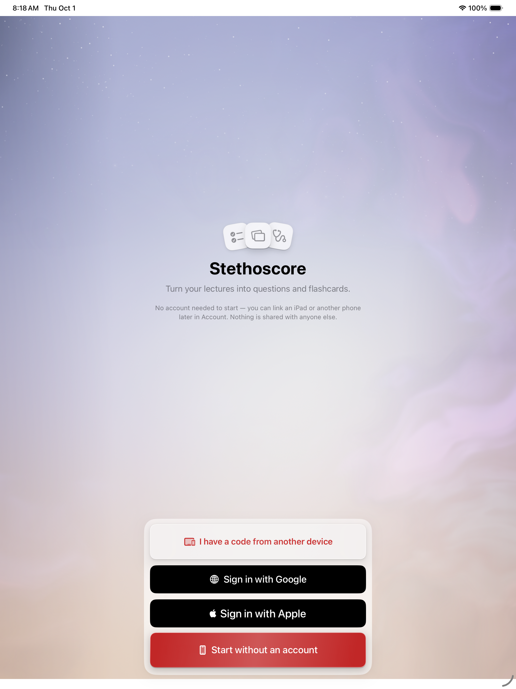

### ipad/2-signed-in: iPad Pro 13-inch (M5)

```
bundle=com.cramdown.personal exe=Stethoscore Personal
keep=1 args=-launchTestSignedIn
launch_status=0
peak_rss_mb=345
pid=33872 alive_after_30s=yes
--- stderr.txt (last 25 of 1)
IOSurfaceClientSetSurfaceNotify failed e00002c7
--- log-process.txt: 56 matching lines (last 30)
2026-10-01 08:20:33.336 Df Stethoscore Personal[33872:186e4] [com.apple.CFNetwork:Default] Initializing CFHTTPCookieStorage singleton
2026-10-01 08:20:33.336 Df Stethoscore Personal[33872:186e4] [com.apple.CFNetwork:Default] Creating default cookie storage with process/bundle identifier
2026-10-01 08:20:33.341 Df Stethoscore Personal[33872:186e4] [com.apple.CFNetwork:Default] Initializing AlternativeServices Storage singleton
2026-10-01 08:20:33.342 Df Stethoscore Personal[33872:186e4] [com.apple.FileURL:default] kExcludedFromBackupXattrName set on path: /Users/runner/Library/Developer/CoreSimulator/Devices/A2011F14-88A1-46AA-999A-FD6FEDCD870B/data/Containers/Data/Application/AE0AFD23-D707-421B-87C7-AE70DA13F46F/Library/HTTPStorages/com.cramdown.personal
2026-10-01 08:20:33.350 Df Stethoscore Personal[33872:186e4] [com.apple.CFNetwork:Default] Connection 0: creating secure tcp or quic connection
2026-10-01 08:20:33.368 Df Stethoscore Personal[33872:186e4] [com.apple.CFNetwork:Default] Connection 1: enabling TLS
2026-10-01 08:20:33.368 Df Stethoscore Personal[33872:186e4] [com.apple.CFNetwork:Default] Connection 1: starting, TC(0x0)
2026-10-01 08:20:33.374 Df Stethoscore Personal[33872:186e4] [com.apple.CFNetwork:Default] Task <1AB7EB9E-BDF8-407B-A2B8-C66A79399453>.<1> setting up Connection 1
2026-10-01 08:20:33.397 Df Stethoscore Personal[33872:1882f] [com.apple.CFNetwork:Default] Garbage collection for alternative services
2026-10-01 08:20:33.416 Df Stethoscore Personal[33872:186e4] [com.apple.CFNetwork:Default] Connection 1: asked to evaluate TLS Trust
2026-10-01 08:20:33.419 Df Stethoscore Personal[33872:186e4] [com.apple.CFNetwork:Default] Task <1AB7EB9E-BDF8-407B-A2B8-C66A79399453>.<1> auth completion disp=1 cred=0x0
2026-10-01 08:20:33.456 Df Stethoscore Personal[33872:186e4] [com.apple.CFNetwork:Default] System Trust Evaluation yielded status(0)
2026-10-01 08:20:33.471 Df Stethoscore Personal[33872:186c1] [com.apple.CFNetwork:Default] Connection 1: TLS Trust result 0
2026-10-01 08:20:33.474 Df Stethoscore Personal[33872:186c1] [com.apple.network:boringssl] nw_protocol_boringssl_signal_connected(895) [C1.1.1.1:2][0x1164811e0] TLS connected [server(0) version(0x0304) ciphersuite(TLS_AES_256_GCM_SHA384) group(0x11ec) signature_alg(0x0403) alpn(h2) resumed(0) offered_ticket(0) in_early_data(0) early_data_accepted(0) false_started(0) ocsp_received(0) sct_received(1
2026-10-01 08:20:33.475 Df Stethoscore Personal[33872:186c1] [com.apple.CFNetwork:Default] Connection 1: connected successfully
2026-10-01 08:20:33.475 Df Stethoscore Personal[33872:186c1] [com.apple.CFNetwork:Default] Connection 1: TLS handshake complete
2026-10-01 08:20:33.475 Df Stethoscore Personal[33872:186c1] [com.apple.CFNetwork:Default] Connection 1: ready C(N) E(N)
2026-10-01 08:20:33.505 Df Stethoscore Personal[33872:186c1] [com.apple.CFNetwork:Default] Task <1AB7EB9E-BDF8-407B-A2B8-C66A79399453>.<1> now using Connection 1
2026-10-01 08:20:33.511 Df Stethoscore Personal[33872:186c1] [com.apple.CFNetwork:Default] Task <1AB7EB9E-BDF8-407B-A2B8-C66A79399453>.<1> sent request, body S 2
2026-10-01 08:20:33.641 Df Stethoscore Personal[33872:1882f] [com.apple.CFNetwork:Default] Task <1AB7EB9E-BDF8-407B-A2B8-C66A79399453>.<1> received response, status 200 content U
2026-10-01 08:20:33.641 Df Stethoscore Personal[33872:1882f] [com.apple.CFNetwork:Default] Task <1AB7EB9E-BDF8-407B-A2B8-C66A79399453>.<1> done using Connection 1
2026-10-01 08:20:33.669 Df Stethoscore Personal[33872:1882f] [com.apple.CFNetwork:Default] Task <1AB7EB9E-BDF8-407B-A2B8-C66A79399453>.<1> response ended
2026-10-01 08:20:33.670 Df Stethoscore Personal[33872:186e4] [com.apple.CFNetwork:Default] Task <1AB7EB9E-BDF8-407B-A2B8-C66A79399453>.<1> finished successfully
2026-10-01 08:20:34.283 I  Stethoscore Personal[33872:1894c] [com.apple.storekit:Default] AAFService Closing XPCConnection ddf00075
2026-10-01 08:20:34.293 Df Stethoscore Personal[33872:18830] [com.apple.storekit:Default] AAFService connection invalidated
2026-10-01 08:20:34.303 Df Stethoscore Personal[33872:1894c] [com.apple.storekit:Default] Registering for 'transactionsupdated' daemon notification
2026-10-01 08:20:36.105 Df Stethoscore Personal[33872:18638] [com.apple.network:activity] <nw_activity 50:1 [1510D2BD-A4A1-4A4A-BC9C-050E1C242DB8] (global parent) (reporting strategy default) complete (reason success)> complete with reason 2 (success), duration 9303ms
2026-10-01 08:20:36.105 Df Stethoscore Personal[33872:18638] [com.apple.network:activity] <nw_activity 50:2 [30F1B663-B614-4709-B0FA-3D8DCC4BFAEB] (reporting strategy default) complete (reason success)> complete with reason 2 (success), duration 9303ms
2026-10-01 08:20:36.105 Df Stethoscore Personal[33872:18638] [com.apple.network:activity] Unsetting the global parent activity <nw_activity 50:1 [1510D2BD-A4A1-4A4A-BC9C-050E1C242DB8] (global parent) (reporting strategy default) complete (reason success)>
2026-10-01 08:21:19.565 Df Stethoscore Personal[33872:186e1] [com.apple.FileURL:default] kExcludedFromBackupXattrName set on path: /Users/runner/Library/Developer/CoreSimulator/Devices/A2011F14-88A1-46AA-999A-FD6FEDCD870B/data/Containers/Data/Application/AE0AFD23-D707-421B-87C7-AE70DA13F46F/Library/Application Support/RedPenSources
--- log-system.txt: 126 matching lines (last 30)
2026-10-01 08:20:25.198 Df splashboardd[28660:14fd6] [com.apple.SplashBoard:Capture] Updating window to <XBLaunchStateRequest: 0x105e76300; groupID: com.cramdown.personal - {DEFAULT GROUP}; statusBar: normal; refSize: {1032, 1376}; naturalSize: {1376, 1032}; orientation: LandscapeLeft; userInterfaceStyle: Dark>
```
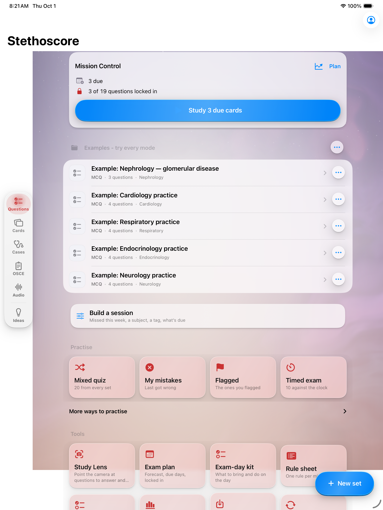

### ipad/3-relaunch: iPad Pro 13-inch (M5)

```
bundle=com.cramdown.personal exe=Stethoscore Personal
keep=1 args=
launch_status=0
peak_rss_mb=347
pid=37209 alive_after_30s=yes
--- stderr.txt (last 25 of 1)
IOSurfaceClientSetSurfaceNotify failed e00002c7
--- log-process.txt: 31 matching lines (last 30)
2026-10-01 08:22:09.799 Df Stethoscore Personal[37209:1a66e] [com.apple.dt.xctest:Default] notify_get_state check indicated test daemon not ready.
2026-10-01 08:22:09.799 Df Stethoscore Personal[37209:1a66e] [com.apple.dt.xctest:Default] notify_get_state check indicated test daemon not ready.
2026-10-01 08:22:09.799 Df Stethoscore Personal[37209:1a66e] [com.apple.dt.xctest:Default] notify_get_state check indicated test daemon not ready.
2026-10-01 08:22:09.821 Df Stethoscore Personal[37209:1a66e] [com.apple.UIKit:KeyWindow] Setting default evaluation strategy for UIUserInterfaceIdiomPad to LastOneWins
2026-10-01 08:22:09.821 Df Stethoscore Personal[37209:1a66e] [com.apple.UIKit:KeyWindow] Setting default evaluation strategy for UIUserInterfaceIdiomPad to SystemShellManaged
2026-10-01 08:22:09.863 Df Stethoscore Personal[37209:1a66e] [com.apple.FileURL:default] kExcludedFromBackupXattrName set on path: /Users/runner/Library/Developer/CoreSimulator/Devices/A2011F14-88A1-46AA-999A-FD6FEDCD870B/data/Containers/Data/Application/9BBB6682-A74E-4BF7-BF0E-C53B5C2F199D/Library/Application Support/RedPenBlobs
2026-10-01 08:22:10.893 I  Stethoscore Personal[37209:1a66e] [com.apple.DesignLibrary:defaults] liveTuning=false
2026-10-01 08:22:11.042 Df Stethoscore Personal[37209:1a66e] [PrototypeTools:domain] Not observing PTDefaults on customer install.
2026-10-01 08:22:11.175 Df Stethoscore Personal[37209:1a676] [com.apple.calls.callkit:Default] Call host has no calls
2026-10-01 08:22:11.314 I  Stethoscore Personal[37209:1a67a] [com.apple.storekit:Default] AAFService Starting new XPCConnection 05e78991
2026-10-01 08:22:11.343 Df Stethoscore Personal[37209:1a679] [com.apple.storekit:Default] [Default] Finished iterating transaction batches
2026-10-01 08:22:11.343 I  Stethoscore Personal[37209:1a698] [com.apple.storekit:Default] AAFService Closing XPCConnection 05e78991
2026-10-01 08:22:11.352 Df Stethoscore Personal[37209:1a679] [com.apple.storekit:Default] AAFService connection invalidated
2026-10-01 08:22:12.633 Df Stethoscore Personal[37209:1a66e] [com.apple.network:activity] Create activity from XPC object <nw_activity 50:1 [5188F554-D45D-4C62-8908-54FD96C02B81] (reporting strategy default)>
2026-10-01 08:22:12.633 Df Stethoscore Personal[37209:1a66e] [com.apple.network:activity] Create activity from XPC object <nw_activity 50:2 [16BD27BB-59FA-4CDE-A824-0EE29FCC449C] (reporting strategy default)>
2026-10-01 08:22:12.633 Df Stethoscore Personal[37209:1a66e] [com.apple.network:activity] Set activity <nw_activity 50:1 [5188F554-D45D-4C62-8908-54FD96C02B81] (reporting strategy default)> as the global parent
2026-10-01 08:22:12.783 I  Stethoscore Personal[37209:1a6db] [com.apple.storekit:Default] AAFService Starting new XPCConnection 8b057427
2026-10-01 08:22:12.791 I  Stethoscore Personal[37209:1a66e] [com.apple.PointerUI:Common] Activating Connection: <BSXPC(com.apple.PointerUI.pointeruid.service[C:3-1])-as(com.apple.PointerUI.pointeruid.default-service):0x1026b2ee0 name=(null)>
2026-10-01 08:22:12.817 Df Stethoscore Personal[37209:1a676] [com.apple.storekit:Default] [Default] Finished iterating transaction batches
2026-10-01 08:22:12.817 I  Stethoscore Personal[37209:1a676] [com.apple.storekit:Default] AAFService Closing XPCConnection 8b057427
2026-10-01 08:22:12.818 I  Stethoscore Personal[37209:1a676] [com.apple.storekit:Default] AAFService Starting new XPCConnection f692e2eb
2026-10-01 08:22:12.850 Df Stethoscore Personal[37209:1a679] [com.apple.storekit:Default] AAFService connection invalidated
2026-10-01 08:22:12.864 Df Stethoscore Personal[37209:1a676] [com.apple.storekit:Default] [Default] Finished iterating transaction batches
2026-10-01 08:22:13.688 I  Stethoscore Personal[37209:1a676] [com.apple.storekit:Default] AAFService Closing XPCConnection f692e2eb
2026-10-01 08:22:13.727 Df Stethoscore Personal[37209:1a676] [com.apple.storekit:Default] Registering for 'transactionsupdated' daemon notification
2026-10-01 08:22:13.737 Df Stethoscore Personal[37209:1a679] [com.apple.storekit:Default] AAFService connection invalidated
2026-10-01 08:22:16.436 Df Stethoscore Personal[37209:1a66e] [com.apple.network:activity] <nw_activity 50:1 [5188F554-D45D-4C62-8908-54FD96C02B81] (global parent) (reporting strategy default) complete (reason success)> complete with reason 2 (success), duration 8390ms
2026-10-01 08:22:16.437 Df Stethoscore Personal[37209:1a66e] [com.apple.network:activity] <nw_activity 50:2 [16BD27BB-59FA-4CDE-A824-0EE29FCC449C] (reporting strategy default) complete (reason success)> complete with reason 2 (success), duration 8390ms
2026-10-01 08:22:16.437 Df Stethoscore Personal[37209:1a66e] [com.apple.network:activity] Unsetting the global parent activity <nw_activity 50:1 [5188F554-D45D-4C62-8908-54FD96C02B81] (global parent) (reporting strategy default) complete (reason success)>
2026-10-01 08:22:21.139 Df Stethoscore Personal[37209:1a760] [com.apple.FileURL:default] kExcludedFromBackupXattrName set on path: /Users/runner/Library/Developer/CoreSimulator/Devices/A2011F14-88A1-46AA-999A-FD6FEDCD870B/data/Containers/Data/Application/9BBB6682-A74E-4BF7-BF0E-C53B5C2F199D/Library/Application Support/RedPenSources
--- log-system.txt: 123 matching lines (last 30)
2026-10-01 08:22:06.508 Df splashboardd[28660:14fd6] [com.apple.SplashBoard:Capture] Updating window to <XBLaunchStateRequest: 0x105e743f0; groupID: com.cramdown.personal - {DEFAULT GROUP}; statusBar: normal; refSize: {1032, 1376}; naturalSize: {1376, 1032}; orientation: LandscapeLeft; userInterfaceStyle: Dark>
```
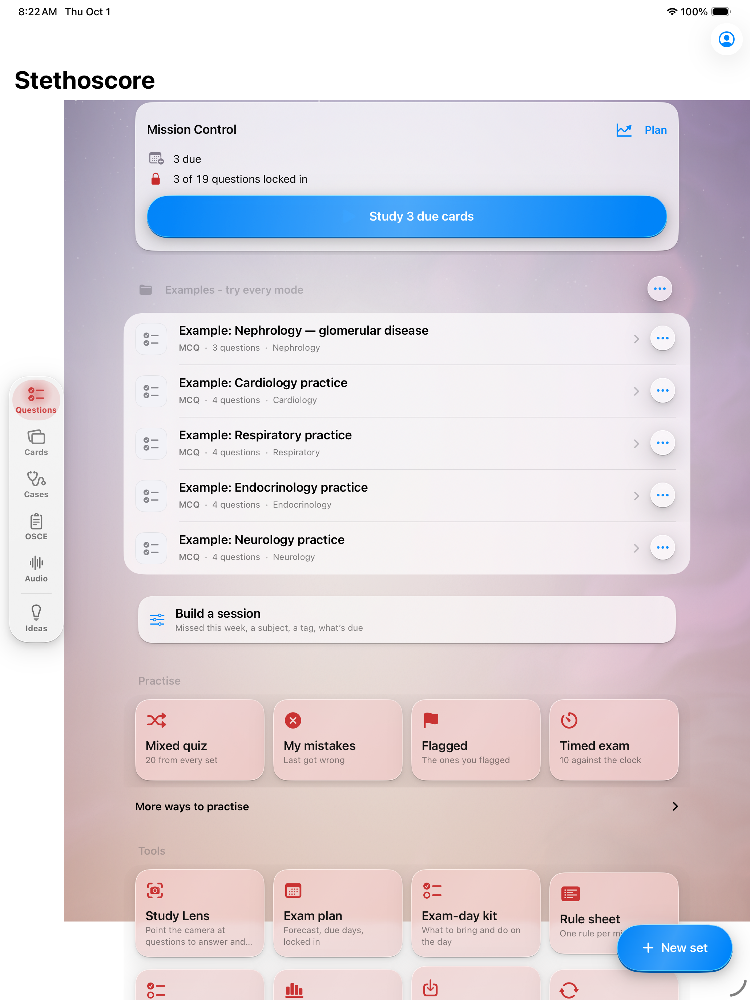

### ipad/6-open-every-set: iPad Pro 13-inch (M5)

```
bundle=com.cramdown.personal exe=Stethoscore Personal
keep=1 args=-launchTestSignedIn -launchTestOpenSets
launch_status=0
peak_rss_mb=349
pid=39724 alive_after_60s=yes
--- stderr.txt (last 25 of 1)
IOSurfaceClientSetSurfaceNotify failed e00002c7
--- log-process.txt: 31 matching lines (last 30)
2026-10-01 08:23:21.117 Df Stethoscore Personal[39724:1bff6] [com.apple.dt.xctest:Default] notify_get_state check indicated test daemon not ready.
2026-10-01 08:23:21.117 Df Stethoscore Personal[39724:1bff6] [com.apple.dt.xctest:Default] notify_get_state check indicated test daemon not ready.
2026-10-01 08:23:21.118 Df Stethoscore Personal[39724:1bff6] [com.apple.dt.xctest:Default] notify_get_state check indicated test daemon not ready.
2026-10-01 08:23:21.181 Df Stethoscore Personal[39724:1bff6] [com.apple.FileURL:default] kExcludedFromBackupXattrName set on path: /Users/runner/Library/Developer/CoreSimulator/Devices/A2011F14-88A1-46AA-999A-FD6FEDCD870B/data/Containers/Data/Application/49AFBFA9-61AD-4555-8F82-DED653AC0E7D/Library/Application Support/RedPenBlobs
2026-10-01 08:23:21.276 Df Stethoscore Personal[39724:1bff6] [com.apple.UIKit:KeyWindow] Setting default evaluation strategy for UIUserInterfaceIdiomPad to LastOneWins
2026-10-01 08:23:21.277 Df Stethoscore Personal[39724:1bff6] [com.apple.UIKit:KeyWindow] Setting default evaluation strategy for UIUserInterfaceIdiomPad to SystemShellManaged
2026-10-01 08:23:22.092 I  Stethoscore Personal[39724:1bff6] [com.apple.DesignLibrary:defaults] liveTuning=false
2026-10-01 08:23:22.212 Df Stethoscore Personal[39724:1bff6] [PrototypeTools:domain] Not observing PTDefaults on customer install.
2026-10-01 08:23:22.309 Df Stethoscore Personal[39724:1c017] [com.apple.calls.callkit:Default] Call host has no calls
2026-10-01 08:23:22.403 I  Stethoscore Personal[39724:1c014] [com.apple.storekit:Default] AAFService Starting new XPCConnection 351a29dc
2026-10-01 08:23:22.447 Df Stethoscore Personal[39724:1c016] [com.apple.storekit:Default] [Default] Finished iterating transaction batches
2026-10-01 08:23:22.447 I  Stethoscore Personal[39724:1c016] [com.apple.storekit:Default] AAFService Closing XPCConnection 351a29dc
2026-10-01 08:23:22.447 Df Stethoscore Personal[39724:1c016] [com.apple.storekit:Default] AAFService connection invalidated
2026-10-01 08:23:23.470 Df Stethoscore Personal[39724:1bff6] [com.apple.network:activity] Create activity from XPC object <nw_activity 50:1 [540A9C97-B49A-4AC2-9B9C-1349E0105E33] (reporting strategy default)>
2026-10-01 08:23:23.471 Df Stethoscore Personal[39724:1bff6] [com.apple.network:activity] Create activity from XPC object <nw_activity 50:2 [D4B72C7C-494F-4477-959A-9C6C1FC8DB6E] (reporting strategy default)>
2026-10-01 08:23:23.471 Df Stethoscore Personal[39724:1bff6] [com.apple.network:activity] Set activity <nw_activity 50:1 [540A9C97-B49A-4AC2-9B9C-1349E0105E33] (reporting strategy default)> as the global parent
2026-10-01 08:23:23.475 I  Stethoscore Personal[39724:1c017] [com.apple.storekit:Default] AAFService Starting new XPCConnection 26f22895
2026-10-01 08:23:23.484 I  Stethoscore Personal[39724:1bff6] [com.apple.PointerUI:Common] Activating Connection: <BSXPC(com.apple.PointerUI.pointeruid.service[C:3-1])-as(com.apple.PointerUI.pointeruid.default-service):0x103e0b1b0 name=(null)>
2026-10-01 08:23:23.492 Df Stethoscore Personal[39724:1c043] [com.apple.storekit:Default] [Default] Finished iterating transaction batches
2026-10-01 08:23:23.492 I  Stethoscore Personal[39724:1c043] [com.apple.storekit:Default] AAFService Closing XPCConnection 26f22895
2026-10-01 08:23:23.492 I  Stethoscore Personal[39724:1c017] [com.apple.storekit:Default] AAFService Starting new XPCConnection d4d3a72f
2026-10-01 08:23:23.502 Df Stethoscore Personal[39724:1c014] [com.apple.storekit:Default] AAFService connection invalidated
2026-10-01 08:23:23.510 Df Stethoscore Personal[39724:1c043] [com.apple.storekit:Default] [Default] Finished iterating transaction batches
2026-10-01 08:23:24.419 I  Stethoscore Personal[39724:1c043] [com.apple.storekit:Default] AAFService Closing XPCConnection d4d3a72f
2026-10-01 08:23:24.419 Df Stethoscore Personal[39724:1c043] [com.apple.storekit:Default] AAFService connection invalidated
2026-10-01 08:23:24.420 Df Stethoscore Personal[39724:1c045] [com.apple.storekit:Default] Registering for 'transactionsupdated' daemon notification
2026-10-01 08:23:25.313 Df Stethoscore Personal[39724:1bff6] [com.apple.network:activity] <nw_activity 50:1 [540A9C97-B49A-4AC2-9B9C-1349E0105E33] (global parent) (reporting strategy default) complete (reason success)> complete with reason 2 (success), duration 5640ms
2026-10-01 08:23:25.313 Df Stethoscore Personal[39724:1bff6] [com.apple.network:activity] <nw_activity 50:2 [D4B72C7C-494F-4477-959A-9C6C1FC8DB6E] (reporting strategy default) complete (reason success)> complete with reason 2 (success), duration 5640ms
2026-10-01 08:23:25.313 Df Stethoscore Personal[39724:1bff6] [com.apple.network:activity] Unsetting the global parent activity <nw_activity 50:1 [540A9C97-B49A-4AC2-9B9C-1349E0105E33] (global parent) (reporting strategy default) complete (reason success)>
2026-10-01 08:23:32.987 Df Stethoscore Personal[39724:1c045] [com.apple.FileURL:default] kExcludedFromBackupXattrName set on path: /Users/runner/Library/Developer/CoreSimulator/Devices/A2011F14-88A1-46AA-999A-FD6FEDCD870B/data/Containers/Data/Application/49AFBFA9-61AD-4555-8F82-DED653AC0E7D/Library/Application Support/RedPenSources
--- log-system.txt: 121 matching lines (last 30)
2026-10-01 08:23:19.053 Df SpringBoard[25234:1bab7] [com.apple.SplashBoard:FileManifest] <XBApplicationSnapshotManifestImpl: 0x124132000> [com.cramdown.personal] Snapshot data for <XBApplicationSnapshot: 0x1241e9a40; …6182BFAD2072> [com.cramdown.personal] written to file: /Users/runner/Library/Developer/CoreSimulator/Devices/A2011F14-88A1-46AA-999A-FD6FEDCD870B/data/Containers/Data/Application/49A
```
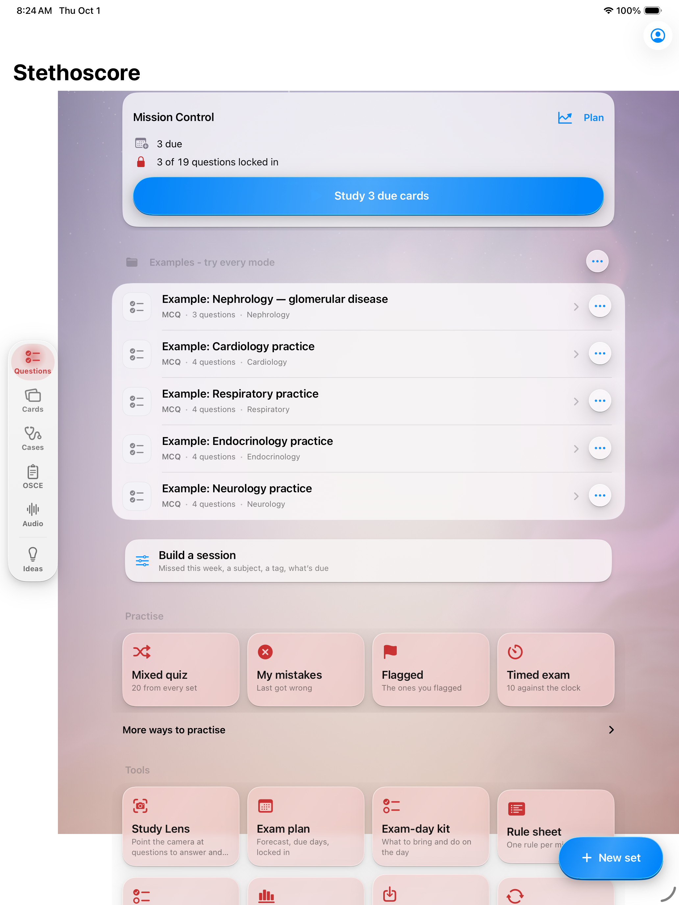

### iphone/1-fresh: iPhone 17 Pro

```
bundle=com.cramdown.personal exe=Stethoscore Personal
keep=0 args=
launch_status=0
peak_rss_mb=188
pid=8456 alive_after_30s=yes
--- stderr.txt (last 25 of 1)
IOSurfaceClientSetSurfaceNotify failed e00002c7
--- log-process.txt: 19 matching lines (last 30)
2026-10-01 08:01:33.181 Df Stethoscore Personal[8456:736d] [com.apple.dt.xctest:Default] Registering for test daemon availability notify post.
2026-10-01 08:01:33.181 Df Stethoscore Personal[8456:736d] [com.apple.dt.xctest:Default] notify_get_state check indicated test daemon not ready.
2026-10-01 08:01:33.182 Df Stethoscore Personal[8456:736d] [com.apple.dt.xctest:Default] notify_get_state check indicated test daemon not ready.
2026-10-01 08:01:33.182 Df Stethoscore Personal[8456:736d] [com.apple.dt.xctest:Default] notify_get_state check indicated test daemon not ready.
2026-10-01 08:01:33.357 Df Stethoscore Personal[8456:736d] [com.apple.FileURL:default] kExcludedFromBackupXattrName set on path: /Users/runner/Library/Developer/CoreSimulator/Devices/22452A91-4697-4369-8812-53ADB77EB73B/data/Containers/Data/Application/6CCE51E8-D968-4C6B-A9E8-58453DAFB9DD/Library/Application Support/RedPenBlobs
2026-10-01 08:01:33.562 Df Stethoscore Personal[8456:736d] [com.apple.UIKit:KeyWindow] Setting default evaluation strategy for UIUserInterfaceIdiomPhone to LastOneWins
2026-10-01 08:01:33.563 Df Stethoscore Personal[8456:736d] [com.apple.UIKit:KeyWindow] Setting default evaluation strategy for UIUserInterfaceIdiomPhone to SystemShellManaged
2026-10-01 08:01:34.493 Df Stethoscore Personal[8456:736d] [PrototypeTools:domain] Not observing PTDefaults on customer install.
2026-10-01 08:01:35.929 Df Stethoscore Personal[8456:736d] [com.apple.network:activity] Create activity from XPC object <nw_activity 50:1 [55D82C76-AF9C-4E96-A858-021EB18C1089] (reporting strategy default)>
2026-10-01 08:01:35.929 Df Stethoscore Personal[8456:736d] [com.apple.network:activity] Create activity from XPC object <nw_activity 50:2 [D817F98D-5D1F-42AF-AF9C-F174AF8CCDD4] (reporting strategy default)>
2026-10-01 08:01:35.929 Df Stethoscore Personal[8456:736d] [com.apple.network:activity] Set activity <nw_activity 50:1 [55D82C76-AF9C-4E96-A858-021EB18C1089] (reporting strategy default)> as the global parent
2026-10-01 08:01:36.405 Df Stethoscore Personal[8456:73c5] [com.apple.storekit:Default] [Default] Finished iterating transaction batches
2026-10-01 08:01:36.405 Df Stethoscore Personal[8456:73c5] [com.apple.storekit:Default] AAFService connection invalidated
2026-10-01 08:01:36.667 Df Stethoscore Personal[8456:7497] [com.apple.storekit:Default] [Default] Finished iterating transaction batches
2026-10-01 08:01:36.670 Df Stethoscore Personal[8456:73c6] [com.apple.storekit:Default] AAFService connection invalidated
2026-10-01 08:01:36.672 Df Stethoscore Personal[8456:73b7] [com.apple.storekit:Default] Registering for 'transactionsupdated' daemon notification
2026-10-01 08:01:51.275 Df Stethoscore Personal[8456:736d] [com.apple.network:activity] <nw_activity 50:1 [55D82C76-AF9C-4E96-A858-021EB18C1089] (global parent) (reporting strategy default) complete (reason failure)> complete with reason 3 (failure), duration 20250ms
2026-10-01 08:01:51.275 Df Stethoscore Personal[8456:736d] [com.apple.network:activity] <nw_activity 50:2 [D817F98D-5D1F-42AF-AF9C-F174AF8CCDD4] (reporting strategy default) complete (reason failure)> complete with reason 3 (failure), duration 20251ms
2026-10-01 08:01:51.275 Df Stethoscore Personal[8456:736d] [com.apple.network:activity] Unsetting the global parent activity <nw_activity 50:1 [55D82C76-AF9C-4E96-A858-021EB18C1089] (global parent) (reporting strategy default) complete (reason failure)>
--- log-system.txt: 71 matching lines (last 30)
2026-10-01 08:01:24.730 Df SpringBoard[5378:5fde] [com.apple.SplashBoard:FileManifest] <XBApplicationSnapshotManifestImpl: 0x117f92580> [com.cramdown.personal] Snapshot data for <XBApplicationSnapshot: 0x11a226300; …F2BDD13D8AF9> [com.cramdown.personal] written to file: /Users/runner/Library/Developer/CoreSimulator/Devices/22452A91-4697-4369-8812-53ADB77EB73B/data/Containers/Data/Application/6CCE5
2026-10-01 08:01:24.736 Df splashboardd[8271:7166] [com.apple.SplashBoard:Capture] Updating window to <XBLaunchStateRequest: 0x101e84000; groupID: com.cramdown.personal - {DEFAULT GROUP}; statusBar: normal; refSize: {402, 874}; orientation: Portrait; userInterfaceStyle: Dark>
2026-10-01 08:01:24.745 Df SpringBoard[5378:5f80] [com.apple.UserNotifications:DataProviderFactory] [com.cramdown.personal] Application installed using default data provider
2026-10-01 08:01:24.868 Df SpringBoard[5378:5ead] [com.apple.SplashBoard:Capture] Image generation complete for: <XBLaunchStateRequest: 0x11b5f56c0; groupID: com.cramdown.personal - {DEFAULT GROUP}; statusBar: normal; refSize: {402, 874}; orientation: Portrait; userInterfaceStyle: Dark>
2026-10-01 08:01:24.869 Df SpringBoard[5378:5fde] [com.apple.SplashBoard:FileManifest] <XBApplicationSnapshotManifestImpl: 0x117f92580> [com.cramdown.personal] Snapshot data for <XBApplicationSnapshot: 0x11a226840; …2FA6BDF4DD2C> [com.cramdown.personal] written to file: /Users/runner/Library/Developer/CoreSimulator/Devices/22452A91-4697-4369-8812-53ADB77EB73B/data/Containers/Data/Application/6CCE5
2026-10-01 08:01:26.591 Df callservicesd[5474:652e] [com.apple.calls.copresencecore:Default] Invalidating cached value for bundle identifier: com.cramdown.personal
2026-10-01 08:01:26.619 Df callservicesd[5474:652e] [com.apple.calls.copresencecore:Default] Invalidating cached value for bundle identifier: com.cramdown.personal
2026-10-01 08:01:28.730 Df biomed[5392:4d7c] [com.apple.Biome:BiomeCascade] Creating dataResource: CCDataResource: file:///Users/runner/Library/Developer/CoreSimulator/Devices/22452A91-4697-4369-8812-53ADB77EB73B/data/Library/Biome/sets/Default/App.Shortcut.Phrase/sourceIdentifier=com.cramdown.personal/ in temporary path: /Users/runner/Library/Developer/CoreSimulator/Devices/22452A91-4697-4369-881
2026-10-01 08:01:28.748 Df biomed[5392:4d7c] [com.apple.Biome:BiomeCascade] Successfully renamed temporary directory and moved to final path: /Users/runner/Library/Developer/CoreSimulator/Devices/22452A91-4697-4369-8812-53ADB77EB73B/data/Library/Biome/sets/Default/App.Shortcut.Phrase/sourceIdentifier=com.cramdown.personal/Database
    "terminate_running_process" = 1;
	retryTimeout: 120.000000 (default write com.apple.CoreSimulatorBridge LaunchRetryTimeout <value>)
	bootTimeout: 300.000000 (default write com.apple.CoreSimulatorBridge BootRetryTimeout <value>)
```
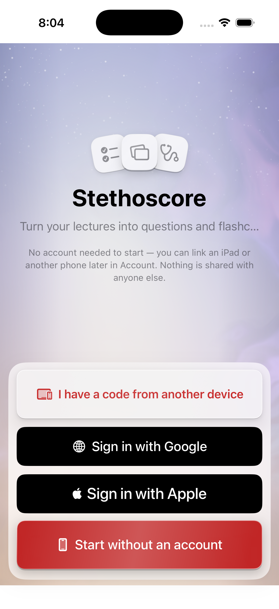

### iphone/2-signed-in: iPhone 17 Pro

```
bundle=com.cramdown.personal exe=Stethoscore Personal
keep=1 args=-launchTestSignedIn
launch_status=0
peak_rss_mb=369
pid=13651 alive_after_30s=yes
--- stderr.txt (last 25 of 1)
IOSurfaceClientSetSurfaceNotify failed e00002c7
--- log-process.txt: 55 matching lines (last 30)
2026-10-01 08:05:50.462 Df Stethoscore Personal[13651:a9a7] [com.apple.CFNetwork:Default] Creating default cookie storage with process/bundle identifier
2026-10-01 08:05:50.475 Df Stethoscore Personal[13651:a9a7] [com.apple.CFNetwork:Default] Initializing AlternativeServices Storage singleton
2026-10-01 08:05:50.476 Df Stethoscore Personal[13651:a9a7] [com.apple.FileURL:default] kExcludedFromBackupXattrName set on path: /Users/runner/Library/Developer/CoreSimulator/Devices/22452A91-4697-4369-8812-53ADB77EB73B/data/Containers/Data/Application/6DDBE881-1E14-49B8-9C8C-A18F22367129/Library/HTTPStorages/com.cramdown.personal
2026-10-01 08:05:50.479 Df Stethoscore Personal[13651:a9b3] [com.apple.storekit:Default] AAFService connection invalidated
2026-10-01 08:05:50.500 Df Stethoscore Personal[13651:a9a7] [com.apple.CFNetwork:Default] Connection 0: creating secure tcp or quic connection
2026-10-01 08:05:50.958 I  Stethoscore Personal[13651:ab31] [com.apple.storekit:Default] AAFService Closing XPCConnection a0a6fabb
2026-10-01 08:05:50.968 Df Stethoscore Personal[13651:ab32] [com.apple.storekit:Default] Registering for 'transactionsupdated' daemon notification
2026-10-01 08:05:50.978 Df Stethoscore Personal[13651:ab34] [com.apple.storekit:Default] AAFService connection invalidated
2026-10-01 08:05:51.029 Df Stethoscore Personal[13651:a9a7] [com.apple.CFNetwork:Default] Connection 1: enabling TLS
2026-10-01 08:05:51.030 Df Stethoscore Personal[13651:a9a7] [com.apple.CFNetwork:Default] Connection 1: starting, TC(0x0)
2026-10-01 08:05:51.635 Df Stethoscore Personal[13651:a9a7] [com.apple.CFNetwork:Default] Task <85D01413-59BC-4CC7-ACE3-1327A22C78AB>.<1> setting up Connection 1
2026-10-01 08:05:51.878 Df Stethoscore Personal[13651:ab34] [com.apple.CFNetwork:Default] Connection 1: asked to evaluate TLS Trust
2026-10-01 08:05:51.897 Df Stethoscore Personal[13651:ab34] [com.apple.CFNetwork:Default] Task <85D01413-59BC-4CC7-ACE3-1327A22C78AB>.<1> auth completion disp=1 cred=0x0
2026-10-01 08:05:51.972 Df Stethoscore Personal[13651:ab32] [com.apple.CFNetwork:Default] System Trust Evaluation yielded status(0)
2026-10-01 08:05:52.013 Df Stethoscore Personal[13651:ab35] [com.apple.CFNetwork:Default] Connection 1: TLS Trust result 0
2026-10-01 08:05:52.019 Df Stethoscore Personal[13651:ab35] [com.apple.network:boringssl] nw_protocol_boringssl_signal_connected(895) [C1.1.1.1:2][0x116093c60] TLS connected [server(0) version(0x0304) ciphersuite(TLS_AES_256_GCM_SHA384) group(0x11ec) signature_alg(0x0403) alpn(h2) resumed(0) offered_ticket(0) in_early_data(0) early_data_accepted(0) false_started(0) ocsp_received(0) sct_received(1)
2026-10-01 08:05:52.040 Df Stethoscore Personal[13651:ab35] [com.apple.CFNetwork:Default] Connection 1: connected successfully
2026-10-01 08:05:52.040 Df Stethoscore Personal[13651:ab35] [com.apple.CFNetwork:Default] Connection 1: TLS handshake complete
2026-10-01 08:05:52.041 Df Stethoscore Personal[13651:ab35] [com.apple.CFNetwork:Default] Connection 1: ready C(N) E(N)
2026-10-01 08:05:52.052 Df Stethoscore Personal[13651:ab35] [com.apple.CFNetwork:Default] Task <85D01413-59BC-4CC7-ACE3-1327A22C78AB>.<1> now using Connection 1
2026-10-01 08:05:52.053 Df Stethoscore Personal[13651:ab35] [com.apple.CFNetwork:Default] Task <85D01413-59BC-4CC7-ACE3-1327A22C78AB>.<1> sent request, body S 2
2026-10-01 08:05:52.134 Df Stethoscore Personal[13651:a9a7] [com.apple.CFNetwork:Default] Task <85D01413-59BC-4CC7-ACE3-1327A22C78AB>.<1> received response, status 200 content U
2026-10-01 08:05:52.134 Df Stethoscore Personal[13651:a9a7] [com.apple.CFNetwork:Default] Task <85D01413-59BC-4CC7-ACE3-1327A22C78AB>.<1> done using Connection 1
2026-10-01 08:05:52.142 Df Stethoscore Personal[13651:a9a7] [com.apple.CFNetwork:Default] Task <85D01413-59BC-4CC7-ACE3-1327A22C78AB>.<1> response ended
2026-10-01 08:05:52.143 Df Stethoscore Personal[13651:ab35] [com.apple.CFNetwork:Default] Task <85D01413-59BC-4CC7-ACE3-1327A22C78AB>.<1> finished successfully
2026-10-01 08:05:53.142 Df Stethoscore Personal[13651:ab35] [com.apple.CFNetwork:Default] Garbage collection for alternative services
2026-10-01 08:06:01.540 Df Stethoscore Personal[13651:a94b] [com.apple.network:activity] <nw_activity 50:1 [EB75C636-E7F2-4403-9DE4-14A06E8E9B5B] (global parent) (reporting strategy default) complete (reason success)> complete with reason 2 (success), duration 17002ms
2026-10-01 08:06:01.540 Df Stethoscore Personal[13651:a94b] [com.apple.network:activity] <nw_activity 50:2 [E8AC9415-1C32-4912-B804-3653BD70EE9E] (reporting strategy default) complete (reason success)> complete with reason 2 (success), duration 17001ms
2026-10-01 08:06:01.540 Df Stethoscore Personal[13651:a94b] [com.apple.network:activity] Unsetting the global parent activity <nw_activity 50:1 [EB75C636-E7F2-4403-9DE4-14A06E8E9B5B] (global parent) (reporting strategy default) complete (reason success)>
2026-10-01 08:06:17.241 Df Stethoscore Personal[13651:a9b2] [com.apple.FileURL:default] kExcludedFromBackupXattrName set on path: /Users/runner/Library/Developer/CoreSimulator/Devices/22452A91-4697-4369-8812-53ADB77EB73B/data/Containers/Data/Application/6DDBE881-1E14-49B8-9C8C-A18F22367129/Library/Application Support/RedPenSources
--- log-system.txt: 80 matching lines (last 30)
2026-10-01 08:05:40.614 Df SpringBoard[5378:7a4d] [com.apple.SplashBoard:Capture] Asynchronously generating image data for request: <XBLaunchStateRequest: 0x11b7828b0; groupID: com.cramdown.personal - {DEFAULT GROUP}; statusBar: normal; refSize: {402, 874}; orientation: Portrait; userInterfaceStyle: Dark>
```
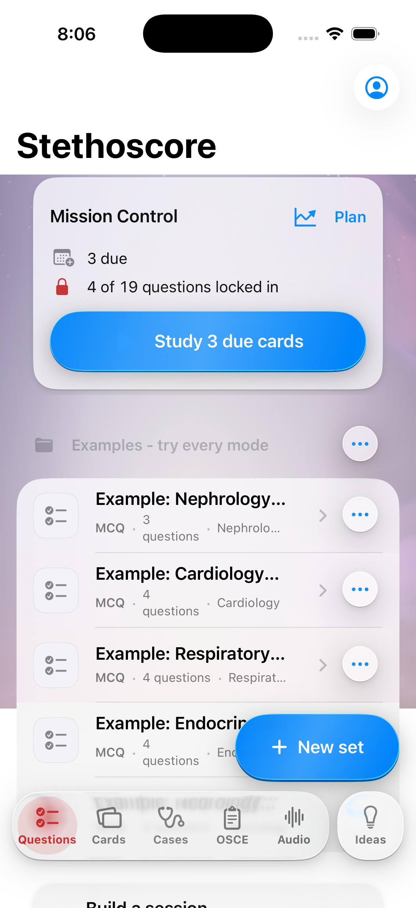

### iphone/3-relaunch: iPhone 17 Pro

```
bundle=com.cramdown.personal exe=Stethoscore Personal
keep=1 args=
launch_status=0
peak_rss_mb=334
pid=16037 alive_after_30s=yes
--- stderr.txt (last 25 of 1)
IOSurfaceClientSetSurfaceNotify failed e00002c7
--- log-process.txt: 30 matching lines (last 30)
2026-10-01 08:07:06.064 Df Stethoscore Personal[16037:c27b] [com.apple.dt.xctest:Default] Registering for test daemon availability notify post.
2026-10-01 08:07:06.064 Df Stethoscore Personal[16037:c27b] [com.apple.dt.xctest:Default] notify_get_state check indicated test daemon not ready.
2026-10-01 08:07:06.065 Df Stethoscore Personal[16037:c27b] [com.apple.dt.xctest:Default] notify_get_state check indicated test daemon not ready.
2026-10-01 08:07:06.065 Df Stethoscore Personal[16037:c27b] [com.apple.dt.xctest:Default] notify_get_state check indicated test daemon not ready.
2026-10-01 08:07:06.165 Df Stethoscore Personal[16037:c27b] [com.apple.FileURL:default] kExcludedFromBackupXattrName set on path: /Users/runner/Library/Developer/CoreSimulator/Devices/22452A91-4697-4369-8812-53ADB77EB73B/data/Containers/Data/Application/96017443-3460-4725-B9BA-77F3FF7FDCB0/Library/Application Support/RedPenBlobs
2026-10-01 08:07:06.275 Df Stethoscore Personal[16037:c27b] [com.apple.UIKit:KeyWindow] Setting default evaluation strategy for UIUserInterfaceIdiomPhone to LastOneWins
2026-10-01 08:07:06.275 Df Stethoscore Personal[16037:c27b] [com.apple.UIKit:KeyWindow] Setting default evaluation strategy for UIUserInterfaceIdiomPhone to SystemShellManaged
2026-10-01 08:07:07.265 I  Stethoscore Personal[16037:c27b] [com.apple.DesignLibrary:defaults] liveTuning=false
2026-10-01 08:07:07.423 Df Stethoscore Personal[16037:c27b] [PrototypeTools:domain] Not observing PTDefaults on customer install.
2026-10-01 08:07:07.536 Df Stethoscore Personal[16037:c2ae] [com.apple.calls.callkit:Default] Call host has no calls
2026-10-01 08:07:07.655 I  Stethoscore Personal[16037:c2a3] [com.apple.storekit:Default] AAFService Starting new XPCConnection 89b95a9b
2026-10-01 08:07:07.693 Df Stethoscore Personal[16037:c2a3] [com.apple.storekit:Default] [Default] Finished iterating transaction batches
2026-10-01 08:07:07.694 I  Stethoscore Personal[16037:c2a3] [com.apple.storekit:Default] AAFService Closing XPCConnection 89b95a9b
2026-10-01 08:07:07.694 Df Stethoscore Personal[16037:c2a3] [com.apple.storekit:Default] AAFService connection invalidated
2026-10-01 08:07:08.664 Df Stethoscore Personal[16037:c27b] [com.apple.network:activity] Create activity from XPC object <nw_activity 50:1 [C594DD4E-6EDE-4FE3-B5B6-DA29C4904968] (reporting strategy default)>
2026-10-01 08:07:08.664 Df Stethoscore Personal[16037:c27b] [com.apple.network:activity] Create activity from XPC object <nw_activity 50:2 [6BFE4AAC-FF1D-43C4-B9B0-4C524A894D15] (reporting strategy default)>
2026-10-01 08:07:08.664 Df Stethoscore Personal[16037:c27b] [com.apple.network:activity] Set activity <nw_activity 50:1 [C594DD4E-6EDE-4FE3-B5B6-DA29C4904968] (reporting strategy default)> as the global parent
2026-10-01 08:07:08.669 I  Stethoscore Personal[16037:c2c9] [com.apple.storekit:Default] AAFService Starting new XPCConnection 69b41e5a
2026-10-01 08:07:08.688 Df Stethoscore Personal[16037:c2ac] [com.apple.storekit:Default] [Default] Finished iterating transaction batches
2026-10-01 08:07:08.688 I  Stethoscore Personal[16037:c2ac] [com.apple.storekit:Default] AAFService Closing XPCConnection 69b41e5a
2026-10-01 08:07:08.688 Df Stethoscore Personal[16037:c2ac] [com.apple.storekit:Default] AAFService connection invalidated
2026-10-01 08:07:08.689 I  Stethoscore Personal[16037:c2c9] [com.apple.storekit:Default] AAFService Starting new XPCConnection 1649fbce
2026-10-01 08:07:08.728 Df Stethoscore Personal[16037:c2a4] [com.apple.storekit:Default] [Default] Finished iterating transaction batches
2026-10-01 08:07:09.301 I  Stethoscore Personal[16037:c2a4] [com.apple.storekit:Default] AAFService Closing XPCConnection 1649fbce
2026-10-01 08:07:09.303 Df Stethoscore Personal[16037:c2a4] [com.apple.storekit:Default] Registering for 'transactionsupdated' daemon notification
2026-10-01 08:07:09.303 Df Stethoscore Personal[16037:c2ae] [com.apple.storekit:Default] AAFService connection invalidated
2026-10-01 08:07:10.028 Df Stethoscore Personal[16037:c27b] [com.apple.network:activity] <nw_activity 50:1 [C594DD4E-6EDE-4FE3-B5B6-DA29C4904968] (global parent) (reporting strategy default) complete (reason success)> complete with reason 2 (success), duration 5867ms
2026-10-01 08:07:10.028 Df Stethoscore Personal[16037:c27b] [com.apple.network:activity] <nw_activity 50:2 [6BFE4AAC-FF1D-43C4-B9B0-4C524A894D15] (reporting strategy default) complete (reason success)> complete with reason 2 (success), duration 5867ms
2026-10-01 08:07:10.028 Df Stethoscore Personal[16037:c27b] [com.apple.network:activity] Unsetting the global parent activity <nw_activity 50:1 [C594DD4E-6EDE-4FE3-B5B6-DA29C4904968] (global parent) (reporting strategy default) complete (reason success)>
2026-10-01 08:07:44.120 Df Stethoscore Personal[16037:c2a3] [com.apple.FileURL:default] kExcludedFromBackupXattrName set on path: /Users/runner/Library/Developer/CoreSimulator/Devices/22452A91-4697-4369-8812-53ADB77EB73B/data/Containers/Data/Application/96017443-3460-4725-B9BA-77F3FF7FDCB0/Library/Application Support/RedPenSources
--- log-system.txt: 79 matching lines (last 30)
2026-10-01 08:07:02.236 Df splashboardd[8271:7166] [com.apple.SplashBoard:Capture] Updating window to <XBLaunchStateRequest: 0x101e853b0; groupID: com.cramdown.personal - {DEFAULT GROUP}; statusBar: normal; refSize: {402, 874}; orientation: Portrait; userInterfaceStyle: Light>
```


### iphone/5-other-bundle-id: iPhone 17 Pro

```
bundle=swift-playgrounds-dev-run.launchtest exe=Stethoscore Personal
keep=0 args=-launchTestSignedIn
launch_status=0
peak_rss_mb=409
pid=22289 alive_after_30s=yes
--- stderr.txt (last 25 of 1)
IOSurfaceClientSetSurfaceNotify failed e00002c7
--- log-process.txt: 55 matching lines (last 30)
2026-10-01 08:10:13.018 Df Stethoscore Personal[22289:fef9] [com.apple.CFNetwork:Default] Initializing AlternativeServices Storage singleton
2026-10-01 08:10:13.018 Df Stethoscore Personal[22289:fef9] [com.apple.FileURL:default] kExcludedFromBackupXattrName set on path: /Users/runner/Library/Developer/CoreSimulator/Devices/22452A91-4697-4369-8812-53ADB77EB73B/data/Containers/Data/Application/9C3CF3A6-8457-41DA-862F-E324A4D36B96/Library/HTTPStorages/swift-playgrounds-dev-run.launchtest
2026-10-01 08:10:13.052 Df Stethoscore Personal[22289:fef9] [com.apple.CFNetwork:Default] Connection 0: creating secure tcp or quic connection
2026-10-01 08:10:13.070 Df Stethoscore Personal[22289:fef9] [com.apple.CFNetwork:Default] Connection 1: enabling TLS
2026-10-01 08:10:13.070 Df Stethoscore Personal[22289:fef9] [com.apple.CFNetwork:Default] Connection 1: starting, TC(0x0)
2026-10-01 08:10:13.073 Df Stethoscore Personal[22289:fefe] [com.apple.CFNetwork:Default] Garbage collection for alternative services
2026-10-01 08:10:13.082 Df Stethoscore Personal[22289:fef9] [com.apple.CFNetwork:Default] Task <76714B18-A509-4516-80D9-6128B9BDFBDF>.<1> setting up Connection 1
2026-10-01 08:10:13.139 Df Stethoscore Personal[22289:fed1] [com.apple.CFNetwork:Default] Connection 1: asked to evaluate TLS Trust
2026-10-01 08:10:13.146 Df Stethoscore Personal[22289:fed1] [com.apple.CFNetwork:Default] Task <76714B18-A509-4516-80D9-6128B9BDFBDF>.<1> auth completion disp=1 cred=0x0
2026-10-01 08:10:13.187 Df Stethoscore Personal[22289:ffff] [com.apple.CFNetwork:Default] System Trust Evaluation yielded status(0)
2026-10-01 08:10:13.195 Df Stethoscore Personal[22289:ffff] [com.apple.CFNetwork:Default] Connection 1: TLS Trust result 0
2026-10-01 08:10:13.202 Df Stethoscore Personal[22289:ffff] [com.apple.network:boringssl] nw_protocol_boringssl_signal_connected(895) [C1.1.1.1:2][0x1195656e0] TLS connected [server(0) version(0x0304) ciphersuite(TLS_AES_256_GCM_SHA384) group(0x11ec) signature_alg(0x0403) alpn(h2) resumed(0) offered_ticket(0) in_early_data(0) early_data_accepted(0) false_started(0) ocsp_received(0) sct_received(1)
2026-10-01 08:10:13.208 Df Stethoscore Personal[22289:ffff] [com.apple.CFNetwork:Default] Connection 1: connected successfully
2026-10-01 08:10:13.208 Df Stethoscore Personal[22289:ffff] [com.apple.CFNetwork:Default] Connection 1: TLS handshake complete
2026-10-01 08:10:13.209 Df Stethoscore Personal[22289:ffff] [com.apple.CFNetwork:Default] Connection 1: ready C(N) E(N)
2026-10-01 08:10:13.231 Df Stethoscore Personal[22289:ffff] [com.apple.CFNetwork:Default] Task <76714B18-A509-4516-80D9-6128B9BDFBDF>.<1> now using Connection 1
2026-10-01 08:10:13.235 Df Stethoscore Personal[22289:ffff] [com.apple.CFNetwork:Default] Task <76714B18-A509-4516-80D9-6128B9BDFBDF>.<1> sent request, body S 2
2026-10-01 08:10:13.339 Df Stethoscore Personal[22289:fefd] [com.apple.CFNetwork:Default] Task <76714B18-A509-4516-80D9-6128B9BDFBDF>.<1> received response, status 200 content U
2026-10-01 08:10:13.340 Df Stethoscore Personal[22289:fefd] [com.apple.CFNetwork:Default] Task <76714B18-A509-4516-80D9-6128B9BDFBDF>.<1> done using Connection 1
2026-10-01 08:10:13.360 Df Stethoscore Personal[22289:fefd] [com.apple.CFNetwork:Default] Task <76714B18-A509-4516-80D9-6128B9BDFBDF>.<1> response ended
2026-10-01 08:10:13.362 Df Stethoscore Personal[22289:fefd] [com.apple.CFNetwork:Default] Task <76714B18-A509-4516-80D9-6128B9BDFBDF>.<1> finished successfully
2026-10-01 08:10:13.572 I  Stethoscore Personal[22289:feff] [com.apple.storekit:Default] AAFService Starting new XPCConnection bb7c8d1e
2026-10-01 08:10:13.586 Df Stethoscore Personal[22289:ffff] [com.apple.storekit:Default] [Default] Finished iterating transaction batches
2026-10-01 08:10:13.719 I  Stethoscore Personal[22289:fefd] [com.apple.storekit:Default] AAFService Closing XPCConnection bb7c8d1e
2026-10-01 08:10:13.722 Df Stethoscore Personal[22289:fefd] [com.apple.storekit:Default] Registering for 'transactionsupdated' daemon notification
2026-10-01 08:10:13.728 Df Stethoscore Personal[22289:fefd] [com.apple.storekit:Default] AAFService connection invalidated
2026-10-01 08:10:15.262 Df Stethoscore Personal[22289:fe98] [com.apple.network:activity] <nw_activity 50:1 [1CFB1DF4-935B-4E6C-ABB4-6C3C91EF43E2] (global parent) (reporting strategy default) complete (reason success)> complete with reason 2 (success), duration 7013ms
2026-10-01 08:10:15.262 Df Stethoscore Personal[22289:fe98] [com.apple.network:activity] <nw_activity 50:2 [CC775C4F-6757-4B74-8F72-0AC1D8EE8340] (reporting strategy default) complete (reason success)> complete with reason 2 (success), duration 7013ms
2026-10-01 08:10:15.262 Df Stethoscore Personal[22289:fe98] [com.apple.network:activity] Unsetting the global parent activity <nw_activity 50:1 [1CFB1DF4-935B-4E6C-ABB4-6C3C91EF43E2] (global parent) (reporting strategy default) complete (reason success)>
2026-10-01 08:10:30.206 Df Stethoscore Personal[22289:fefd] [com.apple.FileURL:default] kExcludedFromBackupXattrName set on path: /Users/runner/Library/Developer/CoreSimulator/Devices/22452A91-4697-4369-8812-53ADB77EB73B/data/Containers/Data/Application/9C3CF3A6-8457-41DA-862F-E324A4D36B96/Library/Application Support/RedPenSources
--- log-system.txt: 73 matching lines (last 30)
2026-10-01 08:10:05.961 Df splashboardd[8271:7166] [com.apple.SplashBoard:Capture] Updating window to <XBLaunchStateRequest: 0x101e853b0; groupID: swift-playgrounds-dev-run.launchtest - {DEFAULT GROUP}; statusBar: normal; refSize: {402, 874}; orientation: Portrait; userInterfaceStyle: Dark>
```
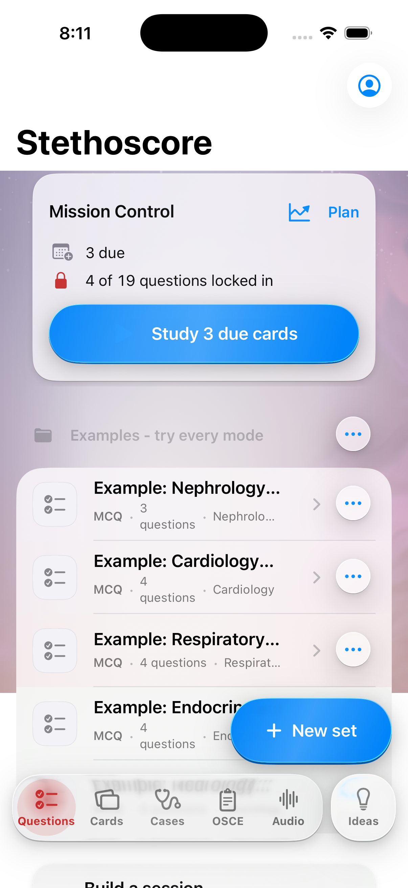

### iphone/6-open-every-set: iPhone 17 Pro

```
bundle=com.cramdown.personal exe=Stethoscore Personal
keep=1 args=-launchTestSignedIn -launchTestOpenSets
launch_status=0
peak_rss_mb=333
pid=18300 alive_after_60s=yes
--- stderr.txt (last 25 of 1)
IOSurfaceClientSetSurfaceNotify failed e00002c7
--- log-process.txt: 29 matching lines (last 30)
2026-10-01 08:08:05.508 Df Stethoscore Personal[18300:d758] [com.apple.dt.xctest:Default] Registering for test daemon availability notify post.
2026-10-01 08:08:05.508 Df Stethoscore Personal[18300:d758] [com.apple.dt.xctest:Default] notify_get_state check indicated test daemon not ready.
2026-10-01 08:08:05.508 Df Stethoscore Personal[18300:d758] [com.apple.dt.xctest:Default] notify_get_state check indicated test daemon not ready.
2026-10-01 08:08:05.508 Df Stethoscore Personal[18300:d758] [com.apple.dt.xctest:Default] notify_get_state check indicated test daemon not ready.
2026-10-01 08:08:05.570 Df Stethoscore Personal[18300:d758] [com.apple.FileURL:default] kExcludedFromBackupXattrName set on path: /Users/runner/Library/Developer/CoreSimulator/Devices/22452A91-4697-4369-8812-53ADB77EB73B/data/Containers/Data/Application/C27D911E-5A0C-40DD-9941-9508A9371674/Library/Application Support/RedPenBlobs
2026-10-01 08:08:05.658 Df Stethoscore Personal[18300:d758] [com.apple.UIKit:KeyWindow] Setting default evaluation strategy for UIUserInterfaceIdiomPhone to LastOneWins
2026-10-01 08:08:05.658 Df Stethoscore Personal[18300:d758] [com.apple.UIKit:KeyWindow] Setting default evaluation strategy for UIUserInterfaceIdiomPhone to SystemShellManaged
2026-10-01 08:08:06.663 I  Stethoscore Personal[18300:d758] [com.apple.DesignLibrary:defaults] liveTuning=false
2026-10-01 08:08:06.812 Df Stethoscore Personal[18300:d758] [PrototypeTools:domain] Not observing PTDefaults on customer install.
2026-10-01 08:08:06.957 Df Stethoscore Personal[18300:d780] [com.apple.calls.callkit:Default] Call host has no calls
2026-10-01 08:08:07.071 I  Stethoscore Personal[18300:d780] [com.apple.storekit:Default] AAFService Starting new XPCConnection 59b4a0e7
2026-10-01 08:08:07.102 Df Stethoscore Personal[18300:d797] [com.apple.storekit:Default] [Default] Finished iterating transaction batches
2026-10-01 08:08:07.103 I  Stethoscore Personal[18300:d815] [com.apple.storekit:Default] AAFService Closing XPCConnection 59b4a0e7
2026-10-01 08:08:07.103 Df Stethoscore Personal[18300:d815] [com.apple.storekit:Default] AAFService connection invalidated
2026-10-01 08:08:07.844 Df Stethoscore Personal[18300:d758] [com.apple.network:activity] Create activity from XPC object <nw_activity 50:1 [C535E2B6-66B9-471D-965E-66566678960D] (reporting strategy default)>
2026-10-01 08:08:07.844 Df Stethoscore Personal[18300:d758] [com.apple.network:activity] Create activity from XPC object <nw_activity 50:2 [F73058D6-0BAD-4F42-8E64-669301AEDFC0] (reporting strategy default)>
2026-10-01 08:08:07.844 Df Stethoscore Personal[18300:d758] [com.apple.network:activity] Set activity <nw_activity 50:1 [C535E2B6-66B9-471D-965E-66566678960D] (reporting strategy default)> as the global parent
2026-10-01 08:08:07.879 I  Stethoscore Personal[18300:d815] [com.apple.storekit:Default] AAFService Starting new XPCConnection b72bc3dc
2026-10-01 08:08:07.898 Df Stethoscore Personal[18300:d797] [com.apple.storekit:Default] [Default] Finished iterating transaction batches
2026-10-01 08:08:07.899 I  Stethoscore Personal[18300:d797] [com.apple.storekit:Default] AAFService Closing XPCConnection b72bc3dc
2026-10-01 08:08:07.899 I  Stethoscore Personal[18300:d797] [com.apple.storekit:Default] AAFService Starting new XPCConnection d298f85e
2026-10-01 08:08:07.919 Df Stethoscore Personal[18300:d7a7] [com.apple.storekit:Default] AAFService connection invalidated
2026-10-01 08:08:07.923 Df Stethoscore Personal[18300:d797] [com.apple.storekit:Default] [Default] Finished iterating transaction batches
2026-10-01 08:08:08.612 I  Stethoscore Personal[18300:d780] [com.apple.storekit:Default] AAFService Closing XPCConnection d298f85e
2026-10-01 08:08:08.617 Df Stethoscore Personal[18300:d780] [com.apple.storekit:Default] Registering for 'transactionsupdated' daemon notification
2026-10-01 08:08:08.619 Df Stethoscore Personal[18300:d797] [com.apple.storekit:Default] AAFService connection invalidated
2026-10-01 08:08:30.211 Df Stethoscore Personal[18300:d758] [com.apple.network:activity] <nw_activity 50:1 [C535E2B6-66B9-471D-965E-66566678960D] (global parent) (reporting strategy default) complete (reason success)> complete with reason 2 (success), duration 26262ms
2026-10-01 08:08:30.211 Df Stethoscore Personal[18300:d758] [com.apple.network:activity] <nw_activity 50:2 [F73058D6-0BAD-4F42-8E64-669301AEDFC0] (reporting strategy default) complete (reason success)> complete with reason 2 (success), duration 26262ms
2026-10-01 08:08:30.211 Df Stethoscore Personal[18300:d758] [com.apple.network:activity] Unsetting the global parent activity <nw_activity 50:1 [C535E2B6-66B9-471D-965E-66566678960D] (global parent) (reporting strategy default) complete (reason success)>
--- log-system.txt: 79 matching lines (last 30)
2026-10-01 08:08:02.549 Df splashboardd[8271:7166] [com.apple.SplashBoard:Capture] Updating window to <XBLaunchStateRequest: 0x101e84460; groupID: com.cramdown.personal - {DEFAULT GROUP}; statusBar: normal; refSize: {402, 874}; orientation: Portrait; userInterfaceStyle: Light>
2026-10-01 08:08:02.754 Df SpringBoard[5378:d48e] [com.apple.SplashBoard:FileManifest] <XBApplicationSnapshotManifestImpl: 0x1080ce400> [com.cramdown.personal] Snapshot data for <XBApplicationSnapshot: 0x1163f7b80; …5FF892DA41E8> [com.cramdown.personal] written to file: /Users/runner/Library/Developer/CoreSimulator/Devices/22452A91-4697-4369-8812-53ADB77EB73B/data/Containers/Data/Application/C27D9
```
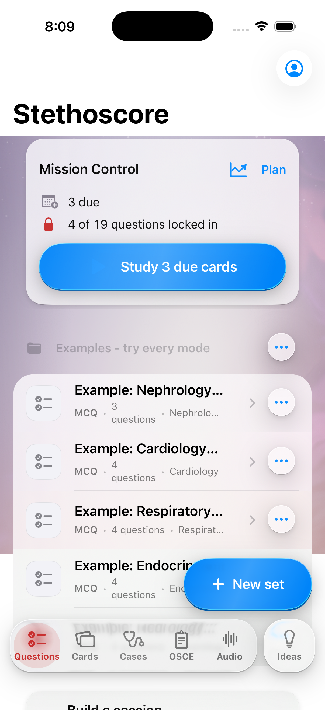

## current-core2

```
iphone/1-fresh=0
iphone/2-signed-in=0
iphone/3-relaunch=0
iphone/6-open-every-set=0
iphone/5-other-bundle-id=0
ipad/1-fresh=0
ipad/2-signed-in=0
ipad/3-relaunch=0
ipad/6-open-every-set=0
```

### ipad/1-fresh: iPad Pro 13-inch (M5)

```
bundle=com.cramdown.personal exe=Stethoscore Personal
keep=0 args=
launch_status=0
peak_rss_mb=301
pid=19675 alive_after_30s=yes
--- stderr.txt (last 25 of 1)
IOSurfaceClientSetSurfaceNotify failed e00002c7
--- log-process.txt: 19 matching lines (last 30)
2026-10-01 08:03:58.757 Df Stethoscore Personal[19675:f233] [com.apple.dt.xctest:Default] Registering for test daemon availability notify post.
2026-10-01 08:03:58.758 Df Stethoscore Personal[19675:f233] [com.apple.dt.xctest:Default] notify_get_state check indicated test daemon not ready.
2026-10-01 08:03:58.758 Df Stethoscore Personal[19675:f233] [com.apple.dt.xctest:Default] notify_get_state check indicated test daemon not ready.
2026-10-01 08:03:58.758 Df Stethoscore Personal[19675:f233] [com.apple.dt.xctest:Default] notify_get_state check indicated test daemon not ready.
2026-10-01 08:03:58.795 Df Stethoscore Personal[19675:f233] [com.apple.FileURL:default] kExcludedFromBackupXattrName set on path: /Users/runner/Library/Developer/CoreSimulator/Devices/A2011F14-88A1-46AA-999A-FD6FEDCD870B/data/Containers/Data/Application/94CB7E54-72DE-4A98-9B7E-59BA094B7B0D/Library/Application Support/RedPenBlobs
2026-10-01 08:03:58.859 Df Stethoscore Personal[19675:f233] [com.apple.UIKit:KeyWindow] Setting default evaluation strategy for UIUserInterfaceIdiomPad to LastOneWins
2026-10-01 08:03:58.859 Df Stethoscore Personal[19675:f233] [com.apple.UIKit:KeyWindow] Setting default evaluation strategy for UIUserInterfaceIdiomPad to SystemShellManaged
2026-10-01 08:03:59.104 Df Stethoscore Personal[19675:f233] [PrototypeTools:domain] Not observing PTDefaults on customer install.
2026-10-01 08:03:59.741 Df Stethoscore Personal[19675:f233] [com.apple.network:activity] Create activity from XPC object <nw_activity 50:1 [06CCF7E2-B6E0-423E-AA72-629E296DB82E] (reporting strategy default)>
2026-10-01 08:03:59.741 Df Stethoscore Personal[19675:f233] [com.apple.network:activity] Create activity from XPC object <nw_activity 50:2 [7BDECD07-BC5F-4E0C-9762-E9122F448400] (reporting strategy default)>
2026-10-01 08:03:59.741 Df Stethoscore Personal[19675:f233] [com.apple.network:activity] Set activity <nw_activity 50:1 [06CCF7E2-B6E0-423E-AA72-629E296DB82E] (reporting strategy default)> as the global parent
2026-10-01 08:04:00.047 Df Stethoscore Personal[19675:f245] [com.apple.storekit:Default] [Default] Finished iterating transaction batches
2026-10-01 08:04:00.095 Df Stethoscore Personal[19675:f247] [com.apple.storekit:Default] [Default] Finished iterating transaction batches
2026-10-01 08:04:00.105 Df Stethoscore Personal[19675:f245] [com.apple.storekit:Default] AAFService connection invalidated
2026-10-01 08:04:00.251 Df Stethoscore Personal[19675:f247] [com.apple.storekit:Default] Registering for 'transactionsupdated' daemon notification
2026-10-01 08:04:00.270 Df Stethoscore Personal[19675:f247] [com.apple.storekit:Default] AAFService connection invalidated
2026-10-01 08:04:00.487 Df Stethoscore Personal[19675:f233] [com.apple.network:activity] <nw_activity 50:1 [06CCF7E2-B6E0-423E-AA72-629E296DB82E] (global parent) (reporting strategy default) complete (reason success)> complete with reason 2 (success), duration 3222ms
2026-10-01 08:04:00.487 Df Stethoscore Personal[19675:f233] [com.apple.network:activity] <nw_activity 50:2 [7BDECD07-BC5F-4E0C-9762-E9122F448400] (reporting strategy default) complete (reason success)> complete with reason 2 (success), duration 3222ms
2026-10-01 08:04:00.487 Df Stethoscore Personal[19675:f233] [com.apple.network:activity] Unsetting the global parent activity <nw_activity 50:1 [06CCF7E2-B6E0-423E-AA72-629E296DB82E] (global parent) (reporting strategy default) complete (reason success)>
--- log-system.txt: 96 matching lines (last 30)
2026-10-01 08:03:49.891 Df SpringBoard[17816:e7b4] [com.apple.SplashBoard:Capture] Asynchronously generating image data for request: <XBLaunchStateRequest: 0x119793090; groupID: com.cramdown.personal - {DEFAULT GROUP}; statusBar: normal; refSize: {1032, 1376}; naturalSize: {1376, 1032}; orientation: LandscapeLeft; userInterfaceStyle: Dark>
2026-10-01 08:03:49.891 Df splashboardd[19212:ecdf] [com.apple.SplashBoard:Capture] Updating window to <XBLaunchStateRequest: 0x103a50150; groupID: com.cramdown.personal - {DEFAULT GROUP}; statusBar: normal; refSize: {1032, 1376}; naturalSize: {1376, 1032}; orientation: LandscapeLeft; userInterfaceStyle: Dark>
2026-10-01 08:03:50.025 Df SpringBoard[17816:e778] [com.apple.SplashBoard:Capture] Image generation complete for: <XBLaunchStateRequest: 0x119793090; groupID: com.cramdown.personal - {DEFAULT GROUP}; statusBar: normal; refSize: {1032, 1376}; naturalSize: {1376, 1032}; orientation: LandscapeLeft; userInterfaceStyle: Dark>
2026-10-01 08:03:50.025 Df SpringBoard[17816:e7b4] [com.apple.SplashBoard:Capture] Asynchronously generating image data for request: <XBLaunchStateRequest: 0x119792530; groupID: com.cramdown.personal - {DEFAULT GROUP}; statusBar: normal; refSize: {1032, 375}; naturalSize: {375, 1032}; orientation: LandscapeLeft; userInterfaceStyle: Dark>
2026-10-01 08:03:50.025 Df SpringBoard[17816:e77e] [com.apple.SplashBoard:FileManifest] <XBApplicationSnapshotManifestImpl: 0x119620880> [com.cramdown.personal] Snapshot data for <XBApplicationSnapshot: 0x1199a9340; …BD938C7723EF> [com.cramdown.personal] written to file: /Users/runner/Library/Developer/CoreSimulator/Devices/A2011F14-88A1-46AA-999A-FD6FEDCD870B/data/Containers/Data/Application/94CB
2026-10-01 08:03:50.026 Df splashboardd[19212:ecdf] [com.apple.SplashBoard:Capture] Updating window to <XBLaunchStateRequest: 0x103a50000; groupID: com.cramdown.personal - {DEFAULT GROUP}; statusBar: normal; refSize: {1032, 375}; naturalSize: {375, 1032}; orientation: LandscapeLeft; userInterfaceStyle: Dark>
2026-10-01 08:03:50.046 Df SpringBoard[17816:e652] [com.apple.SplashBoard:Capture] Image generation complete for: <XBLaunchStateRequest: 0x119792530; groupID: com.cramdown.personal - {DEFAULT GROUP}; statusBar: normal; refSize: {1032, 375}; naturalSize: {375, 1032}; orientation: LandscapeLeft; userInterfaceStyle: Dark>
2026-10-01 08:03:50.047 Df SpringBoard[17816:e778] [com.apple.SplashBoard:FileManifest] <XBApplicationSnapshotManifestImpl: 0x119620880> [com.cramdown.personal] Snapshot data for <XBApplicationSnapshot: 0x1199a9a40; …5F010EDB8167> [com.cramdown.personal] written to file: /Users/runner/Library/Developer/CoreSimulator/Devices/A2011F14-88A1-46AA-999A-FD6FEDCD870B/data/Containers/Data/Application/94CB
    "terminate_running_process" = 1;
	retryTimeout: 300.000000 (default write com.apple.CoreSimulatorBridge LaunchRetryTimeout <value>)
	bootTimeout: 300.000000 (default write com.apple.CoreSimulatorBridge BootRetryTimeout <value>)
	bootLeeway: 120.000000 (default write com.apple.CoreSimulatorBridge BootLeeway <value>)
```
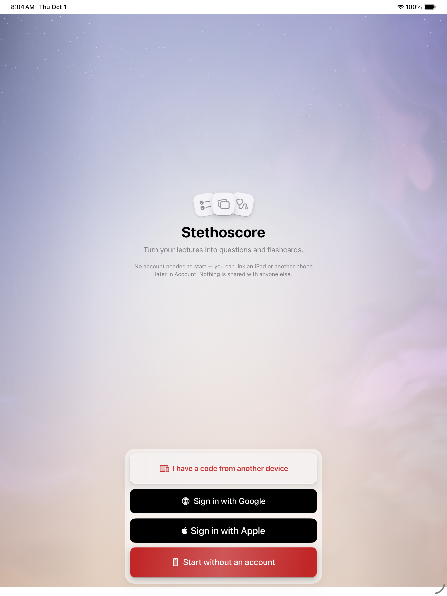

### ipad/2-signed-in: iPad Pro 13-inch (M5)

```
bundle=com.cramdown.personal exe=Stethoscore Personal
keep=1 args=-launchTestSignedIn
launch_status=0
peak_rss_mb=476
pid=21892 alive_after_30s=yes
--- stderr.txt (last 25 of 1)
IOSurfaceClientSetSurfaceNotify failed e00002c7
--- log-process.txt: 64 matching lines (last 30)
2026-10-01 08:05:04.349 Df Stethoscore Personal[21892:10ce5] [com.apple.CFNetwork:Default] Connection 1: starting, TC(0x0)
2026-10-01 08:05:04.352 Df Stethoscore Personal[21892:10ce5] [com.apple.CFNetwork:Default] Task <CC71C69F-C9DE-4DBD-A624-43846295FD45>.<1> setting up Connection 1
2026-10-01 08:05:04.368 Df Stethoscore Personal[21892:10cd9] [com.apple.CFNetwork:Default] Connection 1: asked to evaluate TLS Trust
2026-10-01 08:05:04.369 Df Stethoscore Personal[21892:10cd9] [com.apple.CFNetwork:Default] Task <CC71C69F-C9DE-4DBD-A624-43846295FD45>.<1> auth completion disp=1 cred=0x0
2026-10-01 08:05:04.387 Df Stethoscore Personal[21892:10ce5] [com.apple.CFNetwork:Default] System Trust Evaluation yielded status(0)
2026-10-01 08:05:04.390 Df Stethoscore Personal[21892:10cf1] [com.apple.CFNetwork:Default] Connection 1: TLS Trust result 0
2026-10-01 08:05:04.391 Df Stethoscore Personal[21892:10cf1] [com.apple.network:boringssl] nw_protocol_boringssl_signal_connected(895) [C1.1.1.1:2][0x11b63c060] TLS connected [server(0) version(0x0304) ciphersuite(TLS_AES_256_GCM_SHA384) group(0x11ec) signature_alg(0x0403) alpn(h2) resumed(0) offered_ticket(0) in_early_data(0) early_data_accepted(0) false_started(0) ocsp_received(0) sct_received(1
2026-10-01 08:05:04.391 Df Stethoscore Personal[21892:10cf1] [com.apple.CFNetwork:Default] Connection 1: connected successfully
2026-10-01 08:05:04.391 Df Stethoscore Personal[21892:10cf1] [com.apple.CFNetwork:Default] Connection 1: TLS handshake complete
2026-10-01 08:05:04.392 Df Stethoscore Personal[21892:10cf1] [com.apple.CFNetwork:Default] Connection 1: ready C(N) E(N)
2026-10-01 08:05:04.393 Df Stethoscore Personal[21892:10cf1] [com.apple.CFNetwork:Default] Task <CC71C69F-C9DE-4DBD-A624-43846295FD45>.<1> now using Connection 1
2026-10-01 08:05:04.394 Df Stethoscore Personal[21892:10cf1] [com.apple.CFNetwork:Default] Task <CC71C69F-C9DE-4DBD-A624-43846295FD45>.<1> sent request, body S 2
2026-10-01 08:05:04.498 Df Stethoscore Personal[21892:10cf1] [com.apple.CFNetwork:Default] Task <CC71C69F-C9DE-4DBD-A624-43846295FD45>.<1> received response, status 200 content U
2026-10-01 08:05:04.498 Df Stethoscore Personal[21892:10cf1] [com.apple.CFNetwork:Default] Task <CC71C69F-C9DE-4DBD-A624-43846295FD45>.<1> done using Connection 1
2026-10-01 08:05:04.504 Df Stethoscore Personal[21892:10cf1] [com.apple.CFNetwork:Default] Task <CC71C69F-C9DE-4DBD-A624-43846295FD45>.<1> response ended
2026-10-01 08:05:04.505 Df Stethoscore Personal[21892:10cf1] [com.apple.CFNetwork:Default] Task <CC71C69F-C9DE-4DBD-A624-43846295FD45>.<1> finished successfully
2026-10-01 08:05:04.794 I  Stethoscore Personal[21892:10ce6] [com.apple.storekit:Default] AAFService Closing XPCConnection d2bf9d3e
2026-10-01 08:05:04.794 Df Stethoscore Personal[21892:10cf0] [com.apple.storekit:Default] AAFService connection invalidated
2026-10-01 08:05:04.795 Df Stethoscore Personal[21892:10ce6] [com.apple.storekit:Default] Registering for 'transactionsupdated' daemon notification
2026-10-01 08:05:19.437 Df Stethoscore Personal[21892:10acf] [com.apple.network:activity] <nw_activity 50:1 [0624437A-6AFE-45D6-AE22-D6F62CC7E5CD] (global parent) (reporting strategy default) complete (reason success)> complete with reason 2 (success), duration 18069ms
2026-10-01 08:05:19.438 Df Stethoscore Personal[21892:10acf] [com.apple.network:activity] <nw_activity 50:2 [EC3E308F-582E-403A-8ABC-9DAF6EA81AAE] (reporting strategy default) complete (reason success)> complete with reason 2 (success), duration 18069ms
2026-10-01 08:05:19.438 Df Stethoscore Personal[21892:10acf] [com.apple.network:activity] Unsetting the global parent activity <nw_activity 50:1 [0624437A-6AFE-45D6-AE22-D6F62CC7E5CD] (global parent) (reporting strategy default) complete (reason success)>
2026-10-01 08:05:38.822 Df Stethoscore Personal[21892:10ba2] [com.apple.DataDeliveryServices:Default] Adding observer for DDS asset update notification for asset type: (com.apple.MobileAsset.LinguisticData)
2026-10-01 08:05:38.827 Df Stethoscore Personal[21892:10ba2] [com.apple.DataDeliveryServices:Default] Adding observer for DDS asset update notification for asset type: (com.apple.MobileAsset.LinguisticDataAuto)
2026-10-01 08:05:39.497 I  Stethoscore Personal[21892:10ba2] [com.apple.LanguageModeling:Default] Options is updating adaptationEnabled from 1 to 0
2026-10-01 08:05:39.697 Df Stethoscore Personal[21892:10ba2] [com.apple.DataDeliveryServices:Default] Auto asset specifier: Priority_ar is not supported
2026-10-01 08:05:39.704 Df Stethoscore Personal[21892:10ba2] [com.apple.DataDeliveryServices:Default] Auto asset specifier: Priority_ar is not supported
2026-10-01 08:05:39.763 Df Stethoscore Personal[21892:10ba2] [com.apple.DataDeliveryServices:Default] Supported compatibility version = 17 in file: Info.plist
2026-10-01 08:05:39.766 Df Stethoscore Personal[21892:10ba2] [com.apple.DataDeliveryServices:Default] Supported compatibility version for LinguisticData assets = 17
2026-10-01 08:05:39.795 I  Stethoscore Personal[21892:10ba2] [com.apple.LanguageModeling:Default] Options is updating adaptationEnabled from 1 to 0
--- log-system.txt: 171 matching lines (last 30)
2026-10-01 08:05:06.170 Df suggestd[17944:fbcc] [com.apple.proactive.ProactiveHarvesting:Default] HVQueue<ProactiveHarvesting.ThirdPartyApp>: enqueueContent: writing com.cramdown.personal:StudySetEntity/31CF58DE-1731-4EB9-BCD6-57966FE160E7 to memory
```
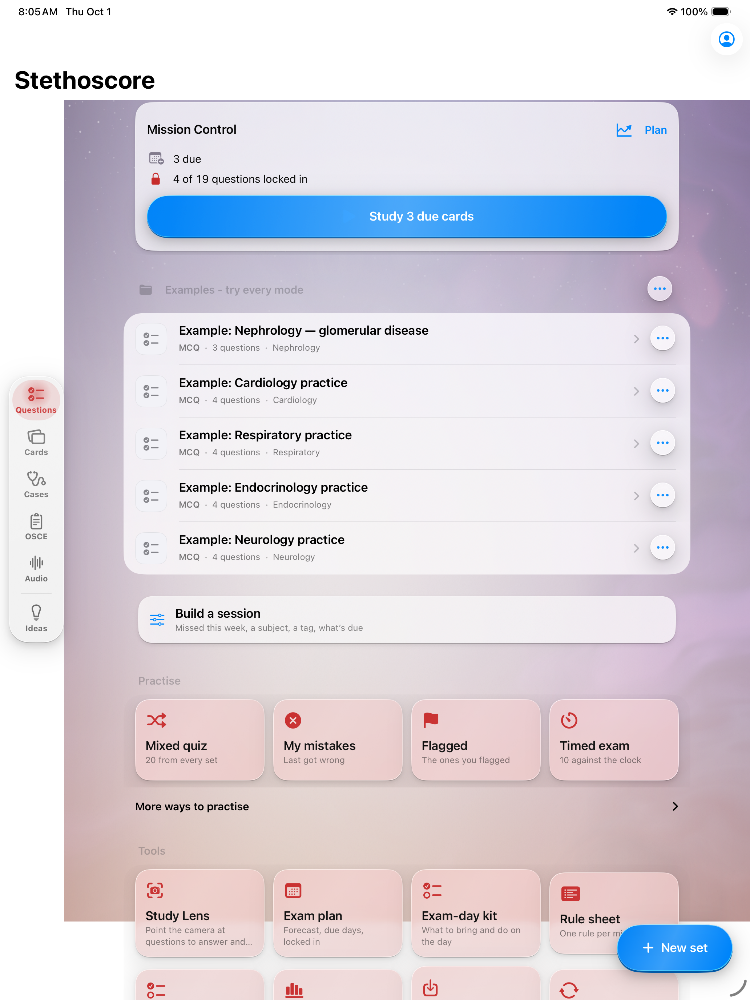

### ipad/3-relaunch: iPad Pro 13-inch (M5)

```
bundle=com.cramdown.personal exe=Stethoscore Personal
keep=1 args=
launch_status=0
peak_rss_mb=349
pid=24344 alive_after_30s=yes
--- stderr.txt (last 25 of 1)
IOSurfaceClientSetSurfaceNotify failed e00002c7
--- log-process.txt: 31 matching lines (last 30)
2026-10-01 08:05:48.656 Df Stethoscore Personal[24344:123a0] [com.apple.dt.xctest:Default] notify_get_state check indicated test daemon not ready.
2026-10-01 08:05:48.656 Df Stethoscore Personal[24344:123a0] [com.apple.dt.xctest:Default] notify_get_state check indicated test daemon not ready.
2026-10-01 08:05:48.656 Df Stethoscore Personal[24344:123a0] [com.apple.dt.xctest:Default] notify_get_state check indicated test daemon not ready.
2026-10-01 08:05:48.696 Df Stethoscore Personal[24344:123a0] [com.apple.FileURL:default] kExcludedFromBackupXattrName set on path: /Users/runner/Library/Developer/CoreSimulator/Devices/A2011F14-88A1-46AA-999A-FD6FEDCD870B/data/Containers/Data/Application/45B3B4F0-E328-42FF-9EFE-FD3D5C2D744C/Library/Application Support/RedPenBlobs
2026-10-01 08:05:48.767 Df Stethoscore Personal[24344:123a0] [com.apple.UIKit:KeyWindow] Setting default evaluation strategy for UIUserInterfaceIdiomPad to LastOneWins
2026-10-01 08:05:48.767 Df Stethoscore Personal[24344:123a0] [com.apple.UIKit:KeyWindow] Setting default evaluation strategy for UIUserInterfaceIdiomPad to SystemShellManaged
2026-10-01 08:05:49.245 I  Stethoscore Personal[24344:123a0] [com.apple.DesignLibrary:defaults] liveTuning=false
2026-10-01 08:05:49.343 Df Stethoscore Personal[24344:123a0] [PrototypeTools:domain] Not observing PTDefaults on customer install.
2026-10-01 08:05:49.409 Df Stethoscore Personal[24344:123ec] [com.apple.calls.callkit:Default] Call host has no calls
2026-10-01 08:05:49.488 I  Stethoscore Personal[24344:123ec] [com.apple.storekit:Default] AAFService Starting new XPCConnection 0ea1c720
2026-10-01 08:05:49.504 Df Stethoscore Personal[24344:12409] [com.apple.storekit:Default] [Default] Finished iterating transaction batches
2026-10-01 08:05:49.505 I  Stethoscore Personal[24344:124d1] [com.apple.storekit:Default] AAFService Closing XPCConnection 0ea1c720
2026-10-01 08:05:49.505 Df Stethoscore Personal[24344:123ec] [com.apple.storekit:Default] AAFService connection invalidated
2026-10-01 08:05:50.229 Df Stethoscore Personal[24344:123a0] [com.apple.network:activity] Create activity from XPC object <nw_activity 50:1 [15945ED4-55B0-4644-8F76-1A7D135FF1C9] (reporting strategy default)>
2026-10-01 08:05:50.230 Df Stethoscore Personal[24344:123a0] [com.apple.network:activity] Create activity from XPC object <nw_activity 50:2 [C13EE578-9180-40F9-9204-D442647ED71B] (reporting strategy default)>
2026-10-01 08:05:50.230 Df Stethoscore Personal[24344:123a0] [com.apple.network:activity] Set activity <nw_activity 50:1 [15945ED4-55B0-4644-8F76-1A7D135FF1C9] (reporting strategy default)> as the global parent
2026-10-01 08:05:50.322 I  Stethoscore Personal[24344:12409] [com.apple.storekit:Default] AAFService Starting new XPCConnection 1727c1da
2026-10-01 08:05:50.326 I  Stethoscore Personal[24344:123a0] [com.apple.PointerUI:Common] Activating Connection: <BSXPC(com.apple.PointerUI.pointeruid.service[C:3-1])-as(com.apple.PointerUI.pointeruid.default-service):0x106adf160 name=(null)>
2026-10-01 08:05:50.328 Df Stethoscore Personal[24344:12409] [com.apple.storekit:Default] [Default] Finished iterating transaction batches
2026-10-01 08:05:50.328 I  Stethoscore Personal[24344:1240b] [com.apple.storekit:Default] AAFService Closing XPCConnection 1727c1da
2026-10-01 08:05:50.328 Df Stethoscore Personal[24344:1240b] [com.apple.storekit:Default] AAFService connection invalidated
2026-10-01 08:05:50.328 I  Stethoscore Personal[24344:12409] [com.apple.storekit:Default] AAFService Starting new XPCConnection 2d9ce46e
2026-10-01 08:05:50.335 Df Stethoscore Personal[24344:12409] [com.apple.storekit:Default] [Default] Finished iterating transaction batches
2026-10-01 08:05:50.526 Df Stethoscore Personal[24344:1240b] [com.apple.FileURL:default] kExcludedFromBackupXattrName set on path: /Users/runner/Library/Developer/CoreSimulator/Devices/A2011F14-88A1-46AA-999A-FD6FEDCD870B/data/Containers/Data/Application/45B3B4F0-E328-42FF-9EFE-FD3D5C2D744C/Library/Application Support/RedPenSources
2026-10-01 08:05:50.653 I  Stethoscore Personal[24344:123ec] [com.apple.storekit:Default] AAFService Closing XPCConnection 2d9ce46e
2026-10-01 08:05:50.653 Df Stethoscore Personal[24344:1240b] [com.apple.storekit:Default] AAFService connection invalidated
2026-10-01 08:05:50.654 Df Stethoscore Personal[24344:123ec] [com.apple.storekit:Default] Registering for 'transactionsupdated' daemon notification
2026-10-01 08:06:17.286 Df Stethoscore Personal[24344:123a0] [com.apple.network:activity] <nw_activity 50:1 [15945ED4-55B0-4644-8F76-1A7D135FF1C9] (global parent) (reporting strategy default) complete (reason failure)> complete with reason 3 (failure), duration 29466ms
2026-10-01 08:06:17.286 Df Stethoscore Personal[24344:123a0] [com.apple.network:activity] <nw_activity 50:2 [C13EE578-9180-40F9-9204-D442647ED71B] (reporting strategy default) complete (reason failure)> complete with reason 3 (failure), duration 29466ms
2026-10-01 08:06:17.286 Df Stethoscore Personal[24344:123a0] [com.apple.network:activity] Unsetting the global parent activity <nw_activity 50:1 [15945ED4-55B0-4644-8F76-1A7D135FF1C9] (global parent) (reporting strategy default) complete (reason failure)>
--- log-system.txt: 122 matching lines (last 30)
2026-10-01 08:05:47.713 Df splashboardd[19212:ecdf] [com.apple.SplashBoard:Capture] Updating window to <XBLaunchStateRequest: 0x103a503f0; groupID: com.cramdown.personal - {DEFAULT GROUP}; statusBar: normal; refSize: {1032, 1376}; naturalSize: {1376, 1032}; orientation: LandscapeLeft; userInterfaceStyle: Dark>
```


### ipad/6-open-every-set: iPad Pro 13-inch (M5)

```
bundle=com.cramdown.personal exe=Stethoscore Personal
keep=1 args=-launchTestSignedIn -launchTestOpenSets
launch_status=0
peak_rss_mb=350
pid=26813 alive_after_60s=yes
--- stderr.txt (last 25 of 1)
IOSurfaceClientSetSurfaceNotify failed e00002c7
--- log-process.txt: 31 matching lines (last 30)
2026-10-01 08:06:31.610 Df Stethoscore Personal[26813:13a7c] [com.apple.dt.xctest:Default] notify_get_state check indicated test daemon not ready.
2026-10-01 08:06:31.610 Df Stethoscore Personal[26813:13a7c] [com.apple.dt.xctest:Default] notify_get_state check indicated test daemon not ready.
2026-10-01 08:06:31.610 Df Stethoscore Personal[26813:13a7c] [com.apple.dt.xctest:Default] notify_get_state check indicated test daemon not ready.
2026-10-01 08:06:31.651 Df Stethoscore Personal[26813:13a7c] [com.apple.FileURL:default] kExcludedFromBackupXattrName set on path: /Users/runner/Library/Developer/CoreSimulator/Devices/A2011F14-88A1-46AA-999A-FD6FEDCD870B/data/Containers/Data/Application/B91981A9-133D-4FA5-8F60-B79FEE4DF024/Library/Application Support/RedPenBlobs
2026-10-01 08:06:31.711 Df Stethoscore Personal[26813:13a7c] [com.apple.UIKit:KeyWindow] Setting default evaluation strategy for UIUserInterfaceIdiomPad to LastOneWins
2026-10-01 08:06:31.712 Df Stethoscore Personal[26813:13a7c] [com.apple.UIKit:KeyWindow] Setting default evaluation strategy for UIUserInterfaceIdiomPad to SystemShellManaged
2026-10-01 08:06:32.174 I  Stethoscore Personal[26813:13a7c] [com.apple.DesignLibrary:defaults] liveTuning=false
2026-10-01 08:06:32.246 Df Stethoscore Personal[26813:13a7c] [PrototypeTools:domain] Not observing PTDefaults on customer install.
2026-10-01 08:06:32.302 Df Stethoscore Personal[26813:13ac7] [com.apple.calls.callkit:Default] Call host has no calls
2026-10-01 08:06:32.356 I  Stethoscore Personal[26813:13ae1] [com.apple.storekit:Default] AAFService Starting new XPCConnection cc079096
2026-10-01 08:06:32.362 Df Stethoscore Personal[26813:13ae4] [com.apple.storekit:Default] [Default] Finished iterating transaction batches
2026-10-01 08:06:32.362 I  Stethoscore Personal[26813:13ae1] [com.apple.storekit:Default] AAFService Closing XPCConnection cc079096
2026-10-01 08:06:32.362 Df Stethoscore Personal[26813:13ae4] [com.apple.storekit:Default] AAFService connection invalidated
2026-10-01 08:06:33.031 Df Stethoscore Personal[26813:13a7c] [com.apple.network:activity] Create activity from XPC object <nw_activity 50:1 [8F69ECF0-CB70-46C4-B4DC-C3FF477662BC] (reporting strategy default)>
2026-10-01 08:06:33.031 Df Stethoscore Personal[26813:13a7c] [com.apple.network:activity] Create activity from XPC object <nw_activity 50:2 [D6CF50E8-2CA6-44B4-8A68-EB938D9177F6] (reporting strategy default)>
2026-10-01 08:06:33.031 Df Stethoscore Personal[26813:13a7c] [com.apple.network:activity] Set activity <nw_activity 50:1 [8F69ECF0-CB70-46C4-B4DC-C3FF477662BC] (reporting strategy default)> as the global parent
2026-10-01 08:06:33.113 I  Stethoscore Personal[26813:13acb] [com.apple.storekit:Default] AAFService Starting new XPCConnection c1b85c7e
2026-10-01 08:06:33.122 Df Stethoscore Personal[26813:13acc] [com.apple.storekit:Default] [Default] Finished iterating transaction batches
2026-10-01 08:06:33.122 I  Stethoscore Personal[26813:13acc] [com.apple.storekit:Default] AAFService Closing XPCConnection c1b85c7e
2026-10-01 08:06:33.122 I  Stethoscore Personal[26813:13acc] [com.apple.storekit:Default] AAFService Starting new XPCConnection 367ec092
2026-10-01 08:06:33.122 Df Stethoscore Personal[26813:13ae1] [com.apple.storekit:Default] AAFService connection invalidated
2026-10-01 08:06:33.123 I  Stethoscore Personal[26813:13a7c] [com.apple.PointerUI:Common] Activating Connection: <BSXPC(com.apple.PointerUI.pointeruid.service[C:3-1])-as(com.apple.PointerUI.pointeruid.default-service):0x1045f7250 name=(null)>
2026-10-01 08:06:33.131 Df Stethoscore Personal[26813:13acb] [com.apple.storekit:Default] [Default] Finished iterating transaction batches
2026-10-01 08:06:33.135 Df Stethoscore Personal[26813:13ac7] [com.apple.FileURL:default] kExcludedFromBackupXattrName set on path: /Users/runner/Library/Developer/CoreSimulator/Devices/A2011F14-88A1-46AA-999A-FD6FEDCD870B/data/Containers/Data/Application/B91981A9-133D-4FA5-8F60-B79FEE4DF024/Library/Application Support/RedPenSources
2026-10-01 08:06:33.637 I  Stethoscore Personal[26813:13acb] [com.apple.storekit:Default] AAFService Closing XPCConnection 367ec092
2026-10-01 08:06:33.637 Df Stethoscore Personal[26813:13ae1] [com.apple.storekit:Default] AAFService connection invalidated
2026-10-01 08:06:33.638 Df Stethoscore Personal[26813:13acb] [com.apple.storekit:Default] Registering for 'transactionsupdated' daemon notification
2026-10-01 08:06:47.174 Df Stethoscore Personal[26813:13a7c] [com.apple.network:activity] <nw_activity 50:1 [8F69ECF0-CB70-46C4-B4DC-C3FF477662BC] (global parent) (reporting strategy default) complete (reason success)> complete with reason 2 (success), duration 16532ms
2026-10-01 08:06:47.174 Df Stethoscore Personal[26813:13a7c] [com.apple.network:activity] <nw_activity 50:2 [D6CF50E8-2CA6-44B4-8A68-EB938D9177F6] (reporting strategy default) complete (reason success)> complete with reason 2 (success), duration 16532ms
2026-10-01 08:06:47.174 Df Stethoscore Personal[26813:13a7c] [com.apple.network:activity] Unsetting the global parent activity <nw_activity 50:1 [8F69ECF0-CB70-46C4-B4DC-C3FF477662BC] (global parent) (reporting strategy default) complete (reason success)>
--- log-system.txt: 122 matching lines (last 30)
2026-10-01 08:06:30.713 Df SpringBoard[17816:138ee] [com.apple.SplashBoard:Capture] Image generation complete for: <XBLaunchStateRequest: 0x119abd260; groupID: com.cramdown.personal - {DEFAULT GROUP}; statusBar: normal; refSize: {375, 1376}; orientation: Portrait; userInterfaceStyle: Dark>
```


### iphone/1-fresh: iPhone 17 Pro

```
bundle=com.cramdown.personal exe=Stethoscore Personal
keep=0 args=
launch_status=0
peak_rss_mb=320
pid=4082 alive_after_30s=yes
--- stderr.txt (last 25 of 1)
IOSurfaceClientSetSurfaceNotify failed e00002c7
--- log-process.txt: 19 matching lines (last 30)
2026-10-01 07:58:31.408 Df Stethoscore Personal[4082:473a] [com.apple.dt.xctest:Default] Registering for test daemon availability notify post.
2026-10-01 07:58:31.409 Df Stethoscore Personal[4082:473a] [com.apple.dt.xctest:Default] notify_get_state check indicated test daemon not ready.
2026-10-01 07:58:31.409 Df Stethoscore Personal[4082:473a] [com.apple.dt.xctest:Default] notify_get_state check indicated test daemon not ready.
2026-10-01 07:58:31.409 Df Stethoscore Personal[4082:473a] [com.apple.dt.xctest:Default] notify_get_state check indicated test daemon not ready.
2026-10-01 07:58:31.436 Df Stethoscore Personal[4082:473a] [com.apple.FileURL:default] kExcludedFromBackupXattrName set on path: /Users/runner/Library/Developer/CoreSimulator/Devices/22452A91-4697-4369-8812-53ADB77EB73B/data/Containers/Data/Application/FA6E8F8B-FF36-4D8A-9A5B-60C91F7A249D/Library/Application Support/RedPenBlobs
2026-10-01 07:58:31.485 Df Stethoscore Personal[4082:473a] [com.apple.UIKit:KeyWindow] Setting default evaluation strategy for UIUserInterfaceIdiomPhone to LastOneWins
2026-10-01 07:58:31.485 Df Stethoscore Personal[4082:473a] [com.apple.UIKit:KeyWindow] Setting default evaluation strategy for UIUserInterfaceIdiomPhone to SystemShellManaged
2026-10-01 07:58:31.752 Df Stethoscore Personal[4082:473a] [PrototypeTools:domain] Not observing PTDefaults on customer install.
2026-10-01 07:58:32.506 Df Stethoscore Personal[4082:473a] [com.apple.network:activity] Create activity from XPC object <nw_activity 50:1 [E88DA96D-1098-45A7-84EA-716FF923AFAA] (reporting strategy default)>
2026-10-01 07:58:32.506 Df Stethoscore Personal[4082:473a] [com.apple.network:activity] Create activity from XPC object <nw_activity 50:2 [2DEEA712-FA26-474B-8E9A-30298566A273] (reporting strategy default)>
2026-10-01 07:58:32.506 Df Stethoscore Personal[4082:473a] [com.apple.network:activity] Set activity <nw_activity 50:1 [E88DA96D-1098-45A7-84EA-716FF923AFAA] (reporting strategy default)> as the global parent
2026-10-01 07:58:32.558 Df Stethoscore Personal[4082:4752] [com.apple.storekit:Default] [Default] Finished iterating transaction batches
2026-10-01 07:58:32.558 Df Stethoscore Personal[4082:475e] [com.apple.storekit:Default] AAFService connection invalidated
2026-10-01 07:58:32.682 Df Stethoscore Personal[4082:47a7] [com.apple.storekit:Default] [Default] Finished iterating transaction batches
2026-10-01 07:58:32.705 Df Stethoscore Personal[4082:47a5] [com.apple.storekit:Default] Registering for 'transactionsupdated' daemon notification
2026-10-01 07:58:32.705 Df Stethoscore Personal[4082:47a5] [com.apple.storekit:Default] AAFService connection invalidated
2026-10-01 07:58:33.171 Df Stethoscore Personal[4082:473a] [com.apple.network:activity] <nw_activity 50:1 [E88DA96D-1098-45A7-84EA-716FF923AFAA] (global parent) (reporting strategy default) complete (reason success)> complete with reason 2 (success), duration 2576ms
2026-10-01 07:58:33.171 Df Stethoscore Personal[4082:473a] [com.apple.network:activity] <nw_activity 50:2 [2DEEA712-FA26-474B-8E9A-30298566A273] (reporting strategy default) complete (reason success)> complete with reason 2 (success), duration 2576ms
2026-10-01 07:58:33.171 Df Stethoscore Personal[4082:473a] [com.apple.network:activity] Unsetting the global parent activity <nw_activity 50:1 [E88DA96D-1098-45A7-84EA-716FF923AFAA] (global parent) (reporting strategy default) complete (reason success)>
--- log-system.txt: 72 matching lines (last 30)
2026-10-01 07:58:27.659 Df splashboardd[4052:465d] [com.apple.SplashBoard:Capture] Updating window to <XBLaunchStateRequest: 0x1038d4070; groupID: com.cramdown.personal - {DEFAULT GROUP}; statusBar: normal; refSize: {402, 874}; orientation: Portrait; userInterfaceStyle: Light>
2026-10-01 07:58:27.714 Df SpringBoard[2764:3fa9] [com.apple.SplashBoard:Capture] Image generation complete for: <XBLaunchStateRequest: 0x11d498e70; groupID: com.cramdown.personal - {DEFAULT GROUP}; statusBar: normal; refSize: {402, 874}; orientation: Portrait; userInterfaceStyle: Light>
2026-10-01 07:58:27.714 Df SpringBoard[2764:3fb1] [com.apple.SplashBoard:Capture] Asynchronously generating image data for request: <XBLaunchStateRequest: 0x11d49a5a0; groupID: com.cramdown.personal - {DEFAULT GROUP}; statusBar: normal; refSize: {402, 874}; orientation: Portrait; userInterfaceStyle: Dark>
2026-10-01 07:58:27.716 Df splashboardd[4052:465d] [com.apple.SplashBoard:Capture] Updating window to <XBLaunchStateRequest: 0x103a5c000; groupID: com.cramdown.personal - {DEFAULT GROUP}; statusBar: normal; refSize: {402, 874}; orientation: Portrait; userInterfaceStyle: Dark>
2026-10-01 07:58:27.717 Df SpringBoard[2764:3244] [com.apple.UserNotifications:DataProviderFactory] [com.cramdown.personal] Application installed using default data provider
2026-10-01 07:58:27.719 Df SpringBoard[2764:3fab] [com.apple.SplashBoard:FileManifest] <XBApplicationSnapshotManifestImpl: 0x119f3fa80> [com.cramdown.personal] Snapshot data for <XBApplicationSnapshot: 0x11d629340; …ED7D6E5F8D83> [com.cramdown.personal] written to file: /Users/runner/Library/Developer/CoreSimulator/Devices/22452A91-4697-4369-8812-53ADB77EB73B/data/Containers/Data/Application/FA6E8
2026-10-01 07:58:27.791 Df SpringBoard[2764:3c5b] [com.apple.SplashBoard:Capture] Image generation complete for: <XBLaunchStateRequest: 0x11d49a5a0; groupID: com.cramdown.personal - {DEFAULT GROUP}; statusBar: normal; refSize: {402, 874}; orientation: Portrait; userInterfaceStyle: Dark>
2026-10-01 07:58:27.791 Df SpringBoard[2764:3fab] [com.apple.SplashBoard:FileManifest] <XBApplicationSnapshotManifestImpl: 0x119f3fa80> [com.cramdown.personal] Snapshot data for <XBApplicationSnapshot: 0x11d629500; …E4C07F674675> [com.cramdown.personal] written to file: /Users/runner/Library/Developer/CoreSimulator/Devices/22452A91-4697-4369-8812-53ADB77EB73B/data/Containers/Data/Application/FA6E8
    "terminate_running_process" = 1;
	retryTimeout: 300.000000 (default write com.apple.CoreSimulatorBridge LaunchRetryTimeout <value>)
	bootTimeout: 300.000000 (default write com.apple.CoreSimulatorBridge BootRetryTimeout <value>)
	bootLeeway: 120.000000 (default write com.apple.CoreSimulatorBridge BootLeeway <value>)
```
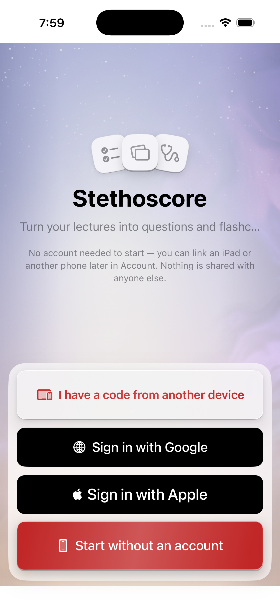

### iphone/2-signed-in: iPhone 17 Pro

```
bundle=com.cramdown.personal exe=Stethoscore Personal
keep=1 args=-launchTestSignedIn
launch_status=0
peak_rss_mb=438
pid=5956 alive_after_30s=yes
--- stderr.txt (last 25 of 1)
IOSurfaceClientSetSurfaceNotify failed e00002c7
--- log-process.txt: 55 matching lines (last 30)
2026-10-01 07:59:23.235 Df Stethoscore Personal[5956:5c83] [com.apple.CFNetwork:Default] Creating default cookie storage with process/bundle identifier
2026-10-01 07:59:23.237 Df Stethoscore Personal[5956:5c83] [com.apple.CFNetwork:Default] Initializing AlternativeServices Storage singleton
2026-10-01 07:59:23.238 Df Stethoscore Personal[5956:5c83] [com.apple.FileURL:default] kExcludedFromBackupXattrName set on path: /Users/runner/Library/Developer/CoreSimulator/Devices/22452A91-4697-4369-8812-53ADB77EB73B/data/Containers/Data/Application/46B68386-9AAE-4267-BFAE-77D6B02D5F56/Library/HTTPStorages/com.cramdown.personal
2026-10-01 07:59:23.244 Df Stethoscore Personal[5956:5c83] [com.apple.CFNetwork:Default] Connection 0: creating secure tcp or quic connection
2026-10-01 07:59:23.254 Df Stethoscore Personal[5956:5c73] [com.apple.storekit:Default] AAFService connection invalidated
2026-10-01 07:59:23.308 Df Stethoscore Personal[5956:5c83] [com.apple.CFNetwork:Default] Connection 1: enabling TLS
2026-10-01 07:59:23.308 Df Stethoscore Personal[5956:5c83] [com.apple.CFNetwork:Default] Connection 1: starting, TC(0x0)
2026-10-01 07:59:23.327 Df Stethoscore Personal[5956:5c83] [com.apple.CFNetwork:Default] Task <85CF3F2B-ABE3-4AA1-902D-87043522CA98>.<1> setting up Connection 1
2026-10-01 07:59:23.429 Df Stethoscore Personal[5956:5c74] [com.apple.CFNetwork:Default] Connection 1: asked to evaluate TLS Trust
2026-10-01 07:59:23.455 Df Stethoscore Personal[5956:5e17] [com.apple.CFNetwork:Default] Task <85CF3F2B-ABE3-4AA1-902D-87043522CA98>.<1> auth completion disp=1 cred=0x0
2026-10-01 07:59:23.505 Df Stethoscore Personal[5956:5c75] [com.apple.CFNetwork:Default] Garbage collection for alternative services
2026-10-01 07:59:23.529 Df Stethoscore Personal[5956:5e1c] [com.apple.CFNetwork:Default] System Trust Evaluation yielded status(0)
2026-10-01 07:59:23.606 Df Stethoscore Personal[5956:5e1c] [com.apple.CFNetwork:Default] Connection 1: TLS Trust result 0
2026-10-01 07:59:23.631 I  Stethoscore Personal[5956:5de1] [com.apple.storekit:Default] AAFService Closing XPCConnection d11e677f
2026-10-01 07:59:23.632 Df Stethoscore Personal[5956:5de1] [com.apple.storekit:Default] Registering for 'transactionsupdated' daemon notification
2026-10-01 07:59:23.636 Df Stethoscore Personal[5956:5c74] [com.apple.storekit:Default] AAFService connection invalidated
2026-10-01 07:59:23.642 Df Stethoscore Personal[5956:5e1c] [com.apple.network:boringssl] nw_protocol_boringssl_signal_connected(895) [C1.1.1.1:2][0x10b37d1e0] TLS connected [server(0) version(0x0304) ciphersuite(TLS_AES_256_GCM_SHA384) group(0x11ec) signature_alg(0x0403) alpn(h2) resumed(0) offered_ticket(0) in_early_data(0) early_data_accepted(0) false_started(0) ocsp_received(0) sct_received(1) 
2026-10-01 07:59:23.646 Df Stethoscore Personal[5956:5e1c] [com.apple.CFNetwork:Default] Connection 1: connected successfully
2026-10-01 07:59:23.646 Df Stethoscore Personal[5956:5e1c] [com.apple.CFNetwork:Default] Connection 1: TLS handshake complete
2026-10-01 07:59:23.646 Df Stethoscore Personal[5956:5e1c] [com.apple.CFNetwork:Default] Connection 1: ready C(N) E(N)
2026-10-01 07:59:23.649 Df Stethoscore Personal[5956:5e1c] [com.apple.CFNetwork:Default] Task <85CF3F2B-ABE3-4AA1-902D-87043522CA98>.<1> now using Connection 1
2026-10-01 07:59:23.649 Df Stethoscore Personal[5956:5e1c] [com.apple.CFNetwork:Default] Task <85CF3F2B-ABE3-4AA1-902D-87043522CA98>.<1> sent request, body S 2
2026-10-01 07:59:23.722 Df Stethoscore Personal[5956:5c74] [com.apple.CFNetwork:Default] Task <85CF3F2B-ABE3-4AA1-902D-87043522CA98>.<1> received response, status 200 content U
2026-10-01 07:59:23.722 Df Stethoscore Personal[5956:5c74] [com.apple.CFNetwork:Default] Task <85CF3F2B-ABE3-4AA1-902D-87043522CA98>.<1> done using Connection 1
2026-10-01 07:59:23.727 Df Stethoscore Personal[5956:5c74] [com.apple.CFNetwork:Default] Task <85CF3F2B-ABE3-4AA1-902D-87043522CA98>.<1> response ended
2026-10-01 07:59:23.727 Df Stethoscore Personal[5956:5de1] [com.apple.CFNetwork:Default] Task <85CF3F2B-ABE3-4AA1-902D-87043522CA98>.<1> finished successfully
2026-10-01 07:59:25.537 Df Stethoscore Personal[5956:5c73] [com.apple.FileURL:default] kExcludedFromBackupXattrName set on path: /Users/runner/Library/Developer/CoreSimulator/Devices/22452A91-4697-4369-8812-53ADB77EB73B/data/Containers/Data/Application/46B68386-9AAE-4267-BFAE-77D6B02D5F56/Library/Application Support/RedPenSources
2026-10-01 07:59:26.339 Df Stethoscore Personal[5956:5c4f] [com.apple.network:activity] <nw_activity 50:1 [C19782D1-9054-4925-916C-4D01EFA3DAFD] (global parent) (reporting strategy default) complete (reason success)> complete with reason 2 (success), duration 5713ms
2026-10-01 07:59:26.339 Df Stethoscore Personal[5956:5c4f] [com.apple.network:activity] <nw_activity 50:2 [44E77900-7C5C-49DD-B220-4173CCC018A1] (reporting strategy default) complete (reason success)> complete with reason 2 (success), duration 5713ms
2026-10-01 07:59:26.339 Df Stethoscore Personal[5956:5c4f] [com.apple.network:activity] Unsetting the global parent activity <nw_activity 50:1 [C19782D1-9054-4925-916C-4D01EFA3DAFD] (global parent) (reporting strategy default) complete (reason success)>
--- log-system.txt: 122 matching lines (last 30)
2026-10-01 07:59:31.186 Df suggestd[3010:3cf3] [com.apple.proactive.ProactiveHarvesting:Default] HVQueue<ProactiveHarvesting.ThirdPartyApp>: enqueueContent: com.cramdown.personal:StudySetEntity/8EF72F5A-029B-4589-B46B-001A1D0DA92F <private>
```
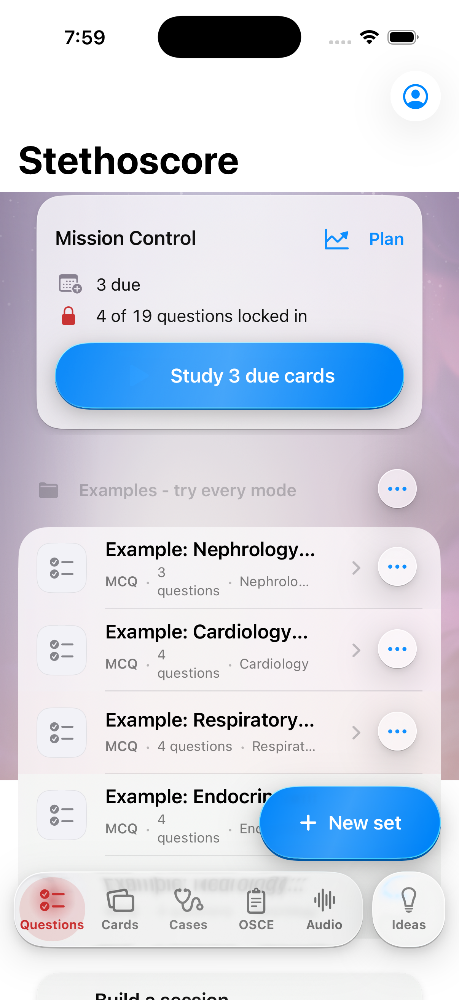

### iphone/3-relaunch: iPhone 17 Pro

```
bundle=com.cramdown.personal exe=Stethoscore Personal
keep=1 args=
launch_status=0
peak_rss_mb=332
pid=8284 alive_after_30s=yes
--- stderr.txt (last 25 of 1)
IOSurfaceClientSetSurfaceNotify failed e00002c7
--- log-process.txt: 30 matching lines (last 30)
2026-10-01 08:00:06.210 Df Stethoscore Personal[8284:74c3] [com.apple.dt.xctest:Default] Registering for test daemon availability notify post.
2026-10-01 08:00:06.210 Df Stethoscore Personal[8284:74c3] [com.apple.dt.xctest:Default] notify_get_state check indicated test daemon not ready.
2026-10-01 08:00:06.210 Df Stethoscore Personal[8284:74c3] [com.apple.dt.xctest:Default] notify_get_state check indicated test daemon not ready.
2026-10-01 08:00:06.210 Df Stethoscore Personal[8284:74c3] [com.apple.dt.xctest:Default] notify_get_state check indicated test daemon not ready.
2026-10-01 08:00:06.241 Df Stethoscore Personal[8284:74c3] [com.apple.FileURL:default] kExcludedFromBackupXattrName set on path: /Users/runner/Library/Developer/CoreSimulator/Devices/22452A91-4697-4369-8812-53ADB77EB73B/data/Containers/Data/Application/E1146C73-83B8-4B56-816C-2D31C7B11FB9/Library/Application Support/RedPenBlobs
2026-10-01 08:00:06.291 Df Stethoscore Personal[8284:74c3] [com.apple.UIKit:KeyWindow] Setting default evaluation strategy for UIUserInterfaceIdiomPhone to LastOneWins
2026-10-01 08:00:06.291 Df Stethoscore Personal[8284:74c3] [com.apple.UIKit:KeyWindow] Setting default evaluation strategy for UIUserInterfaceIdiomPhone to SystemShellManaged
2026-10-01 08:00:06.763 I  Stethoscore Personal[8284:74c3] [com.apple.DesignLibrary:defaults] liveTuning=false
2026-10-01 08:00:06.842 Df Stethoscore Personal[8284:74c3] [PrototypeTools:domain] Not observing PTDefaults on customer install.
2026-10-01 08:00:06.904 Df Stethoscore Personal[8284:74f0] [com.apple.calls.callkit:Default] Call host has no calls
2026-10-01 08:00:06.963 I  Stethoscore Personal[8284:74f1] [com.apple.storekit:Default] AAFService Starting new XPCConnection 3b9554cd
2026-10-01 08:00:06.971 Df Stethoscore Personal[8284:74e6] [com.apple.storekit:Default] [Default] Finished iterating transaction batches
2026-10-01 08:00:06.982 I  Stethoscore Personal[8284:74ed] [com.apple.storekit:Default] AAFService Closing XPCConnection 3b9554cd
2026-10-01 08:00:06.982 Df Stethoscore Personal[8284:74ed] [com.apple.storekit:Default] AAFService connection invalidated
2026-10-01 08:00:07.349 Df Stethoscore Personal[8284:74c3] [com.apple.network:activity] Create activity from XPC object <nw_activity 50:1 [E43A4C3C-022B-4E41-B128-515E072B71CC] (reporting strategy default)>
2026-10-01 08:00:07.349 Df Stethoscore Personal[8284:74c3] [com.apple.network:activity] Create activity from XPC object <nw_activity 50:2 [6DFA5576-165A-4C21-BF08-A9011ADC27F8] (reporting strategy default)>
2026-10-01 08:00:07.349 Df Stethoscore Personal[8284:74c3] [com.apple.network:activity] Set activity <nw_activity 50:1 [E43A4C3C-022B-4E41-B128-515E072B71CC] (reporting strategy default)> as the global parent
2026-10-01 08:00:07.350 I  Stethoscore Personal[8284:74f0] [com.apple.storekit:Default] AAFService Starting new XPCConnection c48f1bf4
2026-10-01 08:00:07.355 Df Stethoscore Personal[8284:74e5] [com.apple.storekit:Default] [Default] Finished iterating transaction batches
2026-10-01 08:00:07.355 I  Stethoscore Personal[8284:74e5] [com.apple.storekit:Default] AAFService Closing XPCConnection c48f1bf4
2026-10-01 08:00:07.355 I  Stethoscore Personal[8284:74f1] [com.apple.storekit:Default] AAFService Starting new XPCConnection b8f1f339
2026-10-01 08:00:07.355 Df Stethoscore Personal[8284:74f0] [com.apple.storekit:Default] AAFService connection invalidated
2026-10-01 08:00:07.359 Df Stethoscore Personal[8284:74e5] [com.apple.storekit:Default] [Default] Finished iterating transaction batches
2026-10-01 08:00:07.521 I  Stethoscore Personal[8284:74e5] [com.apple.storekit:Default] AAFService Closing XPCConnection b8f1f339
2026-10-01 08:00:07.521 Df Stethoscore Personal[8284:74f0] [com.apple.storekit:Default] AAFService connection invalidated
2026-10-01 08:00:07.522 Df Stethoscore Personal[8284:74e5] [com.apple.storekit:Default] Registering for 'transactionsupdated' daemon notification
2026-10-01 08:00:11.370 Df Stethoscore Personal[8284:74ed] [com.apple.FileURL:default] kExcludedFromBackupXattrName set on path: /Users/runner/Library/Developer/CoreSimulator/Devices/22452A91-4697-4369-8812-53ADB77EB73B/data/Containers/Data/Application/E1146C73-83B8-4B56-816C-2D31C7B11FB9/Library/Application Support/RedPenSources
2026-10-01 08:00:11.624 Df Stethoscore Personal[8284:74c3] [com.apple.network:activity] <nw_activity 50:1 [E43A4C3C-022B-4E41-B128-515E072B71CC] (global parent) (reporting strategy default) complete (reason success)> complete with reason 2 (success), duration 6195ms
2026-10-01 08:00:11.624 Df Stethoscore Personal[8284:74c3] [com.apple.network:activity] <nw_activity 50:2 [6DFA5576-165A-4C21-BF08-A9011ADC27F8] (reporting strategy default) complete (reason success)> complete with reason 2 (success), duration 6195ms
2026-10-01 08:00:11.624 Df Stethoscore Personal[8284:74c3] [com.apple.network:activity] Unsetting the global parent activity <nw_activity 50:1 [E43A4C3C-022B-4E41-B128-515E072B71CC] (global parent) (reporting strategy default) complete (reason success)>
--- log-system.txt: 80 matching lines (last 30)
2026-10-01 08:00:05.062 Df SpringBoard[2764:71d2] [com.apple.SplashBoard:Capture] Image generation complete for: <XBLaunchStateRequest: 0x1208e2840; groupID: com.cramdown.personal - {DEFAULT GROUP}; statusBar: normal; refSize: {402, 874}; orientation: Portrait; userInterfaceStyle: Light>
```
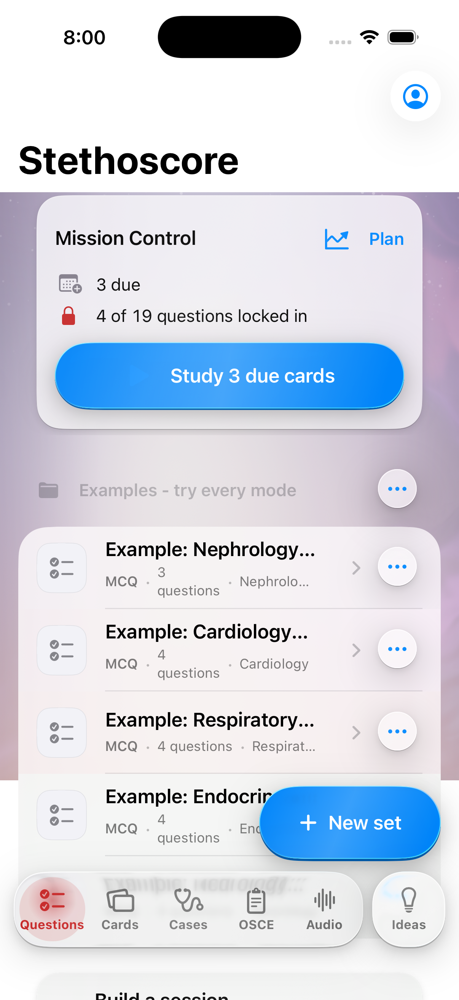

### iphone/5-other-bundle-id: iPhone 17 Pro

```
bundle=swift-playgrounds-dev-run.launchtest exe=Stethoscore Personal
keep=0 args=-launchTestSignedIn
launch_status=0
peak_rss_mb=495
pid=15118 alive_after_30s=yes
--- stderr.txt (last 25 of 1)
IOSurfaceClientSetSurfaceNotify failed e00002c7
--- log-process.txt: 55 matching lines (last 30)
2026-10-01 08:02:12.459 Df Stethoscore Personal[15118:bcd7] [com.apple.CFNetwork:Default] Initializing AlternativeServices Storage singleton
2026-10-01 08:02:12.459 Df Stethoscore Personal[15118:bcd7] [com.apple.FileURL:default] kExcludedFromBackupXattrName set on path: /Users/runner/Library/Developer/CoreSimulator/Devices/22452A91-4697-4369-8812-53ADB77EB73B/data/Containers/Data/Application/4952CA9E-7F9D-406E-82EE-935B5BCE25E3/Library/HTTPStorages/swift-playgrounds-dev-run.launchtest
2026-10-01 08:02:12.464 Df Stethoscore Personal[15118:bcd7] [com.apple.CFNetwork:Default] Connection 0: creating secure tcp or quic connection
2026-10-01 08:02:12.468 Df Stethoscore Personal[15118:bcd7] [com.apple.CFNetwork:Default] Connection 1: enabling TLS
2026-10-01 08:02:12.468 Df Stethoscore Personal[15118:bcd7] [com.apple.CFNetwork:Default] Connection 1: starting, TC(0x0)
2026-10-01 08:02:12.473 Df Stethoscore Personal[15118:bcd7] [com.apple.CFNetwork:Default] Task <3EC9148E-BC18-4076-96C4-52F350E6A8F9>.<1> setting up Connection 1
2026-10-01 08:02:12.483 Df Stethoscore Personal[15118:bcec] [com.apple.CFNetwork:Default] Garbage collection for alternative services
2026-10-01 08:02:12.490 Df Stethoscore Personal[15118:bc65] [com.apple.CFNetwork:Default] Connection 1: asked to evaluate TLS Trust
2026-10-01 08:02:12.491 Df Stethoscore Personal[15118:bc65] [com.apple.CFNetwork:Default] Task <3EC9148E-BC18-4076-96C4-52F350E6A8F9>.<1> auth completion disp=1 cred=0x0
2026-10-01 08:02:12.500 Df Stethoscore Personal[15118:bced] [com.apple.CFNetwork:Default] System Trust Evaluation yielded status(0)
2026-10-01 08:02:12.505 Df Stethoscore Personal[15118:bc65] [com.apple.CFNetwork:Default] Connection 1: TLS Trust result 0
2026-10-01 08:02:12.507 Df Stethoscore Personal[15118:bc65] [com.apple.network:boringssl] nw_protocol_boringssl_signal_connected(895) [C1.1.1.1:2][0x11c85bc60] TLS connected [server(0) version(0x0304) ciphersuite(TLS_AES_256_GCM_SHA384) group(0x11ec) signature_alg(0x0403) alpn(h2) resumed(0) offered_ticket(0) in_early_data(0) early_data_accepted(0) false_started(0) ocsp_received(0) sct_received(1)
2026-10-01 08:02:12.508 Df Stethoscore Personal[15118:bc65] [com.apple.CFNetwork:Default] Connection 1: connected successfully
2026-10-01 08:02:12.508 Df Stethoscore Personal[15118:bc65] [com.apple.CFNetwork:Default] Connection 1: TLS handshake complete
2026-10-01 08:02:12.508 Df Stethoscore Personal[15118:bc65] [com.apple.CFNetwork:Default] Connection 1: ready C(N) E(N)
2026-10-01 08:02:12.511 Df Stethoscore Personal[15118:bc65] [com.apple.CFNetwork:Default] Task <3EC9148E-BC18-4076-96C4-52F350E6A8F9>.<1> now using Connection 1
2026-10-01 08:02:12.512 Df Stethoscore Personal[15118:bc65] [com.apple.CFNetwork:Default] Task <3EC9148E-BC18-4076-96C4-52F350E6A8F9>.<1> sent request, body S 2
2026-10-01 08:02:12.523 Df Stethoscore Personal[15118:bc60] [com.apple.CFNetwork:Default] Task <3EC9148E-BC18-4076-96C4-52F350E6A8F9>.<1> received response, status 200 content U
2026-10-01 08:02:12.524 Df Stethoscore Personal[15118:bc60] [com.apple.CFNetwork:Default] Task <3EC9148E-BC18-4076-96C4-52F350E6A8F9>.<1> done using Connection 1
2026-10-01 08:02:12.530 Df Stethoscore Personal[15118:bc60] [com.apple.CFNetwork:Default] Task <3EC9148E-BC18-4076-96C4-52F350E6A8F9>.<1> response ended
2026-10-01 08:02:12.530 Df Stethoscore Personal[15118:bc60] [com.apple.CFNetwork:Default] Task <3EC9148E-BC18-4076-96C4-52F350E6A8F9>.<1> finished successfully
2026-10-01 08:02:12.776 I  Stethoscore Personal[15118:bc53] [com.apple.storekit:Default] AAFService Starting new XPCConnection a60611f8
2026-10-01 08:02:12.784 Df Stethoscore Personal[15118:bc60] [com.apple.storekit:Default] [Default] Finished iterating transaction batches
2026-10-01 08:02:12.790 I  Stethoscore Personal[15118:bcd8] [com.apple.storekit:Default] AAFService Closing XPCConnection a60611f8
2026-10-01 08:02:12.790 Df Stethoscore Personal[15118:bcec] [com.apple.storekit:Default] AAFService connection invalidated
2026-10-01 08:02:12.791 Df Stethoscore Personal[15118:bcd8] [com.apple.storekit:Default] Registering for 'transactionsupdated' daemon notification
2026-10-01 08:02:12.848 Df Stethoscore Personal[15118:bc64] [com.apple.FileURL:default] kExcludedFromBackupXattrName set on path: /Users/runner/Library/Developer/CoreSimulator/Devices/22452A91-4697-4369-8812-53ADB77EB73B/data/Containers/Data/Application/4952CA9E-7F9D-406E-82EE-935B5BCE25E3/Library/Application Support/RedPenSources
2026-10-01 08:02:15.841 Df Stethoscore Personal[15118:bc0b] [com.apple.network:activity] <nw_activity 50:1 [E4E60AE8-8F50-436F-BA6A-710B999C6A54] (global parent) (reporting strategy default) complete (reason success)> complete with reason 2 (success), duration 7122ms
2026-10-01 08:02:15.841 Df Stethoscore Personal[15118:bc0b] [com.apple.network:activity] <nw_activity 50:2 [1349B0DF-269B-44F7-90B4-7EE98F35D00B] (reporting strategy default) complete (reason success)> complete with reason 2 (success), duration 7122ms
2026-10-01 08:02:15.841 Df Stethoscore Personal[15118:bc0b] [com.apple.network:activity] Unsetting the global parent activity <nw_activity 50:1 [E4E60AE8-8F50-436F-BA6A-710B999C6A54] (global parent) (reporting strategy default) complete (reason success)>
--- log-system.txt: 76 matching lines (last 30)
2026-10-01 08:02:08.336 Df SpringBoard[2764:b8ea] [com.apple.SplashBoard:Capture] Image generation complete for: <XBLaunchStateRequest: 0x11c626e60; groupID: swift-playgrounds-dev-run.launchtest - {DEFAULT GROUP}; statusBar: normal; refSize: {402, 874}; orientation: Portrait; userInterfaceStyle: Dark>
```
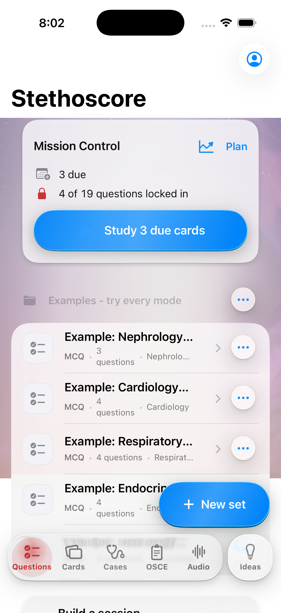

### iphone/6-open-every-set: iPhone 17 Pro

```
bundle=com.cramdown.personal exe=Stethoscore Personal
keep=1 args=-launchTestSignedIn -launchTestOpenSets
launch_status=0
peak_rss_mb=337
pid=10773 alive_after_60s=yes
--- stderr.txt (last 25 of 1)
IOSurfaceClientSetSurfaceNotify failed e00002c7
--- log-process.txt: 30 matching lines (last 30)
2026-10-01 08:00:53.810 Df Stethoscore Personal[10773:906c] [com.apple.dt.xctest:Default] Registering for test daemon availability notify post.
2026-10-01 08:00:53.811 Df Stethoscore Personal[10773:906c] [com.apple.dt.xctest:Default] notify_get_state check indicated test daemon not ready.
2026-10-01 08:00:53.811 Df Stethoscore Personal[10773:906c] [com.apple.dt.xctest:Default] notify_get_state check indicated test daemon not ready.
2026-10-01 08:00:53.811 Df Stethoscore Personal[10773:906c] [com.apple.dt.xctest:Default] notify_get_state check indicated test daemon not ready.
2026-10-01 08:00:53.844 Df Stethoscore Personal[10773:906c] [com.apple.FileURL:default] kExcludedFromBackupXattrName set on path: /Users/runner/Library/Developer/CoreSimulator/Devices/22452A91-4697-4369-8812-53ADB77EB73B/data/Containers/Data/Application/27F508AC-7BD5-4917-921B-D4A3CF309645/Library/Application Support/RedPenBlobs
2026-10-01 08:00:53.931 Df Stethoscore Personal[10773:906c] [com.apple.UIKit:KeyWindow] Setting default evaluation strategy for UIUserInterfaceIdiomPhone to LastOneWins
2026-10-01 08:00:53.931 Df Stethoscore Personal[10773:906c] [com.apple.UIKit:KeyWindow] Setting default evaluation strategy for UIUserInterfaceIdiomPhone to SystemShellManaged
2026-10-01 08:00:54.366 I  Stethoscore Personal[10773:906c] [com.apple.DesignLibrary:defaults] liveTuning=false
2026-10-01 08:00:54.448 Df Stethoscore Personal[10773:906c] [PrototypeTools:domain] Not observing PTDefaults on customer install.
2026-10-01 08:00:54.506 Df Stethoscore Personal[10773:90a7] [com.apple.calls.callkit:Default] Call host has no calls
2026-10-01 08:00:54.582 I  Stethoscore Personal[10773:9099] [com.apple.storekit:Default] AAFService Starting new XPCConnection 89b31f43
2026-10-01 08:00:54.593 Df Stethoscore Personal[10773:90a5] [com.apple.storekit:Default] [Default] Finished iterating transaction batches
2026-10-01 08:00:54.593 I  Stethoscore Personal[10773:9098] [com.apple.storekit:Default] AAFService Closing XPCConnection 89b31f43
2026-10-01 08:00:54.593 Df Stethoscore Personal[10773:9098] [com.apple.storekit:Default] AAFService connection invalidated
2026-10-01 08:00:55.006 Df Stethoscore Personal[10773:906c] [com.apple.network:activity] Create activity from XPC object <nw_activity 50:1 [0A2E9A81-3CC9-45E9-B162-31C67655B8D0] (reporting strategy default)>
2026-10-01 08:00:55.006 Df Stethoscore Personal[10773:906c] [com.apple.network:activity] Create activity from XPC object <nw_activity 50:2 [30D2F67E-EA21-4F46-8438-C27C38FFE5F7] (reporting strategy default)>
2026-10-01 08:00:55.006 Df Stethoscore Personal[10773:906c] [com.apple.network:activity] Set activity <nw_activity 50:1 [0A2E9A81-3CC9-45E9-B162-31C67655B8D0] (reporting strategy default)> as the global parent
2026-10-01 08:00:55.008 I  Stethoscore Personal[10773:9098] [com.apple.storekit:Default] AAFService Starting new XPCConnection d653946e
2026-10-01 08:00:55.014 Df Stethoscore Personal[10773:90a7] [com.apple.storekit:Default] [Default] Finished iterating transaction batches
2026-10-01 08:00:55.014 I  Stethoscore Personal[10773:9098] [com.apple.storekit:Default] AAFService Closing XPCConnection d653946e
2026-10-01 08:00:55.014 I  Stethoscore Personal[10773:9099] [com.apple.storekit:Default] AAFService Starting new XPCConnection 03b49fea
2026-10-01 08:00:55.015 Df Stethoscore Personal[10773:90a5] [com.apple.storekit:Default] AAFService connection invalidated
2026-10-01 08:00:55.023 Df Stethoscore Personal[10773:9099] [com.apple.storekit:Default] [Default] Finished iterating transaction batches
2026-10-01 08:00:55.381 I  Stethoscore Personal[10773:90a5] [com.apple.storekit:Default] AAFService Closing XPCConnection 03b49fea
2026-10-01 08:00:55.383 Df Stethoscore Personal[10773:9099] [com.apple.storekit:Default] Registering for 'transactionsupdated' daemon notification
2026-10-01 08:00:55.384 Df Stethoscore Personal[10773:9099] [com.apple.storekit:Default] AAFService connection invalidated
2026-10-01 08:00:56.401 Df Stethoscore Personal[10773:9098] [com.apple.FileURL:default] kExcludedFromBackupXattrName set on path: /Users/runner/Library/Developer/CoreSimulator/Devices/22452A91-4697-4369-8812-53ADB77EB73B/data/Containers/Data/Application/27F508AC-7BD5-4917-921B-D4A3CF309645/Library/Application Support/RedPenSources
2026-10-01 08:01:00.889 Df Stethoscore Personal[10773:906c] [com.apple.network:activity] <nw_activity 50:1 [0A2E9A81-3CC9-45E9-B162-31C67655B8D0] (global parent) (reporting strategy default) complete (reason success)> complete with reason 2 (success), duration 7908ms
2026-10-01 08:01:00.889 Df Stethoscore Personal[10773:906c] [com.apple.network:activity] <nw_activity 50:2 [30D2F67E-EA21-4F46-8438-C27C38FFE5F7] (reporting strategy default) complete (reason success)> complete with reason 2 (success), duration 7908ms
2026-10-01 08:01:00.889 Df Stethoscore Personal[10773:906c] [com.apple.network:activity] Unsetting the global parent activity <nw_activity 50:1 [0A2E9A81-3CC9-45E9-B162-31C67655B8D0] (global parent) (reporting strategy default) complete (reason success)>
--- log-system.txt: 79 matching lines (last 30)
2026-10-01 08:00:52.251 Df callservicesd[2852:8eb8] [com.apple.calls.copresencecore:Default] Invalidating cached value for bundle identifier: com.cramdown.personal
```


## current-lecture

```
iphone/1-fresh=0
iphone/2-signed-in=0
iphone/3-relaunch=0
iphone/5-other-bundle-id=0
ipad/1-fresh=0
ipad/2-signed-in=0
ipad/3-relaunch=0
```

### ipad/1-fresh: iPad Pro 13-inch (M5)

```
bundle=com.cramdown.personal exe=Stethoscore Personal
keep=0 args=
launch_status=0
peak_rss_mb=48
pid=22540 alive_after_30s=yes
--- stderr.txt (last 25 of 1)
IOSurfaceClientSetSurfaceNotify failed e00002c7
--- log-process.txt: 19 matching lines (last 30)
2026-10-01 07:52:07.351 Df Stethoscore Personal[22540:11d42] [com.apple.dt.xctest:Default] Registering for test daemon availability notify post.
2026-10-01 07:52:07.351 Df Stethoscore Personal[22540:11d42] [com.apple.dt.xctest:Default] notify_get_state check indicated test daemon not ready.
2026-10-01 07:52:07.352 Df Stethoscore Personal[22540:11d42] [com.apple.dt.xctest:Default] notify_get_state check indicated test daemon not ready.
2026-10-01 07:52:07.352 Df Stethoscore Personal[22540:11d42] [com.apple.dt.xctest:Default] notify_get_state check indicated test daemon not ready.
2026-10-01 07:52:07.457 Df Stethoscore Personal[22540:11d42] [com.apple.FileURL:default] kExcludedFromBackupXattrName set on path: /Users/runner/Library/Developer/CoreSimulator/Devices/A2011F14-88A1-46AA-999A-FD6FEDCD870B/data/Containers/Data/Application/325E28B4-5842-47E8-A0DB-097D24877728/Library/Application Support/RedPenBlobs
2026-10-01 07:52:07.644 Df Stethoscore Personal[22540:11d42] [com.apple.UIKit:KeyWindow] Setting default evaluation strategy for UIUserInterfaceIdiomPad to LastOneWins
2026-10-01 07:52:07.645 Df Stethoscore Personal[22540:11d42] [com.apple.UIKit:KeyWindow] Setting default evaluation strategy for UIUserInterfaceIdiomPad to SystemShellManaged
2026-10-01 07:52:08.683 Df Stethoscore Personal[22540:11d42] [PrototypeTools:domain] Not observing PTDefaults on customer install.
2026-10-01 07:52:10.847 Df Stethoscore Personal[22540:11d42] [com.apple.network:activity] Create activity from XPC object <nw_activity 50:1 [10D8E868-8003-486E-A940-47C6AD1467B8] (reporting strategy default)>
2026-10-01 07:52:10.847 Df Stethoscore Personal[22540:11d42] [com.apple.network:activity] Create activity from XPC object <nw_activity 50:2 [D6290A1A-437B-4E31-8234-9EDBA54AC8B0] (reporting strategy default)>
2026-10-01 07:52:10.847 Df Stethoscore Personal[22540:11d42] [com.apple.network:activity] Set activity <nw_activity 50:1 [10D8E868-8003-486E-A940-47C6AD1467B8] (reporting strategy default)> as the global parent
2026-10-01 07:52:11.550 Df Stethoscore Personal[22540:11e80] [com.apple.storekit:Default] [Default] Finished iterating transaction batches
2026-10-01 07:52:11.551 Df Stethoscore Personal[22540:11e80] [com.apple.storekit:Default] AAFService connection invalidated
2026-10-01 07:52:11.724 Df Stethoscore Personal[22540:11e81] [com.apple.storekit:Default] [Default] Finished iterating transaction batches
2026-10-01 07:52:11.815 Df Stethoscore Personal[22540:11e80] [com.apple.storekit:Default] Registering for 'transactionsupdated' daemon notification
2026-10-01 07:52:11.877 Df Stethoscore Personal[22540:11d6f] [com.apple.storekit:Default] AAFService connection invalidated
2026-10-01 07:52:34.480 Df Stethoscore Personal[22540:11d42] [com.apple.network:activity] <nw_activity 50:1 [10D8E868-8003-486E-A940-47C6AD1467B8] (global parent) (reporting strategy default) complete (reason failure)> complete with reason 3 (failure), duration 30072ms
2026-10-01 07:52:34.480 Df Stethoscore Personal[22540:11d42] [com.apple.network:activity] <nw_activity 50:2 [D6290A1A-437B-4E31-8234-9EDBA54AC8B0] (reporting strategy default) complete (reason failure)> complete with reason 3 (failure), duration 30069ms
2026-10-01 07:52:34.480 Df Stethoscore Personal[22540:11d42] [com.apple.network:activity] Unsetting the global parent activity <nw_activity 50:1 [10D8E868-8003-486E-A940-47C6AD1467B8] (global parent) (reporting strategy default) complete (reason failure)>
--- log-system.txt: 93 matching lines (last 30)
2026-10-01 07:52:02.246 Df splashboardd[22526:11cda] [com.apple.SplashBoard:Capture] Updating window to <XBLaunchStateRequest: 0x10124c150; groupID: com.cramdown.personal - {DEFAULT GROUP}; statusBar: normal; refSize: {1032, 1376}; naturalSize: {1376, 1032}; orientation: LandscapeLeft; userInterfaceStyle: Dark>
2026-10-01 07:52:02.392 Df SpringBoard[19005:11c63] [com.apple.SplashBoard:FileManifest] <XBApplicationSnapshotManifestImpl: 0x11772fb80> [com.cramdown.personal] Snapshot data for <XBApplicationSnapshot: 0x11bddfb80; …B0A901F1B6BB> [com.cramdown.personal] written to file: /Users/runner/Library/Developer/CoreSimulator/Devices/A2011F14-88A1-46AA-999A-FD6FEDCD870B/data/Containers/Data/Application/325
2026-10-01 07:52:02.394 Df SpringBoard[19005:11c7d] [com.apple.SplashBoard:Capture] Image generation complete for: <XBLaunchStateRequest: 0x11bdd3b80; groupID: com.cramdown.personal - {DEFAULT GROUP}; statusBar: normal; refSize: {1032, 1376}; naturalSize: {1376, 1032}; orientation: LandscapeLeft; userInterfaceStyle: Dark>
2026-10-01 07:52:02.394 Df SpringBoard[19005:10aa4] [com.apple.SplashBoard:Capture] Asynchronously generating image data for request: <XBLaunchStateRequest: 0x11bdd28b0; groupID: com.cramdown.personal - {DEFAULT GROUP}; statusBar: normal; refSize: {1032, 375}; naturalSize: {375, 1032}; orientation: LandscapeLeft; userInterfaceStyle: Dark>
2026-10-01 07:52:02.395 Df splashboardd[22526:11cda] [com.apple.SplashBoard:Capture] Updating window to <XBLaunchStateRequest: 0x10124c000; groupID: com.cramdown.personal - {DEFAULT GROUP}; statusBar: normal; refSize: {1032, 375}; naturalSize: {375, 1032}; orientation: LandscapeLeft; userInterfaceStyle: Dark>
2026-10-01 07:52:02.427 Df SpringBoard[19005:10983] [com.apple.SplashBoard:Capture] Image generation complete for: <XBLaunchStateRequest: 0x11bdd28b0; groupID: com.cramdown.personal - {DEFAULT GROUP}; statusBar: normal; refSize: {1032, 375}; naturalSize: {375, 1032}; orientation: LandscapeLeft; userInterfaceStyle: Dark>
2026-10-01 07:52:02.437 Df SpringBoard[19005:108c2] [com.apple.SplashBoard:FileManifest] <XBApplicationSnapshotManifestImpl: 0x11772fb80> [com.cramdown.personal] Snapshot data for <XBApplicationSnapshot: 0x11bddfd40; …FDCDE43D154E> [com.cramdown.personal] written to file: /Users/runner/Library/Developer/CoreSimulator/Devices/A2011F14-88A1-46AA-999A-FD6FEDCD870B/data/Containers/Data/Application/325
    "terminate_running_process" = 1;
	retryTimeout: 120.000000 (default write com.apple.CoreSimulatorBridge LaunchRetryTimeout <value>)
	bootTimeout: 300.000000 (default write com.apple.CoreSimulatorBridge BootRetryTimeout <value>)
	bootLeeway: 120.000000 (default write com.apple.CoreSimulatorBridge BootLeeway <value>)
	Note: Use 'xcrun simctl spawn booted defaults write <domain> <key> <value>' to modify defaults in the booted Simulator device.
```
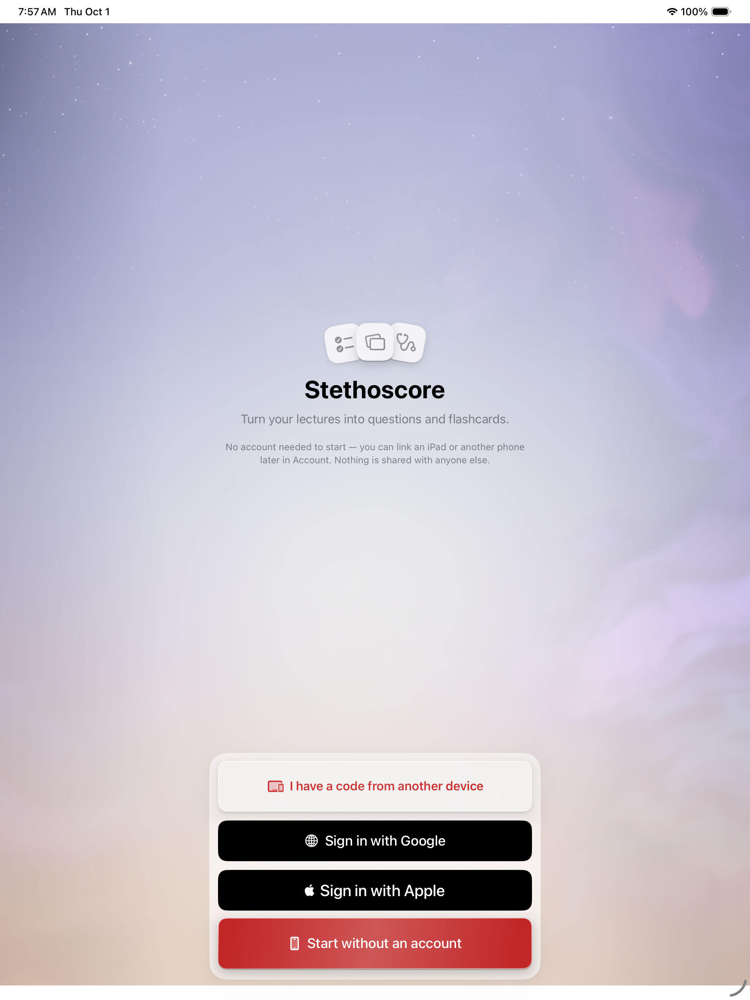

### ipad/2-signed-in: iPad Pro 13-inch (M5)

```
bundle=com.cramdown.personal exe=Stethoscore Personal
keep=1 args=-launchTestSignedIn
launch_status=0
peak_rss_mb=383
pid=27449 alive_after_30s=yes
--- stderr.txt (last 25 of 1)
IOSurfaceClientSetSurfaceNotify failed e00002c7
--- log-process.txt: 56 matching lines (last 30)
2026-10-01 08:00:05.115 Df Stethoscore Personal[27449:15b80] [com.apple.CFNetwork:Default] Initializing CFHTTPCookieStorage singleton
2026-10-01 08:00:05.115 Df Stethoscore Personal[27449:15b80] [com.apple.CFNetwork:Default] Creating default cookie storage with process/bundle identifier
2026-10-01 08:00:05.122 Df Stethoscore Personal[27449:15b80] [com.apple.CFNetwork:Default] Initializing AlternativeServices Storage singleton
2026-10-01 08:00:05.124 Df Stethoscore Personal[27449:15b80] [com.apple.FileURL:default] kExcludedFromBackupXattrName set on path: /Users/runner/Library/Developer/CoreSimulator/Devices/A2011F14-88A1-46AA-999A-FD6FEDCD870B/data/Containers/Data/Application/CF3B564A-A62C-4FD8-A22D-A78E60FD9A88/Library/HTTPStorages/com.cramdown.personal
2026-10-01 08:00:05.142 Df Stethoscore Personal[27449:15b80] [com.apple.CFNetwork:Default] Connection 0: creating secure tcp or quic connection
2026-10-01 08:00:05.166 Df Stethoscore Personal[27449:15b80] [com.apple.CFNetwork:Default] Connection 1: enabling TLS
2026-10-01 08:00:05.166 Df Stethoscore Personal[27449:15b80] [com.apple.CFNetwork:Default] Connection 1: starting, TC(0x0)
2026-10-01 08:00:05.175 Df Stethoscore Personal[27449:15b80] [com.apple.CFNetwork:Default] Task <EC457EFD-2E00-4047-8E6E-041FCA52F0C3>.<1> setting up Connection 1
2026-10-01 08:00:05.226 Df Stethoscore Personal[27449:15b51] [com.apple.CFNetwork:Default] Connection 1: asked to evaluate TLS Trust
2026-10-01 08:00:05.227 Df Stethoscore Personal[27449:15ca5] [com.apple.CFNetwork:Default] Task <EC457EFD-2E00-4047-8E6E-041FCA52F0C3>.<1> auth completion disp=1 cred=0x0
2026-10-01 08:00:05.264 Df Stethoscore Personal[27449:15b51] [com.apple.CFNetwork:Default] System Trust Evaluation yielded status(0)
2026-10-01 08:00:05.274 Df Stethoscore Personal[27449:15b7a] [com.apple.CFNetwork:Default] Connection 1: TLS Trust result 0
2026-10-01 08:00:05.277 Df Stethoscore Personal[27449:15b7a] [com.apple.network:boringssl] nw_protocol_boringssl_signal_connected(895) [C1.1.1.1:2][0x115849be0] TLS connected [server(0) version(0x0304) ciphersuite(TLS_AES_256_GCM_SHA384) group(0x11ec) signature_alg(0x0403) alpn(h2) resumed(0) offered_ticket(0) in_early_data(0) early_data_accepted(0) false_started(0) ocsp_received(0) sct_received(1
2026-10-01 08:00:05.280 Df Stethoscore Personal[27449:15b7a] [com.apple.CFNetwork:Default] Connection 1: connected successfully
2026-10-01 08:00:05.280 Df Stethoscore Personal[27449:15b7a] [com.apple.CFNetwork:Default] Connection 1: TLS handshake complete
2026-10-01 08:00:05.280 Df Stethoscore Personal[27449:15b7a] [com.apple.CFNetwork:Default] Connection 1: ready C(N) E(N)
2026-10-01 08:00:05.284 Df Stethoscore Personal[27449:15b7a] [com.apple.CFNetwork:Default] Task <EC457EFD-2E00-4047-8E6E-041FCA52F0C3>.<1> now using Connection 1
2026-10-01 08:00:05.285 Df Stethoscore Personal[27449:15b7a] [com.apple.CFNetwork:Default] Task <EC457EFD-2E00-4047-8E6E-041FCA52F0C3>.<1> sent request, body S 2
2026-10-01 08:00:05.342 Df Stethoscore Personal[27449:15ca5] [com.apple.CFNetwork:Default] Garbage collection for alternative services
2026-10-01 08:00:05.358 Df Stethoscore Personal[27449:15b51] [com.apple.CFNetwork:Default] Task <EC457EFD-2E00-4047-8E6E-041FCA52F0C3>.<1> received response, status 200 content U
2026-10-01 08:00:05.358 Df Stethoscore Personal[27449:15b51] [com.apple.CFNetwork:Default] Task <EC457EFD-2E00-4047-8E6E-041FCA52F0C3>.<1> done using Connection 1
2026-10-01 08:00:05.375 Df Stethoscore Personal[27449:15b51] [com.apple.CFNetwork:Default] Task <EC457EFD-2E00-4047-8E6E-041FCA52F0C3>.<1> response ended
2026-10-01 08:00:05.377 Df Stethoscore Personal[27449:15b51] [com.apple.CFNetwork:Default] Task <EC457EFD-2E00-4047-8E6E-041FCA52F0C3>.<1> finished successfully
2026-10-01 08:00:06.814 I  Stethoscore Personal[27449:15b7e] [com.apple.storekit:Default] AAFService Closing XPCConnection 3b54c363
2026-10-01 08:00:06.821 Df Stethoscore Personal[27449:15b51] [com.apple.storekit:Default] AAFService connection invalidated
2026-10-01 08:00:06.824 Df Stethoscore Personal[27449:15b7e] [com.apple.storekit:Default] Registering for 'transactionsupdated' daemon notification
2026-10-01 08:00:07.529 Df Stethoscore Personal[27449:15b12] [com.apple.network:activity] <nw_activity 50:1 [FB47D4B7-CC4C-4E99-AFE8-3E3BF5B4E935] (global parent) (reporting strategy default) complete (reason success)> complete with reason 2 (success), duration 12768ms
2026-10-01 08:00:07.529 Df Stethoscore Personal[27449:15b12] [com.apple.network:activity] <nw_activity 50:2 [38C60AC3-DDB4-4228-9482-648413568E9A] (reporting strategy default) complete (reason success)> complete with reason 2 (success), duration 12768ms
2026-10-01 08:00:07.529 Df Stethoscore Personal[27449:15b12] [com.apple.network:activity] Unsetting the global parent activity <nw_activity 50:1 [FB47D4B7-CC4C-4E99-AFE8-3E3BF5B4E935] (global parent) (reporting strategy default) complete (reason success)>
2026-10-01 08:00:25.755 Df Stethoscore Personal[27449:15b51] [com.apple.FileURL:default] kExcludedFromBackupXattrName set on path: /Users/runner/Library/Developer/CoreSimulator/Devices/A2011F14-88A1-46AA-999A-FD6FEDCD870B/data/Containers/Data/Application/CF3B564A-A62C-4FD8-A22D-A78E60FD9A88/Library/Application Support/RedPenSources
--- log-system.txt: 129 matching lines (last 30)
2026-10-01 07:59:54.607 Df SpringBoard[19005:159fa] [com.apple.SplashBoard:Capture] Asynchronously generating image data for request: <XBLaunchStateRequest: 0x11bdd0c40; groupID: com.cramdown.personal - {DEFAULT GROUP}; statusBar: normal; refSize: {1032, 375}; naturalSize: {375, 1032}; orientation: LandscapeLeft; userInterfaceStyle: Light>
```


### ipad/3-relaunch: iPad Pro 13-inch (M5)

```
bundle=com.cramdown.personal exe=Stethoscore Personal
keep=1 args=
launch_status=0
peak_rss_mb=372
pid=29643 alive_after_30s=yes
--- stderr.txt (last 25 of 1)
IOSurfaceClientSetSurfaceNotify failed e00002c7
--- log-process.txt: 31 matching lines (last 30)
2026-10-01 08:01:26.890 Df Stethoscore Personal[29643:171cc] [com.apple.dt.xctest:Default] notify_get_state check indicated test daemon not ready.
2026-10-01 08:01:26.891 Df Stethoscore Personal[29643:171cc] [com.apple.dt.xctest:Default] notify_get_state check indicated test daemon not ready.
2026-10-01 08:01:26.892 Df Stethoscore Personal[29643:171cc] [com.apple.dt.xctest:Default] notify_get_state check indicated test daemon not ready.
2026-10-01 08:01:26.995 Df Stethoscore Personal[29643:171cc] [com.apple.FileURL:default] kExcludedFromBackupXattrName set on path: /Users/runner/Library/Developer/CoreSimulator/Devices/A2011F14-88A1-46AA-999A-FD6FEDCD870B/data/Containers/Data/Application/0934BA88-AED9-4605-992A-1CF9012AD5FE/Library/Application Support/RedPenBlobs
2026-10-01 08:01:27.155 Df Stethoscore Personal[29643:171cc] [com.apple.UIKit:KeyWindow] Setting default evaluation strategy for UIUserInterfaceIdiomPad to LastOneWins
2026-10-01 08:01:27.158 Df Stethoscore Personal[29643:171cc] [com.apple.UIKit:KeyWindow] Setting default evaluation strategy for UIUserInterfaceIdiomPad to SystemShellManaged
2026-10-01 08:01:28.272 I  Stethoscore Personal[29643:171cc] [com.apple.DesignLibrary:defaults] liveTuning=false
2026-10-01 08:01:28.458 Df Stethoscore Personal[29643:171cc] [PrototypeTools:domain] Not observing PTDefaults on customer install.
2026-10-01 08:01:28.619 Df Stethoscore Personal[29643:17210] [com.apple.calls.callkit:Default] Call host has no calls
2026-10-01 08:01:28.747 I  Stethoscore Personal[29643:17210] [com.apple.storekit:Default] AAFService Starting new XPCConnection 27ee850e
2026-10-01 08:01:28.765 Df Stethoscore Personal[29643:1720f] [com.apple.storekit:Default] [Default] Finished iterating transaction batches
2026-10-01 08:01:28.766 I  Stethoscore Personal[29643:1720f] [com.apple.storekit:Default] AAFService Closing XPCConnection 27ee850e
2026-10-01 08:01:28.766 Df Stethoscore Personal[29643:1720f] [com.apple.storekit:Default] AAFService connection invalidated
2026-10-01 08:01:30.433 Df Stethoscore Personal[29643:171cc] [com.apple.network:activity] Create activity from XPC object <nw_activity 50:1 [6AE52A14-0285-43C0-9A30-4C1DF617ABC5] (reporting strategy default)>
2026-10-01 08:01:30.434 Df Stethoscore Personal[29643:171cc] [com.apple.network:activity] Create activity from XPC object <nw_activity 50:2 [7C6B6DD3-0B57-4E83-9116-066B903C5A28] (reporting strategy default)>
2026-10-01 08:01:30.434 Df Stethoscore Personal[29643:171cc] [com.apple.network:activity] Set activity <nw_activity 50:1 [6AE52A14-0285-43C0-9A30-4C1DF617ABC5] (reporting strategy default)> as the global parent
2026-10-01 08:01:30.507 I  Stethoscore Personal[29643:17210] [com.apple.storekit:Default] AAFService Starting new XPCConnection a7cb0d82
2026-10-01 08:01:30.517 I  Stethoscore Personal[29643:171cc] [com.apple.PointerUI:Common] Activating Connection: <BSXPC(com.apple.PointerUI.pointeruid.service[C:3-1])-as(com.apple.PointerUI.pointeruid.default-service):0x1026c70c0 name=(null)>
2026-10-01 08:01:30.527 Df Stethoscore Personal[29643:17210] [com.apple.storekit:Default] [Default] Finished iterating transaction batches
2026-10-01 08:01:30.527 I  Stethoscore Personal[29643:17210] [com.apple.storekit:Default] AAFService Closing XPCConnection a7cb0d82
2026-10-01 08:01:30.528 I  Stethoscore Personal[29643:17210] [com.apple.storekit:Default] AAFService Starting new XPCConnection b678e6e3
2026-10-01 08:01:30.528 Df Stethoscore Personal[29643:17211] [com.apple.storekit:Default] AAFService connection invalidated
2026-10-01 08:01:30.544 Df Stethoscore Personal[29643:17211] [com.apple.storekit:Default] [Default] Finished iterating transaction batches
2026-10-01 08:01:32.069 I  Stethoscore Personal[29643:1720f] [com.apple.storekit:Default] AAFService Closing XPCConnection b678e6e3
2026-10-01 08:01:32.092 Df Stethoscore Personal[29643:17316] [com.apple.storekit:Default] Registering for 'transactionsupdated' daemon notification
2026-10-01 08:01:32.100 Df Stethoscore Personal[29643:17316] [com.apple.storekit:Default] AAFService connection invalidated
2026-10-01 08:01:32.786 Df Stethoscore Personal[29643:171cc] [com.apple.network:activity] <nw_activity 50:1 [6AE52A14-0285-43C0-9A30-4C1DF617ABC5] (global parent) (reporting strategy default) complete (reason success)> complete with reason 2 (success), duration 7876ms
2026-10-01 08:01:32.786 Df Stethoscore Personal[29643:171cc] [com.apple.network:activity] <nw_activity 50:2 [7C6B6DD3-0B57-4E83-9116-066B903C5A28] (reporting strategy default) complete (reason success)> complete with reason 2 (success), duration 7876ms
2026-10-01 08:01:32.786 Df Stethoscore Personal[29643:171cc] [com.apple.network:activity] Unsetting the global parent activity <nw_activity 50:1 [6AE52A14-0285-43C0-9A30-4C1DF617ABC5] (global parent) (reporting strategy default) complete (reason success)>
2026-10-01 08:02:40.505 Df Stethoscore Personal[29643:172fc] [com.apple.FileURL:default] kExcludedFromBackupXattrName set on path: /Users/runner/Library/Developer/CoreSimulator/Devices/A2011F14-88A1-46AA-999A-FD6FEDCD870B/data/Containers/Data/Application/0934BA88-AED9-4605-992A-1CF9012AD5FE/Library/Application Support/RedPenSources
--- log-system.txt: 121 matching lines (last 30)
2026-10-01 08:01:22.202 Df SpringBoard[19005:10aaf] [com.apple.SplashBoard:Capture] Image generation complete for: <XBLaunchStateRequest: 0x11bda93b0; groupID: com.cramdown.personal - {DEFAULT GROUP}; statusBar: normal; refSize: {1032, 375}; naturalSize: {375, 1032}; orientation: LandscapeLeft; userInterfaceStyle: Light>
```


### iphone/1-fresh: iPhone 17 Pro

```
bundle=com.cramdown.personal exe=Stethoscore Personal
keep=0 args=
launch_status=0
peak_rss_mb=111
pid=7685 alive_after_30s=yes
--- stderr.txt (last 25 of 1)
IOSurfaceClientSetSurfaceNotify failed e00002c7
--- log-process.txt: 20 matching lines (last 30)
2026-10-01 07:33:06.392 Df Stethoscore Personal[7685:6d98] [com.apple.dt.xctest:Default] Registering for test daemon availability notify post.
2026-10-01 07:33:06.392 Df Stethoscore Personal[7685:6d98] [com.apple.dt.xctest:Default] notify_get_state check indicated test daemon not ready.
2026-10-01 07:33:06.392 Df Stethoscore Personal[7685:6d98] [com.apple.dt.xctest:Default] notify_get_state check indicated test daemon not ready.
2026-10-01 07:33:06.392 Df Stethoscore Personal[7685:6d98] [com.apple.dt.xctest:Default] notify_get_state check indicated test daemon not ready.
2026-10-01 07:33:06.495 Df Stethoscore Personal[7685:6d98] [com.apple.FileURL:default] kExcludedFromBackupXattrName set on path: /Users/runner/Library/Developer/CoreSimulator/Devices/22452A91-4697-4369-8812-53ADB77EB73B/data/Containers/Data/Application/8384053E-366F-45DD-B11F-0C47EA66056D/Library/Application Support/RedPenBlobs
2026-10-01 07:33:06.656 Df Stethoscore Personal[7685:6d98] [com.apple.UIKit:KeyWindow] Setting default evaluation strategy for UIUserInterfaceIdiomPhone to LastOneWins
2026-10-01 07:33:06.656 Df Stethoscore Personal[7685:6d98] [com.apple.UIKit:KeyWindow] Setting default evaluation strategy for UIUserInterfaceIdiomPhone to SystemShellManaged
2026-10-01 07:33:07.451 Df Stethoscore Personal[7685:6d98] [PrototypeTools:domain] Not observing PTDefaults on customer install.
2026-10-01 07:33:09.165 Df Stethoscore Personal[7685:6d98] [com.apple.network:activity] Create activity from XPC object <nw_activity 50:1 [F2BD6A5F-163A-42BC-BDEA-CF8D79244723] (reporting strategy default)>
2026-10-01 07:33:09.165 Df Stethoscore Personal[7685:6d98] [com.apple.network:activity] Create activity from XPC object <nw_activity 50:2 [B83F386F-754C-4742-A964-87351B0C8FA2] (reporting strategy default)>
2026-10-01 07:33:09.165 Df Stethoscore Personal[7685:6d98] [com.apple.network:activity] Set activity <nw_activity 50:1 [F2BD6A5F-163A-42BC-BDEA-CF8D79244723] (reporting strategy default)> as the global parent
2026-10-01 07:33:09.605 Df Stethoscore Personal[7685:6ec6] [com.apple.storekit:Default] [Default] Finished iterating transaction batches
2026-10-01 07:33:09.690 Df Stethoscore Personal[7685:6dc9] [com.apple.storekit:Default] AAFService connection invalidated
2026-10-01 07:33:09.937 Df Stethoscore Personal[7685:6dc7] [com.apple.storekit:Default] [Default] Finished iterating transaction batches
2026-10-01 07:33:09.949 Df Stethoscore Personal[7685:6dc7] [com.apple.storekit:Default] Registering for 'transactionsupdated' daemon notification
2026-10-01 07:33:09.980 Df Stethoscore Personal[7685:6dc7] [com.apple.storekit:Default] AAFService connection invalidated
2026-10-01 07:33:10.695 Df Stethoscore Personal[7685:6d98] [com.apple.network:activity] <nw_activity 50:1 [F2BD6A5F-163A-42BC-BDEA-CF8D79244723] (global parent) (reporting strategy default) complete (reason success)> complete with reason 2 (success), duration 6403ms
2026-10-01 07:33:10.695 Df Stethoscore Personal[7685:6d98] [com.apple.network:activity] <nw_activity 50:2 [B83F386F-754C-4742-A964-87351B0C8FA2] (reporting strategy default) complete (reason success)> complete with reason 2 (success), duration 6403ms
2026-10-01 07:33:10.696 Df Stethoscore Personal[7685:6d98] [com.apple.network:activity] Unsetting the global parent activity <nw_activity 50:1 [F2BD6A5F-163A-42BC-BDEA-CF8D79244723] (global parent) (reporting strategy default) complete (reason success)>
2026-10-01 07:33:44.657 E  Stethoscore Personal[7685:6d98] [com.apple.UIKit:BackgroundTask] Background Task 3 ("Saving library"), was created over 30 seconds ago. In applications running in the background, this creates a risk of termination. Remember to call UIApplication.endBackgroundTask(_:) for your task in a timely manner to avoid this.
--- log-system.txt: 70 matching lines (last 30)
2026-10-01 07:33:01.518 Df SpringBoard[4872:5c80] [com.apple.SplashBoard:Capture] Image generation complete for: <XBLaunchStateRequest: 0x102c25810; groupID: com.cramdown.personal - {DEFAULT GROUP}; statusBar: normal; refSize: {402, 874}; orientation: Portrait; userInterfaceStyle: Light>
2026-10-01 07:33:01.518 Df SpringBoard[4872:5c9f] [com.apple.SplashBoard:FileManifest] <XBApplicationSnapshotManifestImpl: 0x11a011a80> [com.cramdown.personal] Snapshot data for <XBApplicationSnapshot: 0x11a36b100; …7A35B80F643A> [com.cramdown.personal] written to file: /Users/runner/Library/Developer/CoreSimulator/Devices/22452A91-4697-4369-8812-53ADB77EB73B/data/Containers/Data/Application/83840
2026-10-01 07:33:01.520 Df SpringBoard[4872:5bf2] [com.apple.SplashBoard:Capture] Asynchronously generating image data for request: <XBLaunchStateRequest: 0x102f33790; groupID: com.cramdown.personal - {DEFAULT GROUP}; statusBar: normal; refSize: {402, 874}; orientation: Portrait; userInterfaceStyle: Dark>
2026-10-01 07:33:01.522 Df splashboardd[7581:6c54] [com.apple.SplashBoard:Capture] Updating window to <XBLaunchStateRequest: 0x101a58000; groupID: com.cramdown.personal - {DEFAULT GROUP}; statusBar: normal; refSize: {402, 874}; orientation: Portrait; userInterfaceStyle: Dark>
2026-10-01 07:33:01.676 Df SpringBoard[4872:5c36] [com.apple.SplashBoard:Capture] Image generation complete for: <XBLaunchStateRequest: 0x102f33790; groupID: com.cramdown.personal - {DEFAULT GROUP}; statusBar: normal; refSize: {402, 874}; orientation: Portrait; userInterfaceStyle: Dark>
2026-10-01 07:33:01.679 Df SpringBoard[4872:5c9f] [com.apple.SplashBoard:FileManifest] <XBApplicationSnapshotManifestImpl: 0x11a011a80> [com.cramdown.personal] Snapshot data for <XBApplicationSnapshot: 0x11a3696c0; …B330A70BCE72> [com.cramdown.personal] written to file: /Users/runner/Library/Developer/CoreSimulator/Devices/22452A91-4697-4369-8812-53ADB77EB73B/data/Containers/Data/Application/83840
    "terminate_running_process" = 1;
	retryTimeout: 120.000000 (default write com.apple.CoreSimulatorBridge LaunchRetryTimeout <value>)
	bootTimeout: 300.000000 (default write com.apple.CoreSimulatorBridge BootRetryTimeout <value>)
	bootLeeway: 120.000000 (default write com.apple.CoreSimulatorBridge BootLeeway <value>)
	Note: Use 'xcrun simctl spawn booted defaults write <domain> <key> <value>' to modify defaults in the booted Simulator device.
```
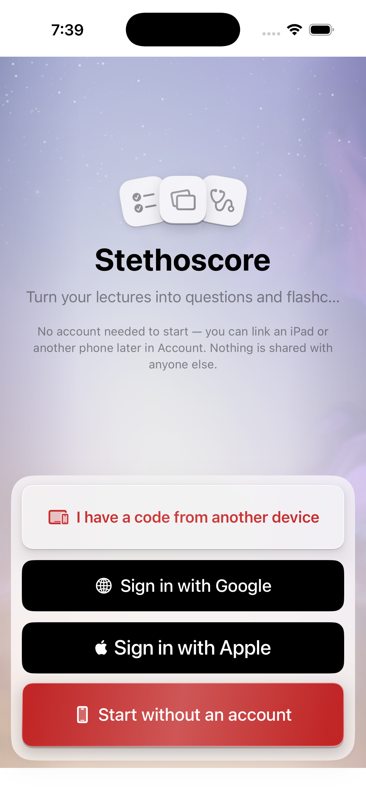

### iphone/2-signed-in: iPhone 17 Pro

```
bundle=com.cramdown.personal exe=Stethoscore Personal
keep=1 args=-launchTestSignedIn
launch_status=0
peak_rss_mb=370
pid=12164 alive_after_30s=yes
--- stderr.txt (last 25 of 1)
IOSurfaceClientSetSurfaceNotify failed e00002c7
--- log-process.txt: 54 matching lines (last 30)
2026-10-01 07:42:54.623 Df Stethoscore Personal[12164:a545] [com.apple.CFNetwork:Default] Initializing CFHTTPCookieStorage singleton
2026-10-01 07:42:54.623 Df Stethoscore Personal[12164:a545] [com.apple.CFNetwork:Default] Creating default cookie storage with process/bundle identifier
2026-10-01 07:42:54.625 Df Stethoscore Personal[12164:a5ea] [com.apple.storekit:Default] [Default] Finished iterating transaction batches
2026-10-01 07:42:54.653 Df Stethoscore Personal[12164:a545] [com.apple.CFNetwork:Default] Initializing AlternativeServices Storage singleton
2026-10-01 07:42:54.654 Df Stethoscore Personal[12164:a545] [com.apple.FileURL:default] kExcludedFromBackupXattrName set on path: /Users/runner/Library/Developer/CoreSimulator/Devices/22452A91-4697-4369-8812-53ADB77EB73B/data/Containers/Data/Application/7ABDAAFE-3DE7-436F-80A8-879F8604C39F/Library/HTTPStorages/com.cramdown.personal
2026-10-01 07:42:54.676 Df Stethoscore Personal[12164:a545] [com.apple.CFNetwork:Default] Connection 0: creating secure tcp or quic connection
2026-10-01 07:42:55.289 Df Stethoscore Personal[12164:a545] [com.apple.CFNetwork:Default] Connection 1: enabling TLS
2026-10-01 07:42:55.289 Df Stethoscore Personal[12164:a545] [com.apple.CFNetwork:Default] Connection 1: starting, TC(0x0)
2026-10-01 07:42:55.527 I  Stethoscore Personal[12164:a5ea] [com.apple.storekit:Default] AAFService Closing XPCConnection d7d4ae53
2026-10-01 07:42:55.546 Df Stethoscore Personal[12164:a52f] [com.apple.storekit:Default] Registering for 'transactionsupdated' daemon notification
2026-10-01 07:42:55.558 Df Stethoscore Personal[12164:a529] [com.apple.storekit:Default] AAFService connection invalidated
2026-10-01 07:42:55.917 Df Stethoscore Personal[12164:a545] [com.apple.CFNetwork:Default] Task <42D6E2AD-04C5-45C9-9EDE-3E091C40890C>.<1> setting up Connection 1
2026-10-01 07:42:56.232 Df Stethoscore Personal[12164:a52f] [com.apple.CFNetwork:Default] Connection 1: asked to evaluate TLS Trust
2026-10-01 07:42:56.250 Df Stethoscore Personal[12164:a52f] [com.apple.CFNetwork:Default] Task <42D6E2AD-04C5-45C9-9EDE-3E091C40890C>.<1> auth completion disp=1 cred=0x0
2026-10-01 07:42:56.684 Df Stethoscore Personal[12164:a52f] [com.apple.CFNetwork:Default] System Trust Evaluation yielded status(0)
2026-10-01 07:42:56.691 Df Stethoscore Personal[12164:a5e9] [com.apple.CFNetwork:Default] Connection 1: TLS Trust result 0
2026-10-01 07:42:56.696 Df Stethoscore Personal[12164:a5e9] [com.apple.network:boringssl] nw_protocol_boringssl_signal_connected(895) [C1.1.1.1:2][0x115842ae0] TLS connected [server(0) version(0x0304) ciphersuite(TLS_AES_256_GCM_SHA384) group(0x11ec) signature_alg(0x0403) alpn(h2) resumed(0) offered_ticket(0) in_early_data(0) early_data_accepted(0) false_started(0) ocsp_received(0) sct_received(1)
2026-10-01 07:42:56.705 Df Stethoscore Personal[12164:a5e9] [com.apple.CFNetwork:Default] Connection 1: connected successfully
2026-10-01 07:42:56.706 Df Stethoscore Personal[12164:a5e9] [com.apple.CFNetwork:Default] Connection 1: TLS handshake complete
2026-10-01 07:42:56.706 Df Stethoscore Personal[12164:a5e9] [com.apple.CFNetwork:Default] Connection 1: ready C(N) E(N)
2026-10-01 07:42:56.723 Df Stethoscore Personal[12164:a5e9] [com.apple.CFNetwork:Default] Task <42D6E2AD-04C5-45C9-9EDE-3E091C40890C>.<1> now using Connection 1
2026-10-01 07:42:56.724 Df Stethoscore Personal[12164:a5e9] [com.apple.CFNetwork:Default] Task <42D6E2AD-04C5-45C9-9EDE-3E091C40890C>.<1> sent request, body S 2
2026-10-01 07:42:56.833 Df Stethoscore Personal[12164:a5ea] [com.apple.CFNetwork:Default] Task <42D6E2AD-04C5-45C9-9EDE-3E091C40890C>.<1> received response, status 200 content U
2026-10-01 07:42:56.833 Df Stethoscore Personal[12164:a5ea] [com.apple.CFNetwork:Default] Task <42D6E2AD-04C5-45C9-9EDE-3E091C40890C>.<1> done using Connection 1
2026-10-01 07:42:56.884 Df Stethoscore Personal[12164:a5ea] [com.apple.CFNetwork:Default] Task <42D6E2AD-04C5-45C9-9EDE-3E091C40890C>.<1> response ended
2026-10-01 07:42:56.886 Df Stethoscore Personal[12164:a545] [com.apple.CFNetwork:Default] Task <42D6E2AD-04C5-45C9-9EDE-3E091C40890C>.<1> finished successfully
2026-10-01 07:42:57.190 Df Stethoscore Personal[12164:a529] [com.apple.CFNetwork:Default] Garbage collection for alternative services
2026-10-01 07:43:04.103 Df Stethoscore Personal[12164:a4b9] [com.apple.network:activity] <nw_activity 50:1 [FF449C58-DDB8-4660-BCCE-42C91FE07DCF] (global parent) (reporting strategy default) complete (reason success)> complete with reason 2 (success), duration 18655ms
2026-10-01 07:43:04.103 Df Stethoscore Personal[12164:a4b9] [com.apple.network:activity] <nw_activity 50:2 [6983B79E-5E71-4F24-B736-128A34392183] (reporting strategy default) complete (reason success)> complete with reason 2 (success), duration 18655ms
2026-10-01 07:43:04.103 Df Stethoscore Personal[12164:a4b9] [com.apple.network:activity] Unsetting the global parent activity <nw_activity 50:1 [FF449C58-DDB8-4660-BCCE-42C91FE07DCF] (global parent) (reporting strategy default) complete (reason success)>
--- log-system.txt: 79 matching lines (last 30)
2026-10-01 07:42:42.002 Df SpringBoard[4872:5c76] [com.apple.SplashBoard:Capture] Asynchronously generating image data for request: <XBLaunchStateRequest: 0x11ab663e0; groupID: com.cramdown.personal - {DEFAULT GROUP}; statusBar: normal; refSize: {402, 874}; orientation: Portrait; userInterfaceStyle: Light>
```
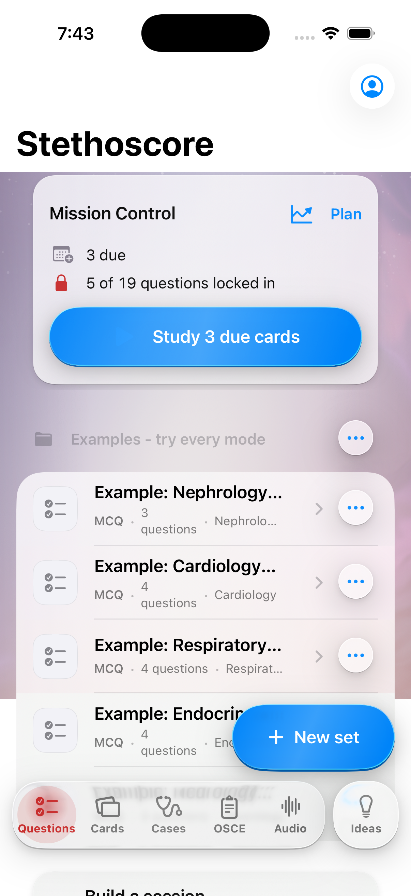

### iphone/3-relaunch: iPhone 17 Pro

```
bundle=com.cramdown.personal exe=Stethoscore Personal
keep=1 args=
launch_status=0
peak_rss_mb=359
pid=14391 alive_after_30s=yes
--- stderr.txt (last 25 of 1)
IOSurfaceClientSetSurfaceNotify failed e00002c7
--- log-process.txt: 30 matching lines (last 30)
2026-10-01 07:44:31.643 Df Stethoscore Personal[14391:be40] [com.apple.dt.xctest:Default] Registering for test daemon availability notify post.
2026-10-01 07:44:31.644 Df Stethoscore Personal[14391:be40] [com.apple.dt.xctest:Default] notify_get_state check indicated test daemon not ready.
2026-10-01 07:44:31.644 Df Stethoscore Personal[14391:be40] [com.apple.dt.xctest:Default] notify_get_state check indicated test daemon not ready.
2026-10-01 07:44:31.644 Df Stethoscore Personal[14391:be40] [com.apple.dt.xctest:Default] notify_get_state check indicated test daemon not ready.
2026-10-01 07:44:31.759 Df Stethoscore Personal[14391:be40] [com.apple.FileURL:default] kExcludedFromBackupXattrName set on path: /Users/runner/Library/Developer/CoreSimulator/Devices/22452A91-4697-4369-8812-53ADB77EB73B/data/Containers/Data/Application/3387A99D-CEA0-4411-B8FD-08F6165310B8/Library/Application Support/RedPenBlobs
2026-10-01 07:44:31.916 Df Stethoscore Personal[14391:be40] [com.apple.UIKit:KeyWindow] Setting default evaluation strategy for UIUserInterfaceIdiomPhone to LastOneWins
2026-10-01 07:44:31.916 Df Stethoscore Personal[14391:be40] [com.apple.UIKit:KeyWindow] Setting default evaluation strategy for UIUserInterfaceIdiomPhone to SystemShellManaged
2026-10-01 07:44:33.138 I  Stethoscore Personal[14391:be40] [com.apple.DesignLibrary:defaults] liveTuning=false
2026-10-01 07:44:33.330 Df Stethoscore Personal[14391:be40] [PrototypeTools:domain] Not observing PTDefaults on customer install.
2026-10-01 07:44:33.503 Df Stethoscore Personal[14391:be6e] [com.apple.calls.callkit:Default] Call host has no calls
2026-10-01 07:44:33.641 I  Stethoscore Personal[14391:be52] [com.apple.storekit:Default] AAFService Starting new XPCConnection d95f27e8
2026-10-01 07:44:33.671 Df Stethoscore Personal[14391:be52] [com.apple.storekit:Default] [Default] Finished iterating transaction batches
2026-10-01 07:44:33.672 I  Stethoscore Personal[14391:be6e] [com.apple.storekit:Default] AAFService Closing XPCConnection d95f27e8
2026-10-01 07:44:33.672 Df Stethoscore Personal[14391:be6e] [com.apple.storekit:Default] AAFService connection invalidated
2026-10-01 07:44:35.039 Df Stethoscore Personal[14391:be40] [com.apple.network:activity] Create activity from XPC object <nw_activity 50:1 [1DCEB153-FA45-4C77-989C-22EC95892104] (reporting strategy default)>
2026-10-01 07:44:35.040 Df Stethoscore Personal[14391:be40] [com.apple.network:activity] Create activity from XPC object <nw_activity 50:2 [42357385-668D-4054-A778-5F70562AD3F8] (reporting strategy default)>
2026-10-01 07:44:35.040 Df Stethoscore Personal[14391:be40] [com.apple.network:activity] Set activity <nw_activity 50:1 [1DCEB153-FA45-4C77-989C-22EC95892104] (reporting strategy default)> as the global parent
2026-10-01 07:44:35.042 I  Stethoscore Personal[14391:be52] [com.apple.storekit:Default] AAFService Starting new XPCConnection dd5c006a
2026-10-01 07:44:35.069 Df Stethoscore Personal[14391:be56] [com.apple.storekit:Default] [Default] Finished iterating transaction batches
2026-10-01 07:44:35.069 I  Stethoscore Personal[14391:be56] [com.apple.storekit:Default] AAFService Closing XPCConnection dd5c006a
2026-10-01 07:44:35.070 I  Stethoscore Personal[14391:be58] [com.apple.storekit:Default] AAFService Starting new XPCConnection fc8d6322
2026-10-01 07:44:35.082 Df Stethoscore Personal[14391:be58] [com.apple.storekit:Default] [Default] Finished iterating transaction batches
2026-10-01 07:44:35.092 Df Stethoscore Personal[14391:be52] [com.apple.storekit:Default] AAFService connection invalidated
2026-10-01 07:44:35.922 I  Stethoscore Personal[14391:be58] [com.apple.storekit:Default] AAFService Closing XPCConnection fc8d6322
2026-10-01 07:44:35.927 Df Stethoscore Personal[14391:be58] [com.apple.storekit:Default] Registering for 'transactionsupdated' daemon notification
2026-10-01 07:44:35.934 Df Stethoscore Personal[14391:be6d] [com.apple.storekit:Default] AAFService connection invalidated
2026-10-01 07:44:36.805 Df Stethoscore Personal[14391:be40] [com.apple.network:activity] <nw_activity 50:1 [1DCEB153-FA45-4C77-989C-22EC95892104] (global parent) (reporting strategy default) complete (reason success)> complete with reason 2 (success), duration 7437ms
2026-10-01 07:44:36.805 Df Stethoscore Personal[14391:be40] [com.apple.network:activity] <nw_activity 50:2 [42357385-668D-4054-A778-5F70562AD3F8] (reporting strategy default) complete (reason success)> complete with reason 2 (success), duration 7437ms
2026-10-01 07:44:36.805 Df Stethoscore Personal[14391:be40] [com.apple.network:activity] Unsetting the global parent activity <nw_activity 50:1 [1DCEB153-FA45-4C77-989C-22EC95892104] (global parent) (reporting strategy default) complete (reason success)>
2026-10-01 07:45:08.113 Df Stethoscore Personal[14391:be52] [com.apple.FileURL:default] kExcludedFromBackupXattrName set on path: /Users/runner/Library/Developer/CoreSimulator/Devices/22452A91-4697-4369-8812-53ADB77EB73B/data/Containers/Data/Application/3387A99D-CEA0-4411-B8FD-08F6165310B8/Library/Application Support/RedPenSources
--- log-system.txt: 79 matching lines (last 30)
2026-10-01 07:44:27.306 Df SpringBoard[4872:5c93] [com.apple.SplashBoard:Capture] Asynchronously generating image data for request: <XBLaunchStateRequest: 0x11a988af0; groupID: com.cramdown.personal - {DEFAULT GROUP}; statusBar: normal; refSize: {402, 874}; orientation: Portrait; userInterfaceStyle: Light>
```
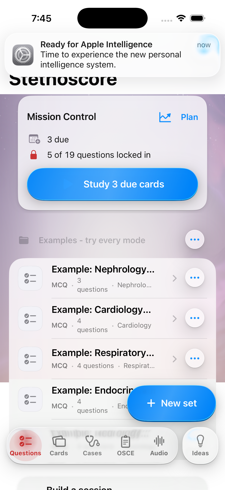

### iphone/5-other-bundle-id: iPhone 17 Pro

```
bundle=swift-playgrounds-dev-run.launchtest exe=Stethoscore Personal
keep=0 args=-launchTestSignedIn
launch_status=0
peak_rss_mb=408
pid=16860 alive_after_30s=yes
--- stderr.txt (last 25 of 1)
IOSurfaceClientSetSurfaceNotify failed e00002c7
--- log-process.txt: 55 matching lines (last 30)
2026-10-01 07:46:42.318 Df Stethoscore Personal[16860:d978] [com.apple.CFNetwork:Default] Initializing AlternativeServices Storage singleton
2026-10-01 07:46:42.319 Df Stethoscore Personal[16860:d978] [com.apple.FileURL:default] kExcludedFromBackupXattrName set on path: /Users/runner/Library/Developer/CoreSimulator/Devices/22452A91-4697-4369-8812-53ADB77EB73B/data/Containers/Data/Application/58D90CEC-DDF1-43CD-AD30-A144C9FE8F03/Library/HTTPStorages/swift-playgrounds-dev-run.launchtest
2026-10-01 07:46:42.334 Df Stethoscore Personal[16860:d978] [com.apple.CFNetwork:Default] Connection 0: creating secure tcp or quic connection
2026-10-01 07:46:42.381 Df Stethoscore Personal[16860:d978] [com.apple.CFNetwork:Default] Connection 1: enabling TLS
2026-10-01 07:46:42.381 Df Stethoscore Personal[16860:d978] [com.apple.CFNetwork:Default] Connection 1: starting, TC(0x0)
2026-10-01 07:46:42.444 Df Stethoscore Personal[16860:d978] [com.apple.CFNetwork:Default] Task <F985DCCA-4873-4659-AEC4-67E824579375>.<1> setting up Connection 1
2026-10-01 07:46:42.632 Df Stethoscore Personal[16860:d91e] [com.apple.CFNetwork:Default] Connection 1: asked to evaluate TLS Trust
2026-10-01 07:46:42.653 Df Stethoscore Personal[16860:d91e] [com.apple.CFNetwork:Default] Task <F985DCCA-4873-4659-AEC4-67E824579375>.<1> auth completion disp=1 cred=0x0
2026-10-01 07:46:42.687 Df Stethoscore Personal[16860:d91d] [com.apple.CFNetwork:Default] System Trust Evaluation yielded status(0)
2026-10-01 07:46:42.699 Df Stethoscore Personal[16860:d978] [com.apple.CFNetwork:Default] Connection 1: TLS Trust result 0
2026-10-01 07:46:42.701 Df Stethoscore Personal[16860:d978] [com.apple.network:boringssl] nw_protocol_boringssl_signal_connected(895) [C1.1.1.1:2][0x11533efe0] TLS connected [server(0) version(0x0304) ciphersuite(TLS_AES_256_GCM_SHA384) group(0x11ec) signature_alg(0x0403) alpn(h2) resumed(0) offered_ticket(0) in_early_data(0) early_data_accepted(0) false_started(0) ocsp_received(0) sct_received(1)
2026-10-01 07:46:42.703 Df Stethoscore Personal[16860:d978] [com.apple.CFNetwork:Default] Connection 1: connected successfully
2026-10-01 07:46:42.703 Df Stethoscore Personal[16860:d978] [com.apple.CFNetwork:Default] Connection 1: TLS handshake complete
2026-10-01 07:46:42.704 Df Stethoscore Personal[16860:d978] [com.apple.CFNetwork:Default] Connection 1: ready C(N) E(N)
2026-10-01 07:46:42.722 Df Stethoscore Personal[16860:d978] [com.apple.CFNetwork:Default] Task <F985DCCA-4873-4659-AEC4-67E824579375>.<1> now using Connection 1
2026-10-01 07:46:42.725 Df Stethoscore Personal[16860:d978] [com.apple.CFNetwork:Default] Task <F985DCCA-4873-4659-AEC4-67E824579375>.<1> sent request, body S 2
2026-10-01 07:46:42.746 Df Stethoscore Personal[16860:d979] [com.apple.CFNetwork:Default] Task <F985DCCA-4873-4659-AEC4-67E824579375>.<1> received response, status 200 content U
2026-10-01 07:46:42.747 Df Stethoscore Personal[16860:d979] [com.apple.CFNetwork:Default] Task <F985DCCA-4873-4659-AEC4-67E824579375>.<1> done using Connection 1
2026-10-01 07:46:42.789 Df Stethoscore Personal[16860:d978] [com.apple.CFNetwork:Default] Garbage collection for alternative services
2026-10-01 07:46:42.961 Df Stethoscore Personal[16860:d979] [com.apple.CFNetwork:Default] Task <F985DCCA-4873-4659-AEC4-67E824579375>.<1> response ended
2026-10-01 07:46:42.962 Df Stethoscore Personal[16860:d979] [com.apple.CFNetwork:Default] Task <F985DCCA-4873-4659-AEC4-67E824579375>.<1> finished successfully
2026-10-01 07:46:43.123 I  Stethoscore Personal[16860:d91c] [com.apple.storekit:Default] AAFService Starting new XPCConnection 7bfceb67
2026-10-01 07:46:43.145 Df Stethoscore Personal[16860:d91e] [com.apple.storekit:Default] [Default] Finished iterating transaction batches
2026-10-01 07:46:43.414 I  Stethoscore Personal[16860:d91c] [com.apple.storekit:Default] AAFService Closing XPCConnection 7bfceb67
2026-10-01 07:46:43.420 Df Stethoscore Personal[16860:d91c] [com.apple.storekit:Default] Registering for 'transactionsupdated' daemon notification
2026-10-01 07:46:43.422 Df Stethoscore Personal[16860:d978] [com.apple.storekit:Default] AAFService connection invalidated
2026-10-01 07:46:49.110 Df Stethoscore Personal[16860:d89a] [com.apple.network:activity] <nw_activity 50:1 [F8F2A62F-0ADC-476C-83D8-15DA236EA339] (global parent) (reporting strategy default) complete (reason success)> complete with reason 2 (success), duration 13549ms
2026-10-01 07:46:49.110 Df Stethoscore Personal[16860:d89a] [com.apple.network:activity] <nw_activity 50:2 [398829C4-1C96-495B-9654-5B5BE4BC55B6] (reporting strategy default) complete (reason success)> complete with reason 2 (success), duration 13549ms
2026-10-01 07:46:49.110 Df Stethoscore Personal[16860:d89a] [com.apple.network:activity] Unsetting the global parent activity <nw_activity 50:1 [F8F2A62F-0ADC-476C-83D8-15DA236EA339] (global parent) (reporting strategy default) complete (reason success)>
2026-10-01 07:47:16.798 Df Stethoscore Personal[16860:d978] [com.apple.FileURL:default] kExcludedFromBackupXattrName set on path: /Users/runner/Library/Developer/CoreSimulator/Devices/22452A91-4697-4369-8812-53ADB77EB73B/data/Containers/Data/Application/58D90CEC-DDF1-43CD-AD30-A144C9FE8F03/Library/Application Support/RedPenSources
--- log-system.txt: 72 matching lines (last 30)
2026-10-01 07:46:33.121 Df SpringBoard[4872:d490] [com.apple.SplashBoard:Capture] Image generation complete for: <XBLaunchStateRequest: 0x11ab65030; groupID: swift-playgrounds-dev-run.launchtest - {DEFAULT GROUP}; statusBar: normal; refSize: {402, 874}; orientation: Portrait; userInterfaceStyle: Light>
```
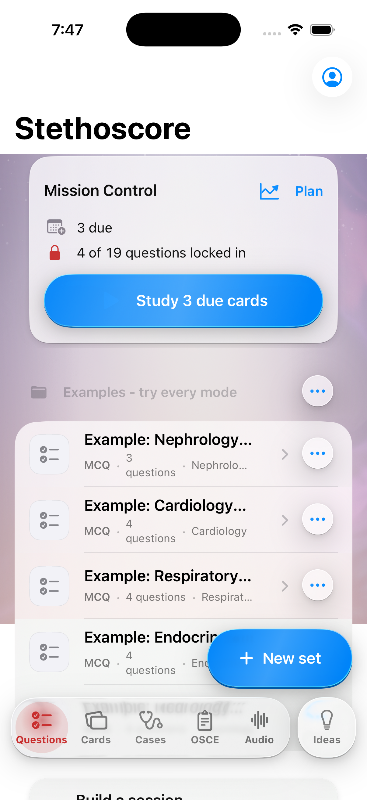

## current

```
iphone/1-fresh=0
iphone/2-signed-in=0
iphone/3-relaunch=0
iphone/5-other-bundle-id=0
ipad/1-fresh=0
ipad/2-signed-in=0
ipad/3-relaunch=0
```

### ipad/1-fresh: iPad Pro 13-inch (M5)

```
bundle=com.cramdown.personal exe=Stethoscore Personal
keep=0 args=
launch_status=0
peak_rss_mb=133
pid=25173 alive_after_30s=yes
--- stderr.txt (last 25 of 1)
IOSurfaceClientSetSurfaceNotify failed e00002c7
--- log-process.txt: 19 matching lines (last 30)
2026-10-01 07:49:06.170 Df Stethoscore Personal[25173:13414] [com.apple.dt.xctest:Default] Registering for test daemon availability notify post.
2026-10-01 07:49:06.172 Df Stethoscore Personal[25173:13414] [com.apple.dt.xctest:Default] notify_get_state check indicated test daemon not ready.
2026-10-01 07:49:06.172 Df Stethoscore Personal[25173:13414] [com.apple.dt.xctest:Default] notify_get_state check indicated test daemon not ready.
2026-10-01 07:49:06.173 Df Stethoscore Personal[25173:13414] [com.apple.dt.xctest:Default] notify_get_state check indicated test daemon not ready.
2026-10-01 07:49:06.264 Df Stethoscore Personal[25173:13414] [com.apple.FileURL:default] kExcludedFromBackupXattrName set on path: /Users/runner/Library/Developer/CoreSimulator/Devices/A2011F14-88A1-46AA-999A-FD6FEDCD870B/data/Containers/Data/Application/D511ABC3-36F9-4044-9876-D6E4508EA1BA/Library/Application Support/RedPenBlobs
2026-10-01 07:49:06.423 Df Stethoscore Personal[25173:13414] [com.apple.UIKit:KeyWindow] Setting default evaluation strategy for UIUserInterfaceIdiomPad to LastOneWins
2026-10-01 07:49:06.425 Df Stethoscore Personal[25173:13414] [com.apple.UIKit:KeyWindow] Setting default evaluation strategy for UIUserInterfaceIdiomPad to SystemShellManaged
2026-10-01 07:49:07.292 Df Stethoscore Personal[25173:13414] [PrototypeTools:domain] Not observing PTDefaults on customer install.
2026-10-01 07:49:08.513 Df Stethoscore Personal[25173:13414] [com.apple.network:activity] Create activity from XPC object <nw_activity 50:1 [B6BA05AF-25F4-404B-B3E0-62E86D3C7936] (reporting strategy default)>
2026-10-01 07:49:08.513 Df Stethoscore Personal[25173:13414] [com.apple.network:activity] Create activity from XPC object <nw_activity 50:2 [4DB0BC01-40C4-4C3B-95A4-E83941BB5C83] (reporting strategy default)>
2026-10-01 07:49:08.513 Df Stethoscore Personal[25173:13414] [com.apple.network:activity] Set activity <nw_activity 50:1 [B6BA05AF-25F4-404B-B3E0-62E86D3C7936] (reporting strategy default)> as the global parent
2026-10-01 07:49:08.836 Df Stethoscore Personal[25173:13517] [com.apple.storekit:Default] [Default] Finished iterating transaction batches
2026-10-01 07:49:08.836 Df Stethoscore Personal[25173:13517] [com.apple.storekit:Default] AAFService connection invalidated
2026-10-01 07:49:09.061 Df Stethoscore Personal[25173:1342c] [com.apple.storekit:Default] [Default] Finished iterating transaction batches
2026-10-01 07:49:09.104 Df Stethoscore Personal[25173:1342c] [com.apple.storekit:Default] Registering for 'transactionsupdated' daemon notification
2026-10-01 07:49:09.107 Df Stethoscore Personal[25173:13441] [com.apple.storekit:Default] AAFService connection invalidated
2026-10-01 07:49:23.123 Df Stethoscore Personal[25173:13414] [com.apple.network:activity] <nw_activity 50:1 [B6BA05AF-25F4-404B-B3E0-62E86D3C7936] (global parent) (reporting strategy default) complete (reason failure)> complete with reason 3 (failure), duration 18800ms
2026-10-01 07:49:23.124 Df Stethoscore Personal[25173:13414] [com.apple.network:activity] <nw_activity 50:2 [4DB0BC01-40C4-4C3B-95A4-E83941BB5C83] (reporting strategy default) complete (reason failure)> complete with reason 3 (failure), duration 18803ms
2026-10-01 07:49:23.124 Df Stethoscore Personal[25173:13414] [com.apple.network:activity] Unsetting the global parent activity <nw_activity 50:1 [B6BA05AF-25F4-404B-B3E0-62E86D3C7936] (global parent) (reporting strategy default) complete (reason failure)>
--- log-system.txt: 93 matching lines (last 30)
2026-10-01 07:48:33.146 Df SpringBoard[21944:11065] [com.apple.SplashBoard:Capture] Image generation complete for: <XBLaunchStateRequest: 0x11aa131e0; groupID: com.cramdown.personal - {DEFAULT GROUP}; statusBar: normal; refSize: {1032, 375}; naturalSize: {375, 1032}; orientation: LandscapeLeft; userInterfaceStyle: Light>
2026-10-01 07:48:33.147 Df SpringBoard[21944:110c2] [com.apple.SplashBoard:Capture] Asynchronously generating image data for request: <XBLaunchStateRequest: 0x11aa12d10; groupID: com.cramdown.personal - {DEFAULT GROUP}; statusBar: normal; refSize: {1032, 1376}; naturalSize: {1376, 1032}; orientation: LandscapeLeft; userInterfaceStyle: Dark>
2026-10-01 07:48:33.147 Df splashboardd[24007:1270c] [com.apple.SplashBoard:Capture] Updating window to <XBLaunchStateRequest: 0x102248150; groupID: com.cramdown.personal - {DEFAULT GROUP}; statusBar: normal; refSize: {1032, 1376}; naturalSize: {1376, 1032}; orientation: LandscapeLeft; userInterfaceStyle: Dark>
2026-10-01 07:48:33.261 Df SpringBoard[21944:110ba] [com.apple.SplashBoard:Capture] Image generation complete for: <XBLaunchStateRequest: 0x11aa12d10; groupID: com.cramdown.personal - {DEFAULT GROUP}; statusBar: normal; refSize: {1032, 1376}; naturalSize: {1376, 1032}; orientation: LandscapeLeft; userInterfaceStyle: Dark>
2026-10-01 07:48:33.262 Df SpringBoard[21944:110c2] [com.apple.SplashBoard:Capture] Asynchronously generating image data for request: <XBLaunchStateRequest: 0x11aa12530; groupID: com.cramdown.personal - {DEFAULT GROUP}; statusBar: normal; refSize: {1032, 375}; naturalSize: {375, 1032}; orientation: LandscapeLeft; userInterfaceStyle: Dark>
2026-10-01 07:48:33.262 Df splashboardd[24007:1270c] [com.apple.SplashBoard:Capture] Updating window to <XBLaunchStateRequest: 0x102248000; groupID: com.cramdown.personal - {DEFAULT GROUP}; statusBar: normal; refSize: {1032, 375}; naturalSize: {375, 1032}; orientation: LandscapeLeft; userInterfaceStyle: Dark>
2026-10-01 07:48:33.262 Df SpringBoard[21944:126a4] [com.apple.SplashBoard:FileManifest] <XBApplicationSnapshotManifestImpl: 0x11e0ccd00> [com.cramdown.personal] Snapshot data for <XBApplicationSnapshot: 0x1225b6a00; …D4EBB51D3C05> [com.cramdown.personal] written to file: /Users/runner/Library/Developer/CoreSimulator/Devices/A2011F14-88A1-46AA-999A-FD6FEDCD870B/data/Containers/Data/Application/D51
2026-10-01 07:48:33.287 Df SpringBoard[21944:110ba] [com.apple.SplashBoard:Capture] Image generation complete for: <XBLaunchStateRequest: 0x11aa12530; groupID: com.cramdown.personal - {DEFAULT GROUP}; statusBar: normal; refSize: {1032, 375}; naturalSize: {375, 1032}; orientation: LandscapeLeft; userInterfaceStyle: Dark>
2026-10-01 07:48:33.288 Df SpringBoard[21944:126a4] [com.apple.SplashBoard:FileManifest] <XBApplicationSnapshotManifestImpl: 0x11e0ccd00> [com.cramdown.personal] Snapshot data for <XBApplicationSnapshot: 0x1225b7100; …13E8F9B04F31> [com.cramdown.personal] written to file: /Users/runner/Library/Developer/CoreSimulator/Devices/A2011F14-88A1-46AA-999A-FD6FEDCD870B/data/Containers/Data/Application/D51
    "terminate_running_process" = 1;
	retryTimeout: 120.000000 (default write com.apple.CoreSimulatorBridge LaunchRetryTimeout <value>)
	bootTimeout: 300.000000 (default write com.apple.CoreSimulatorBridge BootRetryTimeout <value>)
```
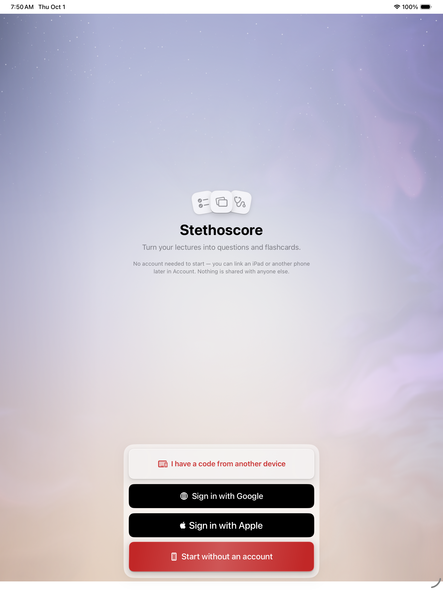

### ipad/2-signed-in: iPad Pro 13-inch (M5)

```
bundle=com.cramdown.personal exe=Stethoscore Personal
keep=1 args=-launchTestSignedIn
launch_status=0
peak_rss_mb=386
pid=28160 alive_after_30s=yes
--- stderr.txt (last 25 of 1)
IOSurfaceClientSetSurfaceNotify failed e00002c7
--- log-process.txt: 55 matching lines (last 30)
2026-10-01 07:51:26.283 Df Stethoscore Personal[28160:15277] [com.apple.CFNetwork:Default] Initializing NSHTTPCookieStorage singleton
2026-10-01 07:51:26.285 Df Stethoscore Personal[28160:15277] [com.apple.CFNetwork:Default] Initializing CFHTTPCookieStorage singleton
2026-10-01 07:51:26.285 Df Stethoscore Personal[28160:15277] [com.apple.CFNetwork:Default] Creating default cookie storage with process/bundle identifier
2026-10-01 07:51:26.289 Df Stethoscore Personal[28160:15277] [com.apple.CFNetwork:Default] Initializing AlternativeServices Storage singleton
2026-10-01 07:51:26.289 Df Stethoscore Personal[28160:15277] [com.apple.FileURL:default] kExcludedFromBackupXattrName set on path: /Users/runner/Library/Developer/CoreSimulator/Devices/A2011F14-88A1-46AA-999A-FD6FEDCD870B/data/Containers/Data/Application/EEA21973-48BC-4DCB-A24E-DB71318A313C/Library/HTTPStorages/com.cramdown.personal
2026-10-01 07:51:26.310 Df Stethoscore Personal[28160:15277] [com.apple.CFNetwork:Default] Connection 0: creating secure tcp or quic connection
2026-10-01 07:51:26.358 Df Stethoscore Personal[28160:15277] [com.apple.CFNetwork:Default] Connection 1: enabling TLS
2026-10-01 07:51:26.358 Df Stethoscore Personal[28160:15277] [com.apple.CFNetwork:Default] Connection 1: starting, TC(0x0)
2026-10-01 07:51:26.421 Df Stethoscore Personal[28160:15277] [com.apple.CFNetwork:Default] Task <57DD254A-1758-4B67-BC9A-D0CF227D9272>.<1> setting up Connection 1
2026-10-01 07:51:26.907 Df Stethoscore Personal[28160:15278] [com.apple.CFNetwork:Default] Connection 1: asked to evaluate TLS Trust
2026-10-01 07:51:26.909 Df Stethoscore Personal[28160:15278] [com.apple.CFNetwork:Default] Task <57DD254A-1758-4B67-BC9A-D0CF227D9272>.<1> auth completion disp=1 cred=0x0
2026-10-01 07:51:26.990 I  Stethoscore Personal[28160:1529e] [com.apple.storekit:Default] AAFService Closing XPCConnection 2f8ecd34
2026-10-01 07:51:26.995 Df Stethoscore Personal[28160:1529e] [com.apple.storekit:Default] Registering for 'transactionsupdated' daemon notification
2026-10-01 07:51:27.003 Df Stethoscore Personal[28160:15277] [com.apple.storekit:Default] AAFService connection invalidated
2026-10-01 07:51:27.056 Df Stethoscore Personal[28160:15278] [com.apple.CFNetwork:Default] System Trust Evaluation yielded status(0)
2026-10-01 07:51:27.120 Df Stethoscore Personal[28160:15277] [com.apple.CFNetwork:Default] Connection 1: TLS Trust result 0
2026-10-01 07:51:27.139 Df Stethoscore Personal[28160:15277] [com.apple.network:boringssl] nw_protocol_boringssl_signal_connected(895) [C1.1.1.1:2][0x12440b260] TLS connected [server(0) version(0x0304) ciphersuite(TLS_AES_256_GCM_SHA384) group(0x11ec) signature_alg(0x0403) alpn(h2) resumed(0) offered_ticket(0) in_early_data(0) early_data_accepted(0) false_started(0) ocsp_received(0) sct_received(1
2026-10-01 07:51:27.141 Df Stethoscore Personal[28160:15277] [com.apple.CFNetwork:Default] Connection 1: connected successfully
2026-10-01 07:51:27.141 Df Stethoscore Personal[28160:15277] [com.apple.CFNetwork:Default] Connection 1: TLS handshake complete
2026-10-01 07:51:27.141 Df Stethoscore Personal[28160:15277] [com.apple.CFNetwork:Default] Connection 1: ready C(N) E(N)
2026-10-01 07:51:27.173 Df Stethoscore Personal[28160:15277] [com.apple.CFNetwork:Default] Task <57DD254A-1758-4B67-BC9A-D0CF227D9272>.<1> now using Connection 1
2026-10-01 07:51:27.175 Df Stethoscore Personal[28160:15277] [com.apple.CFNetwork:Default] Task <57DD254A-1758-4B67-BC9A-D0CF227D9272>.<1> sent request, body S 2
2026-10-01 07:51:27.323 Df Stethoscore Personal[28160:1529e] [com.apple.CFNetwork:Default] Task <57DD254A-1758-4B67-BC9A-D0CF227D9272>.<1> received response, status 200 content U
2026-10-01 07:51:27.323 Df Stethoscore Personal[28160:1529e] [com.apple.CFNetwork:Default] Task <57DD254A-1758-4B67-BC9A-D0CF227D9272>.<1> done using Connection 1
2026-10-01 07:51:27.354 Df Stethoscore Personal[28160:1529e] [com.apple.CFNetwork:Default] Task <57DD254A-1758-4B67-BC9A-D0CF227D9272>.<1> response ended
2026-10-01 07:51:27.355 Df Stethoscore Personal[28160:1529e] [com.apple.CFNetwork:Default] Task <57DD254A-1758-4B67-BC9A-D0CF227D9272>.<1> finished successfully
2026-10-01 07:51:27.651 Df Stethoscore Personal[28160:1529e] [com.apple.CFNetwork:Default] Garbage collection for alternative services
2026-10-01 07:51:37.828 Df Stethoscore Personal[28160:15234] [com.apple.network:activity] <nw_activity 50:1 [770B46F7-3D8C-4832-90D0-51A9D1E6A837] (global parent) (reporting strategy default) complete (reason success)> complete with reason 2 (success), duration 19359ms
2026-10-01 07:51:37.828 Df Stethoscore Personal[28160:15234] [com.apple.network:activity] <nw_activity 50:2 [5749CD0E-EB7D-43CF-B5AA-558328EB0E18] (reporting strategy default) complete (reason success)> complete with reason 2 (success), duration 19359ms
2026-10-01 07:51:37.828 Df Stethoscore Personal[28160:15234] [com.apple.network:activity] Unsetting the global parent activity <nw_activity 50:1 [770B46F7-3D8C-4832-90D0-51A9D1E6A837] (global parent) (reporting strategy default) complete (reason success)>
--- log-system.txt: 129 matching lines (last 30)
2026-10-01 07:51:17.421 Df SpringBoard[21944:14def] [com.apple.SplashBoard:FileManifest] <XBApplicationSnapshotManifestImpl: 0x11e0ccd00> [com.cramdown.personal] Snapshot data for <XBApplicationSnapshot: 0x11e187640; …29341C6CEAEC> [com.cramdown.personal] written to file: /Users/runner/Library/Developer/CoreSimulator/Devices/A2011F14-88A1-46AA-999A-FD6FEDCD870B/data/Containers/Data/Application/EEA
```
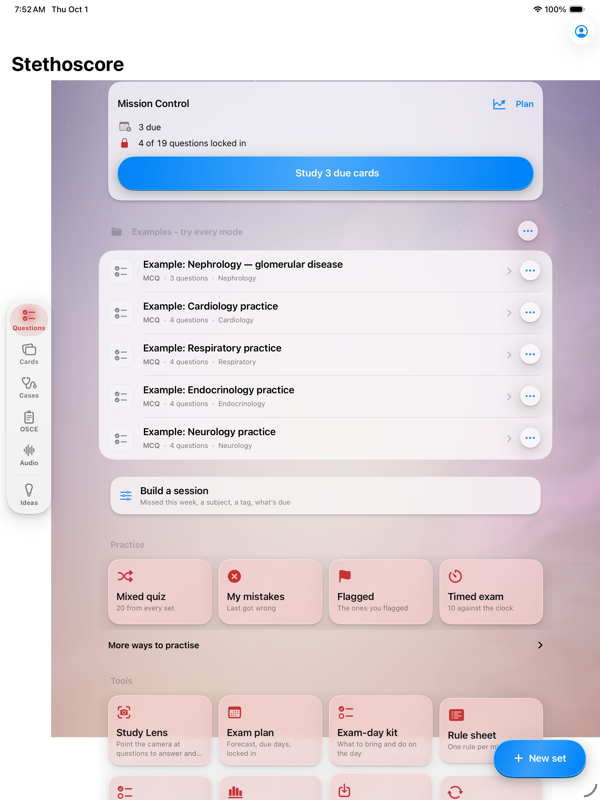

### ipad/3-relaunch: iPad Pro 13-inch (M5)

```
bundle=com.cramdown.personal exe=Stethoscore Personal
keep=1 args=
launch_status=0
peak_rss_mb=349
pid=29992 alive_after_30s=yes
--- stderr.txt (last 25 of 1)
IOSurfaceClientSetSurfaceNotify failed e00002c7
--- log-process.txt: 31 matching lines (last 30)
2026-10-01 07:52:33.064 Df Stethoscore Personal[29992:165e8] [com.apple.dt.xctest:Default] notify_get_state check indicated test daemon not ready.
2026-10-01 07:52:33.064 Df Stethoscore Personal[29992:165e8] [com.apple.dt.xctest:Default] notify_get_state check indicated test daemon not ready.
2026-10-01 07:52:33.064 Df Stethoscore Personal[29992:165e8] [com.apple.dt.xctest:Default] notify_get_state check indicated test daemon not ready.
2026-10-01 07:52:33.119 Df Stethoscore Personal[29992:165e8] [com.apple.FileURL:default] kExcludedFromBackupXattrName set on path: /Users/runner/Library/Developer/CoreSimulator/Devices/A2011F14-88A1-46AA-999A-FD6FEDCD870B/data/Containers/Data/Application/33D1A9F7-4DE4-4B29-B6E1-9D34A14C99DB/Library/Application Support/RedPenBlobs
2026-10-01 07:52:33.240 Df Stethoscore Personal[29992:165e8] [com.apple.UIKit:KeyWindow] Setting default evaluation strategy for UIUserInterfaceIdiomPad to LastOneWins
2026-10-01 07:52:33.242 Df Stethoscore Personal[29992:165e8] [com.apple.UIKit:KeyWindow] Setting default evaluation strategy for UIUserInterfaceIdiomPad to SystemShellManaged
2026-10-01 07:52:34.184 I  Stethoscore Personal[29992:165e8] [com.apple.DesignLibrary:defaults] liveTuning=false
2026-10-01 07:52:34.342 Df Stethoscore Personal[29992:165e8] [PrototypeTools:domain] Not observing PTDefaults on customer install.
2026-10-01 07:52:34.472 Df Stethoscore Personal[29992:16603] [com.apple.calls.callkit:Default] Call host has no calls
2026-10-01 07:52:34.592 I  Stethoscore Personal[29992:16603] [com.apple.storekit:Default] AAFService Starting new XPCConnection 45e9e8bc
2026-10-01 07:52:34.633 Df Stethoscore Personal[29992:16603] [com.apple.storekit:Default] [Default] Finished iterating transaction batches
2026-10-01 07:52:34.633 I  Stethoscore Personal[29992:1660f] [com.apple.storekit:Default] AAFService Closing XPCConnection 45e9e8bc
2026-10-01 07:52:34.633 Df Stethoscore Personal[29992:1660f] [com.apple.storekit:Default] AAFService connection invalidated
2026-10-01 07:52:35.937 Df Stethoscore Personal[29992:165e8] [com.apple.network:activity] Create activity from XPC object <nw_activity 50:1 [0B00FF39-7949-45E0-A368-121032C36F9B] (reporting strategy default)>
2026-10-01 07:52:35.937 Df Stethoscore Personal[29992:165e8] [com.apple.network:activity] Create activity from XPC object <nw_activity 50:2 [C40ED15E-1907-4557-9110-2D8C28B29185] (reporting strategy default)>
2026-10-01 07:52:35.937 Df Stethoscore Personal[29992:165e8] [com.apple.network:activity] Set activity <nw_activity 50:1 [0B00FF39-7949-45E0-A368-121032C36F9B] (reporting strategy default)> as the global parent
2026-10-01 07:52:35.941 I  Stethoscore Personal[29992:16611] [com.apple.storekit:Default] AAFService Starting new XPCConnection 2ca7eda9
2026-10-01 07:52:35.961 I  Stethoscore Personal[29992:165e8] [com.apple.PointerUI:Common] Activating Connection: <BSXPC(com.apple.PointerUI.pointeruid.service[C:3-1])-as(com.apple.PointerUI.pointeruid.default-service):0x104a87160 name=(null)>
2026-10-01 07:52:35.972 Df Stethoscore Personal[29992:16603] [com.apple.storekit:Default] [Default] Finished iterating transaction batches
2026-10-01 07:52:35.972 I  Stethoscore Personal[29992:16603] [com.apple.storekit:Default] AAFService Closing XPCConnection 2ca7eda9
2026-10-01 07:52:35.972 I  Stethoscore Personal[29992:16611] [com.apple.storekit:Default] AAFService Starting new XPCConnection b5595a5b
2026-10-01 07:52:35.977 Df Stethoscore Personal[29992:16607] [com.apple.storekit:Default] AAFService connection invalidated
2026-10-01 07:52:36.010 Df Stethoscore Personal[29992:16603] [com.apple.storekit:Default] [Default] Finished iterating transaction batches
2026-10-01 07:52:36.822 I  Stethoscore Personal[29992:16603] [com.apple.storekit:Default] AAFService Closing XPCConnection b5595a5b
2026-10-01 07:52:36.835 Df Stethoscore Personal[29992:16603] [com.apple.storekit:Default] Registering for 'transactionsupdated' daemon notification
2026-10-01 07:52:36.841 Df Stethoscore Personal[29992:16652] [com.apple.storekit:Default] AAFService connection invalidated
2026-10-01 07:52:37.897 Df Stethoscore Personal[29992:165e8] [com.apple.network:activity] <nw_activity 50:1 [0B00FF39-7949-45E0-A368-121032C36F9B] (global parent) (reporting strategy default) complete (reason success)> complete with reason 2 (success), duration 6402ms
2026-10-01 07:52:37.897 Df Stethoscore Personal[29992:165e8] [com.apple.network:activity] <nw_activity 50:2 [C40ED15E-1907-4557-9110-2D8C28B29185] (reporting strategy default) complete (reason success)> complete with reason 2 (success), duration 6401ms
2026-10-01 07:52:37.898 Df Stethoscore Personal[29992:165e8] [com.apple.network:activity] Unsetting the global parent activity <nw_activity 50:1 [0B00FF39-7949-45E0-A368-121032C36F9B] (global parent) (reporting strategy default) complete (reason success)>
2026-10-01 07:52:50.159 Df Stethoscore Personal[29992:16652] [com.apple.FileURL:default] kExcludedFromBackupXattrName set on path: /Users/runner/Library/Developer/CoreSimulator/Devices/A2011F14-88A1-46AA-999A-FD6FEDCD870B/data/Containers/Data/Application/33D1A9F7-4DE4-4B29-B6E1-9D34A14C99DB/Library/Application Support/RedPenSources
--- log-system.txt: 121 matching lines (last 30)
2026-10-01 07:52:31.001 Df splashboardd[24007:1270c] [com.apple.SplashBoard:Capture] Updating window to <XBLaunchStateRequest: 0x1022483f0; groupID: com.cramdown.personal - {DEFAULT GROUP}; statusBar: normal; refSize: {1032, 1376}; naturalSize: {1376, 1032}; orientation: LandscapeLeft; userInterfaceStyle: Dark>
```
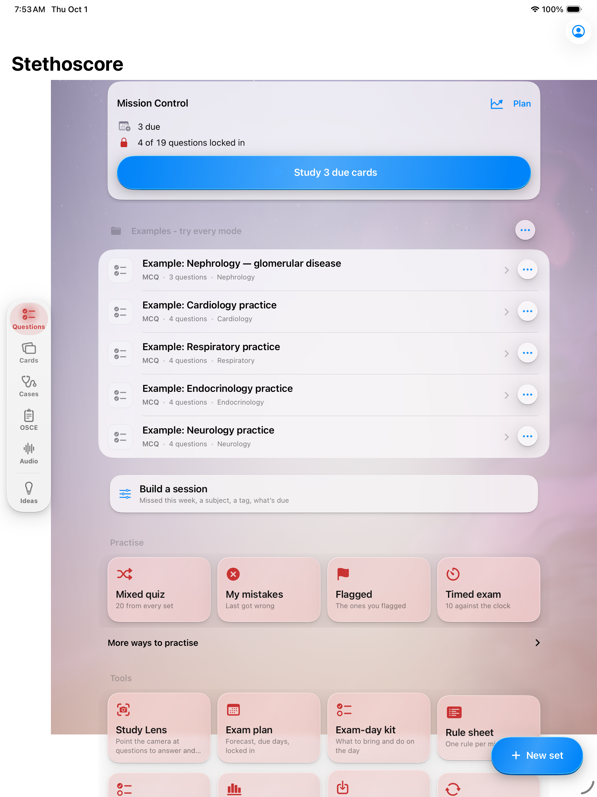

### iphone/1-fresh: iPhone 17 Pro

```
bundle=com.cramdown.personal exe=Stethoscore Personal
keep=0 args=
launch_status=0
peak_rss_mb=197
pid=6564 alive_after_30s=yes
--- stderr.txt (last 25 of 1)
IOSurfaceClientSetSurfaceNotify failed e00002c7
--- log-process.txt: 19 matching lines (last 30)
2026-10-01 07:33:56.020 Df Stethoscore Personal[6564:622c] [com.apple.dt.xctest:Default] Registering for test daemon availability notify post.
2026-10-01 07:33:56.021 Df Stethoscore Personal[6564:622c] [com.apple.dt.xctest:Default] notify_get_state check indicated test daemon not ready.
2026-10-01 07:33:56.021 Df Stethoscore Personal[6564:622c] [com.apple.dt.xctest:Default] notify_get_state check indicated test daemon not ready.
2026-10-01 07:33:56.021 Df Stethoscore Personal[6564:622c] [com.apple.dt.xctest:Default] notify_get_state check indicated test daemon not ready.
2026-10-01 07:33:56.078 Df Stethoscore Personal[6564:622c] [com.apple.FileURL:default] kExcludedFromBackupXattrName set on path: /Users/runner/Library/Developer/CoreSimulator/Devices/22452A91-4697-4369-8812-53ADB77EB73B/data/Containers/Data/Application/BCAEA9E7-A9BC-4750-A4C0-FD24E52F45D8/Library/Application Support/RedPenBlobs
2026-10-01 07:33:56.176 Df Stethoscore Personal[6564:622c] [com.apple.UIKit:KeyWindow] Setting default evaluation strategy for UIUserInterfaceIdiomPhone to LastOneWins
2026-10-01 07:33:56.176 Df Stethoscore Personal[6564:622c] [com.apple.UIKit:KeyWindow] Setting default evaluation strategy for UIUserInterfaceIdiomPhone to SystemShellManaged
2026-10-01 07:33:56.891 Df Stethoscore Personal[6564:622c] [PrototypeTools:domain] Not observing PTDefaults on customer install.
2026-10-01 07:33:58.341 Df Stethoscore Personal[6564:622c] [com.apple.network:activity] Create activity from XPC object <nw_activity 50:1 [AD89E498-7748-48E2-BA78-C048872D683E] (reporting strategy default)>
2026-10-01 07:33:58.341 Df Stethoscore Personal[6564:622c] [com.apple.network:activity] Create activity from XPC object <nw_activity 50:2 [068AC93B-8AD8-4C7A-9B00-738BC5FF785F] (reporting strategy default)>
2026-10-01 07:33:58.341 Df Stethoscore Personal[6564:622c] [com.apple.network:activity] Set activity <nw_activity 50:1 [AD89E498-7748-48E2-BA78-C048872D683E] (reporting strategy default)> as the global parent
2026-10-01 07:33:58.664 Df Stethoscore Personal[6564:62c7] [com.apple.storekit:Default] [Default] Finished iterating transaction batches
2026-10-01 07:33:58.710 Df Stethoscore Personal[6564:62d2] [com.apple.storekit:Default] AAFService connection invalidated
2026-10-01 07:33:58.836 Df Stethoscore Personal[6564:62ce] [com.apple.storekit:Default] [Default] Finished iterating transaction batches
2026-10-01 07:33:58.899 Df Stethoscore Personal[6564:6262] [com.apple.storekit:Default] AAFService connection invalidated
2026-10-01 07:33:58.953 Df Stethoscore Personal[6564:62c7] [com.apple.storekit:Default] Registering for 'transactionsupdated' daemon notification
2026-10-01 07:34:06.491 Df Stethoscore Personal[6564:622c] [com.apple.network:activity] <nw_activity 50:1 [AD89E498-7748-48E2-BA78-C048872D683E] (global parent) (reporting strategy default) complete (reason success)> complete with reason 2 (success), duration 12287ms
2026-10-01 07:34:06.491 Df Stethoscore Personal[6564:622c] [com.apple.network:activity] <nw_activity 50:2 [068AC93B-8AD8-4C7A-9B00-738BC5FF785F] (reporting strategy default) complete (reason success)> complete with reason 2 (success), duration 12288ms
2026-10-01 07:34:06.492 Df Stethoscore Personal[6564:622c] [com.apple.network:activity] Unsetting the global parent activity <nw_activity 50:1 [AD89E498-7748-48E2-BA78-C048872D683E] (global parent) (reporting strategy default) complete (reason success)>
--- log-system.txt: 70 matching lines (last 30)
2026-10-01 07:33:52.143 Df splashboardd[6446:60fd] [com.apple.SplashBoard:Capture] Updating window to <XBLaunchStateRequest: 0x1034d0070; groupID: com.cramdown.personal - {DEFAULT GROUP}; statusBar: normal; refSize: {402, 874}; orientation: Portrait; userInterfaceStyle: Light>
2026-10-01 07:33:52.302 Df SpringBoard[3968:60a4] [com.apple.SplashBoard:Capture] Image generation complete for: <XBLaunchStateRequest: 0x11edd11f0; groupID: com.cramdown.personal - {DEFAULT GROUP}; statusBar: normal; refSize: {402, 874}; orientation: Portrait; userInterfaceStyle: Light>
2026-10-01 07:33:52.302 Df SpringBoard[3968:4f35] [com.apple.SplashBoard:Capture] Asynchronously generating image data for request: <XBLaunchStateRequest: 0x11edd3e90; groupID: com.cramdown.personal - {DEFAULT GROUP}; statusBar: normal; refSize: {402, 874}; orientation: Portrait; userInterfaceStyle: Dark>
2026-10-01 07:33:52.303 Df splashboardd[6446:60fd] [com.apple.SplashBoard:Capture] Updating window to <XBLaunchStateRequest: 0x10365c000; groupID: com.cramdown.personal - {DEFAULT GROUP}; statusBar: normal; refSize: {402, 874}; orientation: Portrait; userInterfaceStyle: Dark>
2026-10-01 07:33:52.311 Df SpringBoard[3968:4f91] [com.apple.SplashBoard:FileManifest] <XBApplicationSnapshotManifestImpl: 0x107b8ba80> [com.cramdown.personal] Snapshot data for <XBApplicationSnapshot: 0x11eddaf40; …1264C31F191C> [com.cramdown.personal] written to file: /Users/runner/Library/Developer/CoreSimulator/Devices/22452A91-4697-4369-8812-53ADB77EB73B/data/Containers/Data/Application/BCAEA
2026-10-01 07:33:52.325 Df SpringBoard[3968:54c2] [com.apple.UserNotifications:DataProviderFactory] [com.cramdown.personal] Application installed using default data provider
2026-10-01 07:33:52.401 Df SpringBoard[3968:4f91] [com.apple.SplashBoard:FileManifest] <XBApplicationSnapshotManifestImpl: 0x107b8ba80> [com.cramdown.personal] Snapshot data for <XBApplicationSnapshot: 0x11eddb100; …AF7EB5C5EE2F> [com.cramdown.personal] written to file: /Users/runner/Library/Developer/CoreSimulator/Devices/22452A91-4697-4369-8812-53ADB77EB73B/data/Containers/Data/Application/BCAEA
2026-10-01 07:33:52.403 Df SpringBoard[3968:54c2] [com.apple.SplashBoard:Capture] Image generation complete for: <XBLaunchStateRequest: 0x11edd3e90; groupID: com.cramdown.personal - {DEFAULT GROUP}; statusBar: normal; refSize: {402, 874}; orientation: Portrait; userInterfaceStyle: Dark>
2026-10-01 07:33:53.952 Df biomed[3982:4838] [com.apple.Biome:BiomeCascade] Creating dataResource: CCDataResource: file:///Users/runner/Library/Developer/CoreSimulator/Devices/22452A91-4697-4369-8812-53ADB77EB73B/data/Library/Biome/sets/Default/App.Shortcut.Phrase/sourceIdentifier=com.cramdown.personal/ in temporary path: /Users/runner/Library/Developer/CoreSimulator/Devices/22452A91-4697-4369-881
2026-10-01 07:33:53.974 Df biomed[3982:4838] [com.apple.Biome:BiomeCascade] Successfully renamed temporary directory and moved to final path: /Users/runner/Library/Developer/CoreSimulator/Devices/22452A91-4697-4369-8812-53ADB77EB73B/data/Library/Biome/sets/Default/App.Shortcut.Phrase/sourceIdentifier=com.cramdown.personal/Database
    "terminate_running_process" = 1;
	retryTimeout: 120.000000 (default write com.apple.CoreSimulatorBridge LaunchRetryTimeout <value>)
```
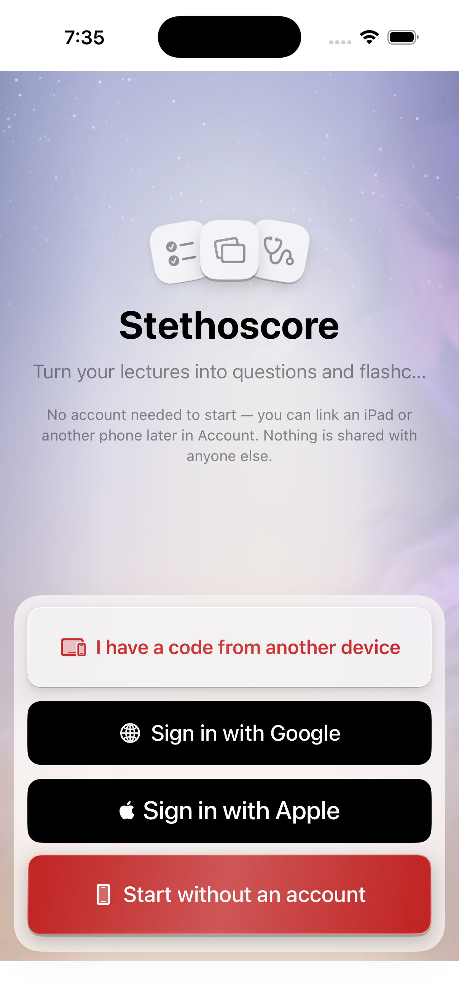

### iphone/2-signed-in: iPhone 17 Pro

```
bundle=com.cramdown.personal exe=Stethoscore Personal
keep=1 args=-launchTestSignedIn
launch_status=0
peak_rss_mb=361
pid=14974 alive_after_30s=yes
--- stderr.txt (last 25 of 1)
IOSurfaceClientSetSurfaceNotify failed e00002c7
--- log-process.txt: 55 matching lines (last 30)
2026-10-01 07:40:33.257 Df Stethoscore Personal[14974:ba1f] [com.apple.CFNetwork:Default] Initializing CFHTTPCookieStorage singleton
2026-10-01 07:40:33.257 Df Stethoscore Personal[14974:ba1f] [com.apple.CFNetwork:Default] Creating default cookie storage with process/bundle identifier
2026-10-01 07:40:33.270 Df Stethoscore Personal[14974:ba1f] [com.apple.CFNetwork:Default] Initializing AlternativeServices Storage singleton
2026-10-01 07:40:33.271 Df Stethoscore Personal[14974:ba1f] [com.apple.FileURL:default] kExcludedFromBackupXattrName set on path: /Users/runner/Library/Developer/CoreSimulator/Devices/22452A91-4697-4369-8812-53ADB77EB73B/data/Containers/Data/Application/12F9C35F-BEB5-4550-9D01-3A278C2F0551/Library/HTTPStorages/com.cramdown.personal
2026-10-01 07:40:33.292 Df Stethoscore Personal[14974:ba1f] [com.apple.CFNetwork:Default] Connection 0: creating secure tcp or quic connection
2026-10-01 07:40:33.734 I  Stethoscore Personal[14974:bad6] [com.apple.storekit:Default] AAFService Closing XPCConnection 47357c88
2026-10-01 07:40:33.744 Df Stethoscore Personal[14974:bad6] [com.apple.storekit:Default] Registering for 'transactionsupdated' daemon notification
2026-10-01 07:40:33.766 Df Stethoscore Personal[14974:baa6] [com.apple.storekit:Default] AAFService connection invalidated
2026-10-01 07:40:34.053 Df Stethoscore Personal[14974:ba1f] [com.apple.CFNetwork:Default] Connection 1: enabling TLS
2026-10-01 07:40:34.053 Df Stethoscore Personal[14974:ba1f] [com.apple.CFNetwork:Default] Connection 1: starting, TC(0x0)
2026-10-01 07:40:34.392 Df Stethoscore Personal[14974:ba1f] [com.apple.CFNetwork:Default] Task <880FA67E-ED08-44DC-ABFC-97E61D5FF65B>.<1> setting up Connection 1
2026-10-01 07:40:34.474 Df Stethoscore Personal[14974:baa6] [com.apple.CFNetwork:Default] Garbage collection for alternative services
2026-10-01 07:40:34.528 Df Stethoscore Personal[14974:bad7] [com.apple.CFNetwork:Default] Connection 1: asked to evaluate TLS Trust
2026-10-01 07:40:34.530 Df Stethoscore Personal[14974:bad7] [com.apple.CFNetwork:Default] Task <880FA67E-ED08-44DC-ABFC-97E61D5FF65B>.<1> auth completion disp=1 cred=0x0
2026-10-01 07:40:34.732 Df Stethoscore Personal[14974:ba1f] [com.apple.CFNetwork:Default] System Trust Evaluation yielded status(0)
2026-10-01 07:40:34.752 Df Stethoscore Personal[14974:ba1f] [com.apple.CFNetwork:Default] Connection 1: TLS Trust result 0
2026-10-01 07:40:34.772 Df Stethoscore Personal[14974:ba1f] [com.apple.network:boringssl] nw_protocol_boringssl_signal_connected(895) [C1.1.1.1:2][0x101b49be0] TLS connected [server(0) version(0x0304) ciphersuite(TLS_AES_256_GCM_SHA384) group(0x11ec) signature_alg(0x0403) alpn(h2) resumed(0) offered_ticket(0) in_early_data(0) early_data_accepted(0) false_started(0) ocsp_received(0) sct_received(1)
2026-10-01 07:40:34.786 Df Stethoscore Personal[14974:ba1f] [com.apple.CFNetwork:Default] Connection 1: connected successfully
2026-10-01 07:40:34.786 Df Stethoscore Personal[14974:ba1f] [com.apple.CFNetwork:Default] Connection 1: TLS handshake complete
2026-10-01 07:40:34.786 Df Stethoscore Personal[14974:ba1f] [com.apple.CFNetwork:Default] Connection 1: ready C(N) E(N)
2026-10-01 07:40:34.805 Df Stethoscore Personal[14974:ba1f] [com.apple.CFNetwork:Default] Task <880FA67E-ED08-44DC-ABFC-97E61D5FF65B>.<1> now using Connection 1
2026-10-01 07:40:34.806 Df Stethoscore Personal[14974:bad8] [com.apple.CFNetwork:Default] Task <880FA67E-ED08-44DC-ABFC-97E61D5FF65B>.<1> sent request, body S 2
2026-10-01 07:40:34.902 Df Stethoscore Personal[14974:bad8] [com.apple.CFNetwork:Default] Task <880FA67E-ED08-44DC-ABFC-97E61D5FF65B>.<1> received response, status 200 content U
2026-10-01 07:40:34.902 Df Stethoscore Personal[14974:bad8] [com.apple.CFNetwork:Default] Task <880FA67E-ED08-44DC-ABFC-97E61D5FF65B>.<1> done using Connection 1
2026-10-01 07:40:34.920 Df Stethoscore Personal[14974:bad8] [com.apple.CFNetwork:Default] Task <880FA67E-ED08-44DC-ABFC-97E61D5FF65B>.<1> response ended
2026-10-01 07:40:34.929 Df Stethoscore Personal[14974:bad8] [com.apple.CFNetwork:Default] Task <880FA67E-ED08-44DC-ABFC-97E61D5FF65B>.<1> finished successfully
2026-10-01 07:40:56.639 Df Stethoscore Personal[14974:b9da] [com.apple.network:activity] <nw_activity 50:1 [235A5B8A-0376-441A-8384-9EF48ED63CCD] (global parent) (reporting strategy default) complete (reason failure)> complete with reason 3 (failure), duration 28765ms
2026-10-01 07:40:56.639 Df Stethoscore Personal[14974:b9da] [com.apple.network:activity] <nw_activity 50:2 [6BEE6CB6-5345-4D38-9A88-21152E4166CE] (reporting strategy default) complete (reason failure)> complete with reason 3 (failure), duration 28764ms
2026-10-01 07:40:56.639 Df Stethoscore Personal[14974:b9da] [com.apple.network:activity] Unsetting the global parent activity <nw_activity 50:1 [235A5B8A-0376-441A-8384-9EF48ED63CCD] (global parent) (reporting strategy default) complete (reason failure)>
2026-10-01 07:41:19.865 Df Stethoscore Personal[14974:ba12] [com.apple.FileURL:default] kExcludedFromBackupXattrName set on path: /Users/runner/Library/Developer/CoreSimulator/Devices/22452A91-4697-4369-8812-53ADB77EB73B/data/Containers/Data/Application/12F9C35F-BEB5-4550-9D01-3A278C2F0551/Library/Application Support/RedPenSources
--- log-system.txt: 81 matching lines (last 30)
2026-10-01 07:40:27.290 Df SpringBoard[3968:b197] [com.apple.SplashBoard:Capture] Asynchronously generating image data for request: <XBLaunchStateRequest: 0x11ef05420; groupID: com.cramdown.personal - {DEFAULT GROUP}; statusBar: normal; refSize: {402, 874}; orientation: Portrait; userInterfaceStyle: Dark>
```
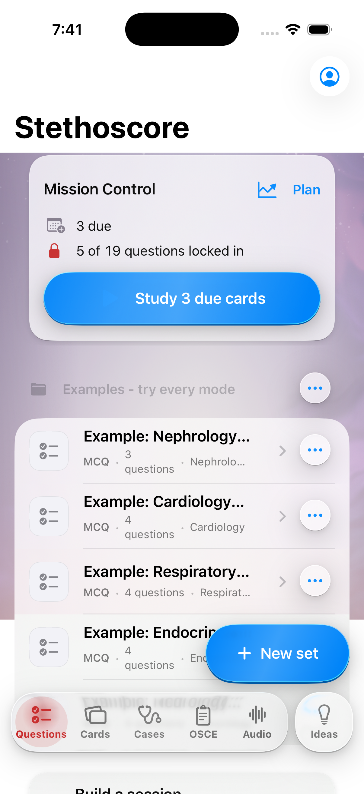

### iphone/3-relaunch: iPhone 17 Pro

```
bundle=com.cramdown.personal exe=Stethoscore Personal
keep=1 args=
launch_status=0
peak_rss_mb=330
pid=17156 alive_after_30s=yes
--- stderr.txt (last 25 of 1)
IOSurfaceClientSetSurfaceNotify failed e00002c7
--- log-process.txt: 30 matching lines (last 30)
2026-10-01 07:41:49.471 Df Stethoscore Personal[17156:d08d] [com.apple.dt.xctest:Default] Registering for test daemon availability notify post.
2026-10-01 07:41:49.471 Df Stethoscore Personal[17156:d08d] [com.apple.dt.xctest:Default] notify_get_state check indicated test daemon not ready.
2026-10-01 07:41:49.471 Df Stethoscore Personal[17156:d08d] [com.apple.dt.xctest:Default] notify_get_state check indicated test daemon not ready.
2026-10-01 07:41:49.471 Df Stethoscore Personal[17156:d08d] [com.apple.dt.xctest:Default] notify_get_state check indicated test daemon not ready.
2026-10-01 07:41:49.554 Df Stethoscore Personal[17156:d08d] [com.apple.FileURL:default] kExcludedFromBackupXattrName set on path: /Users/runner/Library/Developer/CoreSimulator/Devices/22452A91-4697-4369-8812-53ADB77EB73B/data/Containers/Data/Application/7145609E-A6C6-4AA2-A0F9-4653528A3225/Library/Application Support/RedPenBlobs
2026-10-01 07:41:49.677 Df Stethoscore Personal[17156:d08d] [com.apple.UIKit:KeyWindow] Setting default evaluation strategy for UIUserInterfaceIdiomPhone to LastOneWins
2026-10-01 07:41:49.678 Df Stethoscore Personal[17156:d08d] [com.apple.UIKit:KeyWindow] Setting default evaluation strategy for UIUserInterfaceIdiomPhone to SystemShellManaged
2026-10-01 07:41:50.702 I  Stethoscore Personal[17156:d08d] [com.apple.DesignLibrary:defaults] liveTuning=false
2026-10-01 07:41:50.840 Df Stethoscore Personal[17156:d08d] [PrototypeTools:domain] Not observing PTDefaults on customer install.
2026-10-01 07:41:50.980 Df Stethoscore Personal[17156:d0f9] [com.apple.calls.callkit:Default] Call host has no calls
2026-10-01 07:41:51.100 I  Stethoscore Personal[17156:d0d8] [com.apple.storekit:Default] AAFService Starting new XPCConnection 6825a659
2026-10-01 07:41:51.122 Df Stethoscore Personal[17156:d0d3] [com.apple.storekit:Default] [Default] Finished iterating transaction batches
2026-10-01 07:41:51.122 I  Stethoscore Personal[17156:d0d3] [com.apple.storekit:Default] AAFService Closing XPCConnection 6825a659
2026-10-01 07:41:51.122 Df Stethoscore Personal[17156:d0d3] [com.apple.storekit:Default] AAFService connection invalidated
2026-10-01 07:41:52.063 Df Stethoscore Personal[17156:d08d] [com.apple.network:activity] Create activity from XPC object <nw_activity 50:1 [F7F4894B-86D0-4B9E-A71E-30B55ECAE886] (reporting strategy default)>
2026-10-01 07:41:52.063 Df Stethoscore Personal[17156:d08d] [com.apple.network:activity] Create activity from XPC object <nw_activity 50:2 [F64AB8A5-4963-408B-A5B2-A9D2061063CF] (reporting strategy default)>
2026-10-01 07:41:52.063 Df Stethoscore Personal[17156:d08d] [com.apple.network:activity] Set activity <nw_activity 50:1 [F7F4894B-86D0-4B9E-A71E-30B55ECAE886] (reporting strategy default)> as the global parent
2026-10-01 07:41:52.109 I  Stethoscore Personal[17156:d0f9] [com.apple.storekit:Default] AAFService Starting new XPCConnection c5a91d3f
2026-10-01 07:41:52.136 Df Stethoscore Personal[17156:d0f8] [com.apple.storekit:Default] [Default] Finished iterating transaction batches
2026-10-01 07:41:52.136 I  Stethoscore Personal[17156:d0f8] [com.apple.storekit:Default] AAFService Closing XPCConnection c5a91d3f
2026-10-01 07:41:52.137 I  Stethoscore Personal[17156:d0f9] [com.apple.storekit:Default] AAFService Starting new XPCConnection f76c3aa2
2026-10-01 07:41:52.155 Df Stethoscore Personal[17156:d0f9] [com.apple.storekit:Default] [Default] Finished iterating transaction batches
2026-10-01 07:41:52.191 Df Stethoscore Personal[17156:d0f8] [com.apple.storekit:Default] AAFService connection invalidated
2026-10-01 07:41:52.661 I  Stethoscore Personal[17156:d0f9] [com.apple.storekit:Default] AAFService Closing XPCConnection f76c3aa2
2026-10-01 07:41:52.664 Df Stethoscore Personal[17156:d0f8] [com.apple.storekit:Default] Registering for 'transactionsupdated' daemon notification
2026-10-01 07:41:52.704 Df Stethoscore Personal[17156:d1d2] [com.apple.storekit:Default] AAFService connection invalidated
2026-10-01 07:42:05.487 Df Stethoscore Personal[17156:d0f9] [com.apple.FileURL:default] kExcludedFromBackupXattrName set on path: /Users/runner/Library/Developer/CoreSimulator/Devices/22452A91-4697-4369-8812-53ADB77EB73B/data/Containers/Data/Application/7145609E-A6C6-4AA2-A0F9-4653528A3225/Library/Application Support/RedPenSources
2026-10-01 07:42:07.053 Df Stethoscore Personal[17156:d08d] [com.apple.network:activity] <nw_activity 50:1 [F7F4894B-86D0-4B9E-A71E-30B55ECAE886] (global parent) (reporting strategy default) complete (reason success)> complete with reason 2 (success), duration 19194ms
2026-10-01 07:42:07.053 Df Stethoscore Personal[17156:d08d] [com.apple.network:activity] <nw_activity 50:2 [F64AB8A5-4963-408B-A5B2-A9D2061063CF] (reporting strategy default) complete (reason success)> complete with reason 2 (success), duration 19194ms
2026-10-01 07:42:07.053 Df Stethoscore Personal[17156:d08d] [com.apple.network:activity] Unsetting the global parent activity <nw_activity 50:1 [F7F4894B-86D0-4B9E-A71E-30B55ECAE886] (global parent) (reporting strategy default) complete (reason success)>
--- log-system.txt: 78 matching lines (last 30)
2026-10-01 07:41:45.151 Df SpringBoard[3968:ce09] [com.apple.SplashBoard:Capture] Asynchronously generating image data for request: <XBLaunchStateRequest: 0x11edd0d20; groupID: com.cramdown.personal - {DEFAULT GROUP}; statusBar: normal; refSize: {402, 874}; orientation: Portrait; userInterfaceStyle: Light>
```
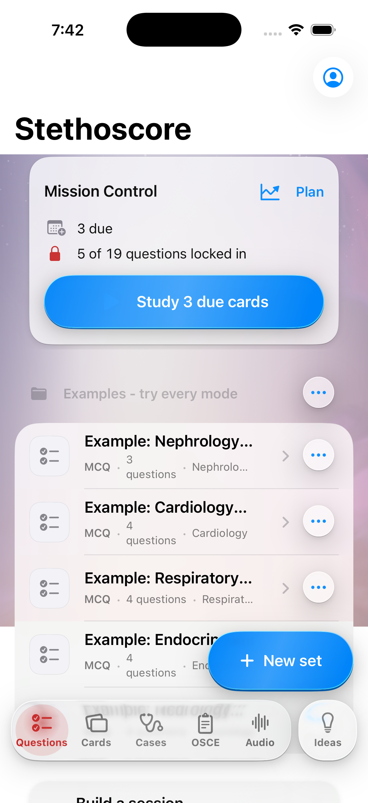

### iphone/5-other-bundle-id: iPhone 17 Pro

```
bundle=swift-playgrounds-dev-run.launchtest exe=Stethoscore Personal
keep=0 args=-launchTestSignedIn
launch_status=0
peak_rss_mb=409
pid=19374 alive_after_30s=yes
--- stderr.txt (last 25 of 1)
IOSurfaceClientSetSurfaceNotify failed e00002c7
--- log-process.txt: 55 matching lines (last 30)
2026-10-01 07:43:01.906 Df Stethoscore Personal[19374:e706] [com.apple.FileURL:default] kExcludedFromBackupXattrName set on path: /Users/runner/Library/Developer/CoreSimulator/Devices/22452A91-4697-4369-8812-53ADB77EB73B/data/Containers/Data/Application/FCD832E2-00B9-4AE5-A9F9-5B77E2F0F06C/Library/HTTPStorages/swift-playgrounds-dev-run.launchtest
2026-10-01 07:43:01.907 Df Stethoscore Personal[19374:e85b] [com.apple.storekit:Default] AAFService connection invalidated
2026-10-01 07:43:01.916 Df Stethoscore Personal[19374:e706] [com.apple.CFNetwork:Default] Connection 0: creating secure tcp or quic connection
2026-10-01 07:43:01.924 Df Stethoscore Personal[19374:e706] [com.apple.CFNetwork:Default] Connection 1: enabling TLS
2026-10-01 07:43:01.924 Df Stethoscore Personal[19374:e706] [com.apple.CFNetwork:Default] Connection 1: starting, TC(0x0)
2026-10-01 07:43:01.982 Df Stethoscore Personal[19374:e706] [com.apple.CFNetwork:Default] Task <08D6E41A-E2D0-419D-9586-37F034F57336>.<1> setting up Connection 1
2026-10-01 07:43:02.025 Df Stethoscore Personal[19374:e85b] [com.apple.CFNetwork:Default] Connection 1: asked to evaluate TLS Trust
2026-10-01 07:43:02.026 Df Stethoscore Personal[19374:e85b] [com.apple.CFNetwork:Default] Task <08D6E41A-E2D0-419D-9586-37F034F57336>.<1> auth completion disp=1 cred=0x0
2026-10-01 07:43:02.031 Df Stethoscore Personal[19374:e85a] [com.apple.CFNetwork:Default] System Trust Evaluation yielded status(0)
2026-10-01 07:43:02.039 Df Stethoscore Personal[19374:e6dc] [com.apple.CFNetwork:Default] Connection 1: TLS Trust result 0
2026-10-01 07:43:02.041 Df Stethoscore Personal[19374:e6dc] [com.apple.network:boringssl] nw_protocol_boringssl_signal_connected(895) [C1.1.1.1:2][0x11722f760] TLS connected [server(0) version(0x0304) ciphersuite(TLS_AES_256_GCM_SHA384) group(0x11ec) signature_alg(0x0403) alpn(h2) resumed(0) offered_ticket(0) in_early_data(0) early_data_accepted(0) false_started(0) ocsp_received(0) sct_received(1)
2026-10-01 07:43:02.043 Df Stethoscore Personal[19374:e6dc] [com.apple.CFNetwork:Default] Connection 1: connected successfully
2026-10-01 07:43:02.043 Df Stethoscore Personal[19374:e6dc] [com.apple.CFNetwork:Default] Connection 1: TLS handshake complete
2026-10-01 07:43:02.043 Df Stethoscore Personal[19374:e6dc] [com.apple.CFNetwork:Default] Connection 1: ready C(N) E(N)
2026-10-01 07:43:02.048 Df Stethoscore Personal[19374:e6dc] [com.apple.CFNetwork:Default] Task <08D6E41A-E2D0-419D-9586-37F034F57336>.<1> now using Connection 1
2026-10-01 07:43:02.049 Df Stethoscore Personal[19374:e85b] [com.apple.CFNetwork:Default] Task <08D6E41A-E2D0-419D-9586-37F034F57336>.<1> sent request, body S 2
2026-10-01 07:43:02.111 Df Stethoscore Personal[19374:e6dc] [com.apple.CFNetwork:Default] Task <08D6E41A-E2D0-419D-9586-37F034F57336>.<1> received response, status 200 content U
2026-10-01 07:43:02.112 Df Stethoscore Personal[19374:e6dc] [com.apple.CFNetwork:Default] Task <08D6E41A-E2D0-419D-9586-37F034F57336>.<1> done using Connection 1
2026-10-01 07:43:02.122 Df Stethoscore Personal[19374:e6dc] [com.apple.CFNetwork:Default] Task <08D6E41A-E2D0-419D-9586-37F034F57336>.<1> response ended
2026-10-01 07:43:02.125 Df Stethoscore Personal[19374:e6dc] [com.apple.CFNetwork:Default] Task <08D6E41A-E2D0-419D-9586-37F034F57336>.<1> finished successfully
2026-10-01 07:43:02.421 I  Stethoscore Personal[19374:e702] [com.apple.storekit:Default] AAFService Starting new XPCConnection ac87c2d7
2026-10-01 07:43:02.434 Df Stethoscore Personal[19374:e893] [com.apple.storekit:Default] [Default] Finished iterating transaction batches
2026-10-01 07:43:02.465 I  Stethoscore Personal[19374:e893] [com.apple.storekit:Default] AAFService Closing XPCConnection ac87c2d7
2026-10-01 07:43:02.468 Df Stethoscore Personal[19374:e893] [com.apple.storekit:Default] Registering for 'transactionsupdated' daemon notification
2026-10-01 07:43:02.469 Df Stethoscore Personal[19374:e892] [com.apple.storekit:Default] AAFService connection invalidated
2026-10-01 07:43:02.565 Df Stethoscore Personal[19374:e85a] [com.apple.CFNetwork:Default] Garbage collection for alternative services
2026-10-01 07:43:20.315 Df Stethoscore Personal[19374:e705] [com.apple.FileURL:default] kExcludedFromBackupXattrName set on path: /Users/runner/Library/Developer/CoreSimulator/Devices/22452A91-4697-4369-8812-53ADB77EB73B/data/Containers/Data/Application/FCD832E2-00B9-4AE5-A9F9-5B77E2F0F06C/Library/Application Support/RedPenSources
2026-10-01 07:43:25.913 Df Stethoscore Personal[19374:e670] [com.apple.network:activity] <nw_activity 50:1 [9BC77021-34C3-4321-9F32-96682961078F] (global parent) (reporting strategy default) complete (reason failure)> complete with reason 3 (failure), duration 28455ms
2026-10-01 07:43:25.913 Df Stethoscore Personal[19374:e670] [com.apple.network:activity] <nw_activity 50:2 [74740D7D-9501-4482-AB1E-90B2C34A4040] (reporting strategy default) complete (reason failure)> complete with reason 3 (failure), duration 28455ms
2026-10-01 07:43:25.913 Df Stethoscore Personal[19374:e670] [com.apple.network:activity] Unsetting the global parent activity <nw_activity 50:1 [9BC77021-34C3-4321-9F32-96682961078F] (global parent) (reporting strategy default) complete (reason failure)>
--- log-system.txt: 73 matching lines (last 30)
2026-10-01 07:42:56.016 Df splashboardd[6446:60fd] [com.apple.SplashBoard:Capture] Updating window to <XBLaunchStateRequest: 0x10365e300; groupID: swift-playgrounds-dev-run.launchtest - {DEFAULT GROUP}; statusBar: normal; refSize: {402, 874}; orientation: Portrait; userInterfaceStyle: Dark>
```

