# Design preview

Commit 8d329477890b6e325b1cac469c47ef4234a26ecd. Test output: [log.txt](log.txt).

## iphone

### graph-11-neurons-at-rest

### graph-12-neurons-two-seconds-later

### graph-13-neurons-landscape

### graph-21-circuit-board

### graph-22-circuit-two-seconds-later

### graph-23-circuit-landscape

### graph-50-1-neurons-close-cardiology

### graph-50-2-neurons-close-examples

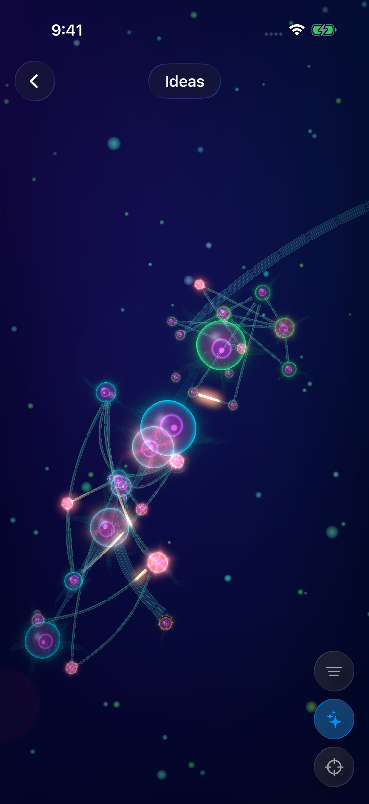

### graph-50-3-neurons-close-inguinal

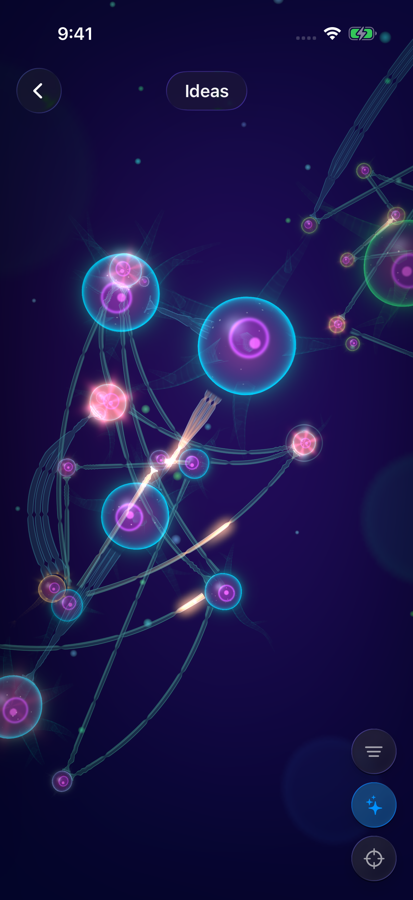

### graph-50-4-neurons-close-heart-failure

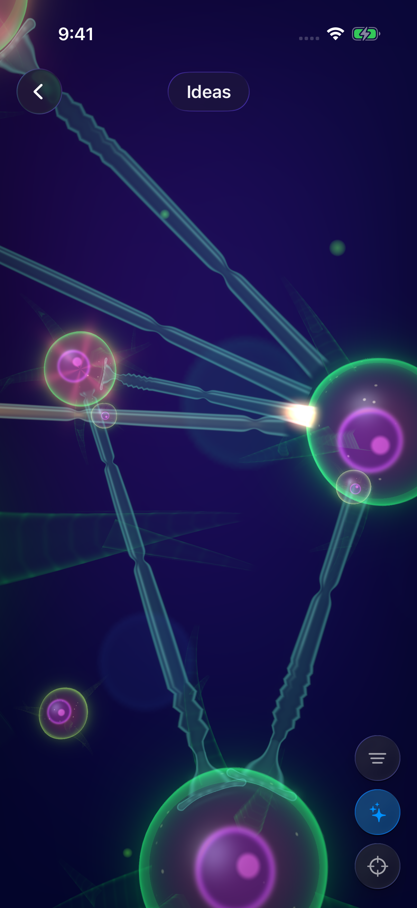

### graph-51-1-circuit-close-cardiology

### graph-51-2-circuit-close-examples

### graph-51-3-circuit-close-acs

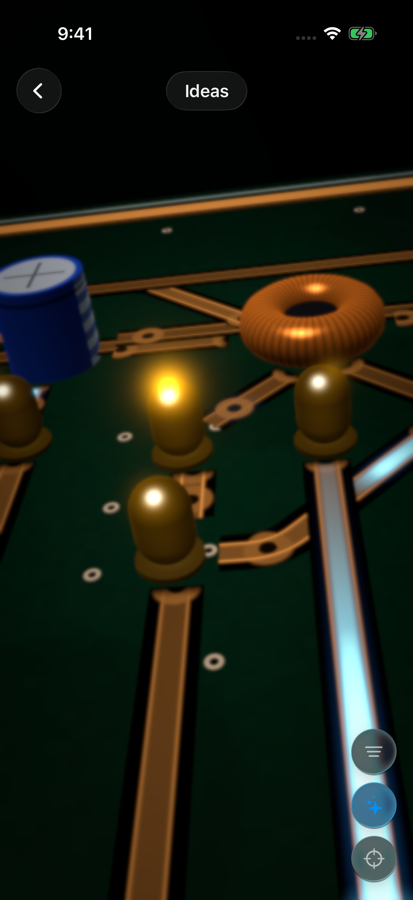

### graph-51-4-circuit-close-stemi

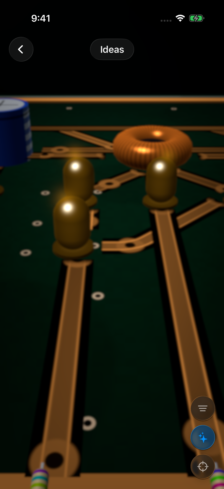

### graph-52-1-space-close-blackHole

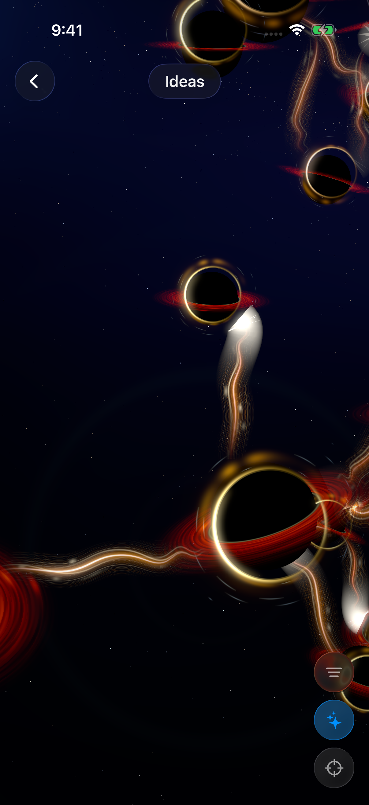

### graph-52-2-space-close-sun

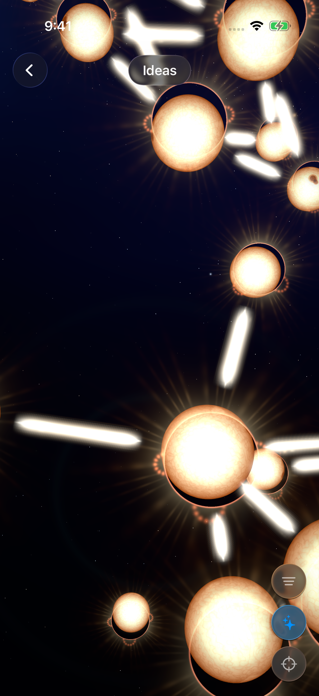

### graph-52-3-space-close-rocky

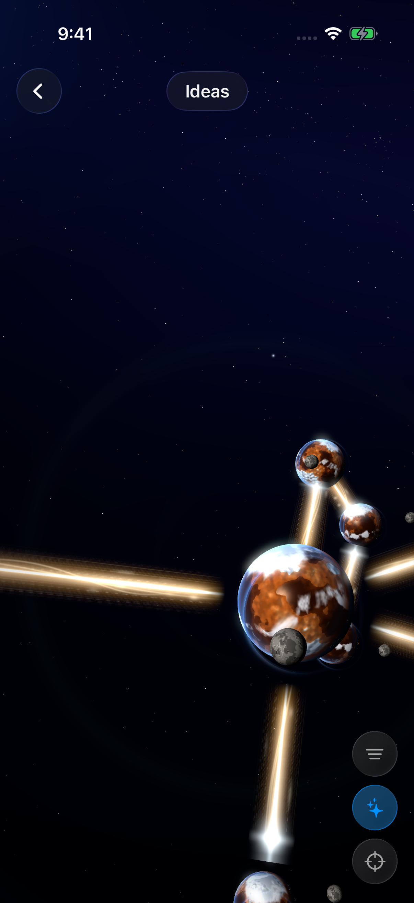

### graph-52-4-space-close-gasGiant

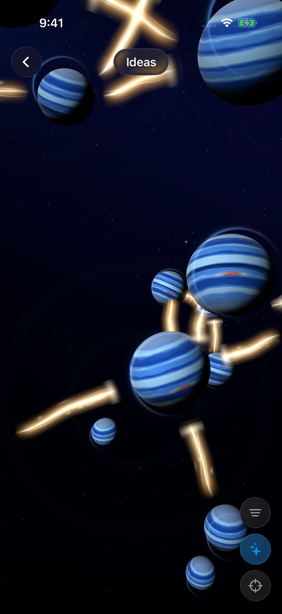

### graph-52-5-space-close-pulsar

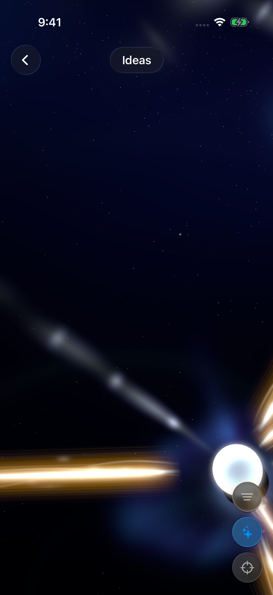

### graph-52-6-space-close-comet

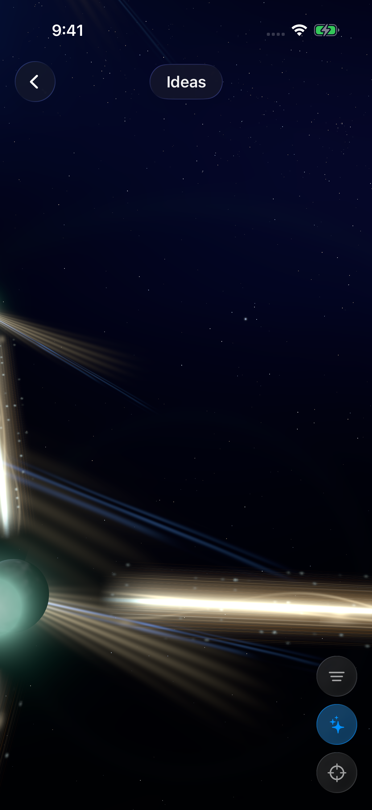

### graph-53-1-space-close-examples

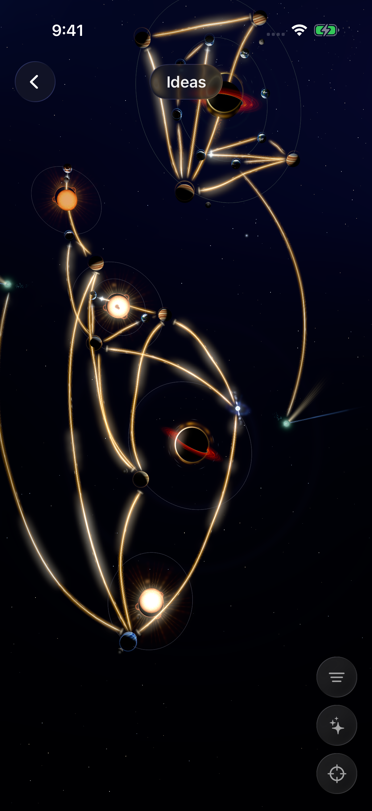

### graph-53-2-space-close-inguinal

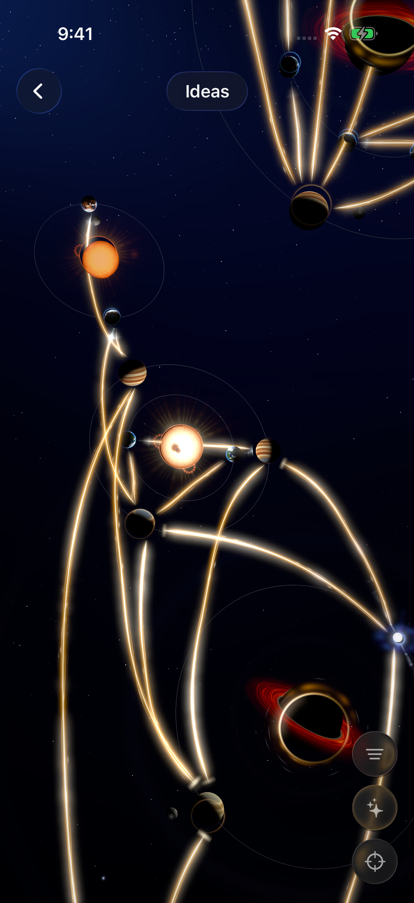

### graph-7-style-1-blackHole

### graph-7-style-2-sun

### graph-7-style-3-rocky

### graph-7-style-4-gasGiant

### graph-7-style-5-pulsar

### graph-7-style-6-comet

- Recording: [graph-testCircuitAtRest.mp4](shots/iphone/graph-testCircuitAtRest.mp4)

- Recording: [graph-testCircuitCloseUp.mp4](shots/iphone/graph-testCircuitCloseUp.mp4)

- Recording: [graph-testEachStyle.mp4](shots/iphone/graph-testEachStyle.mp4)

- Recording: [graph-testNeuronsAtRest.mp4](shots/iphone/graph-testNeuronsAtRest.mp4)

- Recording: [graph-testNeuronsCloseUp.mp4](shots/iphone/graph-testNeuronsCloseUp.mp4)

- Recording: [graph-testSpaceCloseUps.mp4](shots/iphone/graph-testSpaceCloseUps.mp4)

## ipad
