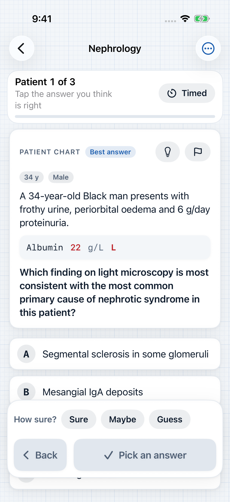
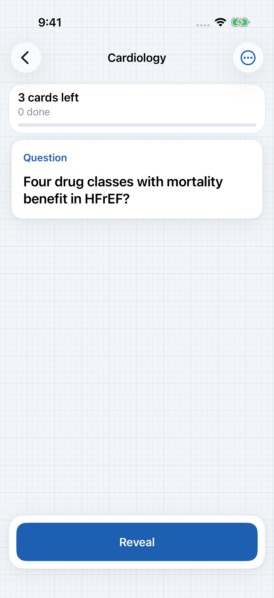
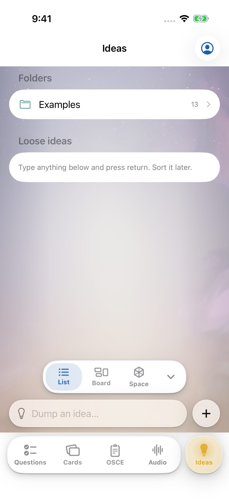
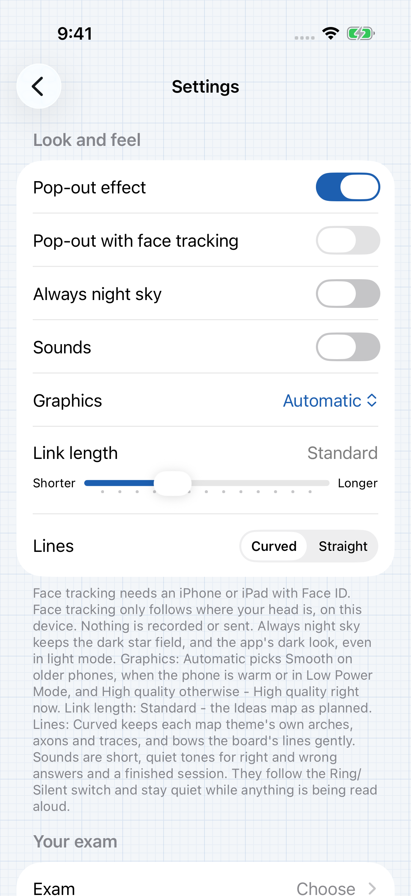
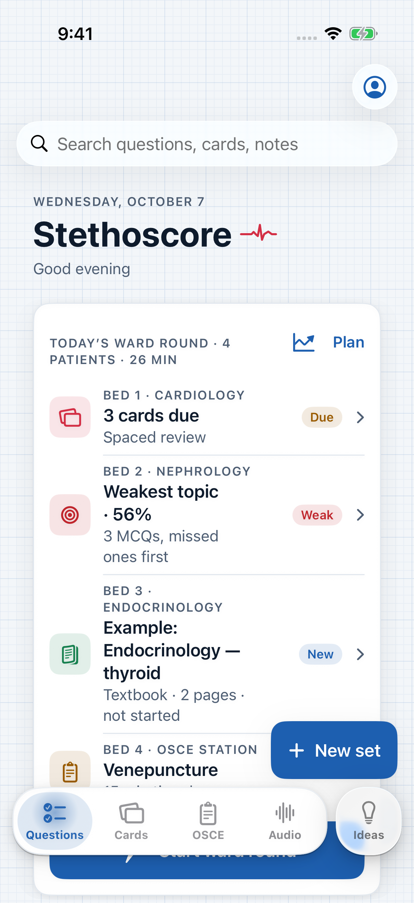
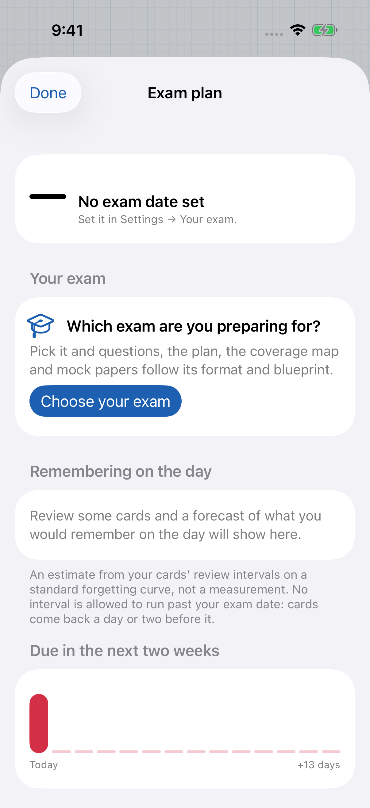

# Native iPhone screenshots — 7 October 2026

These eight original PNGs were extracted from the `shots/iphone/` entries in the GitHub Actions artifact recorded in [provenance.json](provenance.json). The artifact contains the passing `RedPenUITests.DesignTourUITests.testDesignTour` run. No images were generated, edited, or resampled during import.

The screens shown here are software UI captures. Clinical examples and labels shown in the app are not medical advice, clinical validation, or an endorsement of clinical content.

| Screen | Preview |
| --- | --- |
| Library questions |  |
| MCQ quiz |  |
| Anki card |  |
| Ideas list |  |
| Ideas space |  |
| Settings |  |
| Mission control |  |
| Exam plan |  |

Image dimensions, sizes, SHA-256 checksums, and source run details are in [provenance.json](provenance.json). Some captures are byte-identical to previously staged screenshots because the same screen state rendered identically; the checksums and run artifact identify the source for each copy.
